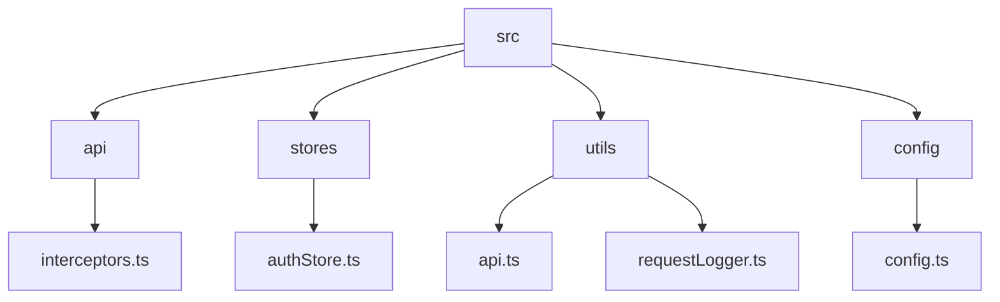
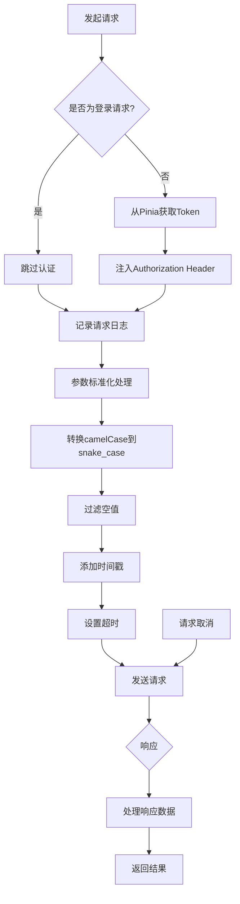
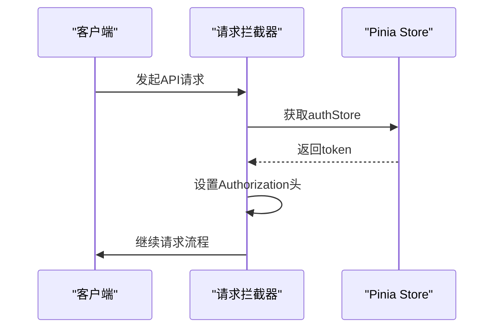
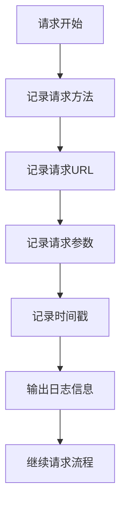
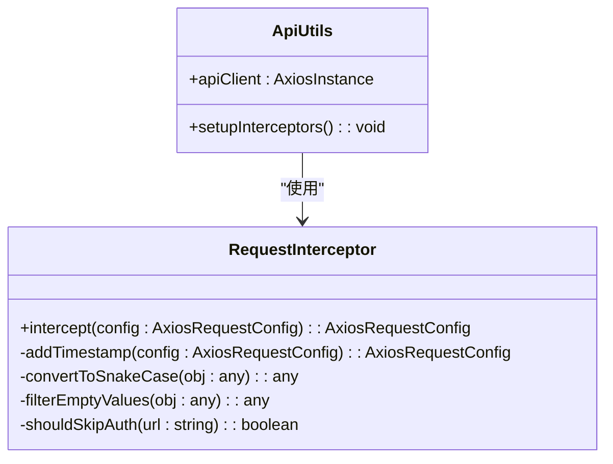
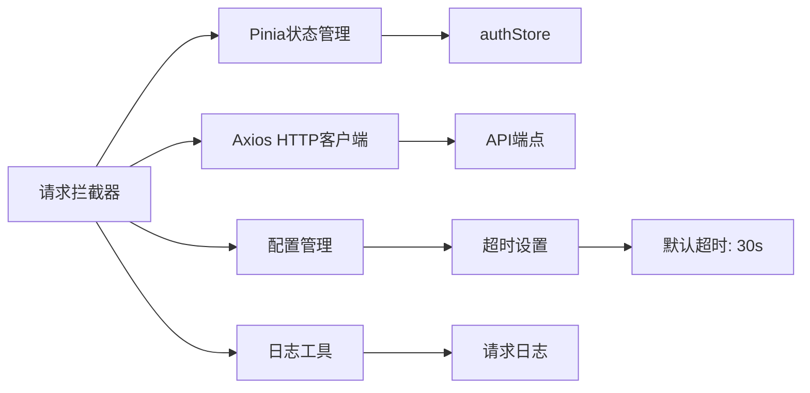

# 请求拦截器

<cite>
**本文档中引用的文件**  
- [main.ts](file://k.yyup.com/client/src/main.ts)
- [interceptors.ts](file://k.yyup.com/client/src/api/interceptors.ts)
- [api.ts](file://k.yyup.com/client/src/utils/api.ts)
- [authStore.ts](file://k.yyup.com/client/src/stores/authStore.ts)
- [requestLogger.ts](file://k.yyup.com/client/src/utils/requestLogger.ts)
- [config.ts](file://k.yyup.com/client/src/config/config.ts)
</cite>

## 目录
1. [介绍](#介绍)
2. [项目结构](#项目结构)
3. [核心组件](#核心组件)
4. [架构概述](#架构概述)
5. [详细组件分析](#详细组件分析)
6. [依赖分析](#依赖分析)
7. [性能考虑](#性能考虑)
8. [故障排除指南](#故障排除指南)
9. [结论](#结论)

## 介绍
本文档详细介绍了在前端应用中请求拦截器的实现机制。重点阐述了如何通过拦截器在请求发送前自动注入认证令牌、记录请求日志、标准化请求参数、配置超时和跨域设置，并支持请求取消功能。文档还说明了拦截器的执行顺序以及对特殊请求（如登录请求）的处理逻辑。

## 项目结构
本项目采用模块化结构，API客户端相关代码主要位于`client/src`目录下。请求拦截器作为API通信的核心组件，被独立封装在`api/interceptors.ts`文件中，并在应用初始化时通过`main.ts`导入。

**图示来源**  
- [main.ts](file://k.yyup.com/client/src/main.ts#L55)
- [interceptors.ts](file://k.yyup.com/client/src/api/interceptors.ts)
- [authStore.ts](file://k.yyup.com/client/src/stores/authStore.ts)
- [api.ts](file://k.yyup.com/client/src/utils/api.ts)
- [requestLogger.ts](file://k.yyup.com/client/src/utils/requestLogger.ts)
- [config.ts](file://k.yyup.com/client/src/config/config.ts)

**本节来源**  
- [main.ts](file://k.yyup.com/client/src/main.ts#L55)
- [interceptors.ts](file://k.yyup.com/client/src/api/interceptors.ts)

## 核心组件
请求拦截器的核心功能包括：认证令牌注入、请求日志记录、参数预处理、超时配置和请求取消机制。这些功能通过Axios拦截器实现，确保所有HTTP请求都经过统一的处理流程。

**本节来源**  
- [interceptors.ts](file://k.yyup.com/client/src/api/interceptors.ts)
- [api.ts](file://k.yyup.com/client/src/utils/api.ts)

## 架构概述
系统通过Axios的拦截器机制实现了请求的统一处理。在请求发送前，拦截器链依次执行认证注入、日志记录和参数标准化等操作；在响应返回后，进行错误处理和数据解析。

**图示来源**  
- [interceptors.ts](file://k.yyup.com/client/src/api/interceptors.ts)
- [authStore.ts](file://k.yyup.com/client/src/stores/authStore.ts)
- [requestLogger.ts](file://k.yyup.com/client/src/utils/requestLogger.ts)

## 详细组件分析

### 认证令牌注入分析
请求拦截器通过访问Pinia状态管理中的authStore来获取当前用户的认证令牌，并将其自动注入到每个请求的Authorization头中。

**图示来源**  
- [interceptors.ts](file://k.yyup.com/client/src/api/interceptors.ts)
- [authStore.ts](file://k.yyup.com/client/src/stores/authStore.ts)

### 请求日志记录分析
系统实现了详细的请求日志记录功能，包含请求方法、URL、参数等信息，便于开发调试和问题追踪。

**图示来源**  
- [interceptors.ts](file://k.yyup.com/client/src/api/interceptors.ts)
- [requestLogger.ts](file://k.yyup.com/client/src/utils/requestLogger.ts)

### 参数标准化处理分析
拦截器实现了请求参数的标准化处理，包括命名规范转换、空值过滤和时间戳添加等功能。

**图示来源**  
- [interceptors.ts](file://k.yyup.com/client/src/api/interceptors.ts)
- [api.ts](file://k.yyup.com/client/src/utils/api.ts)

**本节来源**  
- [interceptors.ts](file://k.yyup.com/client/src/api/interceptors.ts)
- [api.ts](file://k.yyup.com/client/src/utils/api.ts)

## 依赖分析
请求拦截器依赖于多个核心模块，包括状态管理(Pinia)、API客户端(Axios)和配置管理模块。

**图示来源**  
- [interceptors.ts](file://k.yyup.com/client/src/api/interceptors.ts)
- [authStore.ts](file://k.yyup.com/client/src/stores/authStore.ts)
- [config.ts](file://k.yyup.com/client/src/config/config.ts)

**本节来源**  
- [interceptors.ts](file://k.yyup.com/client/src/api/interceptors.ts)
- [authStore.ts](file://k.yyup.com/client/src/stores/authStore.ts)
- [config.ts](file://k.yyup.com/client/src/config/config.ts)

## 性能考虑
拦截器的设计考虑了性能影响，通过条件判断避免不必要的处理，并采用轻量级的日志记录策略。

**本节来源**  
- [interceptors.ts](file://k.yyup.com/client/src/api/interceptors.ts)
- [requestLogger.ts](file://k.yyup.com/client/src/utils/requestLogger.ts)

## 故障排除指南
当遇到API请求问题时，可以通过检查拦截器日志来定位问题。常见的问题包括认证令牌失效、请求超时和参数格式错误。

**本节来源**  
- [interceptors.ts](file://k.yyup.com/client/src/api/interceptors.ts)
- [requestLogger.ts](file://k.yyup.com/client/src/utils/requestLogger.ts)

## 结论
请求拦截器作为API通信的中枢组件，实现了认证、日志、参数处理等关键功能，提高了代码的复用性和可维护性。通过合理的架构设计，确保了系统的稳定性和可扩展性。