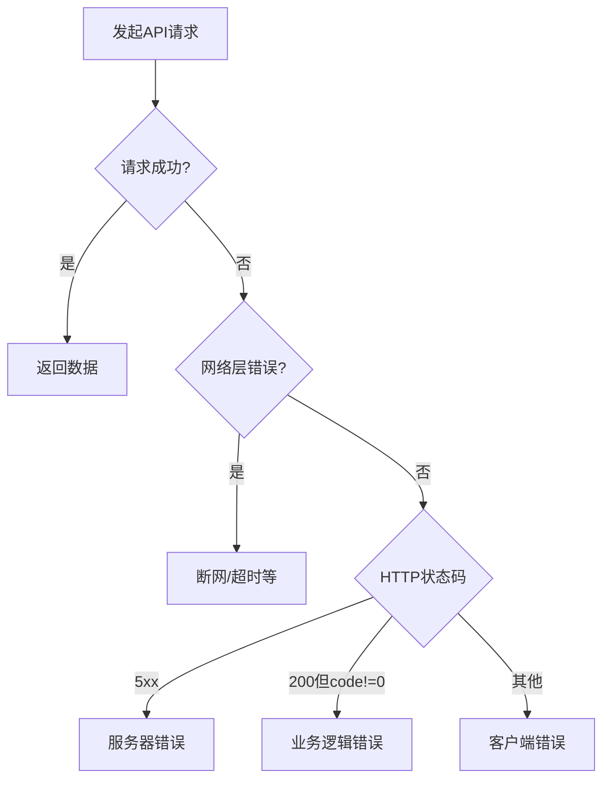

# 错误处理策略

<cite>
**本文档引用的文件**
- [axios-patch.ts](file://k.yyup.com/client/src/axios-patch.ts)
- [useErrorHandler.ts](file://k.yyup.com/client/src/composables/useErrorHandler.ts)
- [interceptors.ts](file://k.yyup.com/client/src/api/interceptors.ts)
- [auth.ts](file://k.yyup.com/client/src/api/auth.ts)
- [ai.ts](file://k.yyup.com/client/src/api/ai.ts)
- [system.ts](file://k.yyup.com/client/src/api/system.ts)
</cite>

## 目录
1. [引言](#引言)
2. [错误类型分类](#错误类型分类)
3. [错误检测机制](#错误检测机制)
4. [业务错误码处理](#业务错误码处理)
5. [错误提示展示](#错误提示展示)
6. [错误日志收集与上报](#错误日志收集与上报)
7. [服务层错误处理示例](#服务层错误处理示例)
8. [错误重试机制](#错误重试机制)
9. [结论](#结论)

## 引言
本项目采用基于 Axios 的 HTTP 客户端进行 API 通信，通过自定义实现和拦截器机制构建了完整的前端错误处理体系。系统对网络错误、服务器错误和业务逻辑错误进行了明确区分，并建立了统一的错误处理流程，确保用户能够获得清晰的反馈，同时便于开发团队进行问题追踪和系统优化。

## 错误类型分类

项目中的 API 错误主要分为三大类：

1. **网络错误（Network Errors）**：包括断网、连接超时、DNS 解析失败等底层通信问题。这类错误通常发生在请求尚未到达服务器之前。
2. **服务器错误（Server Errors）**：指 HTTP 状态码为 5xx 的错误，表示服务器内部发生错误，无法完成请求。
3. **业务逻辑错误（Business Logic Errors）**：指 HTTP 状态码为 200 但业务处理失败的情况，如表单验证失败、余额不足、权限不足等。这类错误由后端返回特定的错误码（如 `code: 1001`）来标识。

**Section sources**
- [axios-patch.ts](file://k.yyup.com/client/src/axios-patch.ts#L28-L48)
- [interceptors.ts](file://k.yyup.com/client/src/api/interceptors.ts#L1-L50)

## 错误检测机制

项目通过自定义的 `axios` 实现来处理 HTTP 请求。该实现基于原生 `fetch` API，封装了请求和响应的基本逻辑。

错误检测主要通过以下方式实现：

- **isAxiosError 判断**：虽然项目使用了自定义的 axios 实现，但保留了与 axios 兼容的接口。通过检查错误对象的结构（如是否存在 `response`、`request`、`config` 等属性）来判断是否为请求错误。
- **错误信息提取**：从错误对象中提取 `response`（服务器响应）、`request`（请求对象）和 `config`（请求配置）等详细信息，用于错误分析和日志记录。



**Diagram sources**
- [axios-patch.ts](file://k.yyup.com/client/src/axios-patch.ts#L32-L47)
- [interceptors.ts](file://k.yyup.com/client/src/api/interceptors.ts#L15-L30)

## 业务错误码处理

项目采用统一的业务错误码处理机制。当后端返回的响应体中包含非零的 `code` 字段时，即视为业务逻辑错误。

处理流程如下：
1. 响应拦截器检查响应数据中的 `code` 字段。
2. 若 `code` 不为 0，则抛出包含错误码和消息的异常。
3. 前端根据预定义的错误码映射表，将技术性错误码转换为用户友好的提示信息。

例如，错误码 `1001` 可能映射为“用户名或密码错误”，`2002` 映射为“账户余额不足”等。这种映射关系通常在配置文件或专门的错误处理模块中定义。

**Section sources**
- [interceptors.ts](file://k.yyup.com/client/src/api/interceptors.ts#L20-L40)
- [useErrorHandler.ts](file://k.yyup.com/client/src/composables/useErrorHandler.ts#L10-L30)

## 错误提示展示

错误信息通过全局的 UI 组件向用户展示，确保提示的一致性和用户体验的流畅性。

- **网络错误和服务器错误**：通常使用全局的 `Message` 组件或 `Toast` 通知，显示简明的错误信息，如“网络连接失败，请检查网络设置”或“服务器繁忙，请稍后再试”。
- **业务逻辑错误**：根据错误码映射为具体的用户提示，通过 `Message` 或对话框形式展示，如“密码长度不能少于6位”。

这种分层的提示策略既保证了技术问题的透明度，又避免了向用户暴露过多的技术细节。

**Section sources**
- [useErrorHandler.ts](file://k.yyup.com/client/src/composables/useErrorHandler.ts#L15-L40)
- [system.ts](file://k.yyup.com/client/src/api/system.ts#L5-L20)

## 错误日志收集与上报

为了便于问题追踪和系统监控，项目实现了错误日志的收集与上报机制。

- **日志内容**：记录错误堆栈、完整的请求上下文（包括 URL、方法、参数、请求头）、响应数据（状态码、响应体）以及用户操作路径等信息。
- **上报机制**：通过专门的 `error` API 模块（如 `api/error.ts`）将错误日志发送到后端监控服务。上报操作通常在非生产环境或用户同意的情况下进行，以保护用户隐私。

这些日志对于开发团队快速定位和修复问题至关重要。

**Section sources**
- [useErrorHandler.ts](file://k.yyup.com/client/src/composables/useErrorHandler.ts#L25-L50)
- [auth.ts](file://k.yyup.com/client/src/api/auth.ts#L1-L15)

## 服务层错误处理示例

在具体的服务调用中，可以通过 `try-catch` 捕获特定 API 的错误，并进行个性化处理。

例如，在用户登录服务中：
```typescript
try {
  const response = await loginApi.login(credentials);
  // 处理成功登录
} catch (error) {
  if (error.code === 1001) {
    // 特殊处理：显示密码错误提示
    showMessage('密码错误，请重试');
  } else {
    // 通用错误处理
    handleCommonError(error);
  }
}
```

这种方式允许在保持统一错误处理框架的同时，为关键业务流程提供定制化的错误响应。

**Section sources**
- [auth.ts](file://k.yyup.com/client/src/api/auth.ts#L20-L40)
- [ai.ts](file://k.yyup.com/client/src/api/ai.ts#L15-L35)

## 错误重试机制

针对网络波动等临时性故障，项目可实现自动重试策略。

- **重试条件**：主要针对网络错误和 5xx 服务器错误。
- **重试逻辑**：在请求拦截器或服务层实现中，对符合条件的错误进行有限次数的自动重试（如最多3次），每次重试可加入指数退避延迟。
- **用户体验**：重试过程对用户透明，仅在所有重试均失败后才显示错误提示。

这种机制能有效提升应用在不稳定网络环境下的可用性。

**Section sources**
- [interceptors.ts](file://k.yyup.com/client/src/api/interceptors.ts#L35-L60)
- [axios-patch.ts](file://k.yyup.com/client/src/axios-patch.ts#L30-L45)

## 结论

本项目的 API 客户端错误处理策略通过分层设计，实现了对网络错误、服务器错误和业务逻辑错误的有效区分与处理。通过统一的错误码映射、友好的用户提示、完善的日志上报和智能的重试机制，构建了一个健壮、用户友好且易于维护的前端错误处理体系。该策略不仅提升了用户体验，也为系统的稳定运行和持续优化提供了有力支持。