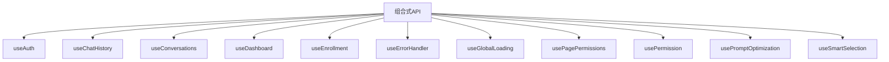
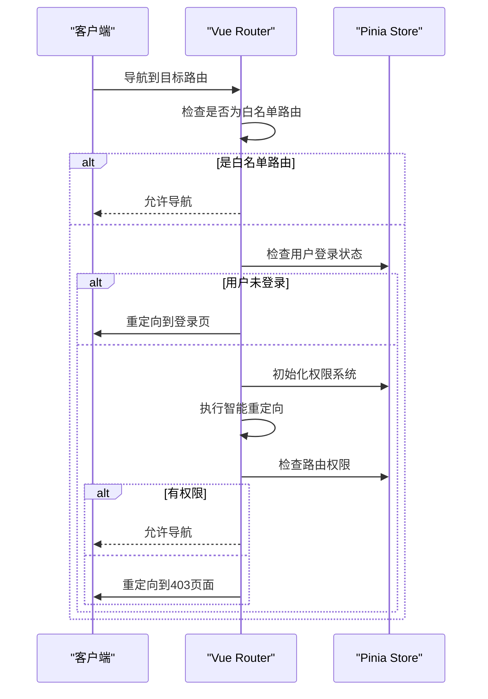
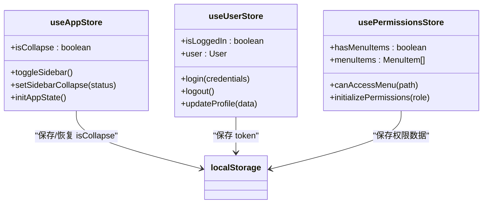
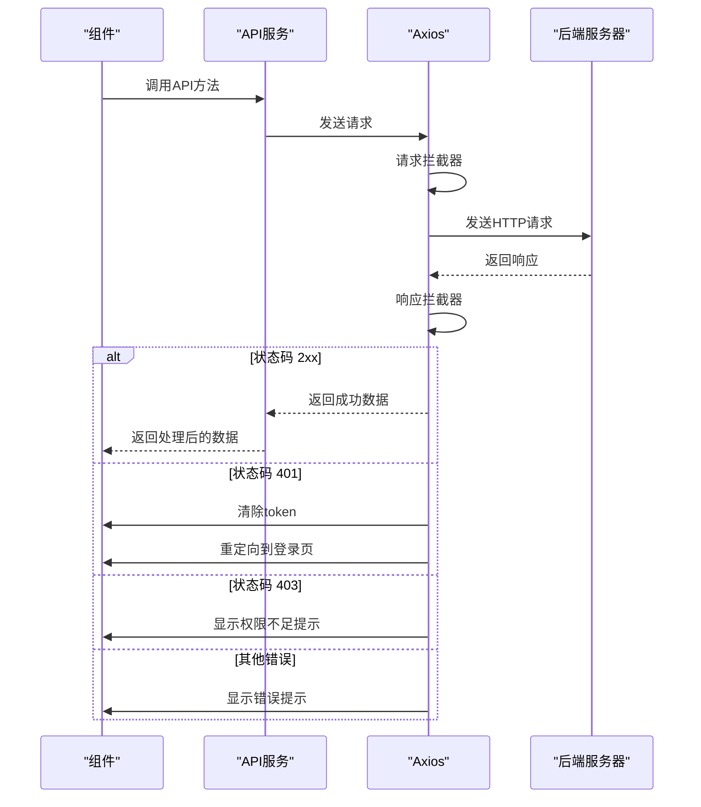
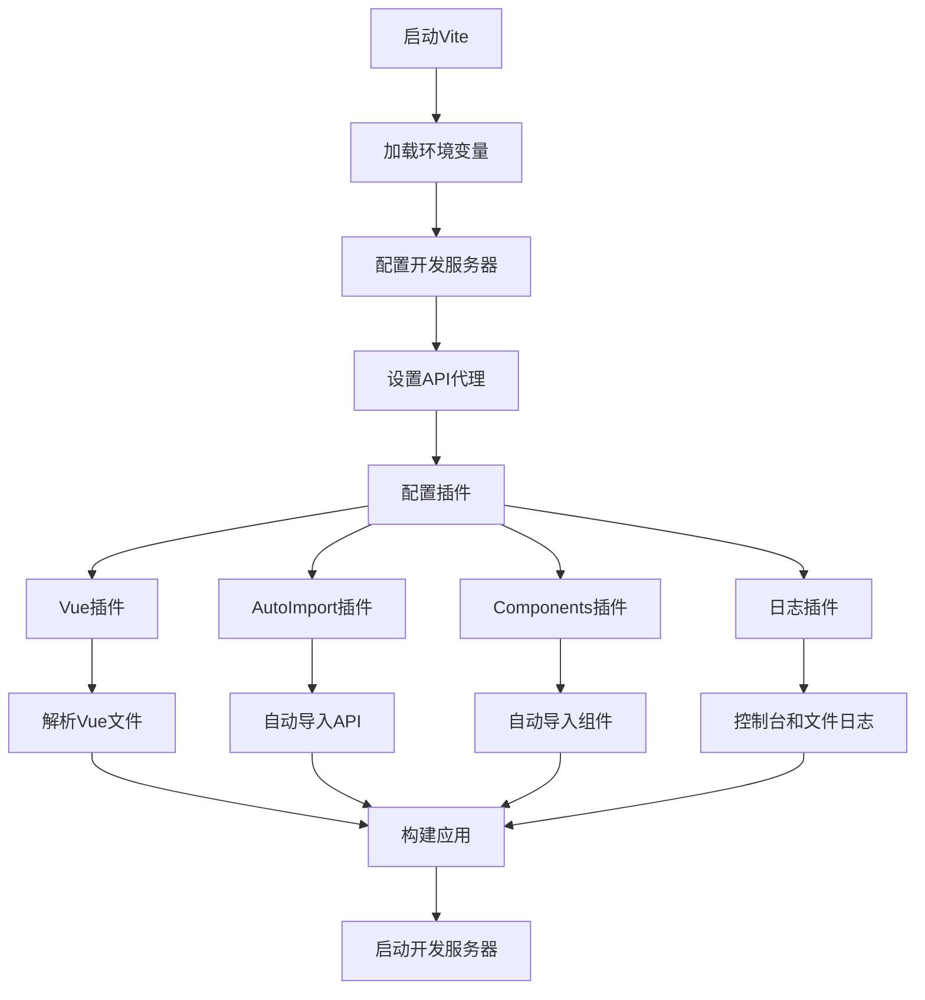
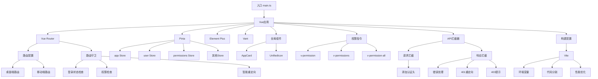

# 前端架构

<cite>
**本文档引用的文件**  
- [main.ts](file://k.yyup.com/client/src/main.ts)
- [router/index.ts](file://k.yyup.com/client/src/router/index.ts)
- [stores/app.ts](file://k.yyup.com/client/src/stores/app.ts)
- [stores/user.ts](file://k.yyup.com/client/src/stores/user.ts)
- [stores/permissions-simple.ts](file://k.yyup.com/client/src/stores/permissions-simple.ts)
- [api/interceptors.ts](file://k.yyup.com/client/src/api/interceptors.ts)
- [vite.config.ts](file://k.yyup.com/client/vite.config.ts)
- [config/environment.ts](file://k.yyup.com/client/src/config/environment.ts)
- [directives/permission.ts](file://k.yyup.com/client/src/directives/permission.ts)
- [auth.ts](file://k.yyup.com/client/src/api/auth.ts)
</cite>

## 目录
1. [项目结构](#项目结构)
2. [组件化架构与组合式API](#组件化架构与组合式api)
3. [前端路由系统](#前端路由系统)
4. [状态管理方案](#状态管理方案)
5. [API客户端服务](#api客户端服务)
6. [前端构建流程](#前端构建流程)
7. [UI组件库集成](#ui组件库集成)
8. [前端架构图](#前端架构图)

## 项目结构

k.yyup.com子系统的前端代码位于`k.yyup.com/client`目录下，采用标准的Vue3项目结构。核心目录包括：
- `src`: 源代码主目录
- `src/api`: API接口定义和客户端
- `src/components`: 可复用的Vue组件
- `src/composables`: 组合式API函数
- `src/config`: 项目配置文件
- `src/directives`: 自定义指令
- `src/layouts`: 页面布局组件
- `src/pages`: 页面组件
- `src/router`: 路由配置
- `src/stores`: Pinia状态管理
- `src/styles`: 样式文件
- `src/utils`: 工具函数
- `src/views`: 视图组件

**Section sources**
- [main.ts](file://k.yyup.com/client/src/main.ts#L1-L231)

## 组件化架构与组合式API

项目采用Vue3的组件化架构，所有组件均使用`.vue`单文件组件格式。组件组织遵循功能模块化原则，按业务领域划分目录，如`ai`、`centers`、`enrollment`等。

组合式API（Composition API）是项目的主要开发模式，通过`setup()`函数和`ref`、`reactive`等响应式API组织组件逻辑。项目在`src/composables`目录下定义了大量可复用的组合式函数，如`useAuth`、`useChatHistory`、`usePermissions`等，实现了逻辑的解耦和复用。



**Diagram sources**
- [composables/useAuth.ts](file://k.yyup.com/client/src/composables/useAuth.ts)
- [composables/useChatHistory.ts](file://k.yyup.com/client/src/composables/useChatHistory.ts)
- [composables/usePermissions.ts](file://k.yyup.com/client/src/composables/usePermissions.ts)

**Section sources**
- [main.ts](file://k.yyup.com/client/src/main.ts#L1-L231)

## 前端路由系统

项目使用Vue Router 4实现前端路由，路由配置位于`src/router`目录。系统采用静态路由配置结合动态权限控制的模式。

核心路由配置文件为`src/router/index.ts`，创建了基于`createWebHistory`的路由实例。路由守卫在`beforeEach`钩子中实现，包含以下逻辑：
1. 白名单路由直接通过
2. 检查用户登录状态，未登录则重定向到登录页
3. 初始化权限系统
4. 智能路由重定向（根据用户角色重定向到合适的首页）
5. 检查路由权限，无权限则重定向到403页面



**Diagram sources**
- [router/index.ts](file://k.yyup.com/client/src/router/index.ts#L1-L120)

**Section sources**
- [router/index.ts](file://k.yyup.com/client/src/router/index.ts#L1-L120)

## 状态管理方案

项目采用Pinia作为状态管理方案，替代了传统的Vuex。状态管理分为两种组织方式：

1. **传统模块化结构**：位于`src/store/modules`，通过`defineStore`定义模块，如`auth`、`chat`、`ai`等。
2. **扁平化结构**：位于`src/stores`，直接在根目录下定义store文件，如`app.ts`、`user.ts`、`permissions.ts`等。

状态持久化通过手动操作`localStorage`实现。例如，`app` store中的侧边栏折叠状态在`toggleSidebar`和`setSidebarCollapse`方法中保存到`localStorage`，并在`initAppState`方法中从`localStorage`恢复。



**Diagram sources**
- [stores/app.ts](file://k.yyup.com/client/src/stores/app.ts#L1-L33)
- [stores/user.ts](file://k.yyup.com/client/src/stores/user.ts)
- [stores/permissions-simple.ts](file://k.yyup.com/client/src/stores/permissions-simple.ts)

**Section sources**
- [stores/app.ts](file://k.yyup.com/client/src/stores/app.ts#L1-L33)
- [stores/user.ts](file://k.yyup.com/client/src/stores/user.ts)
- [stores/permissions-simple.ts](file://k.yyup.com/client/src/stores/permissions-simple.ts)

## API客户端服务

项目使用Axios作为HTTP客户端，通过拦截器实现统一的请求处理。API客户端配置位于`src/api/interceptors.ts`。

### 请求拦截器
- 从`localStorage`获取认证token
- 在请求头中添加`Authorization`字段
- 记录请求日志

### 响应拦截器
- 统一处理HTTP状态码：
  - 400：请求参数错误
  - 401：认证失败，清除token并重定向到登录页
  - 403：权限不足，显示警告信息
  - 404：资源不存在，静默处理
  - 500：服务器内部错误
  - 502/503/504：服务器不可用，静默处理
- 全局错误捕获和用户提示

API模块按功能划分，位于`src/api/modules`目录，每个模块封装特定业务领域的API调用。



**Diagram sources**
- [api/interceptors.ts](file://k.yyup.com/client/src/api/interceptors.ts#L1-L227)
- [auth.ts](file://k.yyup.com/client/src/api/auth.ts#L1-L516)

**Section sources**
- [api/interceptors.ts](file://k.yyup.com/client/src/api/interceptors.ts#L1-L227)
- [auth.ts](file://k.yyup.com/client/src/api/auth.ts#L1-L516)

## 前端构建流程

项目使用Vite作为构建工具，配置文件为`vite.config.ts`。构建流程包含以下关键配置：

### 环境配置
- 使用`loadEnv`加载`.env`文件中的环境变量
- 支持`development`、`production`、`test`、`staging`等多种环境
- 动态配置API基础URL、超时时间等

### 开发服务器
- 配置开发端口、主机和HMR端口
- 设置API代理，将`/api`请求代理到后端服务
- 支持SSE流式传输，禁用响应缓冲

### 代码分割
- 使用`manualChunks`配置代码分割策略
- 将第三方库（如`element-plus`、`vue`、`echarts`）分割到独立的chunk
- 按页面进行代码分割，如`enrollment-plan`、`pages`

### 性能优化
- 预热常用文件（`main.ts`、`App.vue`、`router/index.ts`）
- 禁用开发环境的依赖预构建缓存
- 配置chunk大小警告限制



**Diagram sources**
- [vite.config.ts](file://k.yyup.com/client/vite.config.ts#L1-L220)
- [config/environment.ts](file://k.yyup.com/client/src/config/environment.ts#L1-L205)

**Section sources**
- [vite.config.ts](file://k.yyup.com/client/vite.config.ts#L1-L220)
- [config/environment.ts](file://k.yyup.com/client/src/config/environment.ts#L1-L205)

## UI组件库集成

项目集成了多个UI组件库，主要使用Element Plus作为桌面端UI框架，Vant作为移动端UI框架。

### Element Plus
- 在`main.ts`中全局注册Element Plus
- 配置中文语言包
- 按需导入关键图标组件
- 注册为全局组件

### Vant
- 通过`setupVant`函数在`main.ts`中注册
- 支持移动端UI组件

### 自定义组件
- 项目在`src/components`目录下定义了大量自定义组件
- 组件按功能模块组织目录
- 提供了`AppCard`、`UnifiedIcon`等基础组件
- 支持全局注册和自动导入

权限控制通过自定义指令实现，定义了`v-permission`、`v-permissions`、`v-permission-all`等指令，支持`.hide`和`.disable`修饰符。

```mermaid
classDiagram
class AppCard {
+title : string
+header : slot
+content : slot
+footer : slot
}
class UnifiedIcon {
+name : string
+size : string
+color : string
}
class PermissionDirective {
+v-permission
+v-permissions
+v-permission-all
+.hide
+.disable
}
AppCard --> "Element Plus" : "使用 ElCard"
UnifiedIcon --> "Element Plus Icons" : "使用图标"
PermissionDirective --> "Pinia Store" : "检查权限"
```

**Diagram sources**
- [main.ts](file://k.yyup.com/client/src/main.ts#L1-L231)
- [directives/permission.ts](file://k.yyup.com/client/src/directives/permission.ts#L1-L260)

**Section sources**
- [main.ts](file://k.yyup.com/client/src/main.ts#L1-L231)
- [directives/permission.ts](file://k.yyup.com/client/src/directives/permission.ts#L1-L260)

## 前端架构图



**Diagram sources**
- [main.ts](file://k.yyup.com/client/src/main.ts#L1-L231)
- [router/index.ts](file://k.yyup.com/client/src/router/index.ts#L1-L120)
- [stores/app.ts](file://k.yyup.com/client/src/stores/app.ts#L1-L33)
- [api/interceptors.ts](file://k.yyup.com/client/src/api/interceptors.ts#L1-L227)
- [vite.config.ts](file://k.yyup.com/client/vite.config.ts#L1-L220)

**Section sources**
- [main.ts](file://k.yyup.com/client/src/main.ts#L1-L231)
- [router/index.ts](file://k.yyup.com/client/src/router/index.ts#L1-L120)
- [stores/app.ts](file://k.yyup.com/client/src/stores/app.ts#L1-L33)
- [api/interceptors.ts](file://k.yyup.com/client/src/api/interceptors.ts#L1-L227)
- [vite.config.ts](file://k.yyup.com/client/vite.config.ts#L1-L220)