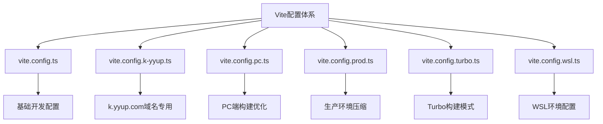
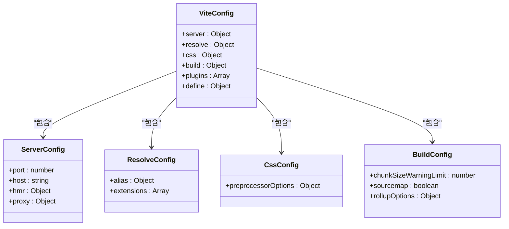
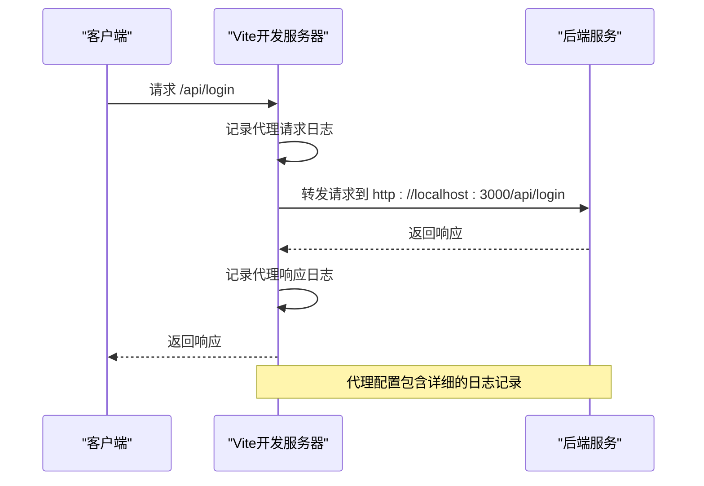
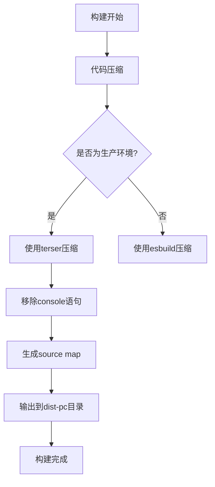
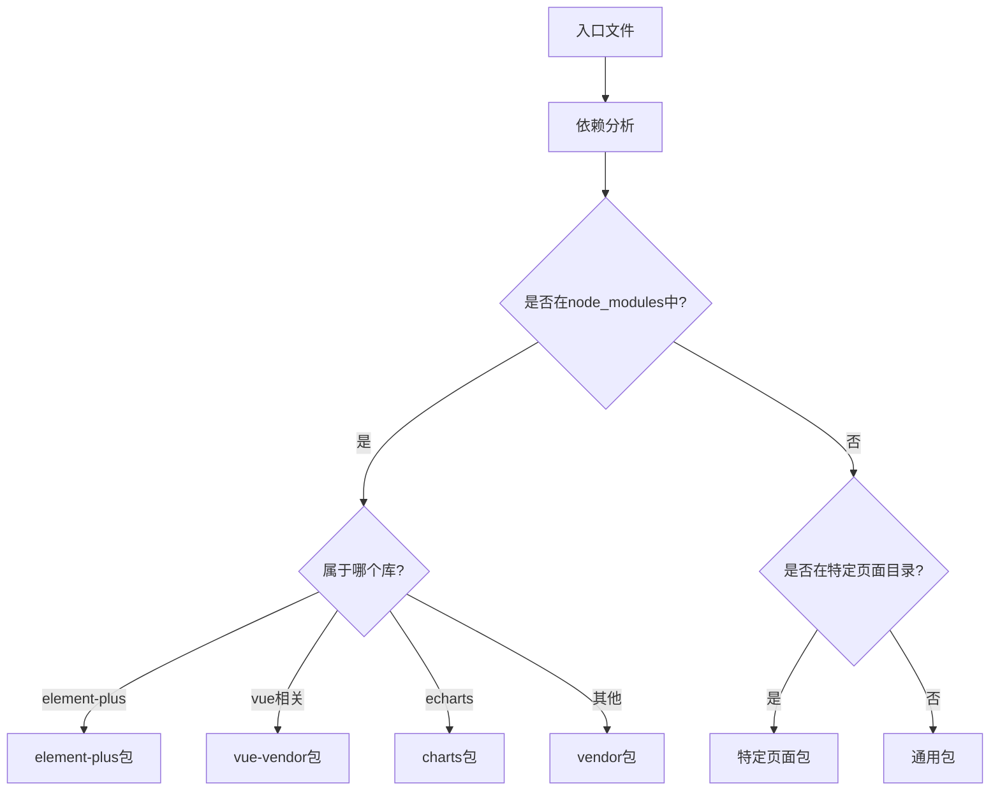
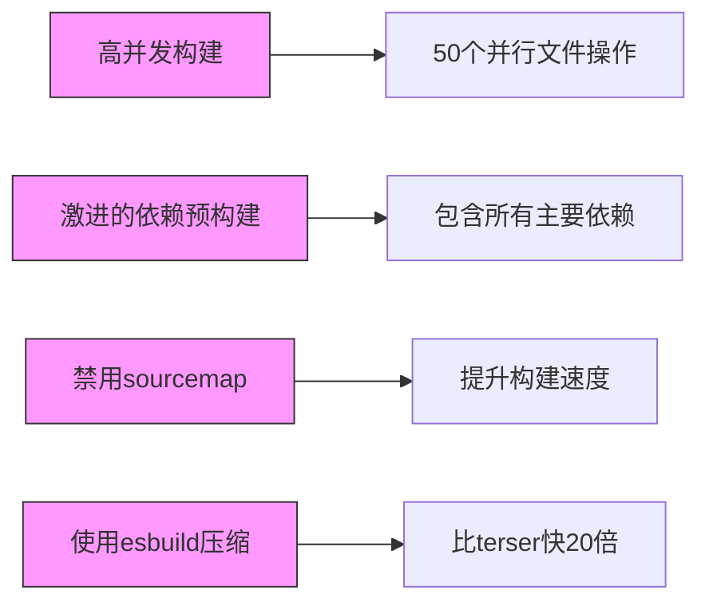
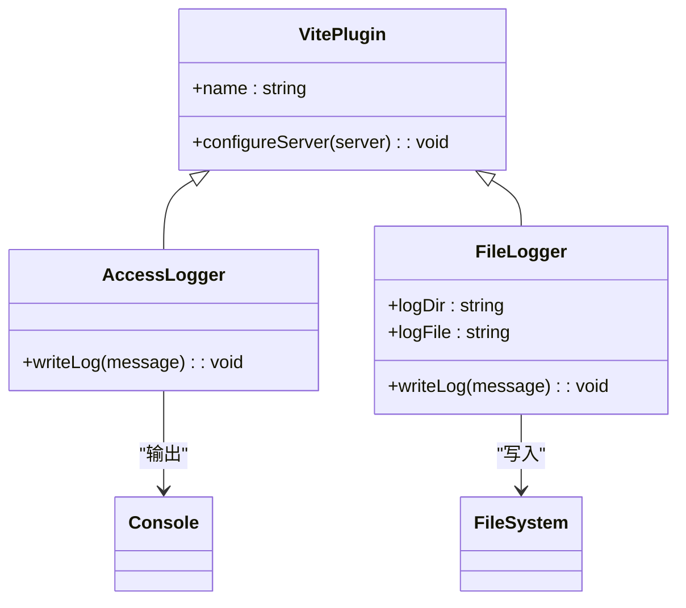
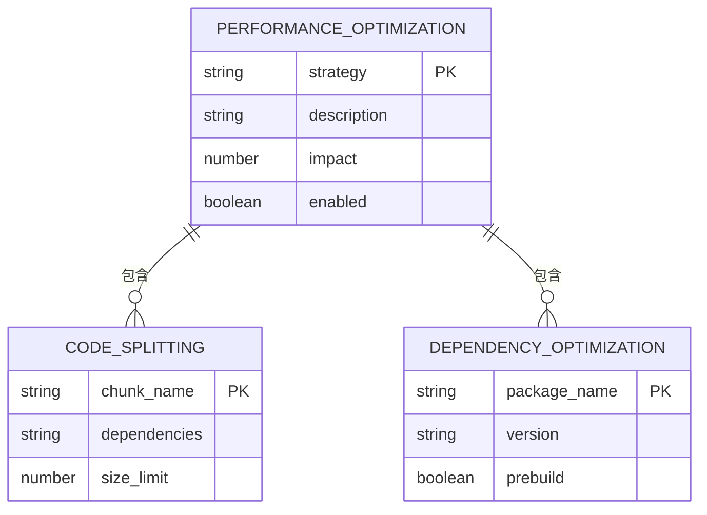
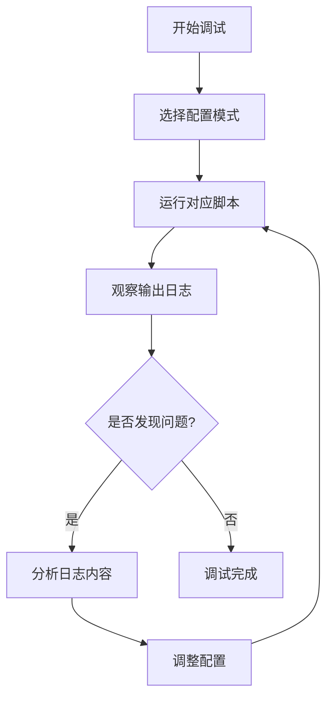

# Vite配置

<cite>
**本文档引用的文件**  
- [vite.config.ts](file://k.yyup.com/client/vite.config.ts)
- [vite.config.k-yyup.ts](file://k.yyup.com/client/vite.config.k-yyup.ts)
- [vite.config.pc.ts](file://k.yyup.com/client/vite.config.pc.ts)
- [vite.config.prod.ts](file://k.yyup.com/client/vite.config.prod.ts)
- [vite.config.turbo.ts](file://k.yyup.com/client/vite.config.turbo.ts)
- [vite.config.wsl.ts](file://k.yyup.com/client/vite.config.wsl.ts)
- [vite-plugin-logger.js](file://k.yyup.com/client/vite-plugin-logger.js)
- [vite-plugin-file-logger.js](file://k.yyup.com/client/vite-plugin-file-logger.js)
- [package.json](file://k.yyup.com/client/package.json)
</cite>

## 目录
1. [项目结构](#项目结构)
2. [核心配置文件分析](#核心配置文件分析)
3. [多环境配置详解](#多环境配置详解)
4. [插件系统与自定义插件](#插件系统与自定义插件)
5. [构建性能优化策略](#构建性能优化策略)
6. [配置调试技巧](#配置调试技巧)

## 项目结构

本项目采用多配置文件的Vite构建体系，主要配置文件位于`k.yyup.com/client/`目录下。通过多个专用配置文件实现不同环境和场景的构建需求，形成灵活的构建系统。

**图示来源**  
- [vite.config.ts](file://k.yyup.com/client/vite.config.ts)
- [vite.config.k-yyup.ts](file://k.yyup.com/client/vite.config.k-yyup.ts)
- [vite.config.pc.ts](file://k.yyup.com/client/vite.config.pc.ts)
- [vite.config.prod.ts](file://k.yyup.com/client/vite.config.prod.ts)
- [vite.config.turbo.ts](file://k.yyup.com/client/vite.config.turbo.ts)
- [vite.config.wsl.ts](file://k.yyup.com/client/vite.config.wsl.ts)

**本节来源**  
- [vite.config.ts](file://k.yyup.com/client/vite.config.ts)
- [package.json](file://k.yyup.com/client/package.json)

## 核心配置文件分析

`vite.config.ts`作为基础配置文件，定义了项目的核心构建规则。该配置文件通过`loadEnv`函数加载环境变量，实现了动态配置能力。配置中包含了路径别名、CSS预处理器、开发服务器设置等关键功能。

路径别名配置使用`resolve.alias`将`@`指向`src`目录，简化了模块导入路径。CSS预处理器配置中，SCSS通过`additionalData`自动导入设计令牌文件，确保样式一致性。开发服务器配置包含了端口、主机、热更新等设置，并针对API代理进行了特殊处理，确保SSE流式数据的正确转发。

**图示来源**  
- [vite.config.ts](file://k.yyup.com/client/vite.config.ts)

**本节来源**  
- [vite.config.ts](file://k.yyup.com/client/vite.config.ts)

## 多环境配置详解

### k.yyup.com域名专用配置

`vite.config.k-yyup.ts`文件针对k.yyup.com域名进行了优化配置。该配置特别关注HMR（热模块替换）的稳定性，通过设置`hmr.forceReload`确保在localhost环境下能够正确工作。同时配置了详细的代理日志，便于调试API请求问题。

**图示来源**  
- [vite.config.k-yyup.ts](file://k.yyup.com/client/vite.config.k-yyup.ts)

### PC端构建优化

`vite.config.pc.ts`配置文件专为PC端生产环境构建优化。该配置通过`outDir`指定输出目录为`dist-pc`，并采用terser进行代码压缩，同时移除所有console语句。分包策略更加精细，将不同功能模块分别打包，优化了首屏加载性能。

**图示来源**  
- [vite.config.pc.ts](file://k.yyup.com/client/vite.config.pc.ts)

### 生产环境压缩与代码分割

`vite.config.prod.ts`配置文件专注于生产环境的构建优化。该配置禁用了HMR和WebSocket相关代码，确保生产环境不会包含开发调试代码。代码分割策略通过`manualChunks`函数实现，将第三方库按功能分组，减少主包体积。

**图示来源**  
- [vite.config.prod.ts](file://k.yyup.com/client/vite.config.prod.ts)

### Turbo构建模式

`vite.config.turbo.ts`配置文件实现了极致的构建性能优化。通过设置`maxParallelFileOps`为50，充分利用多核CPU性能。依赖预构建包含所有主要依赖，减少首次构建时间。同时禁用了sourcemap和压缩大小报告，进一步提升构建速度。

**图示来源**  
- [vite.config.turbo.ts](file://k.yyup.com/client/vite.config.turbo.ts)

### WSL环境特殊配置

`vite.config.wsl.ts`配置文件针对WSL环境进行了专门优化。通过启用`watch.usePolling`解决WSL文件监听问题，并配置了适合12核CPU和16GB内存的构建参数。依赖预构建设置了12个并发线程和4GB内存限制，充分发挥硬件性能。

**图示来源**  
- [vite.config.wsl.ts](file://k.yyup.com/client/vite.config.wsl.ts)

**本节来源**  
- [vite.config.k-yyup.ts](file://k.yyup.com/client/vite.config.k-yyup.ts)
- [vite.config.pc.ts](file://k.yyup.com/client/vite.config.pc.ts)
- [vite.config.prod.ts](file://k.yyup.com/client/vite.config.prod.ts)
- [vite.config.turbo.ts](file://k.yyup.com/client/vite.config.turbo.ts)
- [vite.config.wsl.ts](file://k.yyup.com/client/vite.config.wsl.ts)

## 插件系统与自定义插件

项目使用了多个Vite插件，包括官方的`@vitejs/plugin-vue`和`@vitejs/plugin-vue-jsx`，以及社区的`unplugin-auto-import`和`unplugin-vue-components`。这些插件实现了自动导入和组件自动注册功能，提升了开发效率。

自定义插件`vite-plugin-logger.js`和`vite-plugin-file-logger.js`提供了详细的访问日志功能。前者在控制台输出彩色日志，后者将日志写入文件，便于后续分析。这些插件通过中间件方式注入，对请求进行拦截和记录。

**图示来源**  
- [vite-plugin-logger.js](file://k.yyup.com/client/vite-plugin-logger.js)
- [vite-plugin-file-logger.js](file://k.yyup.com/client/vite-plugin-file-logger.js)

**本节来源**  
- [vite-plugin-logger.js](file://k.yyup.com/client/vite-plugin-logger.js)
- [vite-plugin-file-logger.js](file://k.yyup.com/client/vite-plugin-file-logger.js)
- [vite.config.ts](file://k.yyup.com/client/vite.config.ts)

## 构建性能优化策略

项目通过多种策略实现构建性能优化。首先，通过`optimizeDeps.include`预构建关键依赖，减少首次启动时间。其次，采用精细化的代码分割策略，将第三方库和业务模块分别打包，优化加载性能。

在Turbo模式下，通过增加Node.js内存限制和线程池大小，充分发挥现代硬件性能。WSL模式下则针对文件系统特性进行优化，确保在跨平台环境下的构建稳定性。

**图示来源**  
- [vite.config.turbo.ts](file://k.yyup.com/client/vite.config.turbo.ts)
- [vite.config.wsl.ts](file://k.yyup.com/client/vite.config.wsl.ts)
- [vite.config.prod.ts](file://k.yyup.com/client/vite.config.prod.ts)

**本节来源**  
- [vite.config.turbo.ts](file://k.yyup.com/client/vite.config.turbo.ts)
- [vite.config.wsl.ts](file://k.yyup.com/client/vite.config.wsl.ts)
- [vite.config.prod.ts](file://k.yyup.com/client/vite.config.prod.ts)

## 配置调试技巧

### 配置验证

通过`package.json`中的脚本命令可以验证不同配置的效果。例如，使用`npm run dev:localhost`可以测试k.yyup.com域名配置，使用`npm run build:turbo`可以测试Turbo构建模式的性能。

### 插件调试

自定义插件的日志功能可以帮助调试构建过程。访问日志会记录每个请求的方法、状态码、URL和响应时间，便于分析性能瓶颈。文件日志持久化存储，可用于后续的性能分析。

### 构建性能分析

通过设置环境变量`ANALYZE=true`并运行构建命令，可以生成构建分析报告。该报告以可视化方式展示各个模块的大小，帮助识别需要优化的依赖。

**本节来源**  
- [package.json](file://k.yyup.com/client/package.json)
- [vite-plugin-logger.js](file://k.yyup.com/client/vite-plugin-logger.js)
- [vite-plugin-file-logger.js](file://k.yyup.com/client/vite-plugin-file-logger.js)