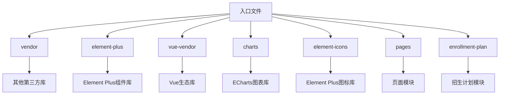
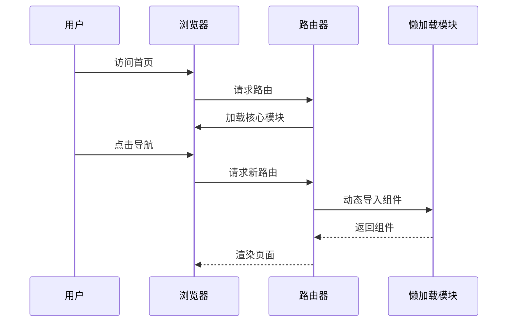
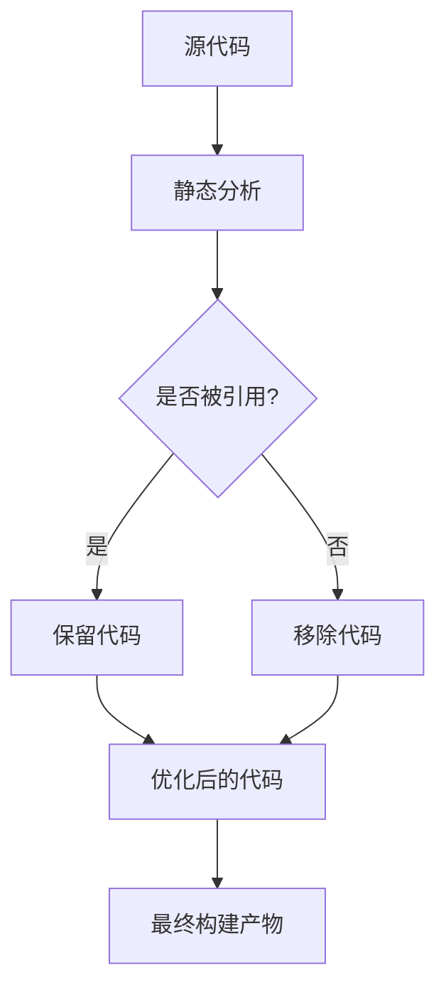
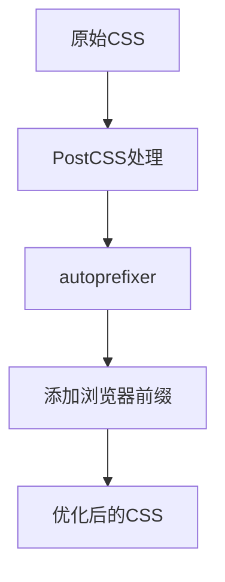
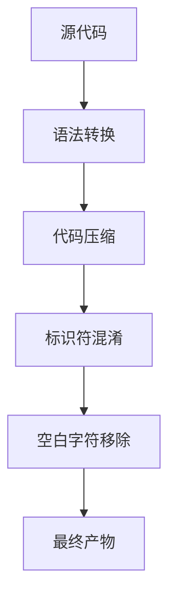
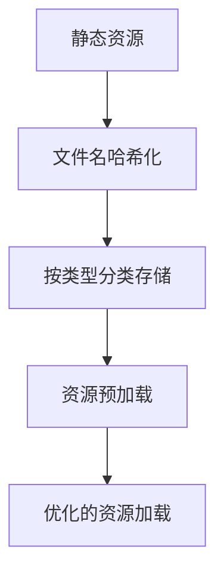
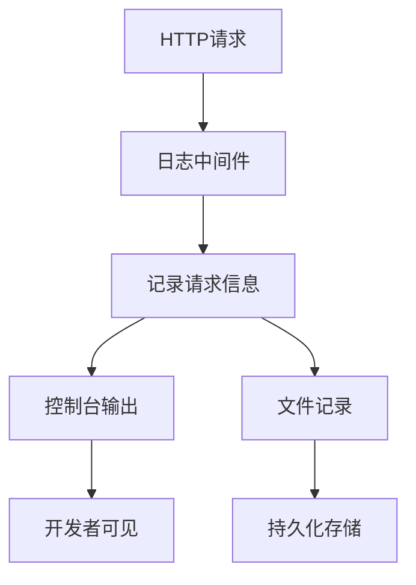
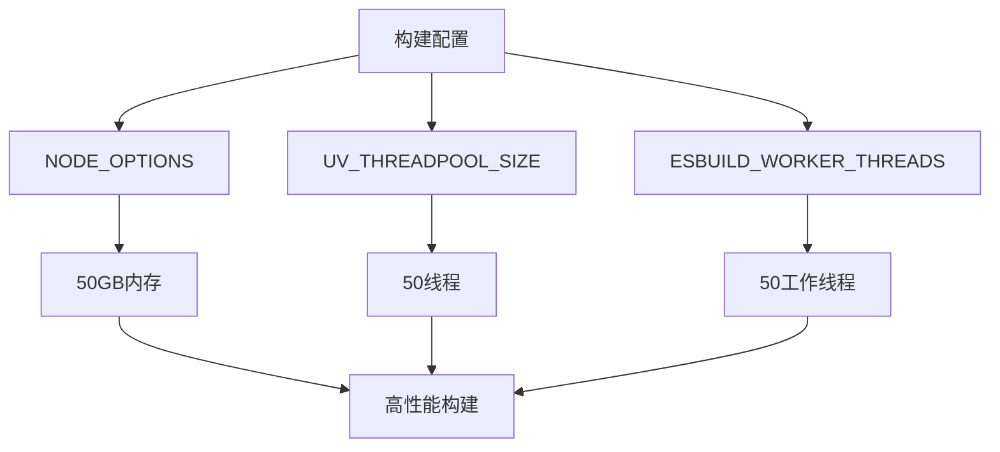
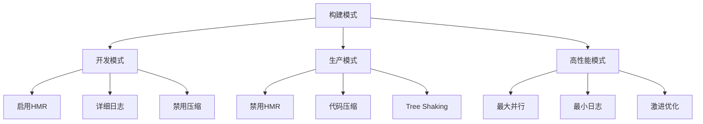

# 构建优化

<cite>
**本文档引用的文件**   
- [package.json](file://k.yyup.com/package.json)
- [client/package.json](file://k.yyup.com/client/package.json)
- [vite.config.ts](file://k.yyup.com/client/vite.config.ts)
- [vite.config.prod.ts](file://k.yyup.com/client/vite.config.prod.ts)
- [vite.config.turbo.ts](file://k.yyup.com/client/vite.config.turbo.ts)
- [postcss.config.js](file://k.yyup.com/client/postcss.config.js)
- [build-config.sh](file://k.yyup.com/build-config.sh)
- [src/router/index.ts](file://k.yyup.com/client/src/router/index.ts)
- [src/router/optimized-routes.ts](file://k.yyup.com/client/src/router/optimized-routes.ts)
- [src/router/mobile-routes.ts](file://k.yyup.com/client/src/router/mobile-routes.ts)
- [vite-plugin-logger.js](file://k.yyup.com/client/vite-plugin-logger.js)
- [vite-plugin-file-logger.js](file://k.yyup.com/client/vite-plugin-file-logger.js)
</cite>

## 目录
1. [介绍](#介绍)
2. [代码分割与路由懒加载](#代码分割与路由懒加载)
3. Tree Shaking实现机制
4. CSS优化策略
5. JavaScript优化
6. 资源优化
7. 构建性能监控
8. 构建优化实践指南
9. 不同构建模式的优化差异

## 介绍
本项目构建系统采用Vite作为核心构建工具，结合Vue 3框架，实现了高效的前端构建流程。项目通过多种优化策略，包括代码分割、Tree Shaking、CSS优化、JavaScript优化等，显著提升了构建性能和运行时性能。构建系统支持多种构建模式，包括开发模式、生产模式和高性能构建模式，满足不同场景下的需求。

**Section sources**
- [package.json](file://k.yyup.com/package.json)
- [client/package.json](file://k.yyup.com/client/package.json)

## 代码分割与路由懒加载
项目通过Vite的代码分割功能和Vue Router的动态导入实现包大小优化。在Vite配置中，通过`manualChunks`函数定义了详细的代码分割策略，将第三方依赖按功能模块分割成独立的chunk。

**Diagram sources**
- [vite.config.ts](file://k.yyup.com/client/vite.config.ts#L202-L212)
- [vite.config.prod.ts](file://k.yyup.com/client/vite.config.prod.ts#L70-L79)

路由懒加载通过Vue Router的动态导入语法实现，所有页面组件均采用`() => import()`的方式导入，确保按需加载。

**Diagram sources**
- [src/router/optimized-routes.ts](file://k.yyup.com/client/src/router/optimized-routes.ts#L13-L215)
- [src/router/index.ts](file://k.yyup.com/client/src/router/index.ts#L14-L17)

**Section sources**
- [vite.config.ts](file://k.yyup.com/client/vite.config.ts#L199-L216)
- [src/router/optimized-routes.ts](file://k.yyup.com/client/src/router/optimized-routes.ts#L13-L215)

## Tree Shaking实现机制
项目通过ES模块的静态分析特性实现Tree Shaking，消除未使用的代码。Vite基于Rollup的Tree Shaking功能，在构建时分析模块间的依赖关系，移除未被引用的代码。

在生产环境配置中，通过设置`rollupOptions.treeshake`选项优化Tree Shaking行为：

**Diagram sources**
- [vite.config.turbo.ts](file://k.yyup.com/client/vite.config.turbo.ts#L128-L132)
- [vite.config.prod.ts](file://k.yyup.com/client/vite.config.prod.ts#L62-L86)

通过`unplugin-auto-import`和`unplugin-vue-components`插件实现自动导入，减少手动导入语句，同时确保Tree Shaking的有效性。

**Section sources**
- [vite.config.turbo.ts](file://k.yyup.com/client/vite.config.turbo.ts#L128-L132)
- [vite.config.prod.ts](file://k.yyup.com/client/vite.config.prod.ts#L62-L86)

## CSS优化策略
项目采用PostCSS进行CSS优化，主要配置包括autoprefixer自动添加浏览器前缀。项目中注释掉了`postcss-px-to-viewport`插件，避免桌面端页面异常放大。

**Diagram sources**
- [postcss.config.js](file://k.yyup.com/client/postcss.config.js#L4-L18)

CSS代码分割通过Vite配置的`cssCodeSplit`选项实现，将CSS文件按需分割，减少初始加载体积。同时通过`cssMinify`选项使用esbuild进行CSS压缩。

**Section sources**
- [postcss.config.js](file://k.yyup.com/client/postcss.config.js#L4-L18)
- [vite.config.turbo.ts](file://k.yyup.com/client/vite.config.turbo.ts#L88-L89)

## JavaScript优化
JavaScript优化主要通过esbuild实现，包括代码压缩、混淆和现代语法转换。在构建配置中，使用esbuild的多种优化选项：

**Diagram sources**
- [vite.config.turbo.ts](file://k.yyup.com/client/vite.config.turbo.ts#L65-L74)
- [vite.config.prod.ts](file://k.yyup.com/client/vite.config.prod.ts#L59-L61)

通过设置`minify: 'esbuild'`使用esbuild进行压缩，相比terser速度快20倍。同时配置`target: 'es2020'`确保兼容现代浏览器。

**Section sources**
- [vite.config.turbo.ts](file://k.yyup.com/client/vite.config.turbo.ts#L65-L74)
- [vite.config.prod.ts](file://k.yyup.com/client/vite.config.prod.ts#L59-L61)

## 资源优化
资源优化包括图片压缩、字体优化和资源预加载。项目通过Vite的`assetFileNames`配置优化资源文件命名和存储结构。

**Diagram sources**
- [vite.config.ts](file://k.yyup.com/client/vite.config.ts#L213-L215)
- [vite.config.prod.ts](file://k.yyup.com/client/vite.config.prod.ts#L81-L83)

通过`warmup`配置预热常用文件，提升开发服务器启动速度。

**Section sources**
- [vite.config.ts](file://k.yyup.com/client/vite.config.ts#L171-L173)

## 构建性能监控
项目通过自定义Vite插件实现构建性能监控，包括访问日志记录和文件日志记录。`vite-plugin-logger`插件记录HTTP请求的详细信息，包括方法、状态码、URL和响应时间。

**Diagram sources**
- [vite-plugin-logger.js](file://k.yyup.com/client/vite-plugin-logger.js#L1-L47)
- [vite-plugin-file-logger.js](file://k.yyup.com/client/vite-plugin-file-logger.js#L1-L61)

通过`ANALYZE=true`环境变量启用构建分析，生成详细的构建报告。

**Section sources**
- [vite-plugin-logger.js](file://k.yyup.com/client/vite-plugin-logger.js#L1-L47)
- [vite-plugin-file-logger.js](file://k.yyup.com/client/vite-plugin-file-logger.js#L1-L61)

## 构建优化实践指南
项目提供了一系列构建优化实践指南，包括性能基准测试、增量构建优化和缓存策略。

高性能构建通过`build-config.sh`脚本配置，设置Node.js内存限制、线程池大小和esbuild工作线程数，充分利用服务器资源。

**Diagram sources**
- [build-config.sh](file://k.yyup.com/build-config.sh#L1-L37)

开发环境通过`optimizeDeps.force = true`强制重新预构建依赖，确保开发环境的稳定性。

**Section sources**
- [build-config.sh](file://k.yyup.com/build-config.sh#L1-L37)
- [vite.config.ts](file://k.yyup.com/client/vite.config.ts#L186-L187)

## 不同构建模式的优化差异
项目支持多种构建模式，每种模式有不同的优化策略：

**Diagram sources**
- [vite.config.ts](file://k.yyup.com/client/vite.config.ts)
- [vite.config.prod.ts](file://k.yyup.com/client/vite.config.prod.ts)
- [vite.config.turbo.ts](file://k.yyup.com/client/vite.config.turbo.ts)

开发模式注重开发体验，启用热模块替换(HMR)和详细的日志输出；生产模式注重产物质量，启用代码压缩和Tree Shaking；高性能模式注重构建速度，采用激进的并行化策略。

**Section sources**
- [vite.config.ts](file://k.yyup.com/client/vite.config.ts)
- [vite.config.prod.ts](file://k.yyup.com/client/vite.config.prod.ts)
- [vite.config.turbo.ts](file://k.yyup.com/client/vite.config.turbo.ts)