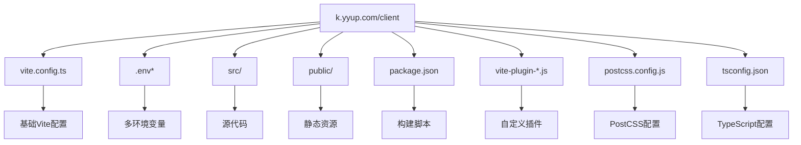
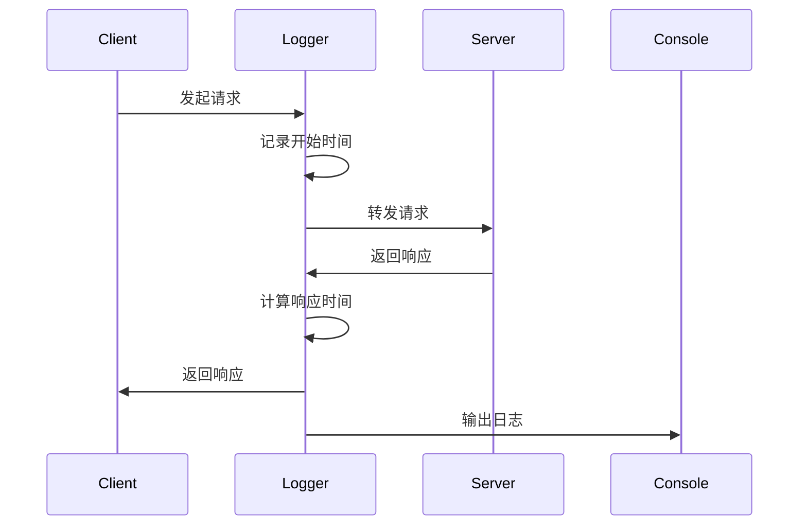
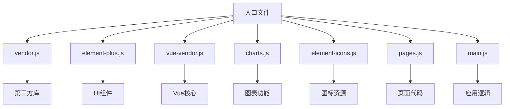
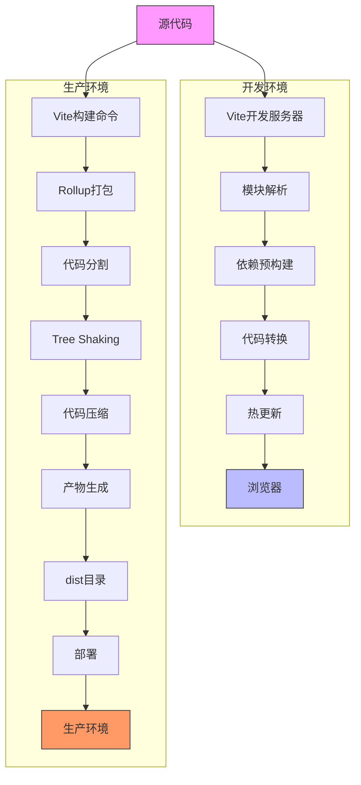

# 构建流程

<cite>
**本文档引用的文件**  
- [vite.config.ts](file://k.yyup.com/client/vite.config.ts)
- [vite-plugin-logger.js](file://k.yyup.com/client/vite-plugin-logger.js)
- [vite-plugin-file-logger.js](file://k.yyup.com/client/vite-plugin-file-logger.js)
- [.env](file://k.yyup.com/client/.env)
- [.env.development](file://k.yyup.com/client/.env.development)
- [.env.production](file://k.yyup.com/client/.env.production)
- [vite.config.prod.ts](file://k.yyup.com/client/vite.config.prod.ts)
- [vite.config.turbo.ts](file://k.yyup.com/client/vite.config.turbo.ts)
- [postcss.config.js](file://k.yyup.com/client/postcss.config.js)
- [tsconfig.json](file://k.yyup.com/client/tsconfig.json)
- [package.json](file://k.yyup.com/client/package.json)
</cite>

## 目录
1. [项目结构](#项目结构)
2. [Vite核心配置](#vite核心配置)
3. [多环境配置与变量注入](#多环境配置与变量注入)
4. [Vite插件系统集成](#vite插件系统集成)
5. [代码分割与懒加载策略](#代码分割与懒加载策略)
6. [CSS预处理器配置](#css预处理器配置)
7. [构建产物优化](#构建产物优化)
8. [构建调试技巧](#构建调试技巧)
9. [构建流程图](#构建流程图)

## 项目结构

本项目采用模块化前端架构，核心构建系统位于 `k.yyup.com/client` 目录下。该目录包含完整的Vite构建配置、源代码、静态资源和构建脚本。



**图示来源**  
- [vite.config.ts](file://k.yyup.com/client/vite.config.ts)
- [package.json](file://k.yyup.com/client/package.json)
- [src/](file://k.yyup.com/client/src)

## Vite核心配置

Vite构建系统通过 `vite.config.ts` 文件进行核心配置，包含开发服务器、构建选项、插件集成等关键设置。

### 基础路径与解析配置

通过 `resolve.alias` 配置了 `@` 别名指向 `src` 目录，简化模块导入路径。同时定义了多种文件扩展名的解析顺序，确保模块正确加载。

### 服务器配置

开发服务器配置包括端口、主机、热更新(HMR)等设置。特别针对WebSocket连接问题，配置了独立的HMR端口和主机，确保在复杂网络环境下仍能正常工作。

### 构建选项

构建配置包含代码分割策略、压缩设置、sourcemap生成等。通过 `rollupOptions.output.manualChunks` 实现了精细化的代码分割，将不同类型的依赖打包到独立的chunk中，优化加载性能。

**本节来源**  
- [vite.config.ts](file://k.yyup.com/client/vite.config.ts#L114-L219)
- [vite.config.prod.ts](file://k.yyup.com/client/vite.config.prod.ts#L46-L87)

## 多环境配置与变量注入

项目通过 `.env` 文件系列实现多环境配置管理，支持开发、测试、生产等不同环境的差异化设置。

### 环境文件体系

项目包含多个环境配置文件：
- `.env`：默认环境变量
- `.env.development`：开发环境变量
- `.env.production`：生产环境变量

### 环境变量注入机制

通过Vite的 `loadEnv` 函数在构建时加载对应环境的变量，并通过 `import.meta.env` 在运行时访问。所有以 `VITE_` 开头的变量都会被暴露给客户端代码。

### 差异化配置示例

```env
# 开发环境 - 使用代理
VITE_API_BASE_URL=/api
VITE_API_PROXY_TARGET=http://localhost:3000

# 生产环境 - 直接指向后端服务
VITE_API_BASE_URL=http://103.210.237.249:4000/api
```

**本节来源**  
- [.env](file://k.yyup.com/client/.env)
- [.env.development](file://k.yyup.com/client/.env.development)
- [.env.production](file://k.yyup.com/client/.env.production)
- [vite.config.ts](file://k.yyup.com/client/vite.config.ts#L13-L22)

## Vite插件系统集成

项目集成了多个Vite插件，包括官方插件和自定义插件，扩展了构建系统的功能。

### 核心插件

- `@vitejs/plugin-vue`：Vue 3单文件组件支持
- `@vitejs/plugin-vue-jsx`：Vue JSX支持
- `unplugin-auto-import`：自动导入常用API
- `unplugin-vue-components`：组件自动注册

### 自定义插件

#### vite-plugin-logger

实现访问日志记录功能，在开发服务器中添加中间件，记录每个请求的方法、URL、状态码和响应时间，并根据状态码显示不同颜色。



**图示来源**  
- [vite-plugin-logger.js](file://k.yyup.com/client/vite-plugin-logger.js)

#### vite-plugin-file-logger

在控制台日志基础上，增加文件日志功能。将访问日志同时写入 `logs/access.log` 文件，便于后续分析和审计。

**本节来源**  
- [vite-plugin-logger.js](file://k.yyup.com/client/vite-plugin-logger.js)
- [vite-plugin-file-logger.js](file://k.yyup.com/client/vite-plugin-file-logger.js)
- [vite.config.ts](file://k.yyup.com/client/vite.config.ts#L47-L48)

## 代码分割与懒加载策略

项目采用多种策略实现代码分割和懒加载，优化包大小和加载性能。

### 动态导入

通过 `import()` 语法实现动态导入，将代码分割到独立的chunk中，按需加载。

### 路由懒加载

在Vue Router配置中使用动态导入，实现路由组件的懒加载，确保初始加载只包含必要代码。

### 手动代码分割

通过 `rollupOptions.output.manualChunks` 配置，将依赖按类型分组打包：
- `element-plus`：Element Plus UI库
- `vue-vendor`：Vue生态库
- `charts`：图表库
- `element-icons`：图标库
- `pages`：页面组件



**图示来源**  
- [vite.config.ts](file://k.yyup.com/client/vite.config.ts#L202-L212)
- [vite.config.prod.ts](file://k.yyup.com/client/vite.config.prod.ts#L70-L80)

## CSS预处理器配置

项目使用SCSS作为CSS预处理器，并配置了全局样式和变量共享机制。

### SCSS配置

通过 `css.preprocessorOptions.scss` 配置SCSS编译选项，使用 `additionalData` 在每个SCSS文件开头自动导入设计令牌文件。

```ts
css: {
  preprocessorOptions: {
    scss: {
      additionalData: `@use "@/styles/design-tokens.scss" as *;`
    }
  }
}
```

### 全局样式注入

`design-tokens.scss` 文件包含所有设计系统变量（颜色、间距、字体等），通过自动导入机制，使这些变量在所有SCSS文件中可用，确保样式一致性。

### PostCSS配置

使用 `postcss.config.js` 配置PostCSS插件，目前仅启用 `autoprefixer` 自动添加浏览器前缀，注释掉了 `postcss-px-to-viewport` 插件以避免桌面端页面异常放大。

**本节来源**  
- [vite.config.ts](file://k.yyup.com/client/vite.config.ts#L175-L182)
- [postcss.config.js](file://k.yyup.com/client/postcss.config.js)
- [src/styles/design-tokens.scss](file://k.yyup.com/client/src/styles/design-tokens.scss)

## 构建产物优化

项目通过多种技术优化构建产物，提升性能和用户体验。

### 代码压缩

使用 `esbuild` 进行代码压缩，相比 `terser` 速度更快。在 `vite.config.turbo.ts` 中配置了激进的压缩选项，包括标识符最小化、语法压缩和空白压缩。

### Tree Shaking

通过ES模块的静态分析特性，自动移除未使用的代码。在 `vite.config.turbo.ts` 中配置了Rollup的treeshake选项，进一步优化副作用分析。

### Gzip压缩

虽然构建过程本身不生成Gzip文件，但配置了适当的文件扩展名和命名策略，便于部署时由服务器（如Nginx）进行Gzip压缩。

### 产物分析

通过注释掉的 `rollup-plugin-visualizer` 插件，可以在需要时生成构建产物的可视化分析报告，帮助识别体积过大的依赖。

**本节来源**  
- [vite.config.ts](file://k.yyup.com/client/vite.config.ts#L198-L219)
- [vite.config.turbo.ts](file://k.yyup.com/client/vite.config.turbo.ts#L65-L75)
- [vite.config.prod.ts](file://k.yyup.com/client/vite.config.prod.ts#L62-L87)

## 构建调试技巧

项目提供了多种构建调试工具和技巧，帮助开发者高效开发和排查问题。

### 开发服务器配置

通过 `package.json` 中的 `dev` 脚本，集成了端口清理、强制重建等功能，确保开发服务器启动的稳定性。

### 热更新机制

配置了HMR（热模块替换）功能，支持在不刷新页面的情况下更新修改的模块。特别针对WebSocket连接问题，配置了独立的HMR端口和协议。

### 构建性能分析

通过 `vite.config.turbo.ts` 配置了多种性能优化选项，包括：
- 增加Node.js内存限制
- 提高线程池大小
- 启用ESBuild工作线程
- 减少日志输出

### 日志调试

通过自定义的 `vite-plugin-logger` 和 `vite-plugin-file-logger` 插件，提供详细的访问日志，便于调试API调用和资源加载问题。

**本节来源**  
- [package.json](file://k.yyup.com/client/package.json#L8-L21)
- [vite-plugin-logger.js](file://k.yyup.com/client/vite-plugin-logger.js)
- [vite-plugin-file-logger.js](file://k.yyup.com/client/vite-plugin-file-logger.js)

## 构建流程图

以下是项目从源代码到生产环境产物的完整构建流程：



**图示来源**  
- [vite.config.ts](file://k.yyup.com/client/vite.config.ts)
- [package.json](file://k.yyup.com/client/package.json)
- [vite.config.prod.ts](file://k.yyup.com/client/vite.config.prod.ts)