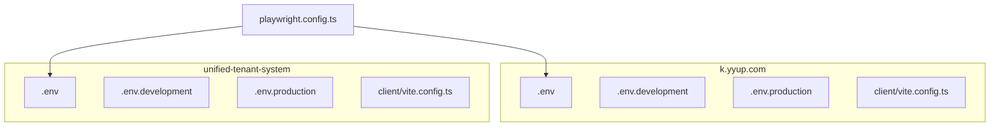
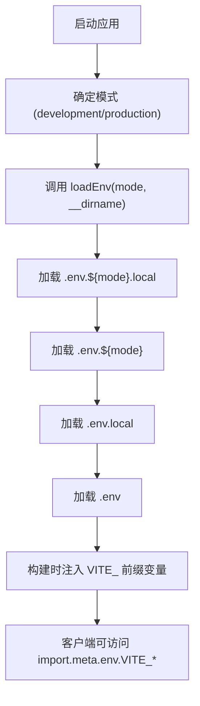
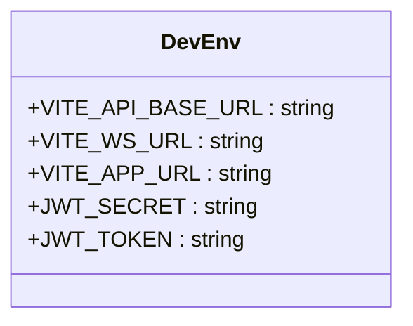
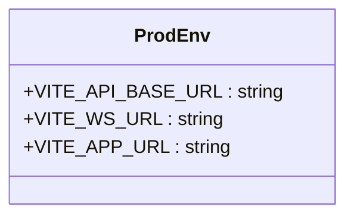
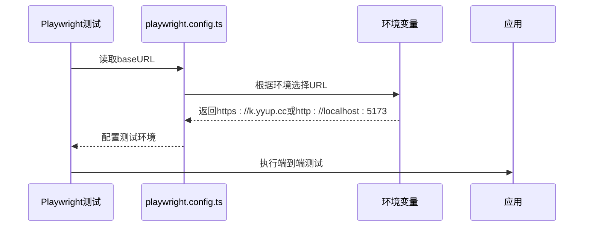

# 环境配置

<cite>
**本文档中引用的文件**  
- [.env](file://k.yyup.com/.env)
- [.env.development](file://k.yyup.com/.env.development)
- [.env.production](file://k.yyup.com/.env.production)
- [vite.config.ts](file://k.yyup.com/client/vite.config.ts)
- [.env](file://unified-tenant-system/.env)
- [.env.development](file://unified-tenant-system/.env.development)
- [.env.production](file://unified-tenant-system/.env.production)
- [vite.config.ts](file://unified-tenant-system/client/vite.config.ts)
- [playwright.config.ts](file://k.yyup.com/playwright.config.ts)
- [playwright.config.ts](file://unified-tenant-system/playwright.config.ts)
</cite>

## 目录
1. [简介](#简介)
2. [项目结构](#项目结构)
3. [核心组件](#核心组件)
4. [架构概述](#架构概述)
5. [详细组件分析](#详细组件分析)
6. [依赖分析](#依赖分析)
7. [性能考虑](#性能考虑)
8. [故障排除指南](#故障排除指南)
9. [结论](#结论)

## 简介
本项目采用基于 `.env` 文件的多环境变量管理系统，支持开发、生产、测试等多种环境配置。系统通过 Vite 构建工具实现环境变量的加载与注入，确保不同环境下应用行为的一致性与安全性。环境变量通过 `VITE_` 前缀暴露至客户端，实现前后端配置的统一管理。本文档详细说明环境变量的加载机制、优先级规则、构建时注入原理，以及各环境的具体配置内容。

## 项目结构
项目包含两个主要子系统：`k.yyup.com` 和 `unified-tenant-system`，每个子系统均具备独立的环境配置体系。环境变量文件位于各子系统根目录，Vite 配置位于 `client` 子目录中。



**图示来源**  
- [.env](file://k.yyup.com/.env)
- [.env.development](file://k.yyup.com/.env.development)
- [.env.production](file://k.yyup.com/.env.production)
- [vite.config.ts](file://k.yyup.com/client/vite.config.ts)
- [.env](file://unified-tenant-system/.env)
- [.env.development](file://unified-tenant-system/.env.development)
- [.env.production](file://unified-tenant-system/.env.production)
- [vite.config.ts](file://unified-tenant-system/client/vite.config.ts)

**本节来源**  
- [k.yyup.com/](file://k.yyup.com/)
- [unified-tenant-system/](file://unified-tenant-system/)

## 核心组件
环境配置系统的核心组件包括 `.env` 系列文件和 `vite.config.ts` 配置文件。`.env` 文件用于定义不同环境下的变量，`vite.config.ts` 负责加载这些变量并注入到构建过程中。Playwright 测试配置文件则用于定义测试环境的基准 URL，确保测试在正确的环境中运行。

**本节来源**  
- [.env](file://k.yyup.com/.env)
- [.env.development](file://k.yyup.com/.env.development)
- [.env.production](file://k.yyup.com/.env.production)
- [vite.config.ts](file://k.yyup.com/client/vite.config.ts)
- [playwright.config.ts](file://k.yyup.com/playwright.config.ts)

## 架构概述
系统采用分层环境配置架构，通过 Vite 的 `loadEnv` 函数按模式加载对应的 `.env` 文件。环境变量优先级遵循：命令行 > `.env.${mode}.local` > `.env.${mode}` > `.env.local` > `.env`。只有以 `VITE_` 开头的变量才会被暴露到客户端代码中，其余变量仅在构建时可用。



**图示来源**  
- [vite.config.ts](file://k.yyup.com/client/vite.config.ts)
- [vite.config.ts](file://unified-tenant-system/client/vite.config.ts)

## 详细组件分析

### 开发环境配置分析
开发环境配置文件 `.env.development` 定义了开发时的 API 基础路径、WebSocket 地址和应用 URL。这些配置指向开发服务器，便于本地调试。JWT 相关配置用于模拟认证状态。



**图示来源**  
- [.env.development](file://k.yyup.com/.env.development)
- [.env.development](file://unified-tenant-system/.env.development)

**本节来源**  
- [.env.development](file://k.yyup.com/.env.development)
- [.env.development](file://unified-tenant-system/.env.development)

### 生产环境配置分析
生产环境配置文件 `.env.production` 定义了生产环境的 API 地址、WebSocket 地址和应用 URL。这些配置指向生产服务器，确保应用在生产环境中正确运行。生产环境不包含敏感的 JWT 配置。



**图示来源**  
- [.env.production](file://k.yyup.com/.env.production)
- [.env.production](file://unified-tenant-system/.env.production)

**本节来源**  
- [.env.production](file://k.yyup.com/.env.production)
- [.env.production](file://unified-tenant-system/.env.production)

### 测试环境配置分析
测试环境通过 `playwright.config.ts` 文件配置，定义了测试的基准 URL 和浏览器配置。测试配置区分了本地开发测试和生产环境测试，确保测试覆盖不同场景。



**图示来源**  
- [playwright.config.ts](file://k.yyup.com/playwright.config.ts)
- [playwright.config.ts](file://unified-tenant-system/playwright.config.ts)

**本节来源**  
- [playwright.config.ts](file://k.yyup.com/playwright.config.ts)
- [playwright.config.ts](file://unified-tenant-system/playwright.config.ts)

## 依赖分析
环境配置系统依赖 Vite 的环境变量加载机制和 Playwright 的测试运行机制。Vite 负责构建时的变量注入，Playwright 负责运行时的环境配置。

```mermaid
dependencyDiagram
Vite --> loadEnv : 加载.env文件
Vite --> defineConfig : 注入环境变量
Playwright --> baseURL : 配置测试环境
loadEnv --> .env : 读取配置
loadEnv --> .env.development : 读取开发配置
loadEnv --> .env.production : 读取生产配置
```

**图示来源**  
- [vite.config.ts](file://k.yyup.com/client/vite.config.ts)
- [playwright.config.ts](file://k.yyup.com/playwright.config.ts)

**本节来源**  
- [vite.config.ts](file://k.yyup.com/client/vite.config.ts)
- [playwright.config.ts](file://k.yyup.com/playwright.config.ts)

## 性能考虑
环境变量在构建时静态注入，不会影响运行时性能。Vite 的依赖预构建配置优化了首次加载速度，代码分割策略改善了关键渲染路径（LCP）。

## 故障排除指南
常见环境配置问题包括变量未正确加载、API 调用失败、测试环境不匹配等。调试时应检查 `.env` 文件命名是否正确，确认 `VITE_` 前缀是否添加，验证 `playwright.config.ts` 中的 `baseURL` 配置。

**本节来源**  
- [vite.config.ts](file://k.yyup.com/client/vite.config.ts)
- [playwright.config.ts](file://k.yyup.com/playwright.config.ts)

## 结论
本项目通过 `.env` 文件和 Vite 配置实现了灵活的多环境管理。开发、生产、测试环境各有独立配置，确保了环境隔离和配置一致性。建议开发者遵循命名规范，保护敏感信息，并通过自动化测试验证配置正确性。