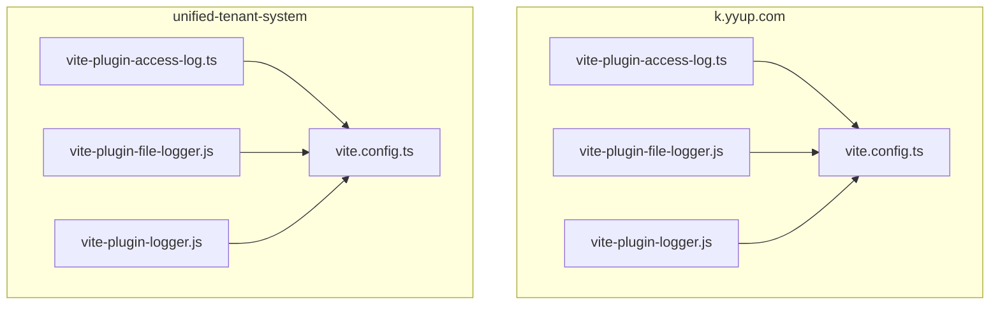
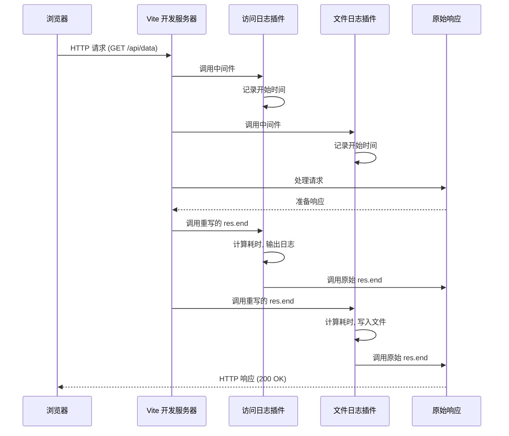
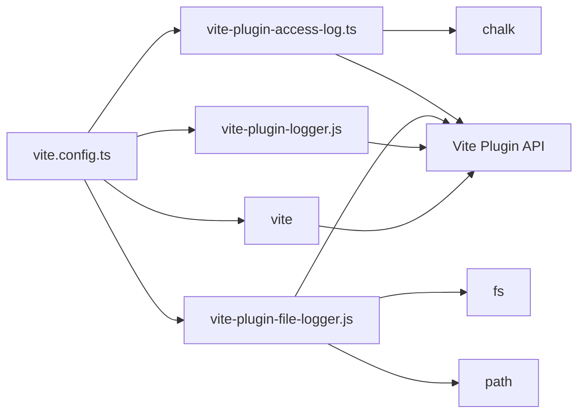

# 自定义插件

<cite>
**本文档引用文件**  
- [vite-plugin-access-log.ts](file://k.yyup.com/client/vite-plugin-access-log.ts)
- [vite-plugin-file-logger.js](file://k.yyup.com/client/vite-plugin-file-logger.js)
- [vite-plugin-logger.js](file://k.yyup.com/client/vite-plugin-logger.js)
- [vite.config.ts](file://k.yyup.com/client/vite.config.ts)
- [unified-tenant-system/client/vite-plugin-access-log.ts](file://unified-tenant-system/client/vite-plugin-access-log.ts)
- [unified-tenant-system/client/vite-plugin-file-logger.js](file://unified-tenant-system/client/vite-plugin-file-logger.js)
- [unified-tenant-system/client/vite-plugin-logger.js](file://unified-tenant-system/client/vite-plugin-logger.js)
- [unified-tenant-system/client/vite.config.ts](file://unified-tenant-system/client/vite.config.ts)
</cite>

## 目录
1. [简介](#简介)
2. [项目结构](#项目结构)
3. [核心组件](#核心组件)
4. [架构概述](#架构概述)
5. [详细组件分析](#详细组件分析)
6. [依赖分析](#依赖分析)
7. [性能考虑](#性能考虑)
8. [故障排除指南](#故障排除指南)
9. [结论](#结论)

## 简介
本文档详细介绍了在 `k.yyup.com` 和 `unified-tenant-system` 项目中实现的自定义 Vite 插件。重点分析了三个核心日志插件：访问日志插件（vite-plugin-access-log.ts）、文件日志插件（vite-plugin-file-logger.js）和通用日志插件（vite-plugin-logger.js）。这些插件用于在开发服务器运行期间记录 HTTP 请求信息、构建过程日志以及系统事件，为开发者提供详细的运行时洞察。文档将深入探讨插件的实现机制、生命周期钩子使用、配置方式以及最佳实践。

## 项目结构
项目中包含两个主要应用：`k.yyup.com` 和 `unified-tenant-system`，它们都实现了相似的日志插件系统。每个应用的 `client` 目录下都包含了一套完整的 Vite 插件实现，包括访问日志、文件日志和通用日志插件。这些插件通过 `vite.config.ts` 配置文件集成到 Vite 构建流程中。



**图示来源**
- [vite-plugin-access-log.ts](file://k.yyup.com/client/vite-plugin-access-log.ts)
- [vite-plugin-file-logger.js](file://k.yyup.com/client/vite-plugin-file-logger.js)
- [vite-plugin-logger.js](file://k.yyup.com/client/vite-plugin-logger.js)
- [vite.config.ts](file://k.yyup.com/client/vite.config.ts)
- [unified-tenant-system/client/vite-plugin-access-log.ts](file://unified-tenant-system/client/vite-plugin-access-log.ts)
- [unified-tenant-system/client/vite-plugin-file-logger.js](file://unified-tenant-system/client/vite-plugin-file-logger.js)
- [unified-tenant-system/client/vite-plugin-logger.js](file://unified-tenant-system/client/vite-plugin-logger.js)
- [unified-tenant-system/client/vite.config.ts](file://unified-tenant-system/client/vite.config.ts)

## 核心组件
本项目的核心组件是三个自定义的 Vite 插件，它们共同构成了开发环境的日志记录系统。`vite-plugin-access-log.ts` 负责在控制台输出格式化的访问日志，使用 `chalk` 库为不同状态码提供颜色编码。`vite-plugin-file-logger.js` 不仅在控制台输出日志，还会将日志信息持久化到 `logs/access.log` 文件中，便于后续分析。`vite-plugin-logger.js` 是一个轻量级的通用日志插件，使用原生 ANSI 转义序列实现日志着色。这三个插件都通过 `configureServer` 钩子注入到 Vite 的中间件管道中，拦截并记录 HTTP 请求的生命周期。

**组件来源**
- [vite-plugin-access-log.ts](file://k.yyup.com/client/vite-plugin-access-log.ts)
- [vite-plugin-file-logger.js](file://k.yyup.com/client/vite-plugin-file-logger.js)
- [vite-plugin-logger.js](file://k.yyup.com/client/vite-plugin-logger.js)

## 架构概述
日志插件系统的架构基于 Vite 的插件 API，利用 `configureServer` 生命周期钩子在开发服务器启动时注册自定义中间件。当 Vite 开发服务器收到 HTTP 请求时，请求会流经这些中间件。每个日志插件都会在请求开始时记录时间戳，并通过重写 `res.end` 方法来捕获响应完成的时机，从而计算出请求的响应时间。插件会提取请求方法、URL、状态码等信息，经过过滤（如排除 HMR 和静态资源请求）后，生成结构化的日志条目。



**图示来源**
- [vite-plugin-access-log.ts](file://k.yyup.com/client/vite-plugin-access-log.ts#L7-L48)
- [vite-plugin-file-logger.js](file://k.yyup.com/client/vite-plugin-file-logger.js#L25-L59)
- [vite.config.ts](file://k.yyup.com/client/vite.config.ts#L47-L48)

## 详细组件分析

### 访问日志插件分析
`vite-plugin-access-log.ts` 是一个 TypeScript 实现的插件，它利用 `chalk` 库在控制台输出美观的彩色日志。插件的核心是 `configureServer` 钩子，它向 Vite 服务器的中间件堆栈添加了一个函数。该函数在请求开始时记录时间戳，并通过重写 `res.end` 方法来捕获响应完成的时刻。插件会根据响应状态码动态选择颜色（绿色表示成功，黄色表示客户端错误，红色表示服务器错误），并过滤掉 HMR 和 `node_modules` 相关的请求，以减少日志噪音。

```mermaid
flowchart TD
A[请求到达] --> B[记录开始时间]
B --> C[保存原始 res.end]
C --> D[重写 res.end 方法]
D --> E[调用 next() 继续处理]
E --> F[响应准备就绪]
F --> G[调用重写的 res.end]
G --> H[计算响应时间]
H --> I[获取状态码]
I --> J{状态码 >= 500?}
J --> |是| K[设置为红色]
J --> |否| L{状态码 >= 400?}
L --> |是| M[设置为黄色]
L --> |否| N[设置为绿色]
N --> O[格式化日志]
M --> O
K --> O
O --> P{是 HMR 或 node_modules 请求?}
P --> |是| Q[跳过日志]
P --> |否| R[输出彩色日志]
R --> S[调用原始 res.end]
```

**图示来源**
- [vite-plugin-access-log.ts](file://k.yyup.com/client/vite-plugin-access-log.ts#L7-L48)
- [unified-tenant-system/client/vite-plugin-access-log.ts](file://unified-tenant-system/client/vite-plugin-access-log.ts#L7-L48)

### 文件日志插件分析
`vite-plugin-file-logger.js` 插件不仅提供控制台输出，还实现了日志的持久化存储。它在插件初始化时检查并创建 `logs` 目录，确保日志文件可以被写入。`writeLog` 函数负责将带有时间戳的日志条目同时输出到控制台和追加到 `logs/access.log` 文件中。与访问日志插件类似，它也通过中间件拦截请求，并在 `res.end` 被调用时记录请求的详细信息，包括方法、状态码、URL 和响应时间。该插件还过滤了 `.map` 文件和 `@fs` 请求，以保持日志的清晰度。

```mermaid
flowchart TD
A[插件初始化] --> B[检查 logs 目录]
B --> C{目录存在?}
C --> |否| D[创建 logs 目录]
C --> |是| E[继续]
D --> E
E --> F[导出插件对象]
F --> G[configureServer 钩子]
G --> H[记录服务器启动]
H --> I[注册中间件]
I --> J[请求到达]
J --> K[记录开始时间]
K --> L[重写 res.end]
L --> M[调用 next()]
M --> N[响应完成]
N --> O[调用重写的 res.end]
O --> P[计算耗时和状态]
P --> Q{是有效请求?}
Q --> |否| R[跳过]
Q --> |是| S[构造日志消息]
S --> T[调用 writeLog]
T --> U[输出到控制台]
T --> V[追加到 access.log]
V --> W[调用原始 res.end]
```

**图示来源**
- [vite-plugin-file-logger.js](file://k.yyup.com/client/vite-plugin-file-logger.js#L4-L61)
- [unified-tenant-system/client/vite-plugin-file-logger.js](file://unified-tenant-system/client/vite-plugin-file-logger.js#L4-L61)

### 通用日志插件分析
`vite-plugin-logger.js` 是一个更轻量级的实现，它不依赖外部库（如 `chalk`），而是直接使用 ANSI 转义序列（`\x1b[32m` 等）来为控制台输出添加颜色。其工作原理与其他两个插件基本相同：通过 `configureServer` 注册中间件，在请求开始时记录时间，在响应结束时计算耗时、获取状态码，并根据状态码选择相应的颜色代码。该插件同样过滤了 HMR、`node_modules` 和 `.map` 文件的请求，以专注于记录主要的 API 和页面请求。

**组件来源**
- [vite-plugin-logger.js](file://k.yyup.com/client/vite-plugin-logger.js#L1-L47)
- [unified-tenant-system/client/vite-plugin-logger.js](file://unified-tenant-system/client/vite-plugin-logger.js#L1-L47)

## 依赖分析
日志插件系统依赖于 Vite 的核心功能和一些 Node.js 内置模块。`vite-plugin-access-log.ts` 依赖于第三方库 `chalk` 来实现跨平台的终端着色。`vite-plugin-file-logger.js` 依赖于 Node.js 的 `fs` 和 `path` 模块来处理文件系统操作，如创建目录和追加写入日志文件。所有插件都依赖于 Vite 的 `Plugin` 类型定义和 `configureServer` 钩子。这些插件通过 `vite.config.ts` 中的 `plugins` 数组被引入，与 `vue`、`vueJsx` 等其他插件协同工作。



**图示来源**
- [vite-plugin-access-log.ts](file://k.yyup.com/client/vite-plugin-access-log.ts#L1-L2)
- [vite-plugin-file-logger.js](file://k.yyup.com/client/vite-plugin-file-logger.js#L1-L2)
- [vite-plugin-logger.js](file://k.yyup.com/client/vite-plugin-logger.js)
- [vite.config.ts](file://k.yyup.com/client/vite.config.ts#L1-L11)

## 性能考虑
这些日志插件在开发环境中运行，对性能的影响是可控的。日志记录操作（尤其是 `console.log` 和文件 I/O）是同步的，可能会轻微增加每个请求的延迟。然而，由于它们只在开发服务器上启用，并且过滤掉了高频的 HMR 请求，因此对整体开发体验的影响很小。`vite-plugin-file-logger.js` 的文件写入操作使用 `fs.appendFileSync`，这是一个阻塞操作，但在开发环境下，日志量通常不大，其影响可以忽略。最佳实践是仅在开发和测试环境中启用这些插件，在生产构建中应将其排除，以避免任何潜在的性能开销和安全风险（如日志信息泄露）。

## 故障排除指南
如果日志插件未按预期工作，请检查以下几点：
1.  **插件是否已正确导入**：确认 `vite.config.ts` 文件中已正确导入 `createLogger` 和 `createFileLogger` 函数。
2.  **插件是否已添加到配置**：检查 `vite.config.ts` 的 `plugins` 数组，确保 `createLogger()` 和 `createFileLogger()` 已被调用并包含在数组中。
3.  **文件权限问题**：对于 `vite-plugin-file-logger.js`，确保 Node.js 进程有权限在项目根目录下创建 `logs` 文件夹和写入 `logs/access.log` 文件。
4.  **依赖安装**：确保 `chalk` 库已通过 `npm install chalk` 安装，否则 `vite-plugin-access-log.ts` 会报错。
5.  **语法错误**：检查插件文件本身是否有 TypeScript 或 JavaScript 语法错误。

**组件来源**
- [vite.config.ts](file://k.yyup.com/client/vite.config.ts#L9-L11)
- [vite.config.ts](file://k.yyup.com/client/vite.config.ts#L47-L48)

## 结论
本文档详细分析了项目中实现的三个自定义 Vite 日志插件。这些插件通过利用 Vite 的 `configureServer` 钩子，有效地拦截了开发服务器的 HTTP 请求，并记录了宝贵的访问日志信息。`vite-plugin-access-log.ts` 提供了美观的彩色控制台输出，`vite-plugin-file-logger.js` 实现了日志的持久化存储，而 `vite-plugin-logger.js` 则提供了一个轻量级的替代方案。这些插件的设计遵循了 Vite 插件的最佳实践，具有良好的可配置性和低侵入性，为开发过程中的调试和监控提供了强有力的支持。开发者可以基于这些示例，创建更多功能丰富的自定义插件来满足特定需求。