# Action逻辑

<cite>
**本文档引用的文件**   
- [mobile-workflow.ts](file://k.yyup.com/client/aimobile/stores/mobile-workflow.ts)
- [ai-assistant.ts](file://k.yyup.com/client/aimobile/stores/ai-assistant.ts)
- [ai-assistant.ts](file://k.yyup.com/client/src/stores/ai-assistant.ts)
- [user.ts](file://k.yyup.com/client/src/stores/user.ts)
- [app.ts](file://k.yyup.com/client/src/stores/app.ts)
</cite>

## 目录
1. [引言](#引言)
2. [Pinia Store Actions设计原则](#pinia-store-actions设计原则)
3. [同步状态更新实现](#同步状态更新实现)
4. [异步Actions处理模式](#异步actions处理模式)
5. [复杂业务逻辑封装案例](#复杂业务逻辑封装案例)
6. [Actions调用关系与状态管理](#actions调用关系与状态管理)
7. [最佳实践建议](#最佳实践建议)
8. [结论](#结论)

## 引言

本项目采用Pinia作为状态管理解决方案，通过Actions实现对应用状态的集中管理和修改。Actions作为唯一修改state的途径，确保了状态变更的可预测性和可追踪性。本文档将深入分析Pinia Store中Actions的实现机制，重点介绍同步和异步操作的处理方式，以及在mobile-workflow和ai-assistant等store中的实际应用。

## Pinia Store Actions设计原则

Pinia Store中的Actions遵循单一职责原则，每个Action负责一个特定的业务逻辑单元。通过将复杂的业务流程分解为多个小的Actions，提高了代码的可维护性和可测试性。所有state的修改都必须通过Actions进行，这保证了状态变更的可追踪性，便于调试和问题排查。

**Section sources**
- [mobile-workflow.ts](file://k.yyup.com/client/aimobile/stores/mobile-workflow.ts#L97-L463)
- [ai-assistant.ts](file://k.yyup.com/client/aimobile/stores/ai-assistant.ts#L159-L645)

## 同步状态更新实现

同步状态更新通过直接修改store中的响应式变量来实现。例如，在app store中，`toggleSidebar` Action通过直接修改`isCollapse`状态来切换侧边栏的展开/折叠状态，并将状态持久化到localStorage中。

**Diagram sources**
- [app.ts](file://k.yyup.com/client/src/stores/app.ts#L13-L17)

**Section sources**
- [app.ts](file://k.yyup.com/client/src/stores/app.ts#L13-L17)

## 异步Actions处理模式

异步Actions广泛使用Promise和async/await语法来处理异步操作。在ai-assistant store中，`sendMessage` Action通过async/await语法调用移动端AI服务，处理消息发送和接收的完整流程。该Action包含错误处理机制，确保在网络请求失败时能够正确更新状态并提供用户反馈。

**Diagram sources**
- [ai-assistant.ts](file://k.yyup.com/client/aimobile/stores/ai-assistant.ts#L269-L376)

**Section sources**
- [ai-assistant.ts](file://k.yyup.com/client/aimobile/stores/ai-assistant.ts#L269-L376)

## 复杂业务逻辑封装案例

### mobile-workflow store工作流执行

mobile-workflow store中的`executeWorkflow` Action封装了移动端工作流的完整执行逻辑。该Action首先检查执行条件，然后创建工作流实例，初始化步骤状态，并开始执行。通过引入移动端特定的状态（如电池电量、网络质量等），实现了对移动设备环境的智能适应。

```mermaid
flowchart TD
A["执行 executeWorkflow"] --> B["检查执行条件"]
B --> C{"条件满足?"}
C --> |是| D["创建工作流实例"]
C --> |否| E["抛出异常"]
D --> F["初始化步骤状态"]
F --> G["触发触觉反馈"]
G --> H["开始执行"]
H --> I["返回工作流实例"]
```

**Diagram sources**
- [mobile-workflow.ts](file://k.yyup.com/client/aimobile/stores/mobile-workflow.ts#L99-L192)

### ai-assistant store AI对话请求

ai-assistant store中的`sendMessage` Action封装了AI对话请求的完整流程。该Action处理用户输入，调用AI服务，处理响应，并更新聊天会话。通过引入上下文记忆和智能建议功能，提升了用户体验。

**Diagram sources**
- [ai-assistant.ts](file://k.yyup.com/client/aimobile/stores/ai-assistant.ts#L269-L376)

**Section sources**
- [mobile-workflow.ts](file://k.yyup.com/client/aimobile/stores/mobile-workflow.ts#L99-L192)
- [ai-assistant.ts](file://k.yyup.com/client/aimobile/stores/ai-assistant.ts#L269-L376)

## Actions调用关系与状态管理

Actions之间通过直接调用或事件驱动的方式进行交互。例如，在ai-assistant store中，`initialize` Action会依次调用`initializeSpeechRecognition`、`initializeSpeechSynthesis`和`loadChatHistory`等其他Actions来完成初始化流程。通过合理管理loading状态和错误处理，确保了用户体验的流畅性。

**Diagram sources**
- [ai-assistant.ts](file://k.yyup.com/client/aimobile/stores/ai-assistant.ts#L161-L175)

**Section sources**
- [ai-assistant.ts](file://k.yyup.com/client/aimobile/stores/ai-assistant.ts#L161-L175)

## 最佳实践建议

1. **分解复杂逻辑**：将复杂的业务逻辑分解为多个小的Actions，每个Action只负责一个明确的职责。
2. **合理使用参数**：为Actions设计清晰的参数接口，避免过度依赖store的内部状态。
3. **避免循环依赖**：确保Actions之间的调用关系是单向的，避免出现循环依赖。
4. **错误处理**：在异步Actions中实现完整的错误处理机制，确保应用的健壮性。
5. **状态管理**：合理使用loading状态和错误状态，为用户提供清晰的反馈。

**Section sources**
- [mobile-workflow.ts](file://k.yyup.com/client/aimobile/stores/mobile-workflow.ts)
- [ai-assistant.ts](file://k.yyup.com/client/aimobile/stores/ai-assistant.ts)

## 结论

通过深入分析Pinia Store中Actions的实现机制，我们可以看到其在管理复杂应用状态方面的强大能力。通过遵循最佳实践，合理设计Actions的结构和交互方式，可以构建出可维护、可扩展且用户体验良好的应用。