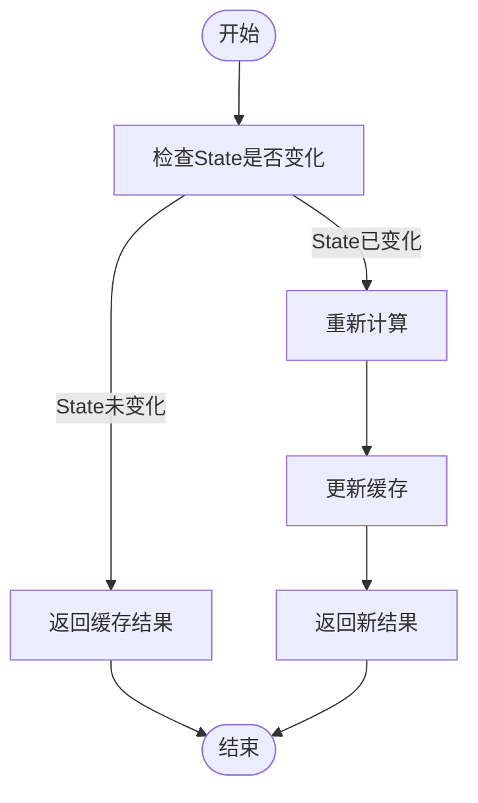
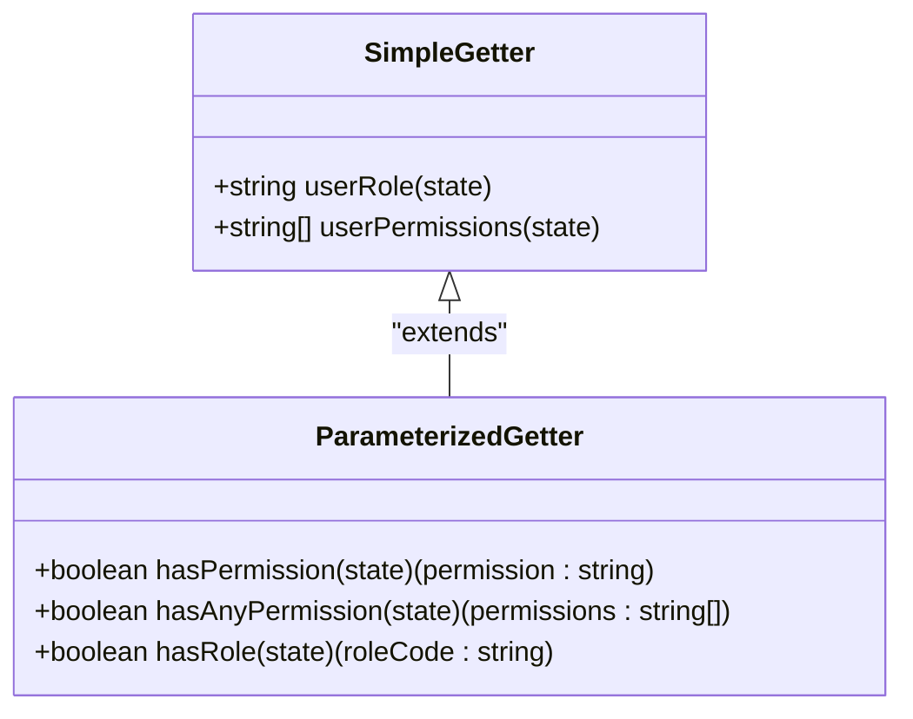
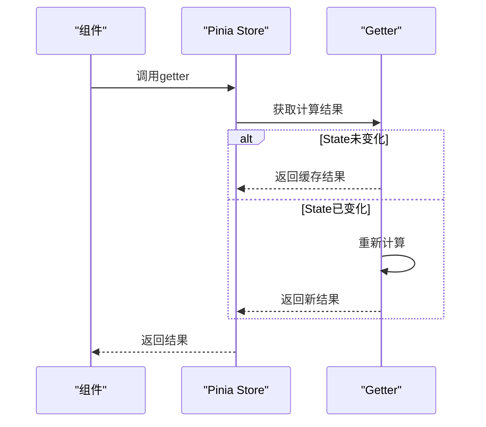

# Getter实现

<cite>
**本文档引用文件**   
- [ai.ts](file://client/src/store/modules/ai.ts#L40-L49)
- [auth.ts](file://client/src/store/modules/auth.ts#L84-L113)
- [chat.ts](file://client/src/store/modules/chat.ts#L20-L31)
- [user.ts](file://client/src/stores/user.ts#L69-L108)
- [ai-assistant.ts](file://client/src/stores/ai-assistant.ts#L55-L67)
- [ai-assistant.ts](file://client/aimobile/stores/ai-assistant.ts#L111-L127)
- [mobile-ai.ts](file://client/aimobile/stores/mobile-ai.ts#L69-L110)
</cite>

## 目录
1. [引言](#引言)
2. [Getter基础概念](#getter基础概念)
3. [缓存机制详解](#缓存机制详解)
4. [同步特性说明](#同步特性说明)
5. [定义方式](#定义方式)
6. [实际应用示例](#实际应用示例)
7. [访问State与其他Getters](#访问state与其他getters)
8. [性能优化建议](#性能优化建议)
9. [结论](#结论)

## 引言
本项目中，Pinia store的getters作为计算属性，为前端应用提供了高效的数据处理和状态管理机制。getters不仅能够封装复杂的业务逻辑，还能通过缓存机制避免重复计算，显著提升应用性能。本文将深入探讨getters的实现细节，包括其缓存机制、同步特性、定义方式以及在实际项目中的应用。

## Getter基础概念
Getters是Pinia store中的计算属性，用于从state中派生出新的数据。它们是只读的，不能直接修改，只能通过actions来改变state，从而间接影响getters的返回值。getters的定义方式类似于Vue的computed属性，但具有更强大的功能和灵活性。

**Section sources**
- [ai.ts](file://client/src/store/modules/ai.ts#L40-L49)
- [auth.ts](file://client/src/store/modules/auth.ts#L84-L113)

## 缓存机制详解
Getters的缓存机制是其核心优势之一。当getters依赖的state发生变化时，getters会自动重新计算并返回新的值。然而，如果state没有变化，getters将直接返回缓存的结果，避免了不必要的计算开销。这种机制特别适用于处理大量数据或复杂计算的场景，能够显著提升应用性能。

例如，在`ai.ts`文件中，`availableModels` getter通过过滤`state.models`来返回所有激活的模型。由于getters的缓存特性，只要`state.models`没有变化，多次调用`availableModels`将直接返回缓存结果，而不会重复执行过滤操作。

**Diagram sources**
- [ai.ts](file://client/src/store/modules/ai.ts#L42-L44)

## 同步特性说明
Getters是同步的，这意味着它们不能执行异步操作。异步操作应该在actions中处理，然后通过改变state来间接影响getters的返回值。这一特性确保了getters的计算结果是可预测的，并且能够在组件渲染时立即可用。

**Section sources**
- [chat.ts](file://client/src/store/modules/chat.ts#L20-L31)

## 定义方式
Getters可以分为简单getters和带参数的getters。简单getters直接返回一个基于state的计算结果，而带参数的getters则接受额外的参数来动态生成结果。

### 简单Getters
简单getters是最常见的形式，它们直接从state中派生数据。例如，在`auth.ts`文件中，`userRole` getter返回当前用户的第一个角色代码或名称。

### 带参数的Getters
带参数的getters允许更灵活的数据处理。例如，`hasPermission` getter接受一个权限字符串作为参数，返回用户是否拥有该权限。

**Diagram sources**
- [auth.ts](file://client/src/store/modules/auth.ts#L86-L113)

## 实际应用示例
### 消息列表过滤
在`chat.ts`文件中，`allConversations` getter将`state.conversations`对象转换为数组，并按最后更新时间排序。这使得UI组件可以轻松地显示最新的会话列表。

### AI状态计算
在`mobile-ai.ts`文件中，`roleSystemPrompt` getter根据当前用户角色返回不同的系统提示。这使得AI助手能够根据不同角色提供个性化的服务。

**Diagram sources**
- [chat.ts](file://client/src/store/modules/chat.ts#L26-L30)
- [mobile-ai.ts](file://client/aimobile/stores/mobile-ai.ts#L78-L110)

## 访问State与其他Getters
Getters可以访问store的state以及其他getters。这使得复杂的业务逻辑可以被分解为多个简单的getters，然后组合使用。例如，在`user.ts`文件中，`isAdmin` getter不仅检查`state.userInfo`中的`isAdmin`标志，还根据角色判断是否为管理员。

**Section sources**
- [user.ts](file://client/src/stores/user.ts#L88-L108)

## 性能优化建议
1. **避免耗时操作**：在getters中避免执行耗时的操作，如复杂的计算或网络请求。
2. **合理利用缓存**：充分利用getters的缓存机制，避免重复计算。
3. **分解复杂逻辑**：将复杂的业务逻辑分解为多个简单的getters，提高代码的可读性和可维护性。

**Section sources**
- [ai-assistant.ts](file://client/src/stores/ai-assistant.ts#L55-L67)
- [ai-assistant.ts](file://client/aimobile/stores/ai-assistant.ts#L111-L127)

## 结论
Pinia store的getters是前端应用中不可或缺的一部分，它们通过缓存机制和同步特性，提供了高效、可预测的数据处理能力。通过合理使用getters，开发者可以封装复杂的业务逻辑，提升应用性能，同时保持代码的清晰和可维护性。