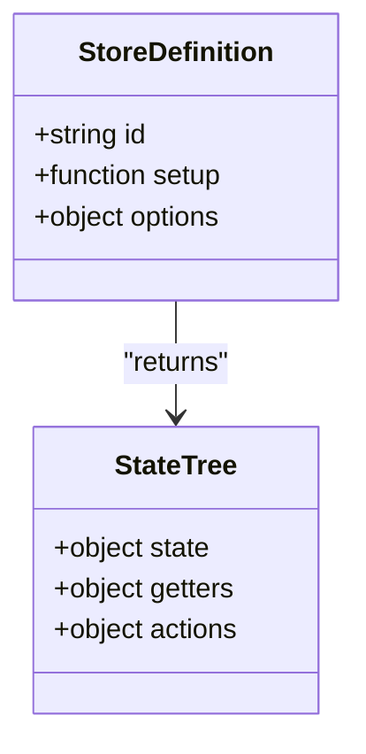
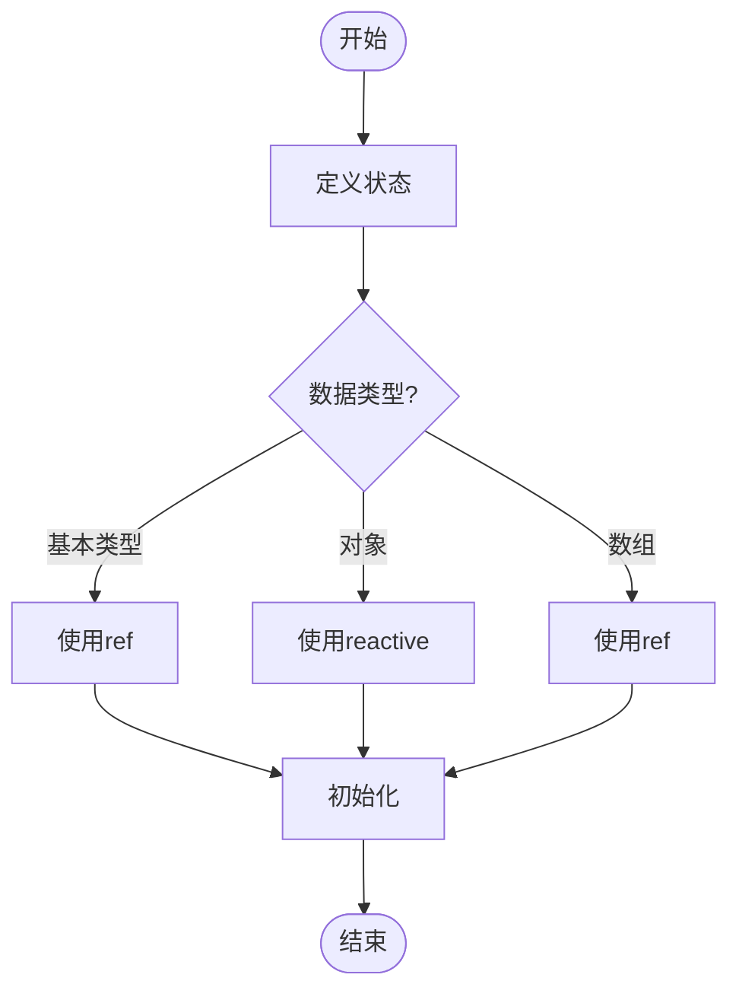
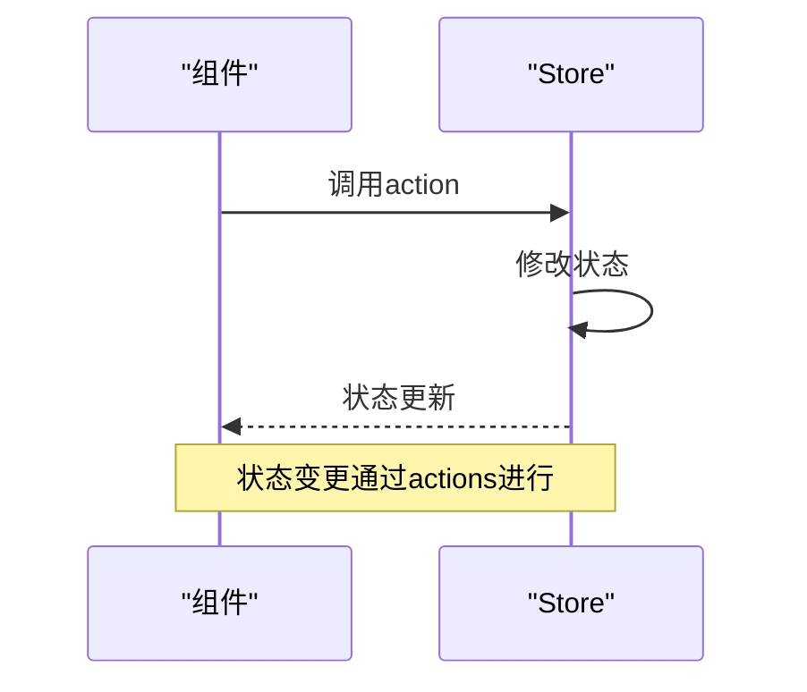
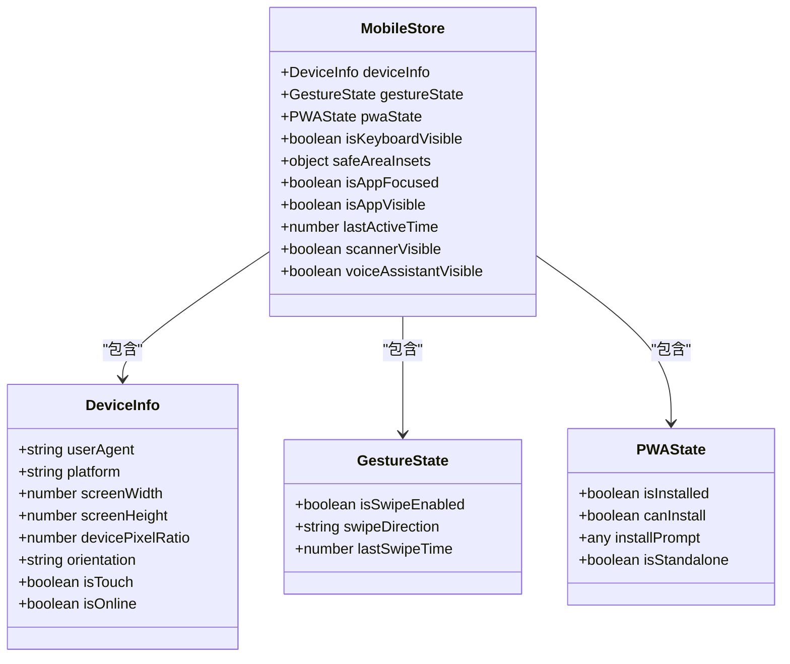
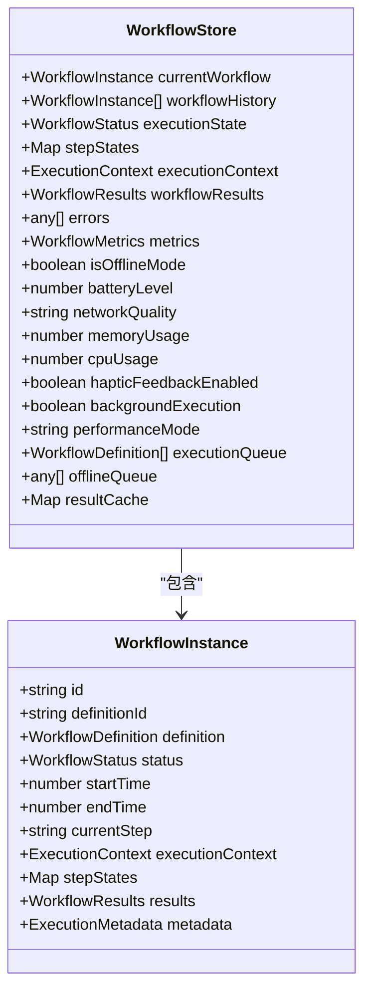
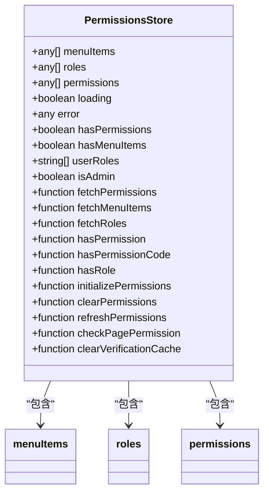

# 状态定义

<cite>
**本文档引用的文件**   
- [mobile.ts](file://k.yyup.com/client/aimobile/stores/mobile.ts)
- [mobile-workflow.ts](file://k.yyup.com/client/aimobile/stores/mobile-workflow.ts)
- [mobile-ai.ts](file://k.yyup.com/client/aimobile/stores/mobile-ai.ts)
- [ai-assistant.ts](file://k.yyup.com/client/aimobile/stores/ai-assistant.ts)
- [permissions.ts](file://k.yyup.com/backup/permission-system/permissions.ts)
- [mobile-workflow.ts](file://k.yyup.com/client/aimobile/types/mobile-workflow.ts)
</cite>

## 目录
1. [引言](#引言)
2. [Pinia Store定义与初始化](#pinia-store定义与初始化)
3. [响应式状态定义模式](#响应式状态定义模式)
4. [状态类型定义与TypeScript集成](#状态类型定义与typescript集成)
5. [状态私有性原则与修改规范](#状态私有性原则与修改规范)
6. [移动端状态管理实践](#移动端状态管理实践)
7. [工作流状态管理](#工作流状态管理)
8. [权限状态管理](#权限状态管理)
9. [状态初始化最佳实践](#状态初始化最佳实践)
10. [结论](#结论)

## 引言

本项目采用Pinia作为状态管理解决方案，通过`defineStore`函数定义和初始化store。Pinia提供了简洁的API来管理应用的状态，支持TypeScript类型推断，确保类型安全。本文档详细介绍了Pinia store中state的声明和初始化，重点阐述了如何使用`defineStore`函数定义store，解释state属性作为函数返回对象的设计原因，以及响应式状态的定义方式。

## Pinia Store定义与初始化

在本项目中，Pinia store通过`defineStore`函数进行定义。该函数接受两个参数：store的ID和一个返回状态、计算属性和actions的函数。这种设计允许store在每次调用时返回一个新的状态实例，避免了状态在不同组件间共享时的污染问题。



**图源**
- [mobile.ts](file://k.yyup.com/client/aimobile/stores/mobile.ts#L36-L479)

**节源**
- [mobile.ts](file://k.yyup.com/client/aimobile/stores/mobile.ts#L36-L479)

## 响应式状态定义模式

Pinia中的状态是响应式的，这意味着当状态发生变化时，所有依赖该状态的组件都会自动更新。状态通常通过`ref`或`reactive`函数定义，以确保其响应性。基本类型、对象和数组等数据结构的初始化模式如下：

- **基本类型**：使用`ref`定义，如`const count = ref(0)`
- **对象**：使用`reactive`定义，如`const user = reactive({ name: '', age: 0 })`
- **数组**：使用`ref`定义，如`const items = ref([])`



**图源**
- [mobile-ai.ts](file://k.yyup.com/client/aimobile/stores/mobile-ai.ts#L54-L60)
- [mobile-workflow.ts](file://k.yyup.com/client/aimobile/stores/mobile-workflow.ts#L24-L31)

**节源**
- [mobile-ai.ts](file://k.yyup.com/client/aimobile/stores/mobile-ai.ts#L54-L60)
- [mobile-workflow.ts](file://k.yyup.com/client/aimobile/stores/mobile-workflow.ts#L24-L31)

## 状态类型定义与TypeScript集成

为了确保类型安全，项目中使用TypeScript接口或类型别名来定义state结构。这不仅提高了代码的可读性和可维护性，还使得IDE能够提供更好的代码补全和错误检查。

```typescript
export interface DeviceInfo {
  userAgent: string
  platform: string
  screenWidth: number
  screenHeight: number
  devicePixelRatio: number
  orientation: 'portrait' | 'landscape'
  isTouch: boolean
  isOnline: boolean
}
```

**节源**
- [mobile.ts](file://k.yyup.com/client/aimobile/stores/mobile.ts#L12-L21)

## 状态私有性原则与修改规范

在Pinia中，状态的修改应仅通过actions进行，以确保状态变更的可追踪性和可预测性。直接修改状态被视为不良实践，因为它绕过了actions的逻辑，可能导致状态不一致。



**图源**
- [mobile-workflow.ts](file://k.yyup.com/client/aimobile/stores/mobile-workflow.ts#L99-L192)
- [mobile-ai.ts](file://k.yyup.com/client/aimobile/stores/mobile-ai.ts#L128-L270)

**节源**
- [mobile-workflow.ts](file://k.yyup.com/client/aimobile/stores/mobile-workflow.ts#L99-L192)
- [mobile-ai.ts](file://k.yyup.com/client/aimobile/stores/mobile-ai.ts#L128-L270)

## 移动端状态管理实践

移动端状态管理涉及设备信息、用户配置等状态的定义。例如，`useMobileStore`定义了设备信息、手势状态、PWA状态等，这些状态通过`ref`和`computed`属性进行管理。



**图源**
- [mobile.ts](file://k.yyup.com/client/aimobile/stores/mobile.ts#L36-L479)

**节源**
- [mobile.ts](file://k.yyup.com/client/aimobile/stores/mobile.ts#L36-L479)

## 工作流状态管理

`useMobileWorkflowStore`管理移动端AI工作流的状态，包括当前工作流、执行状态、步骤状态等。它还处理离线模式、性能优化、电池管理等移动端特性。



**图源**
- [mobile-workflow.ts](file://k.yyup.com/client/aimobile/stores/mobile-workflow.ts#L21-L463)

**节源**
- [mobile-workflow.ts](file://k.yyup.com/client/aimobile/stores/mobile-workflow.ts#L21-L463)

## 权限状态管理

`usePermissionsStore`管理用户的权限、菜单项和角色信息。它提供了检查权限、获取菜单项和角色的方法，确保用户只能访问其权限范围内的功能。



**图源**
- [permissions.ts](file://k.yyup.com/backup/permission-system/permissions.ts#L53-L512)

**节源**
- [permissions.ts](file://k.yyup.com/backup/permission-system/permissions.ts#L53-L512)

## 状态初始化最佳实践

状态初始化的最佳实践包括避免在state中存放非响应式对象或函数。所有状态应通过`ref`或`reactive`定义，以确保其响应性。此外，状态的初始化应在store的setup函数中完成，以确保每次调用store时都能获得一个新的状态实例。

**节源**
- [mobile.ts](file://k.yyup.com/client/aimobile/stores/mobile.ts#L36-L479)
- [mobile-workflow.ts](file://k.yyup.com/client/aimobile/stores/mobile-workflow.ts#L21-L463)
- [mobile-ai.ts](file://k.yyup.com/client/aimobile/stores/mobile-ai.ts#L52-L455)
- [ai-assistant.ts](file://k.yyup.com/client/aimobile/stores/ai-assistant.ts#L58-L647)

## 结论

通过`defineStore`函数定义Pinia store，结合TypeScript类型定义，可以有效地管理应用的状态。状态的响应式定义、私有性原则和最佳实践确保了状态管理的健壮性和可维护性。移动端状态管理实践展示了如何在实际项目中应用这些概念，为用户提供流畅的用户体验。