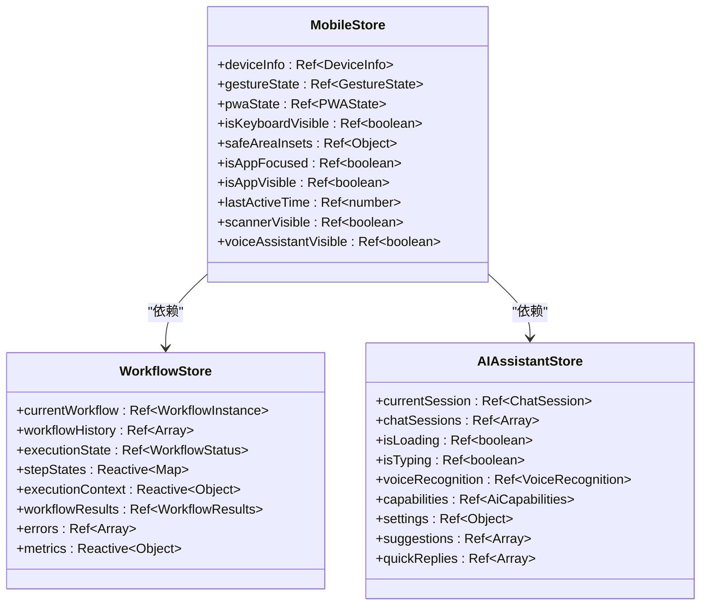
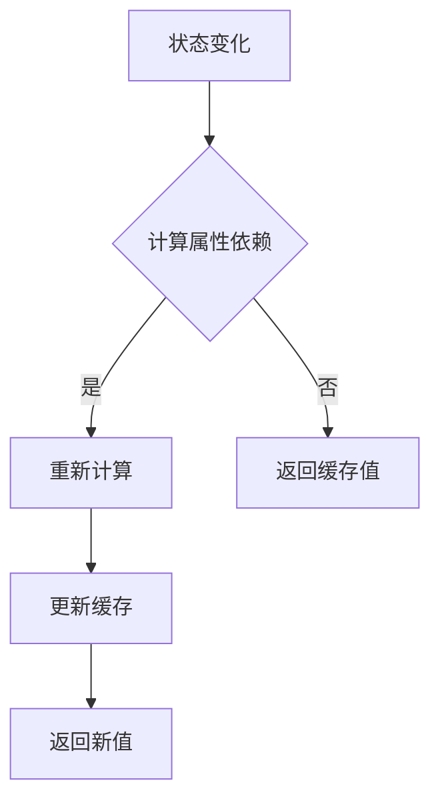
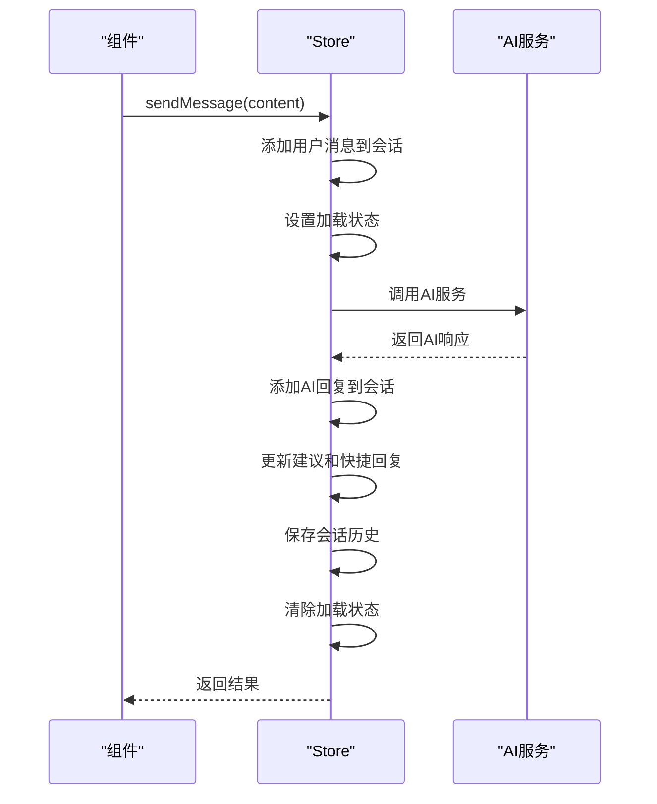
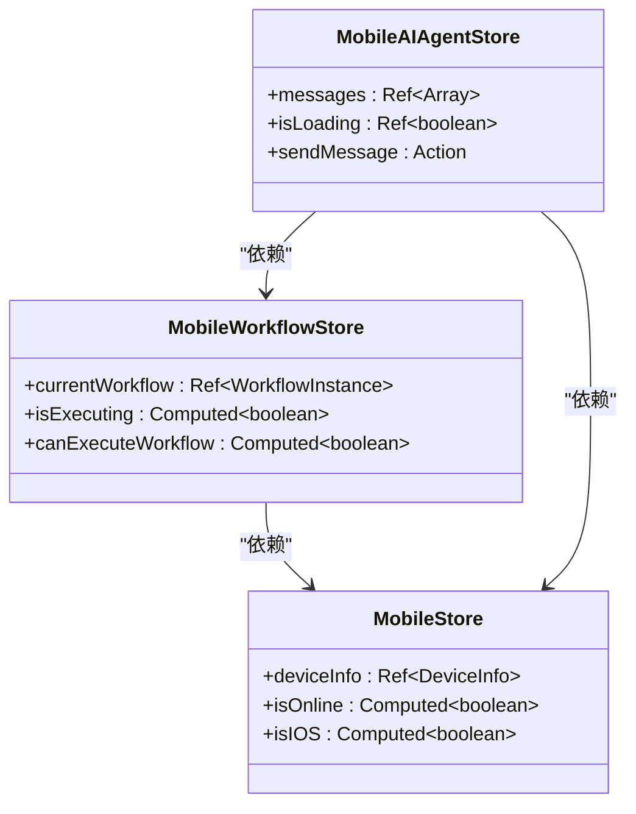
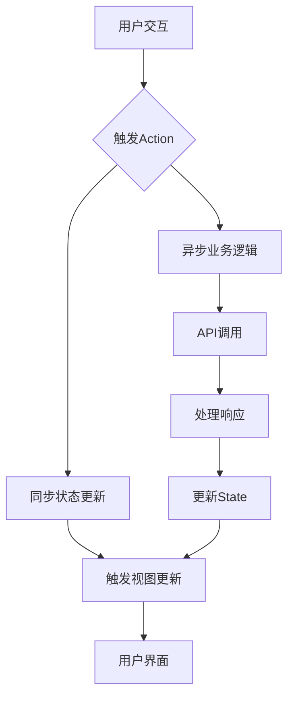

# 状态管理

<cite>
**本文档引用文件**   
- [mobile.ts](file://k.yyup.com/client/aimobile/stores/mobile.ts)
- [mobile-workflow.ts](file://k.yyup.com/client/aimobile/stores/mobile-workflow.ts)
- [ai-assistant.ts](file://k.yyup.com/client/aimobile/stores/ai-assistant.ts)
- [mobile-ai.ts](file://k.yyup.com/client/aimobile/stores/mobile-ai.ts)
- [mobile-agents.ts](file://k.yyup.com/client/aimobile/stores/mobile-agents.ts)
- [app.ts](file://k.yyup.com/client/src/stores/app.ts)
- [user.ts](file://k.yyup.com/client/src/stores/user.ts)
- [theme.ts](file://k.yyup.com/client/src/stores/theme.ts)
</cite>

## 目录
1. [引言](#引言)
2. [模块化设计与职责划分](#模块化设计与职责划分)
3. [状态定义与初始化策略](#状态定义与初始化策略)
4. [计算属性的使用模式](#计算属性的使用模式)
5. [Actions的实现与异步处理](#actions的实现与异步处理)
6. [Store间的依赖关系与数据共享](#store间的依赖关系与数据共享)
7. [状态持久化方案](#状态持久化方案)
8. [最佳实践建议](#最佳实践建议)
9. [状态流图](#状态流图)

## 引言

本项目采用Pinia作为状态管理解决方案，实现了基于模块化设计的高效状态管理架构。系统通过多个专用store模块管理不同领域的应用状态，包括移动端设备状态、AI助手交互、工作流执行等核心功能。这种设计不仅提高了代码的可维护性和可测试性，还确保了状态管理的清晰性和一致性。

## 模块化设计与职责划分

项目中的状态管理采用了清晰的模块化设计，每个store模块负责特定领域的状态管理，实现了关注点分离。

### mobile模块

`mobile` store模块负责管理移动端设备相关的状态信息，包括设备信息、触摸手势、PWA状态等。该模块提供了设备类型判断、操作系统识别、屏幕方向检测等计算属性，以及设备状态初始化、事件监听器设置等方法。

**模块职责**:
- 管理设备信息（用户代理、平台、屏幕尺寸等）
- 处理触摸手势和滑动操作
- 管理PWA安装状态和离线能力
- 处理键盘显示/隐藏检测
- 提供设备性能优化功能

### mobile-workflow模块

`mobile-workflow` store模块专门负责移动端AI工作流的状态管理，支持离线模式、性能优化和电池管理等移动端特性。该模块管理工作流的执行状态、步骤状态、执行上下文等信息。

**模块职责**:
- 管理工作流实例的创建、执行、暂停和停止
- 跟踪工作流执行进度和状态
- 处理移动端特定的性能优化和电池管理
- 管理离线队列和缓存机制
- 提供触觉反馈支持

### ai-assistant模块

`ai-assistant` store模块负责管理AI助手的状态，包括聊天会话、语音识别、智能推荐等功能。该模块支持多会话管理、语音输入输出、上下文记忆等特性。

**模块职责**:
- 管理AI聊天会话和消息历史
- 处理语音识别和语音合成
- 提供智能建议和快捷回复
- 管理AI助手的显示状态（可见性、最小化等）
- 实现聊天历史的本地存储

**Section sources**
- [mobile.ts](file://k.yyup.com/client/aimobile/stores/mobile.ts#L1-L481)
- [mobile-workflow.ts](file://k.yyup.com/client/aimobile/stores/mobile-workflow.ts#L1-L464)
- [ai-assistant.ts](file://k.yyup.com/client/aimobile/stores/ai-assistant.ts#L1-L648)

## 状态定义与初始化策略

### 响应式数据声明

项目采用Vue 3的响应式系统，通过`ref`和`reactive`函数声明响应式数据。对于基本类型数据使用`ref`，对于复杂对象使用`reactive`。

**Diagram sources**
- [mobile.ts](file://k.yyup.com/client/aimobile/stores/mobile.ts#L39-L83)
- [mobile-workflow.ts](file://k.yyup.com/client/aimobile/stores/mobile-workflow.ts#L24-L31)
- [ai-assistant.ts](file://k.yyup.com/client/aimobile/stores/ai-assistant.ts#L62-L94)

### 状态初始化策略

每个store模块都实现了初始化方法，用于设置初始状态和配置。初始化过程包括：

1. **从本地存储恢复状态**：从localStorage恢复用户偏好设置
2. **设置事件监听器**：监听设备状态变化事件
3. **初始化外部服务**：如语音识别、PWA安装提示等
4. **执行环境检测**：检测设备性能、网络状态等

例如，`mobile` store的`initializeDevice`方法会更新设备信息、初始化安全区域并设置事件监听器。

**Section sources**
- [mobile.ts](file://k.yyup.com/client/aimobile/stores/mobile.ts#L167-L180)
- [ai-assistant.ts](file://k.yyup.com/client/aimobile/stores/ai-assistant.ts#L161-L179)
- [theme.ts](file://k.yyup.com/client/src/stores/theme.ts#L241-L261)

## 计算属性的使用模式

### 缓存机制

Pinia的计算属性（getters）具有自动缓存机制，只有当依赖的状态发生变化时才会重新计算。这种机制显著提高了性能，避免了不必要的重复计算。

### 性能优化作用

计算属性在状态管理中发挥着重要的性能优化作用：

1. **减少重复计算**：复杂的计算逻辑只在依赖状态变化时执行
2. **提高响应速度**：缓存的结果可以直接返回，无需重新计算
3. **简化组件逻辑**：组件可以直接使用计算属性，无需关心计算逻辑

例如，`mobile` store中的`isMobile`、`isTablet`、`isDesktop`计算属性根据屏幕宽度判断设备类型，这些判断逻辑会被缓存，直到设备信息发生变化。

**Diagram sources**
- [mobile.ts](file://k.yyup.com/client/aimobile/stores/mobile.ts#L86-L164)
- [mobile-workflow.ts](file://k.yyup.com/client/aimobile/stores/mobile-workflow.ts#L50-L96)

## Actions的实现与异步处理

### 同步状态更新

Actions用于处理同步状态更新，直接修改store中的状态。例如，`app` store的`toggleSidebar`方法直接修改`isCollapse`状态。

### 异步业务逻辑处理

对于异步操作，Actions返回Promise，可以在组件中使用async/await语法处理。异步操作通常包括：

1. **API调用**：与后端服务交互
2. **定时任务**：延迟执行或周期性执行
3. **复杂业务逻辑**：需要多个步骤的处理流程

例如，`ai-assistant` store的`sendMessage`方法处理消息发送的完整流程，包括调用AI服务、处理响应、更新会话历史等。

**Diagram sources**
- [ai-assistant.ts](file://k.yyup.com/client/aimobile/stores/ai-assistant.ts#L269-L375)
- [mobile-workflow.ts](file://k.yyup.com/client/aimobile/stores/mobile-workflow.ts#L98-L192)

**Section sources**
- [app.ts](file://k.yyup.com/client/src/stores/app.ts#L13-L17)
- [user.ts](file://k.yyup.com/client/src/stores/user.ts#L112-L134)
- [ai-assistant.ts](file://k.yyup.com/client/aimobile/stores/ai-assistant.ts#L269-L375)

## Store间的依赖关系与数据共享

### 依赖关系

Store模块之间存在明确的依赖关系，通过`useStore()`函数相互引用。例如，`mobile-workflow` store依赖`mobile` store来获取设备信息。

### 数据共享模式

跨模块状态访问通过以下方式实现：

1. **直接引用**：一个store直接使用另一个store的实例
2. **事件通信**：通过自定义事件传递状态变化
3. **共享状态**：某些状态被多个store共同使用

例如，`mobile-workflow` store通过`useMobileStore()`获取`mobile` store的实例，从而访问设备信息和网络状态。

**Diagram sources**
- [mobile-workflow.ts](file://k.yyup.com/client/aimobile/stores/mobile-workflow.ts#L19-L21)
- [mobile-agents.ts](file://k.yyup.com/client/aimobile/stores/mobile-agents.ts#L26-L27)

## 状态持久化方案

### localStorage持久化

关键状态通过localStorage进行持久化存储，确保页面刷新后状态不丢失。持久化的状态包括：

- **用户偏好设置**：如主题、语言、AI助手设置等
- **会话历史**：AI聊天会话记录
- **应用状态**：侧边栏展开状态、面板宽度等

例如，`ai-assistant` store的`saveChatHistory`方法将聊天会话保存到localStorage，`loadChatHistory`方法从localStorage恢复会话。

### sessionStorage持久化

对于临时性状态，使用sessionStorage进行持久化，这些状态在页面会话结束后自动清除。

**Section sources**
- [ai-assistant.ts](file://k.yyup.com/client/aimobile/stores/ai-assistant.ts#L515-L549)
- [app.ts](file://k.yyup.com/client/src/stores/app.ts#L16-L17)
- [theme.ts](file://k.yyup.com/client/src/stores/theme.ts#L256-L258)

## 最佳实践建议

### 避免直接修改state

始终通过Actions修改状态，确保状态变化的可追踪性和可预测性。直接修改state会导致状态变化难以调试和测试。

### 合理划分store模块

根据功能领域合理划分store模块，遵循单一职责原则。每个store模块应该专注于一个特定领域的状态管理。

### 处理异步操作的loading状态

在执行异步操作时，始终管理loading状态，提供良好的用户体验。例如，在发送消息时显示加载指示器。

### 使用TypeScript增强类型安全

充分利用TypeScript的类型系统，为state、getters和actions定义明确的类型，提高代码的可维护性和可读性。

### 优化性能

- 使用计算属性缓存复杂计算结果
- 避免在组件中重复计算
- 合理使用响应式数据，避免过度响应式

## 状态流图

**Diagram sources**
- [ai-assistant.ts](file://k.yyup.com/client/aimobile/stores/ai-assistant.ts#L269-L375)
- [mobile-workflow.ts](file://k.yyup.com/client/aimobile/stores/mobile-workflow.ts#L98-L192)