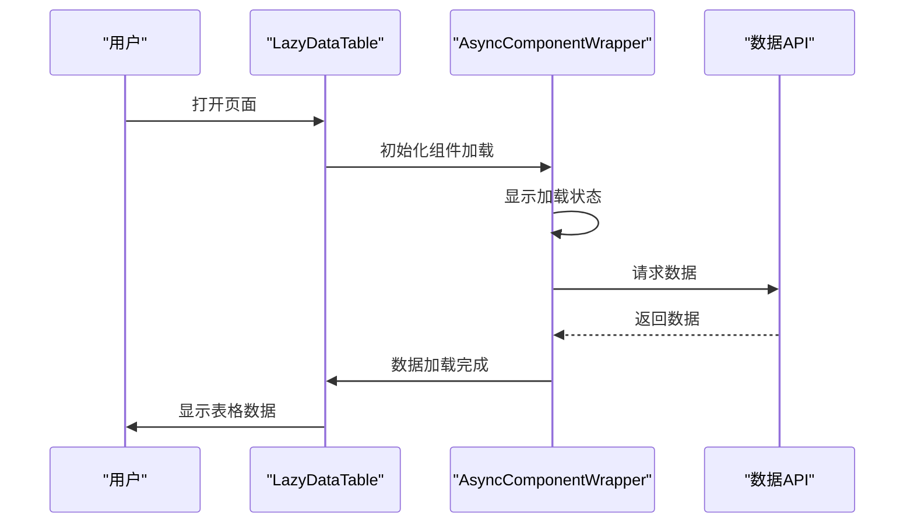
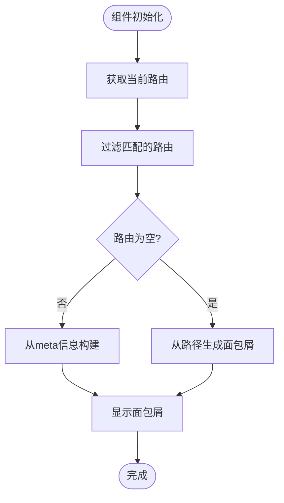
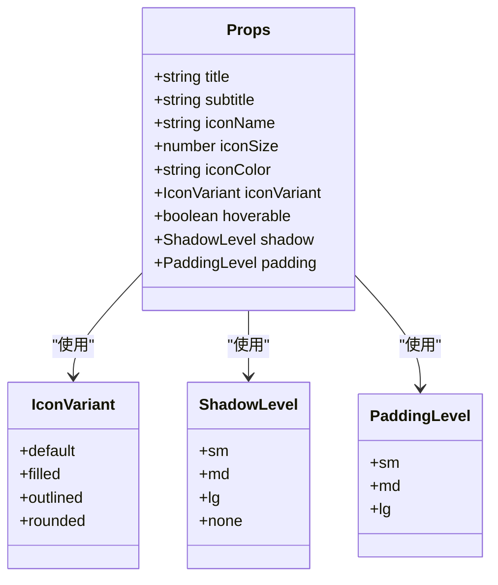
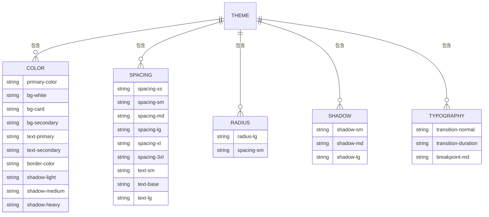
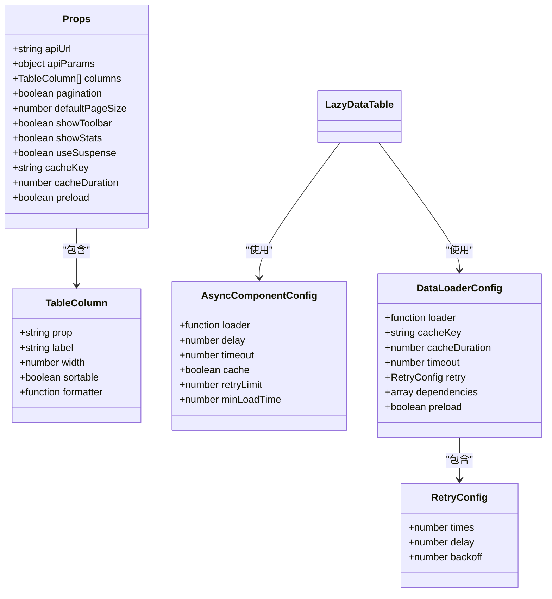
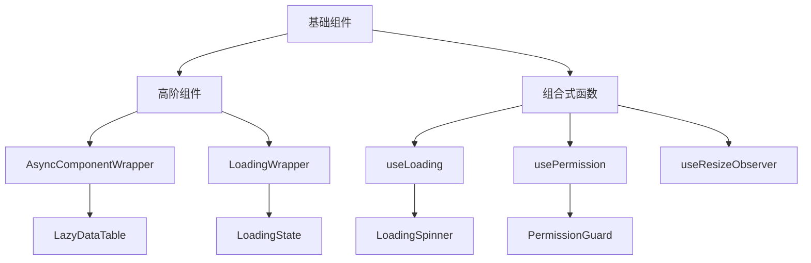

# 基础组件

<cite>
**本文档引用文件**  
- [AppCard.vue](file://k.yyup.com/client/src/components/AppCard.vue)
- [LazyDataTable.vue](file://k.yyup.com/client/src/components/common/LazyDataTable.vue)
- [StudentEditDialog.vue](file://k.yyup.com/client/src/components/dialogs/StudentEditDialog.vue)
- [Breadcrumb.vue](file://k.yyup.com/client/src/layouts/components/Breadcrumb.vue)
- [DataTable.vue](file://k.yyup.com/client/backups/src/components/centers/DataTable.vue)
- [_variables.scss](file://k.yyup.com/client/src/assets/scss/_variables.scss)
- [config.ts](file://k.yyup.com/client/src/config/pagination-config.ts)
</cite>

## 目录
1. [引言](#引言)
2. [组件分类与实现](#组件分类与实现)
3. [API设计原则](#api设计原则)
4. [样式架构与主题定制](#样式架构与主题定制)
5. [类型定义与泛型使用](#类型定义与泛型使用)
6. [测试策略](#测试策略)
7. [复用模式与组合方式](#复用模式与组合方式)
8. [最佳实践指南](#最佳实践指南)

## 引言
k.yyup.com子系统中的基础组件库为整个应用提供了统一的UI基础和交互模式。该组件库基于Vue 3和Element Plus构建，采用Composition API和TypeScript，实现了高可复用性、可维护性和可扩展性的设计目标。组件库涵盖了表单、数据展示、反馈和导航四大类基础组件，支持主题定制、响应式布局和无障碍访问。

## 组件分类与实现

### 表单组件
表单组件包括输入框、选择器、日期选择器等，主要通过Element Plus的表单组件进行封装和定制。以`StudentEditDialog.vue`为例，该组件展示了复杂的表单结构，包含输入框、单选框、日期选择器、下拉选择器等多种表单元素，通过`el-form`和`el-form-item`实现表单验证和布局管理。

**Section sources**
- [StudentEditDialog.vue](file://k.yyup.com/client/src/components/dialogs/StudentEditDialog.vue)

### 数据展示组件
数据展示组件主要包括表格、卡片和图表等。

#### 卡片组件
`AppCard.vue`是基础卡片组件，支持标题、图标、内容和底部插槽的灵活配置。组件通过props定义了标题、副标题、图标名称、阴影等级、内边距等属性，使用SCSS变量实现主题化设计。

```mermaid
classDiagram
class AppCard {
+string title
+string subtitle
+string iconName
+number iconSize
+string iconColor
+string iconVariant
+boolean hoverable
+string shadow
+string padding
+Event emit
-computed cardClasses()
}
AppCard --> UnifiedIcon : "使用"
AppCard --> "CSS变量" : "依赖"
```

**Diagram sources**
- [AppCard.vue](file://k.yyup.com/client/src/components/AppCard.vue)
- [UnifiedIcon.vue](file://k.yyup.com/client/src/components/icons/UnifiedIcon.vue)

#### 表格组件
`LazyDataTable.vue`是延迟加载的数据表格组件，封装了数据获取、分页、导出等功能。该组件使用`AsyncComponentWrapper`实现组件的异步加载，通过`DataLoaderConfig`配置数据加载逻辑，支持缓存和重试机制。



**Diagram sources**
- [LazyDataTable.vue](file://k.yyup.com/client/src/components/common/LazyDataTable.vue)
- [AsyncComponentWrapper.vue](file://k.yyup.com/client/src/components/common/AsyncComponentWrapper.vue)

**Section sources**
- [LazyDataTable.vue](file://k.yyup.com/client/src/components/common/LazyDataTable.vue)

### 反馈组件
反馈组件包括对话框、通知、加载指示器等。

#### 对话框组件
`StudentEditDialog.vue`展示了对话框组件的典型实现，使用`el-dialog`作为基础，通过`v-model`双向绑定控制显示状态，支持表单验证、提交和取消操作。组件通过`defineEmits`定义了`update:modelValue`和`submit`事件，实现了父子组件间的通信。

**Section sources**
- [StudentEditDialog.vue](file://k.yyup.com/client/src/components/dialogs/StudentEditDialog.vue)

#### 加载指示器
`LoadingSpinner.vue`和`LoadingState.vue`提供了不同粒度的加载指示器，支持自定义加载文本和样式。

### 导航组件
导航组件包括标签页、面包屑和分页器等。

#### 面包屑组件
`Breadcrumb.vue`实现了基于Vue Router的动态面包屑导航，根据当前路由自动生成面包屑路径。组件通过`useRoute`获取当前路由信息，解析`matched`路由记录，提取`meta.title`作为面包屑项。



**Diagram sources**
- [Breadcrumb.vue](file://k.yyup.com/client/src/layouts/components/Breadcrumb.vue)

#### 分页器组件
分页器在`DataTable.vue`中实现，通过`el-pagination`组件提供分页功能。组件支持自定义页码大小、布局和总记录数，通过事件机制与父组件通信。

**Section sources**
- [DataTable.vue](file://k.yyup.com/client/backups/src/components/centers/DataTable.vue)

## API设计原则

### Props定义
基础组件的Props定义遵循以下原则：
- 使用TypeScript接口明确定义Props类型
- 通过`withDefaults`设置合理的默认值
- 将相关属性分组，提高可读性
- 使用枚举类型限制可选值



**Diagram sources**
- [AppCard.vue](file://k.yyup.com/client/src/components/AppCard.vue)

### 事件发射
组件通过`defineEmits`定义事件接口，遵循以下规范：
- 使用kebab-case命名事件
- 提供详细的事件参数类型
- 在适当时机发射事件
- 支持事件链式调用

### 插槽使用
组件充分利用Vue的插槽机制，提供灵活的内容定制：
- 默认插槽：用于主要内容
- 具名插槽：如header、footer等特定位置
- 作用域插槽：传递组件内部数据

## 样式架构与主题定制

### SCSS变量体系
样式架构基于SCSS变量实现主题化设计，主要变量定义在`_variables.scss`中，包括颜色、间距、圆角、阴影等。



**Diagram sources**
- [_variables.scss](file://k.yyup.com/client/src/assets/scss/_variables.scss)

### CSS类名规范
CSS类名遵循BEM命名规范，确保样式隔离和可维护性：
- 基础类名：`app-card`
- 修饰符：`app-card--shadow-md`
- 子元素：`app-card-header`

## 类型定义与泛型使用

### TypeScript接口
组件使用TypeScript接口定义数据结构，提高类型安全性和开发体验。



**Diagram sources**
- [LazyDataTable.vue](file://k.yyup.com/client/src/components/common/LazyDataTable.vue)

## 测试策略

### 单元测试
基础组件的单元测试覆盖以下方面：
- Props的正确传递和默认值
- 事件的正确发射
- 插槽内容的正确渲染
- 条件渲染逻辑
- 用户交互行为

### 集成测试
集成测试关注组件在真实场景中的表现：
- 与父组件的数据绑定
- 复杂交互流程
- 异步数据加载
- 错误状态处理

## 复用模式与组合方式

### 高阶组件
通过高阶组件模式增强基础组件功能，如`AsyncComponentWrapper`为任何组件添加异步加载能力。

### 组合式函数
使用Composition API的组合式函数实现逻辑复用，如`useLoading`、`usePermission`等。



**Diagram sources**
- [AsyncComponentWrapper.vue](file://k.yyup.com/client/src/components/common/AsyncComponentWrapper.vue)
- [useLoading.ts](file://k.yyup.com/client/src/composables/useLoading.ts)
- [usePermission.ts](file://k.yyup.com/client/src/composables/usePermission.ts)

## 最佳实践指南

### 组件使用规范
- 优先使用基础组件库中的组件
- 遵循Props命名规范
- 正确处理组件事件
- 合理使用插槽定制内容

### 主题定制方法
- 通过CSS变量覆盖主题
- 使用SCSS的`@import`引入变量文件
- 避免使用`!important`覆盖样式

### 性能优化建议
- 合理使用异步组件加载
- 启用数据缓存
- 避免不必要的重渲染
- 使用虚拟滚动处理大量数据

### 可访问性考虑
- 为交互元素添加适当的ARIA属性
- 确保键盘导航可用
- 提供足够的对比度
- 支持屏幕阅读器