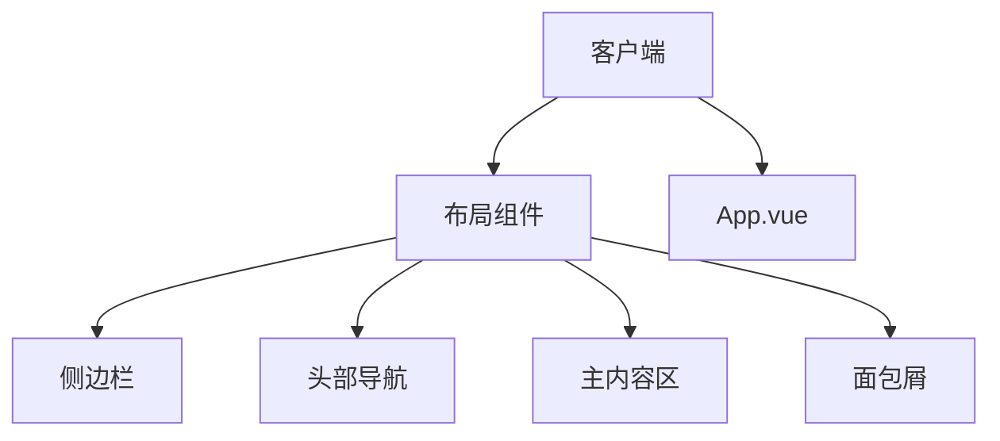
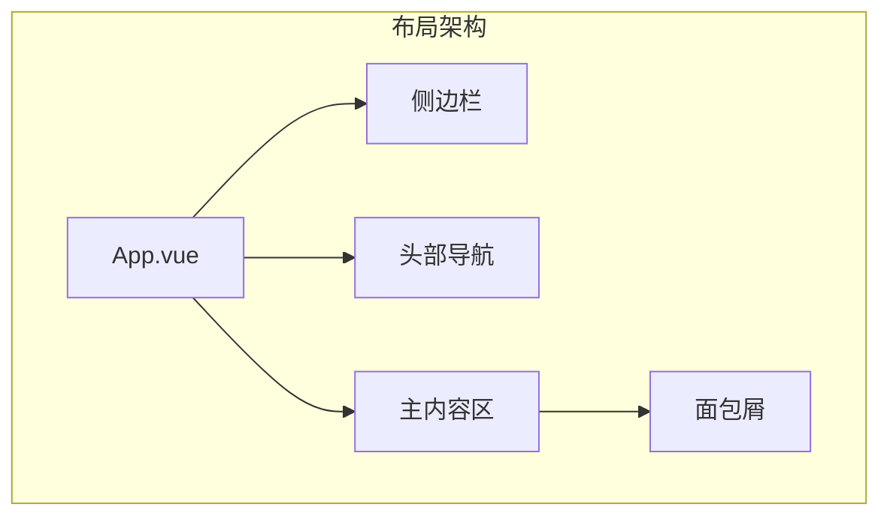
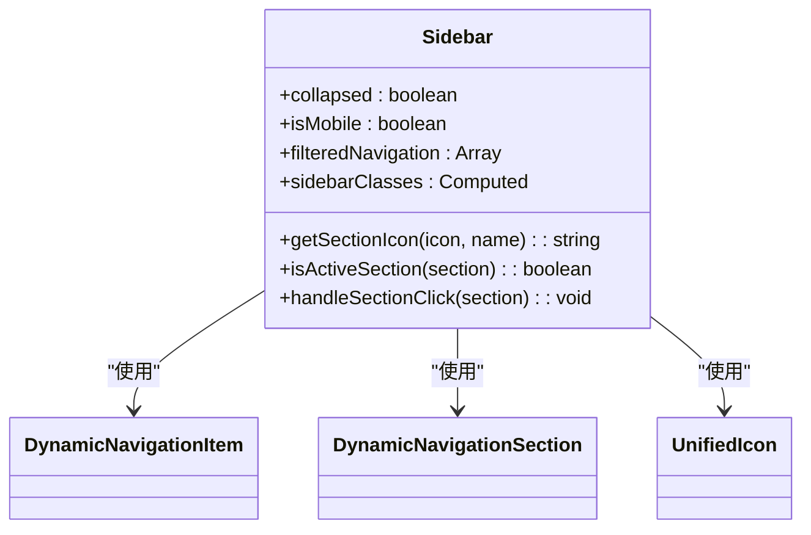
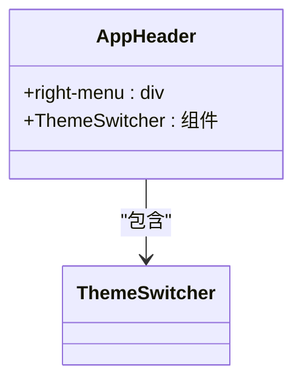
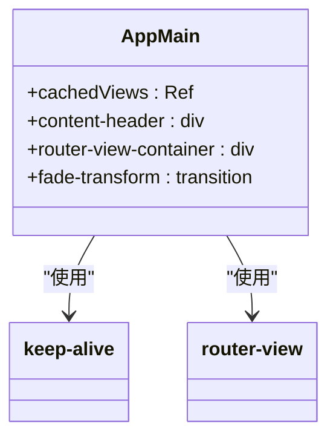
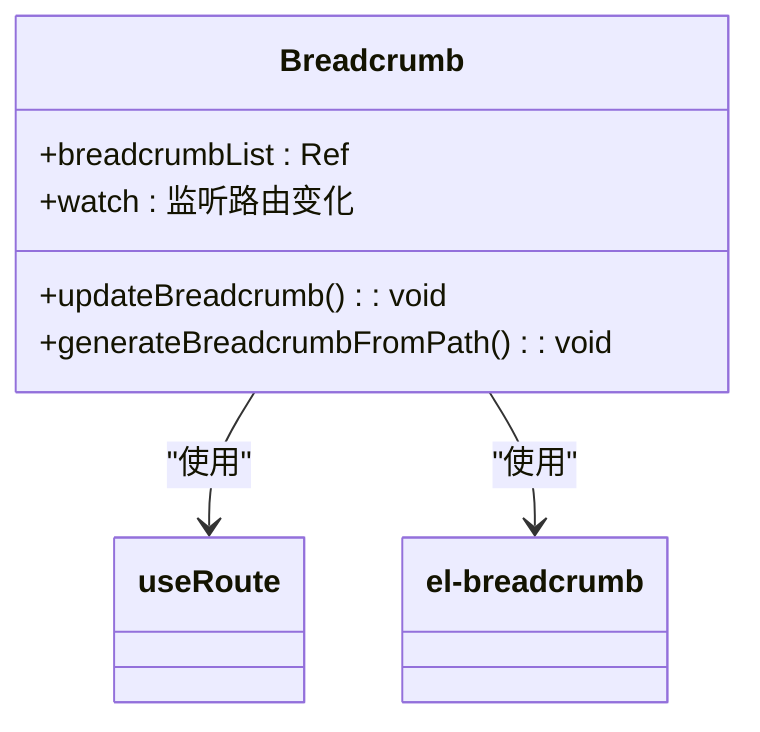
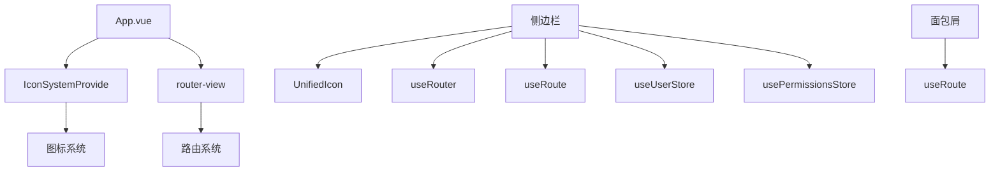

# 布局组件

<cite>
**本文档引用的文件**  
- [App.vue](file://k.yyup.com/client/src/App.vue)
- [Sidebar.vue](file://k.yyup.com/client/backups/src/layouts/components/Sidebar.vue)
- [AppHeader.vue](file://k.yyup.com/client/src/layouts/components/AppHeader.vue)
- [AppMain.vue](file://k.yyup.com/client/src/layouts/components/AppMain.vue)
- [Breadcrumb.vue](file://k.yyup.com/client/src/layouts/components/Breadcrumb.vue)
</cite>

## 目录
1. [引言](#引言)
2. [项目结构](#项目结构)
3. [核心组件](#核心组件)
4. [架构概述](#架构概述)
5. [详细组件分析](#详细组件分析)
6. [依赖分析](#依赖分析)
7. [性能考虑](#性能考虑)
8. [故障排除指南](#故障排除指南)
9. [结论](#结论)

## 引言
本文档详细阐述了k.yyup.com子系统中布局组件的设计理念和实现方式。重点分析侧边栏、头部导航、主内容区、页脚等全局布局组件的结构和交互逻辑。解释布局组件如何实现响应式设计，适配桌面端和移动端的不同屏幕尺寸。说明布局组件的状态管理机制，包括菜单展开/收起状态、主题切换、用户信息展示等。解析布局组件与路由系统的集成，如何根据当前路由动态更新导航高亮状态。描述布局组件的样式隔离策略，确保布局样式不会影响到页面内容。提供布局组件的可访问性（Accessibility）实现细节，包括键盘导航支持、屏幕阅读器兼容性等。包含实际代码示例，展示布局组件如何通过插槽（slot）机制与页面组件进行内容分发。

## 项目结构

**图示来源**  
- [App.vue](file://k.yyup.com/client/src/App.vue)
- [Sidebar.vue](file://k.yyup.com/client/backups/src/layouts/components/Sidebar.vue)
- [AppHeader.vue](file://k.yyup.com/client/src/layouts/components/AppHeader.vue)
- [AppMain.vue](file://k.yyup.com/client/src/layouts/components/AppMain.vue)
- [Breadcrumb.vue](file://k.yyup.com/client/src/layouts/components/Breadcrumb.vue)

**本节来源**  
- [App.vue](file://k.yyup.com/client/src/App.vue)
- [Sidebar.vue](file://k.yyup.com/client/backups/src/layouts/components/Sidebar.vue)

## 核心组件

本文档的核心组件包括侧边栏（Sidebar）、头部导航（AppHeader）、主内容区（AppMain）和面包屑（Breadcrumb）等全局布局组件。这些组件共同构成了k.yyup.com子系统的整体布局框架，实现了统一的用户体验和交互模式。

**本节来源**  
- [Sidebar.vue](file://k.yyup.com/client/backups/src/layouts/components/Sidebar.vue)
- [AppHeader.vue](file://k.yyup.com/client/src/layouts/components/AppHeader.vue)
- [AppMain.vue](file://k.yyup.com/client/src/layouts/components/AppMain.vue)
- [Breadcrumb.vue](file://k.yyup.com/client/src/layouts/components/Breadcrumb.vue)

## 架构概述

**图示来源**  
- [App.vue](file://k.yyup.com/client/src/App.vue)
- [Sidebar.vue](file://k.yyup.com/client/backups/src/layouts/components/Sidebar.vue)
- [AppHeader.vue](file://k.yyup.com/client/src/layouts/components/AppHeader.vue)
- [AppMain.vue](file://k.yyup.com/client/src/layouts/components/AppMain.vue)
- [Breadcrumb.vue](file://k.yyup.com/client/src/layouts/components/Breadcrumb.vue)

## 详细组件分析

### 侧边栏组件分析

**图示来源**  
- [Sidebar.vue](file://k.yyup.com/client/backups/src/layouts/components/Sidebar.vue)

**本节来源**  
- [Sidebar.vue](file://k.yyup.com/client/backups/src/layouts/components/Sidebar.vue)

### 头部导航组件分析

**图示来源**  
- [AppHeader.vue](file://k.yyup.com/client/src/layouts/components/AppHeader.vue)

**本节来源**  
- [AppHeader.vue](file://k.yyup.com/client/src/layouts/components/AppHeader.vue)

### 主内容区组件分析

**图示来源**  
- [AppMain.vue](file://k.yyup.com/client/src/layouts/components/AppMain.vue)

**本节来源**  
- [AppMain.vue](file://k.yyup.com/client/src/layouts/components/AppMain.vue)

### 面包屑组件分析

**图示来源**  
- [Breadcrumb.vue](file://k.yyup.com/client/src/layouts/components/Breadcrumb.vue)

**本节来源**  
- [Breadcrumb.vue](file://k.yyup.com/client/src/layouts/components/Breadcrumb.vue)

## 依赖分析

**图示来源**  
- [App.vue](file://k.yyup.com/client/src/App.vue)
- [Sidebar.vue](file://k.yyup.com/client/backups/src/layouts/components/Sidebar.vue)
- [Breadcrumb.vue](file://k.yyup.com/client/src/layouts/components/Breadcrumb.vue)

**本节来源**  
- [App.vue](file://k.yyup.com/client/src/App.vue)
- [Sidebar.vue](file://k.yyup.com/client/backups/src/layouts/components/Sidebar.vue)
- [Breadcrumb.vue](file://k.yyup.com/client/src/layouts/components/Breadcrumb.vue)

## 性能考虑
布局组件通过使用Vue的keep-alive组件缓存页面实例，避免重复渲染，提高页面切换性能。同时，通过计算属性和响应式数据管理，确保只有在必要时才重新计算和更新DOM。侧边栏的图标映射采用预定义对象，避免重复计算。面包屑组件通过监听路由变化来更新显示，而不是频繁查询路由信息。

## 故障排除指南
当布局组件出现问题时，首先检查App.vue中的根组件结构是否正确。然后检查侧边栏的权限数据是否正常加载，可以通过浏览器开发者工具查看permissionsStore中的menuItems数据。如果面包屑不显示，检查当前路由是否在路由配置中设置了meta.title属性。对于响应式问题，检查CSS媒体查询是否正确应用。主题切换问题通常与ThemeSwitcher组件的状态管理有关。

**本节来源**  
- [App.vue](file://k.yyup.com/client/src/App.vue)
- [Sidebar.vue](file://k.yyup.com/client/backups/src/layouts/components/Sidebar.vue)
- [Breadcrumb.vue](file://k.yyup.com/client/src/layouts/components/Breadcrumb.vue)

## 结论
k.yyup.com子系统的布局组件采用模块化设计，各组件职责分明，通过Vue的组合式API实现响应式数据管理。侧边栏根据用户角色动态生成菜单，头部导航提供主题切换功能，主内容区通过keep-alive优化性能，面包屑组件根据路由自动生成导航路径。整体布局实现了良好的可维护性和扩展性，为系统提供了统一的用户体验。