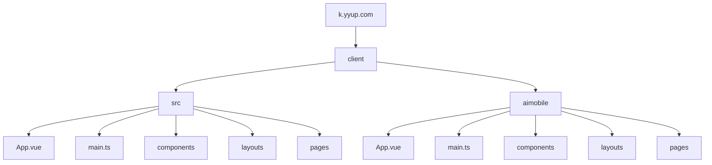
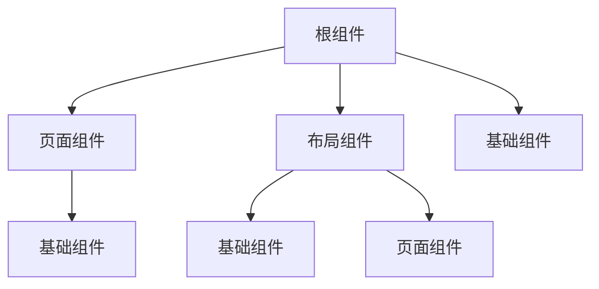
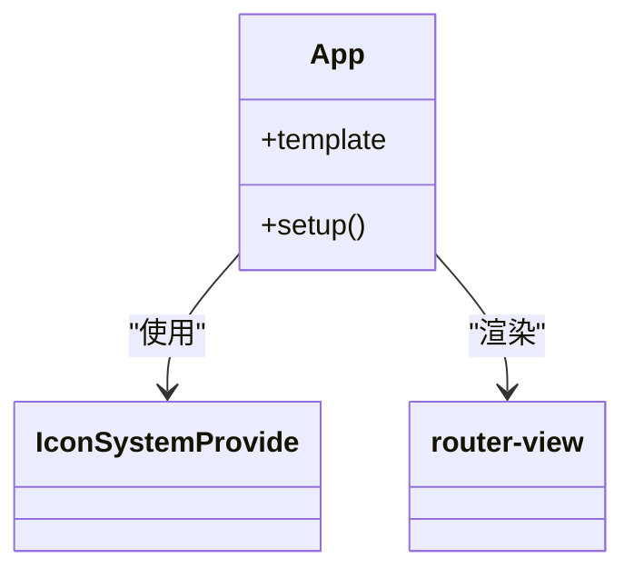
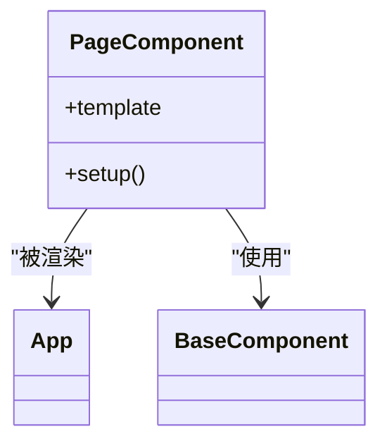
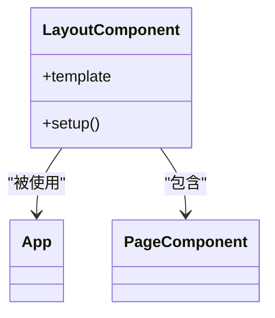
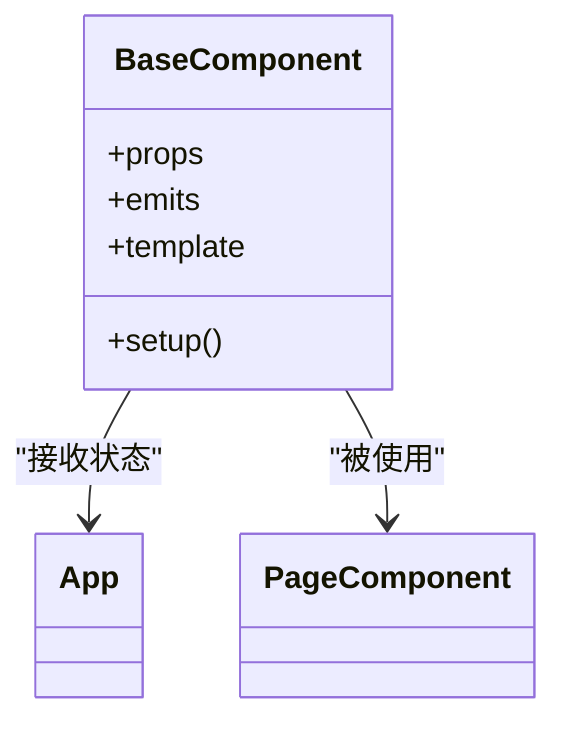
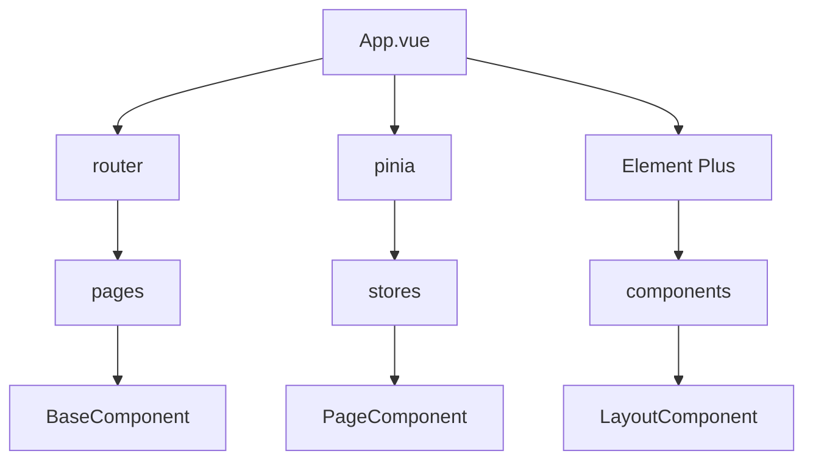

# 组件树

<cite>
**本文档引用的文件**
- [App.vue](file://k.yyup.com/client/src/App.vue)
- [App.vue](file://k.yyup.com/client/aimobile/App.vue)
- [main.ts](file://k.yyup.com/client/src/main.ts)
- [main.ts](file://k.yyup.com/client/aimobile/main.ts)
- [MobileLayout.vue](file://k.yyup.com/client/aimobile/layouts/MobileLayout.vue)
- [MobileSidebar.vue](file://k.yyup.com/client/aimobile/components/MobileSidebar.vue)
- [MobileTabBar.vue](file://k.yyup.com/client/aimobile/components/MobileTabBar.vue)
- [BatchImportConfirmDialog.vue](file://k.yyup.com/BatchImportConfirmDialog.vue)
- [ai-chat-interface-fixed.vue](file://k.yyup.com/ai-chat-interface-fixed.vue)
</cite>

## 目录
1. [介绍](#介绍)
2. [项目结构](#项目结构)
3. [核心组件](#核心组件)
4. [架构概述](#架构概述)
5. [详细组件分析](#详细组件分析)
6. [依赖分析](#依赖分析)
7. [性能考虑](#性能考虑)
8. [故障排除指南](#故障排除指南)
9. [结论](#结论)
10. [附录](#附录)（如有必要）

## 介绍
本文档详细介绍了k.yyup.com子系统的Vue3组件架构。重点分析了根组件App.vue的结构和职责，页面组件的组织结构，布局组件的设计模式，基础组件的分类和复用策略，组件间的通信模式，以及组件的生命周期管理。为开发者提供了组件开发规范，包括命名约定、目录结构、样式隔离等最佳实践。

## 项目结构

k.yyup.com子系统的前端组件主要位于client目录下，分为桌面端和移动端两个主要部分。桌面端组件位于client/src目录，移动端组件位于client/aimobile目录。系统采用了Vue3的组合式API和TypeScript进行开发，使用Pinia进行状态管理，Element Plus作为UI组件库。

**Diagram sources**
- [App.vue](file://k.yyup.com/client/src/App.vue)
- [App.vue](file://k.yyup.com/client/aimobile/App.vue)

**Section sources**
- [App.vue](file://k.yyup.com/client/src/App.vue)
- [App.vue](file://k.yyup.com/client/aimobile/App.vue)

## 核心组件

k.yyup.com子系统的前端架构以App.vue作为根组件，负责整个应用的布局和全局状态注入。App.vue通过router-view渲染不同的页面组件，实现了单页应用的路由切换。系统还包含了大量的基础组件，如表单组件、数据展示组件、导航组件等，这些组件通过props传递数据，通过事件发射进行通信，实现了高度的复用性。

**Section sources**
- [App.vue](file://k.yyup.com/client/src/App.vue)
- [App.vue](file://k.yyup.com/client/aimobile/App.vue)

## 架构概述

k.yyup.com子系统的Vue3组件架构采用了分层设计，分为根组件、页面组件、布局组件和基础组件四个层次。根组件App.vue负责整个应用的布局和全局状态注入，页面组件负责具体页面的业务逻辑，布局组件负责页面的整体布局，基础组件负责具体的UI元素。

**Diagram sources**
- [App.vue](file://k.yyup.com/client/src/App.vue)
- [MobileLayout.vue](file://k.yyup.com/client/aimobile/layouts/MobileLayout.vue)

## 详细组件分析

### 根组件分析

根组件App.vue是整个应用的入口，负责整个应用的布局和全局状态注入。它通过router-view渲染不同的页面组件，实现了单页应用的路由切换。App.vue还通过provide/inject机制向子组件注入全局状态，如用户信息、权限信息等。

#### 根组件结构

**Diagram sources**
- [App.vue](file://k.yyup.com/client/src/App.vue)

**Section sources**
- [App.vue](file://k.yyup.com/client/src/App.vue)

### 页面组件分析

页面组件位于pages目录下，负责具体页面的业务逻辑。每个页面组件都是一个独立的Vue组件，通过路由配置与具体的URL路径关联。页面组件通过props接收路由参数，通过事件发射与父组件通信。

#### 页面组件结构

**Diagram sources**
- [App.vue](file://k.yyup.com/client/src/App.vue)

**Section sources**
- [App.vue](file://k.yyup.com/client/src/App.vue)

### 布局组件分析

布局组件位于layouts目录下，负责页面的整体布局。布局组件通常包含侧边栏、头部导航、主内容区等部分，通过slot机制将页面组件嵌入到布局中。布局组件通过props接收布局配置，通过事件发射与页面组件通信。

#### 布局组件结构

**Diagram sources**
- [MobileLayout.vue](file://k.yyup.com/client/aimobile/layouts/MobileLayout.vue)

**Section sources**
- [MobileLayout.vue](file://k.yyup.com/client/aimobile/layouts/MobileLayout.vue)

### 基础组件分析

基础组件位于components目录下，负责具体的UI元素。基础组件包括表单组件、数据展示组件、导航组件等，通过props传递数据，通过事件发射进行通信，实现了高度的复用性。基础组件通过provide/inject机制接收全局状态，如用户信息、权限信息等。

#### 基础组件结构

**Diagram sources**
- [MobileSidebar.vue](file://k.yyup.com/client/aimobile/components/MobileSidebar.vue)
- [MobileTabBar.vue](file://k.yyup.com/client/aimobile/components/MobileTabBar.vue)

**Section sources**
- [MobileSidebar.vue](file://k.yyup.com/client/aimobile/components/MobileSidebar.vue)
- [MobileTabBar.vue](file://k.yyup.com/client/aimobile/components/MobileTabBar.vue)

## 依赖分析

k.yyup.com子系统的前端组件之间存在复杂的依赖关系。根组件App.vue依赖于路由配置和全局状态管理，页面组件依赖于布局组件和基础组件，布局组件依赖于基础组件和页面组件，基础组件依赖于全局状态管理。

**Diagram sources**
- [main.ts](file://k.yyup.com/client/src/main.ts)
- [main.ts](file://k.yyup.com/client/aimobile/main.ts)

**Section sources**
- [main.ts](file://k.yyup.com/client/src/main.ts)
- [main.ts](file://k.yyup.com/client/aimobile/main.ts)

## 性能考虑

k.yyup.com子系统的前端架构在性能方面做了大量优化。通过使用Vue3的组合式API和TypeScript，提高了代码的可读性和可维护性。通过使用Pinia进行状态管理，避免了状态的重复计算。通过使用Element Plus作为UI组件库，提高了UI的一致性和开发效率。通过使用懒加载和代码分割，减少了初始加载时间。

## 故障排除指南

当遇到前端组件问题时，可以按照以下步骤进行排查：
1. 检查组件的props和emits是否正确
2. 检查组件的生命周期钩子是否正确
3. 检查组件的依赖是否正确
4. 检查组件的样式是否正确
5. 检查组件的逻辑是否正确

**Section sources**
- [App.vue](file://k.yyup.com/client/src/App.vue)
- [App.vue](file://k.yyup.com/client/aimobile/App.vue)

## 结论

k.yyup.com子系统的Vue3组件架构采用了分层设计，分为根组件、页面组件、布局组件和基础组件四个层次。通过使用Vue3的组合式API和TypeScript，提高了代码的可读性和可维护性。通过使用Pinia进行状态管理，避免了状态的重复计算。通过使用Element Plus作为UI组件库，提高了UI的一致性和开发效率。通过使用懒加载和代码分割，减少了初始加载时间。

## 附录

### 组件开发规范
1. 命名约定：组件名采用PascalCase命名法
2. 目录结构：组件按功能分组，每个组件有自己的目录
3. 样式隔离：使用scoped样式，避免样式污染
4. 代码复用：通过mixin和composition API实现代码复用
5. 错误处理：使用try-catch和error boundary处理错误