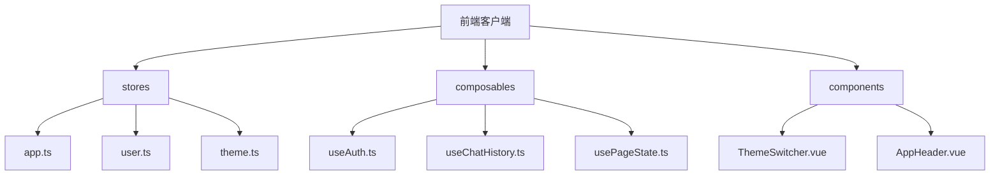
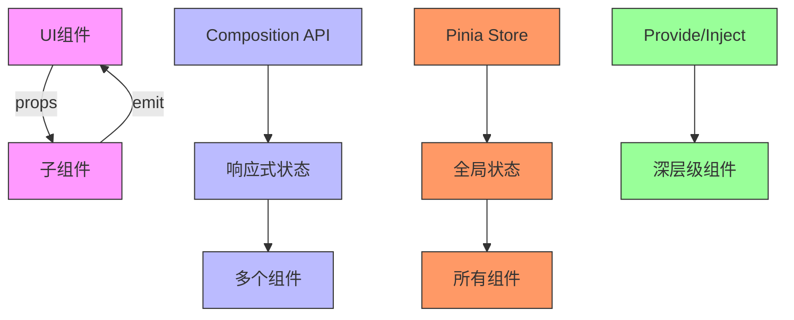
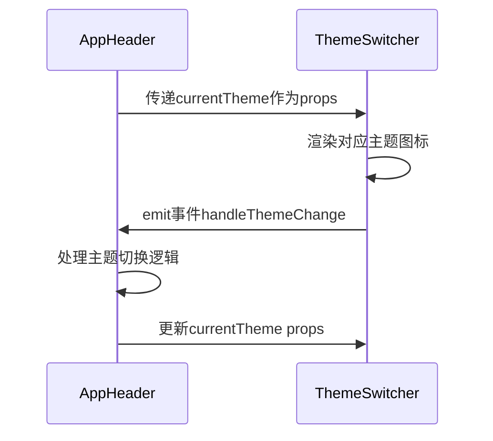
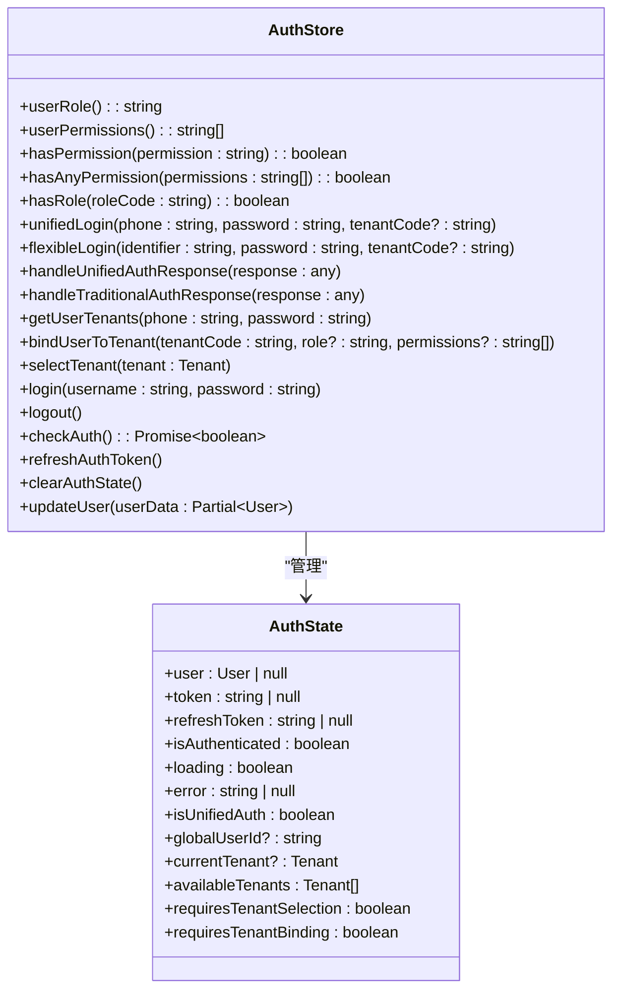
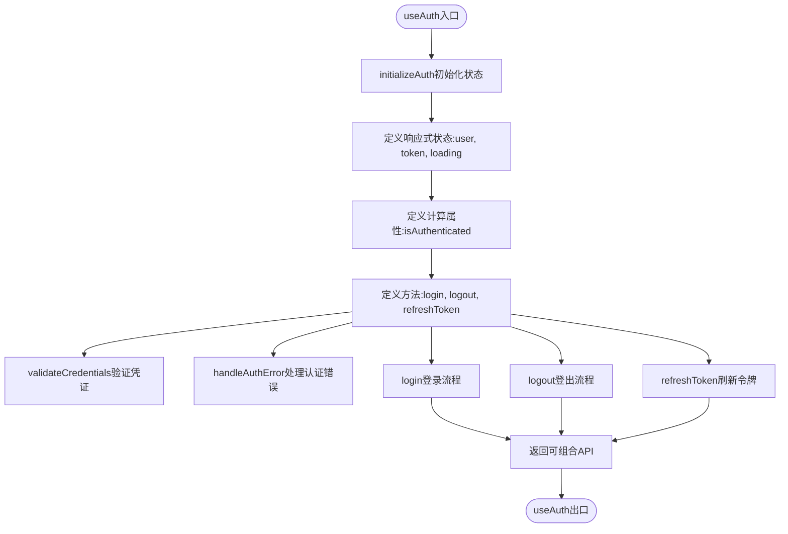
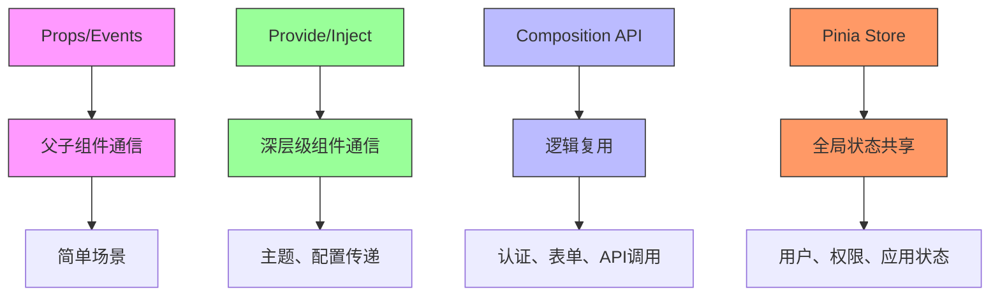

# 组件通信

<cite>
**本文档引用的文件**   
- [ThemeSwitcher.vue](file://k.yyup.com/client/src/components/ThemeSwitcher.vue)
- [auth.ts](file://k.yyup.com/client/src/store/modules/auth.ts)
- [useAuth.ts](file://k.yyup.com/client/src/composables/useAuth.ts)
- [app.ts](file://k.yyup.com/client/src/stores/app.ts)
- [user.ts](file://k.yyup.com/client/src/stores/user.ts)
- [index.ts](file://k.yyup.com/client/src/store/index.ts)
- [AppHeader.vue](file://k.yyup.com/client/src/layouts/components/AppHeader.vue)
</cite>

## 目录
1. [引言](#引言)
2. [项目结构](#项目结构)
3. [核心组件](#核心组件)
4. [架构概述](#架构概述)
5. [详细组件分析](#详细组件分析)
6. [依赖分析](#依赖分析)
7. [性能考虑](#性能考虑)
8. [故障排除指南](#故障排除指南)
9. [结论](#结论)

## 引言
本文档深入探讨k.yyup.com子系统中组件间通信的各种模式和最佳实践。详细解释props和事件（emit）在父子组件通信中的使用场景和限制。阐述Vuex/Pinia状态管理在跨组件通信中的核心作用，说明store的模块化设计和状态共享机制。分析provide/inject API在深层级组件通信中的优势和潜在问题。说明事件总线（Event Bus）模式的实现方式和适用场景。探讨Composition API中通过返回响应式对象实现逻辑复用的方法。提供不同类型通信方式的性能对比和选择建议。包含实际案例，展示复杂场景下多种通信方式的组合使用，如表单组件与状态管理的集成、布局组件与页面组件的状态同步等。说明通信模式的测试策略，确保通信逻辑的可靠性和可维护性。

## 项目结构
k.yyup.com子系统采用模块化的前端架构，主要组件通信相关的文件分布在多个目录中。核心通信机制主要集中在stores和composables目录中，其中stores目录实现了基于Pinia的状态管理，而composables目录则包含了基于Composition API的逻辑复用方案。

**图示来源**
- [app.ts](file://k.yyup.com/client/src/stores/app.ts)
- [user.ts](file://k.yyup.com/client/src/stores/user.ts)
- [theme.ts](file://k.yyup.com/client/src/stores/theme.ts)
- [useAuth.ts](file://k.yyup.com/client/src/composables/useAuth.ts)
- [ThemeSwitcher.vue](file://k.yyup.com/client/src/components/ThemeSwitcher.vue)

**本节来源**
- [k.yyup.com/client/src/stores](file://k.yyup.com/client/src/stores)
- [k.yyup.com/client/src/composables](file://k.yyup.com/client/src/composables)
- [k.yyup.com/client/src/components](file://k.yyup.com/client/src/components)

## 核心组件
k.yyup.com子系统中的核心通信组件主要包括基于Pinia的状态管理store、Composition API可组合函数以及传统的props/events通信模式。这些组件共同构成了系统的通信基础设施，支持从简单的父子组件通信到复杂的跨组件状态共享。

**本节来源**
- [ThemeSwitcher.vue](file://k.yyup.com/client/src/components/ThemeSwitcher.vue)
- [auth.ts](file://k.yyup.com/client/src/store/modules/auth.ts)
- [useAuth.ts](file://k.yyup.com/client/src/composables/useAuth.ts)

## 架构概述
k.yyup.com子系统采用了分层的组件通信架构，结合了多种现代Vue通信模式。系统以Pinia状态管理为核心，实现了全局状态的集中管理，同时利用Composition API实现了逻辑的可复用性，对于简单的父子组件通信则采用传统的props和events模式。

**图示来源**
- [index.ts](file://k.yyup.com/client/src/store/index.ts)
- [useAuth.ts](file://k.yyup.com/client/src/composables/useAuth.ts)
- [ThemeSwitcher.vue](file://k.yyup.com/client/src/components/ThemeSwitcher.vue)

## 详细组件分析

### Props和Events通信模式
在k.yyup.com子系统中，props和events模式主要用于父子组件之间的直接通信。以ThemeSwitcher组件为例，该组件通过props接收当前主题状态，并通过emit机制触发主题切换事件。

**图示来源**
- [ThemeSwitcher.vue](file://k.yyup.com/client/src/components/ThemeSwitcher.vue)
- [AppHeader.vue](file://k.yyup.com/client/src/layouts/components/AppHeader.vue)

**本节来源**
- [ThemeSwitcher.vue](file://k.yyup.com/client/src/components/ThemeSwitcher.vue)
- [AppHeader.vue](file://k.yyup.com/client/src/layouts/components/AppHeader.vue)

### Pinia状态管理
k.yyup.com子系统采用Pinia作为状态管理解决方案，实现了模块化的store设计。auth模块作为核心store之一，管理用户认证状态，包括用户信息、令牌、租户信息等。

**图示来源**
- [auth.ts](file://k.yyup.com/client/src/store/modules/auth.ts)

**本节来源**
- [auth.ts](file://k.yyup.com/client/src/store/modules/auth.ts)
- [index.ts](file://k.yyup.com/client/src/store/index.ts)

### Composition API逻辑复用
k.yyup.com子系统充分利用Composition API的优势，通过可组合函数实现跨组件的逻辑复用。useAuth可组合函数封装了认证相关的业务逻辑，包括登录、登出、令牌刷新等功能。

**图示来源**
- [useAuth.ts](file://k.yyup.com/client/src/composables/useAuth.ts)

**本节来源**
- [useAuth.ts](file://k.yyup.com/client/src/composables/useAuth.ts)

## 依赖分析
k.yyup.com子系统的组件通信依赖关系清晰，形成了一个层次化的通信架构。从底层的props/events到中层的Composition API，再到顶层的Pinia状态管理，不同层次的通信模式各司其职，共同支撑系统的正常运行。

**图示来源**
- [ThemeSwitcher.vue](file://k.yyup.com/client/src/components/ThemeSwitcher.vue)
- [useAuth.ts](file://k.yyup.com/client/src/composables/useAuth.ts)
- [auth.ts](file://k.yyup.com/client/src/store/modules/auth.ts)

**本节来源**
- [k.yyup.com/client/src](file://k.yyup.com/client/src)

## 性能考虑
在k.yyup.com子系统中，不同通信模式的性能特征各异。props/events模式由于是直接的父子通信，性能最优；Composition API通过返回响应式对象实现逻辑复用，避免了不必要的重新渲染；Pinia状态管理虽然提供了全局状态共享的便利，但需要谨慎使用以避免过度的响应式开销。

**本节来源**
- [ThemeSwitcher.vue](file://k.yyup.com/client/src/components/ThemeSwitcher.vue)
- [useAuth.ts](file://k.yyup.com/client/src/composables/useAuth.ts)
- [auth.ts](file://k.yyup.com/client/src/store/modules/auth.ts)

## 故障排除指南
在k.yyup.com子系统中，组件通信问题的排查需要根据具体的通信模式采取不同的策略。对于props/events问题，应检查父子组件的props传递和事件监听是否正确；对于Pinia状态管理问题，应检查store的state、getters和actions是否按预期工作；对于Composition API问题，应检查响应式状态的创建和使用是否正确。

**本节来源**
- [ThemeSwitcher.vue](file://k.yyup.com/client/src/components/ThemeSwitcher.vue)
- [useAuth.ts](file://k.yyup.com/client/src/composables/useAuth.ts)
- [auth.ts](file://k.yyup.com/client/src/store/modules/auth.ts)

## 结论
k.yyup.com子系统通过综合运用多种组件通信模式，构建了一个灵活、可维护的前端架构。props/events模式适用于简单的父子组件通信；Composition API提供了强大的逻辑复用能力；Pinia状态管理实现了全局状态的集中管理。这些通信模式的合理组合使用，确保了系统的可扩展性和可维护性。