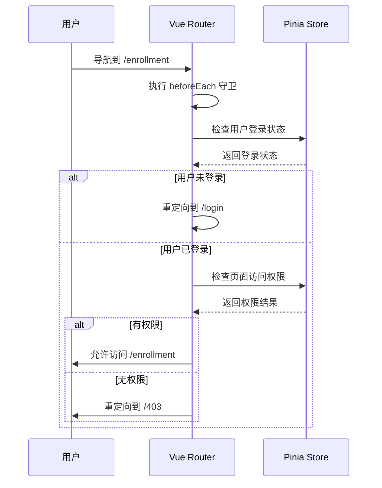
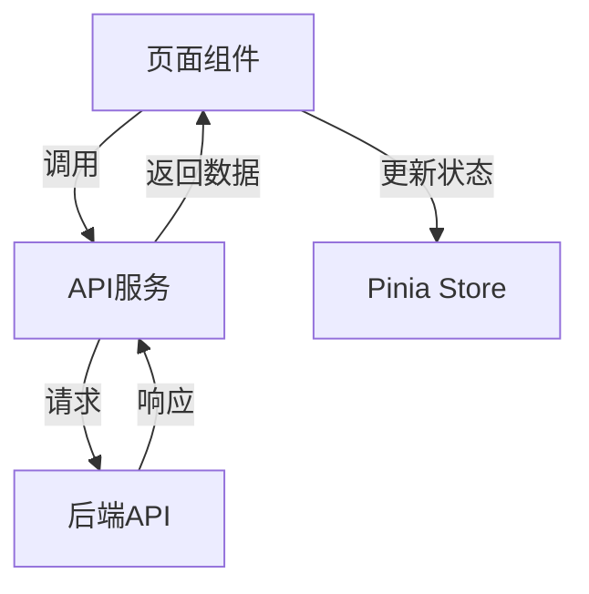
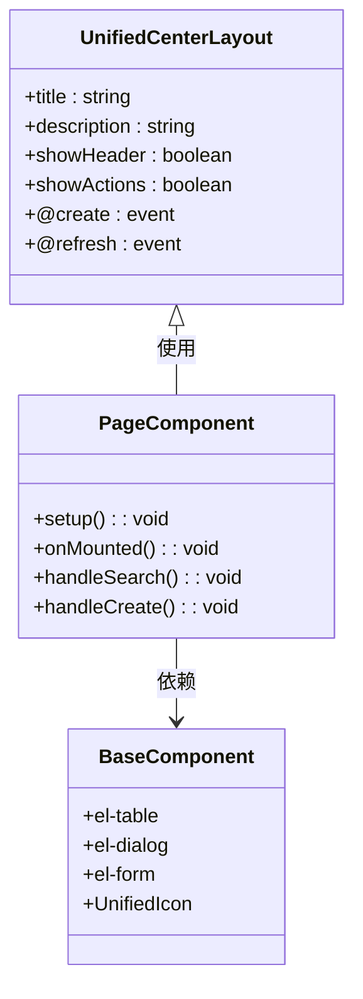

# 页面组件

<cite>
**本文档引用的文件**   
- [enrollment/index.vue](file://k.yyup.com/client/src/pages/enrollment/index.vue)
- [class/index.vue](file://k.yyup.com/client/src/pages/class/index.vue)
- [teacher/index.vue](file://k.yyup.com/client/src/pages/teacher/index.vue)
- [finance/PaymentManagement.vue](file://k.yyup.com/client/src/pages/finance/PaymentManagement.vue)
- [router/index.ts](file://k.yyup.com/client/src/router/index.ts)
- [stores/permissions-simple.ts](file://k.yyup.com/client/src/stores/permissions-simple.ts)
- [api/endpoints.ts](file://k.yyup.com/client/src/api/endpoints.ts)
- [components/layout/UnifiedCenterLayout.vue](file://k.yyup.com/client/src/components/layout/UnifiedCenterLayout.vue)
</cite>

## 目录
1. [引言](#引言)
2. [页面组件组织架构](#页面组件组织架构)
3. [核心业务页面实现](#核心业务页面实现)
4. [Vue Router集成](#vue-router集成)
5. [组合式API结构](#组合式api结构)
6. [状态管理与数据交互](#状态管理与数据交互)
7. [性能优化策略](#性能优化策略)
8. [组件协作关系](#组件协作关系)
9. [结论](#结论)

## 引言
k.yyup.com子系统采用Vue 3框架构建，其页面组件（pages）是系统的核心用户界面。这些组件负责展示和管理幼儿园的招生、教学、人事和财务等核心业务。本文档深入分析这些页面组件的实现细节和组织架构，详细解释其职责、功能、技术实现和最佳实践。

## 页面组件组织架构
k.yyup.com子系统的页面组件遵循清晰的目录结构，按业务功能进行组织。主要的页面组件位于`/src/pages`目录下，每个核心业务模块都有独立的子目录。

```mermaid
graph TD
A[/src/pages] --> B[招生管理]
A --> C[教学管理]
A --> D[人事管理]
A --> E[财务管理]
B --> B1[enrollment/index.vue]
C --> C1[class/index.vue]
D --> D1[teacher/index.vue]
E --> E1[finance/PaymentManagement.vue]
```

**目录来源**
- [enrollment/index.vue](file://k.yyup.com/client/src/pages/enrollment/index.vue)
- [class/index.vue](file://k.yyup.com/client/src/pages/class/index.vue)
- [teacher/index.vue](file://k.yyup.com/client/src/pages/teacher/index.vue)
- [finance/PaymentManagement.vue](file://k.yyup.com/client/src/pages/finance/PaymentManagement.vue)

## 核心业务页面实现
### 招生管理页面
招生管理页面（`enrollment/index.vue`）是系统的核心功能之一，负责管理招生申请的全生命周期。该页面采用组合式API（Composition API）构建，其主要职责包括：

- **数据展示**：通过`el-table`组件展示招生申请列表，包含学生姓名、家长信息、招生状态等关键字段。
- **统计功能**：在页面顶部提供统计卡片，实时显示总咨询数、已报名数、试听中数量和转化率等关键指标。
- **搜索与筛选**：提供强大的搜索和筛选功能，支持按学生姓名、家长姓名、招生状态、年龄段和报名时间范围进行过滤。
- **批量操作**：支持批量通过、批量拒绝和批量导出等操作，提高管理效率。
- **表单交互**：通过`el-dialog`对话框实现新增和编辑招生信息的功能，包含完整的表单验证。

**Section sources**
- [enrollment/index.vue](file://k.yyup.com/client/src/pages/enrollment/index.vue)

### 教学管理页面
教学管理页面（`class/index.vue`）专注于班级和学生的管理。其核心功能包括：

- **班级管理**：展示所有班级的列表，包括班级名称、容量、满员率、主班教师等信息。
- **统计信息**：提供班级总数、学生总数、教师总数和平均满员率等统计数据。
- **学生管理**：每个班级都支持学生管理功能，可以查看、添加、移除和转班学生。
- **教师分配**：支持为班级分配主班和副班教师。

**Section sources**
- [class/index.vue](file://k.yyup.com/client/src/pages/class/index.vue)

### 人事管理页面
人事管理页面（`teacher/index.vue`）用于管理教师信息。其主要特点包括：

- **教师列表**：展示所有教师的工号、姓名、职位、部门、状态等信息。
- **分类筛选**：支持按教师类型（全职、兼职等）、部门和状态进行筛选。
- **操作功能**：提供查看、编辑、删除教师和分配班级等操作。
- **组件复用**：使用`TeacherEditDialog`和`ClassAssignDialog`等基础组件，实现功能的模块化和复用。

**Section sources**
- [teacher/index.vue](file://k.yyup.com/client/src/pages/teacher/index.vue)

### 财务管理页面
财务管理页面（`finance/PaymentManagement.vue`）负责管理学生的缴费单。其主要功能包括：

- **统一布局**：使用`UnifiedCenterLayout`组件，确保与其他中心页面风格一致。
- **统计卡片**：展示待缴费、已缴费、逾期费用和已取消等财务状态的统计信息。
- **批量操作**：支持批量生成缴费单，提高工作效率。

**Section sources**
- [finance/PaymentManagement.vue](file://k.yyup.com/client/src/pages/finance/PaymentManagement.vue)

## Vue Router集成
k.yyup.com子系统通过Vue Router实现页面导航和路由管理。路由配置采用模块化设计，主要配置文件位于`/src/router/index.ts`。

### 动态路由参数
系统支持动态路由参数，例如在招生管理中，可以通过`/enrollment/:id`访问特定招生申请的详情页。这通过在路由配置中定义动态段来实现。

### 嵌套路由
系统使用嵌套路由来组织复杂的页面结构。例如，招生管理页面可能包含多个子页面，如招生统计、招生计划等，这些子页面通过嵌套路由实现。

### 路由守卫
系统实现了全面的路由守卫机制，确保用户权限和登录状态。主要的路由守卫逻辑如下：

1. **白名单检查**：对于登录、注册等公共页面，直接放行。
2. **登录状态验证**：检查用户是否已登录，未登录用户将被重定向到登录页。
3. **权限验证**：通过`permissions-simple`存储检查用户是否有权限访问目标页面，无权限用户将被重定向到403页面。



**Diagram sources**
- [router/index.ts](file://k.yyup.com/client/src/router/index.ts)
- [stores/permissions-simple.ts](file://k.yyup.com/client/src/stores/permissions-simple.ts)

**Section sources**
- [router/index.ts](file://k.yyup.com/client/src/router/index.ts)

## 组合式API结构
所有页面组件均采用Vue 3的组合式API（Composition API）进行开发，这使得代码组织更加灵活和可复用。

### setup函数
`setup`函数是组合式API的入口，它在组件实例创建之前执行。在`setup`函数中，我们定义响应式数据、计算属性、方法和生命周期钩子。

### 响应式数据定义
使用`ref`和`reactive`函数定义响应式数据。例如，在招生管理页面中，`loading`、`dialogVisible`和`enrollmentList`等状态都通过`ref`定义。

### 生命周期钩子
使用`onMounted`等生命周期钩子函数，在组件挂载后执行初始化操作，如加载统计数据和招生列表。

### 计算属性和方法
计算属性（`computed`）用于派生数据，方法（`methods`）用于处理用户交互。例如，`getStatusTagType`方法根据招生状态返回相应的标签类型。

**Section sources**
- [enrollment/index.vue](file://k.yyup.com/client/src/pages/enrollment/index.vue)
- [class/index.vue](file://k.yyup.com/client/src/pages/class/index.vue)

## 状态管理与数据交互
### Pinia状态管理
系统使用Pinia作为状态管理库，集中管理应用的状态。主要的状态存储包括：

- `user`：存储用户信息和登录状态。
- `permissions-simple`：存储用户权限和菜单配置。
- `app`：存储全局应用状态，如主题、布局等。

### API服务调用
页面组件通过调用API服务获取和提交数据。API端点定义在`/src/api/endpoints.ts`文件中，通过`request`工具函数进行HTTP请求。



**Diagram sources**
- [api/endpoints.ts](file://k.yyup.com/client/src/api/endpoints.ts)
- [stores/permissions-simple.ts](file://k.yyup.com/client/src/stores/permissions-simple.ts)

**Section sources**
- [api/endpoints.ts](file://k.yyup.com/client/src/api/endpoints.ts)
- [utils/request.ts](file://k.yyup.com/client/src/utils/request.ts)

## 性能优化策略
### 懒加载
系统采用路由懒加载，将每个页面组件打包成独立的chunk，只有在用户访问时才加载，减少初始加载时间。

### 代码分割
通过动态`import()`语法实现代码分割，将大型组件或库按需加载。

### 组件缓存
使用`<keep-alive>`组件缓存页面状态，避免在页面切换时重复加载数据。

## 组件协作关系
页面组件与布局组件和基础组件紧密协作，形成完整的用户界面。

- **布局组件**：`UnifiedCenterLayout`等布局组件提供统一的页面结构，包括标题、操作按钮和内容区域。
- **基础组件**：`el-table`、`el-dialog`、`el-form`等Element Plus组件提供UI元素，`UnifiedIcon`组件统一管理图标。



**Diagram sources**
- [components/layout/UnifiedCenterLayout.vue](file://k.yyup.com/client/src/components/layout/UnifiedCenterLayout.vue)

**Section sources**
- [components/layout/UnifiedCenterLayout.vue](file://k.yyup.com/client/src/components/layout/UnifiedCenterLayout.vue)

## 结论
k.yyup.com子系统的页面组件设计精良，采用现代前端技术栈，实现了高效、可维护和可扩展的用户界面。通过组合式API、Pinia状态管理和Vue Router的深度集成，系统能够灵活应对复杂的业务需求。同时，通过懒加载、代码分割和组件缓存等性能优化策略，确保了良好的用户体验。