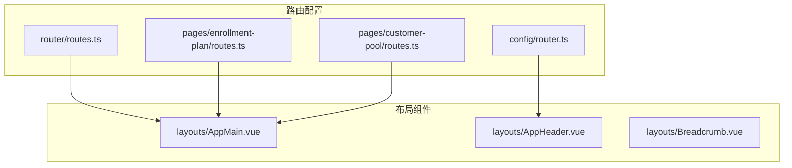
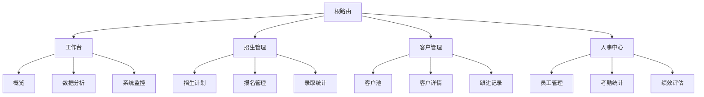
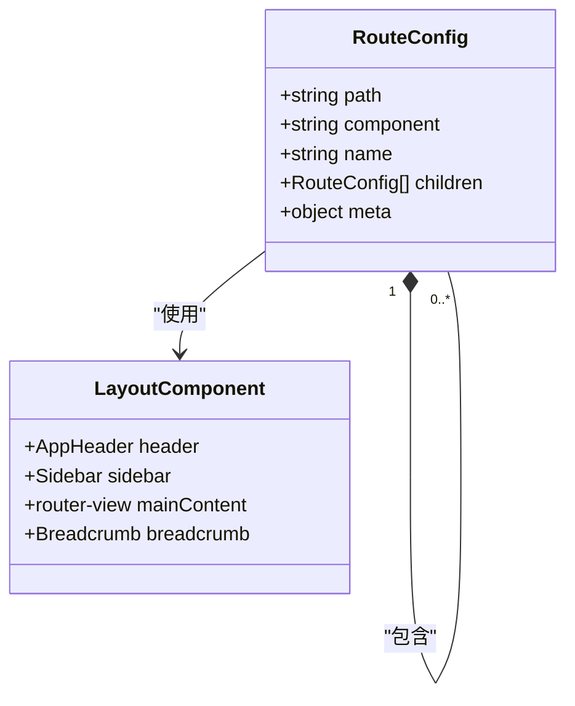
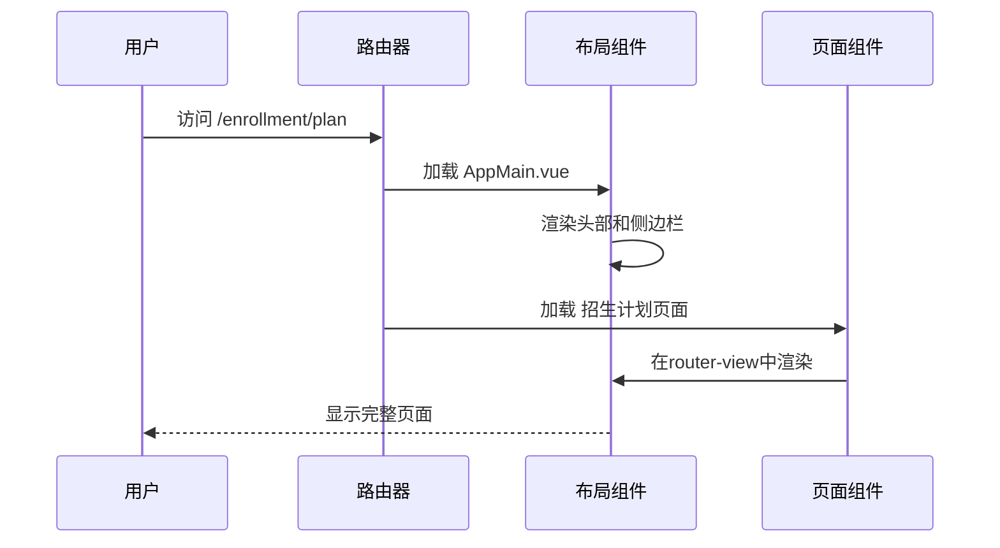
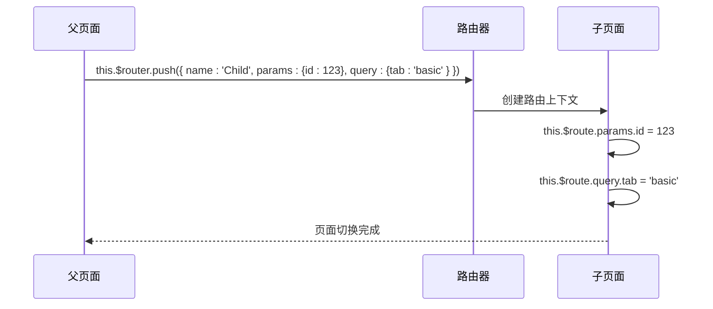
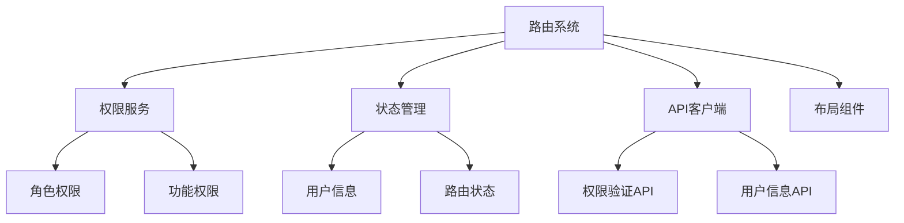

# 嵌套路由

<cite>
**本文档中引用的文件**  
- [router.ts](file://client/src/router/routes.ts)
- [router.ts](file://client/src/config/router.ts)
- [Layout.vue](file://client/src/layouts/components/AppMain.vue)
- [AppHeader.vue](file://client/src/layouts/components/AppHeader.vue)
- [enrollment-plan/routes.ts](file://client/src/pages/enrollment-plan/routes.ts)
- [customer-pool/routes.ts](file://client/src/pages/customer-pool/routes.ts)
- [dashboard/routes.ts](file://client/src/pages/dashboard/routes.ts)
</cite>

## 目录
1. [简介](#简介)
2. [项目结构](#项目结构)
3. [核心组件](#核心组件)
4. [架构概述](#架构概述)
5. [详细组件分析](#详细组件分析)
6. [依赖分析](#依赖分析)
7. [性能考虑](#性能考虑)
8. [故障排除指南](#故障排除指南)
9. [结论](#结论)

## 简介
本项目采用Vue Router实现嵌套路由系统，通过children属性定义多级页面结构，支持复杂的企业级应用导航需求。系统设计了统一的布局组件（Layout）来维护一致的页面框架，包括头部、侧边栏和底部等公共区域。路由系统与权限管理深度集成，确保不同角色用户只能访问授权的页面。主要功能模块如工作台、招生管理、客户管理等均采用嵌套路由设计，实现了清晰的页面层级和导航结构。

## 项目结构
项目采用模块化路由设计，路由配置分散在多个文件中，按功能模块组织。核心路由配置位于`client/src/router/`目录下，各功能模块在各自的页面目录中定义子路由。布局组件统一存放在`client/src/layouts/`目录中，通过路由的meta字段指定不同页面使用的布局。



**图源**
- [routes.ts](file://client/src/router/routes.ts)
- [AppMain.vue](file://client/src/layouts/components/AppMain.vue)

**本节来源**
- [client/src/router/](file://client/src/router/)
- [client/src/layouts/](file://client/src/layouts/)

## 核心组件
嵌套路由系统的核心是Vue Router的children属性和router-view组件的嵌套使用。通过在路由配置中定义children数组，可以创建父子路由关系。每个父路由对应一个布局组件，其中包含一个或多个router-view来渲染子路由组件。布局组件通常包含导航栏、侧边栏等公共UI元素，确保应用整体风格一致。

**本节来源**
- [routes.ts](file://client/src/router/routes.ts)
- [AppMain.vue](file://client/src/layouts/components/AppMain.vue)

## 架构概述
系统采用分层路由架构，顶层路由定义主要功能模块，如工作台、招生管理、客户管理等。每个主模块作为父路由，其子路由定义该模块内的具体功能页面。路由系统与权限服务集成，通过路由守卫验证用户权限，动态控制路由访问。



**图源**
- [routes.ts](file://client/src/router/routes.ts)
- [navigation.ts](file://client/src/config/navigation.ts)

## 详细组件分析
### 嵌套路由实现
嵌套路由通过在路由配置对象中使用children属性实现。父路由通常指向一个布局组件，该组件包含一个router-view用于渲染子路由。子路由的path可以是相对路径，Vue Router会自动将其与父路由路径拼接。

#### 路由配置示例


**图源**
- [routes.ts](file://client/src/router/routes.ts)
- [AppMain.vue](file://client/src/layouts/components/AppMain.vue)

### 布局组件设计
布局组件是嵌套路由的核心，负责提供统一的页面框架。主布局组件AppMain.vue包含头部导航、侧边栏和主要内容区域。通过在路由的meta字段中指定layout属性，可以为不同页面应用不同的布局。

#### 布局组件交互


**图源**
- [AppMain.vue](file://client/src/layouts/components/AppMain.vue)
- [enrollment-plan/routes.ts](file://client/src/pages/enrollment-plan/routes.ts)

### 主要功能模块路由设计
#### 招生管理模块
招生管理模块采用三级路由结构，第一级为招生中心入口，第二级为具体功能模块，第三级为操作页面。

```mermaid
flowchart TD
A[/enrollment] --> B[/enrollment/plan]
A --> C[/enrollment/application]
A --> D[/enrollment/statistics]
B --> B1[/enrollment/plan/create]
B --> B2[/enrollment/plan/edit/:id]
B --> B3[/enrollment/plan/detail/:id]
C --> C1[/enrollment/application/list]
C --> C2[/enrollment/application/detail/:id]
C --> C3[/enrollment/application/process/:id]
D --> D1[/enrollment/statistics/overview]
D --> D2[/enrollment/statistics/conversion]
D --> D3[/enrollment/statistics/trend]
```

**图源**
- [enrollment-plan/routes.ts](file://client/src/pages/enrollment-plan/routes.ts)
- [routes.ts](file://client/src/router/routes.ts)

#### 客户管理模块
客户管理模块路由设计注重客户生命周期管理，从客户获取到跟进维护形成完整流程。

```mermaid
flowchart TD
A[/customer] --> B[/customer/pool]
A --> C[/customer/management]
A --> D[/customer/analytics]
B --> B1[/customer/pool/list]
B --> B2[/customer/pool/import]
B --> B3[/customer/pool/batch]
C --> C1[/customer/management/detail/:id]
C --> C2[/customer/management/follow-up/:id]
C --> C3[/customer/management/transfer/:id]
D --> D1[/customer/analytics/overview]
D --> D2[/customer/analytics/conversion]
D --> D3[/customer/analytics/score]
```

**图源**
- [customer-pool/routes.ts](file://client/src/pages/customer-pool/routes.ts)
- [routes.ts](file://client/src/router/routes.ts)

### 路由参数传递机制
嵌套路由中的参数传递通过Vue Router的params和query机制实现。父路由和子路由可以共享$router对象，通过编程式导航传递参数。对于需要跨层级传递的数据，系统采用Vuex状态管理或路由元信息（meta）来实现。

#### 参数传递流程


**图源**
- [routes.ts](file://client/src/router/routes.ts)
- [composables/useRouter.ts](file://client/src/composables/useRouter.ts)

## 依赖分析
路由系统依赖多个核心模块协同工作，包括权限服务、状态管理、API客户端等。路由守卫与权限服务集成，确保用户只能访问授权的页面。状态管理模块存储当前路由状态和用户权限信息，供路由守卫使用。



**图源**
- [permission.guard.ts](file://client/src/guards/permission.guard.ts)
- [useAuth.ts](file://client/src/composables/useAuth.ts)
- [auth.ts](file://client/src/api/auth.ts)

**本节来源**
- [client/src/guards/](file://client/src/guards/)
- [client/src/composables/](file://client/src/composables/)

## 性能考虑
嵌套路由系统在性能方面做了多项优化。采用路由懒加载，将不同模块的代码分割成独立的chunk，实现按需加载。路由守卫中使用权限缓存，避免重复调用API验证权限。对于复杂的布局组件，使用keep-alive缓存常用页面，减少重复渲染开销。

## 故障排除指南
常见路由问题包括页面空白、权限错误、参数丢失等。排查时应首先检查路由配置的path是否正确，组件路径是否有效。对于权限问题，验证用户角色和路由meta中的权限配置是否匹配。参数传递问题通常源于编程式导航时参数格式错误或路由定义中缺少参数占位符。

**本节来源**
- [permission.guard.ts](file://client/src/guards/permission.guard.ts)
- [error-handler.ts](file://client/src/utils/error-handler.ts)

## 结论
本项目的嵌套路由系统设计合理，通过children属性和布局组件实现了清晰的页面层级结构。各功能模块的路由设计遵循一致的模式，便于维护和扩展。系统与权限管理深度集成，确保了安全性。建议未来进一步优化路由懒加载策略，减少首屏加载时间，并完善路由日志记录，便于问题排查。