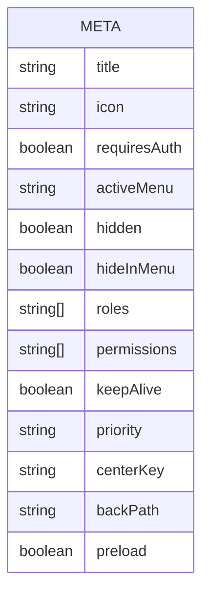
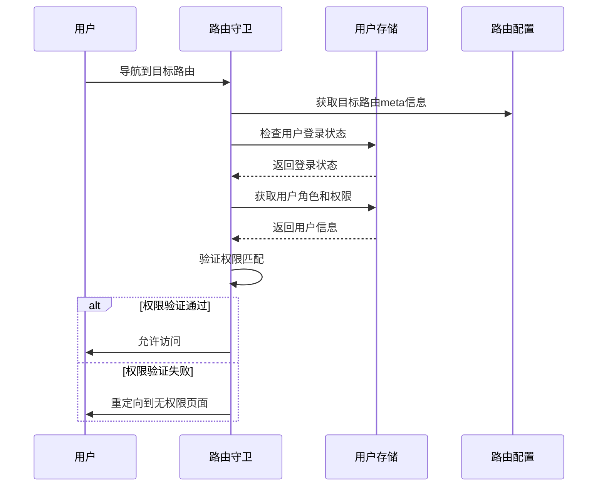
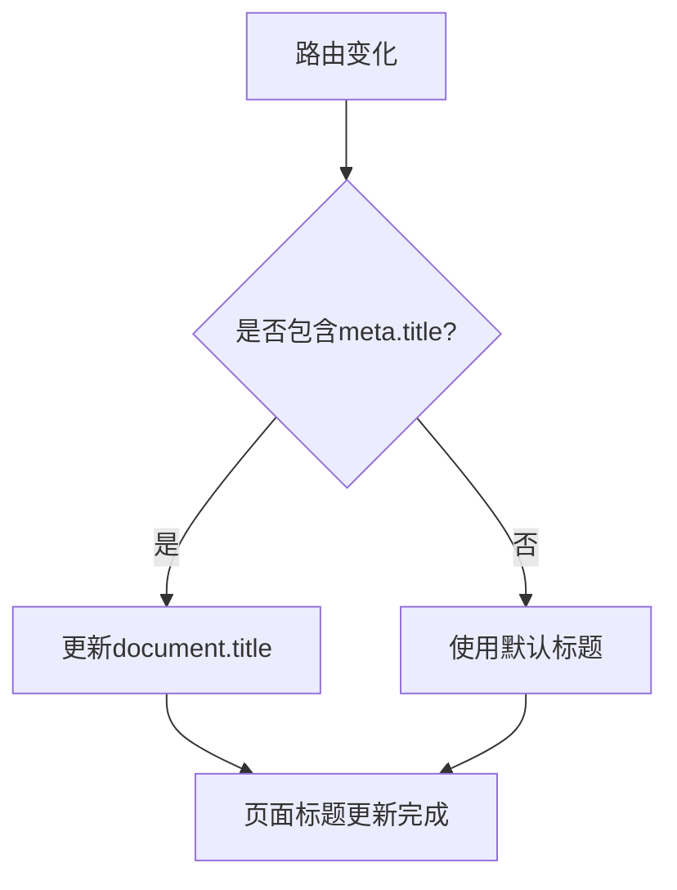
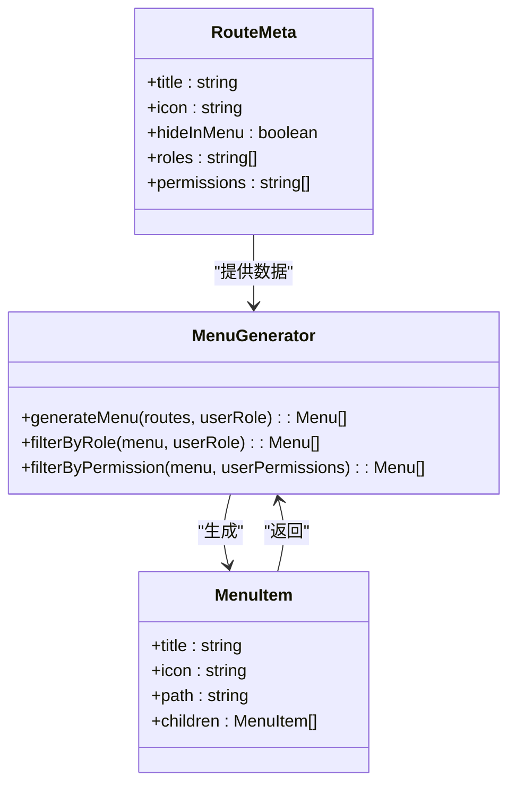
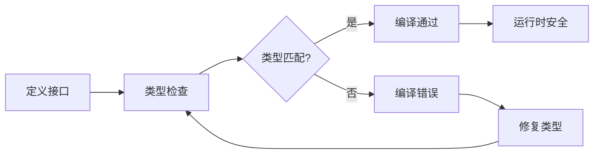

# 路由元信息

<cite>
**本文档引用文件**   
- [router.ts](file://k.yyup.com/client/src/config/router.ts)
- [router.ts](file://unified-tenant-system/client/src/config/router.ts)
- [router.ts](file://k.yyup.com/client/src/router/optimized-routes.ts)
- [route.ts](file://k.yyup.com/client/src/types/route.ts)
- [router.ts](file://k.yyup.com/client/src/types/router.ts)
- [permission.guard.ts](file://k.yyup.com/client/src/guards/permission.guard.ts)
- [parent-center-routes.ts](file://k.yyup.com/client/src/router/parent-center-routes.ts)
- [mobile-routes.ts](file://k.yyup.com/client/src/router/mobile-routes.ts)
</cite>

## 目录
1. [路由元信息概述](#路由元信息概述)
2. [Meta字段数据结构](#meta字段数据结构)
3. [权限控制应用](#权限控制应用)
4. [页面标题管理](#页面标题管理)
5. [导航菜单生成](#导航菜单生成)
6. [最佳实践](#最佳实践)

## 路由元信息概述

路由元信息（Route Meta Information）是前端路由系统中的重要组成部分，通过在路由配置中添加meta字段，可以为每个路由附加自定义数据。这些数据在路由守卫、页面标题管理、导航菜单生成等场景中发挥关键作用。本项目通过meta字段实现了灵活的权限控制、动态页面标题更新和智能导航菜单生成等功能。

**Section sources**
- [router.ts](file://k.yyup.com/client/src/config/router.ts#L1-L180)
- [optimized-routes.ts](file://k.yyup.com/client/src/router/optimized-routes.ts#L1-L800)

## Meta字段数据结构

项目中定义了丰富的meta字段数据结构，用于存储路由的附加信息。这些字段包括页面标题、图标、权限要求、导航菜单标识等。

**Diagram sources **
- [router.ts](file://k.yyup.com/client/src/types/router.ts#L4-L37)
- [route.ts](file://k.yyup.com/client/src/types/route.ts#L5-L10)

**Section sources**
- [router.ts](file://k.yyup.com/client/src/types/router.ts#L4-L45)
- [route.ts](file://k.yyup.com/client/src/types/route.ts#L2-L12)

## 权限控制应用

路由元信息在权限控制中扮演着核心角色。通过在meta字段中设置权限标识，路由守卫可以读取这些信息并进行访问控制。

**Diagram sources **
- [permission.guard.ts](file://k.yyup.com/client/src/guards/permission.guard.ts#L20-L53)
- [optimized-routes.ts](file://k.yyup.com/client/src/router/optimized-routes.ts#L222-L800)

**Section sources**
- [permission.guard.ts](file://k.yyup.com/client/src/guards/permission.guard.ts#L20-L83)
- [optimized-routes.ts](file://k.yyup.com/client/src/router/optimized-routes.ts#L222-L800)

## 页面标题管理

通过路由元信息中的title字段，系统可以实现页面标题的动态更新，提升用户体验。

**Diagram sources **
- [optimized-routes.ts](file://k.yyup.com/client/src/router/optimized-routes.ts#L222-L800)
- [parent-center-routes.ts](file://k.yyup.com/client/src/router/parent-center-routes.ts#L9-L452)

**Section sources**
- [optimized-routes.ts](file://k.yyup.com/client/src/router/optimized-routes.ts#L222-L800)
- [parent-center-routes.ts](file://k.yyup.com/client/src/router/parent-center-routes.ts#L9-L452)

## 导航菜单生成

路由元信息中的meta字段被用于生成导航菜单结构，实现菜单的动态构建和权限过滤。

**Diagram sources **
- [mobile-routes.ts](file://k.yyup.com/client/src/router/mobile-routes.ts#L8-L881)
- [parent-center-routes.ts](file://k.yyup.com/client/src/router/parent-center-routes.ts#L9-L452)

**Section sources**
- [mobile-routes.ts](file://k.yyup.com/client/src/router/mobile-routes.ts#L8-L881)
- [parent-center-routes.ts](file://k.yyup.com/client/src/router/parent-center-routes.ts#L9-L452)

## 最佳实践

### 命名规范

遵循统一的命名规范，确保meta字段的可读性和一致性：
- 使用小写字母和连字符分隔单词
- 保持字段名称简洁明了
- 避免使用缩写，除非是广泛认可的

### 数据结构设计

设计合理的数据结构，提高系统的可维护性：
- 将相关字段分组管理
- 使用枚举值限制字段取值范围
- 提供默认值以减少配置复杂度

### 类型安全处理

通过TypeScript接口定义确保类型安全：
- 为meta字段定义明确的接口
- 使用泛型提高代码复用性
- 在编译时捕获类型错误

**Diagram sources **
- [router.ts](file://k.yyup.com/client/src/types/router.ts#L4-L37)
- [route.ts](file://k.yyup.com/client/src/types/route.ts#L5-L10)

**Section sources**
- [router.ts](file://k.yyup.com/client/src/types/router.ts#L4-L45)
- [route.ts](file://k.yyup.com/client/src/types/route.ts#L2-L12)