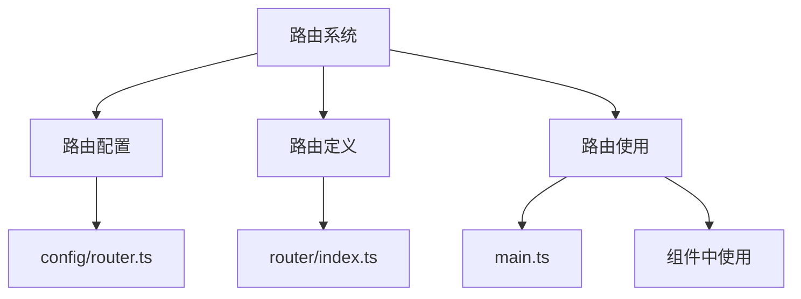
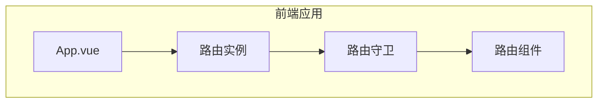
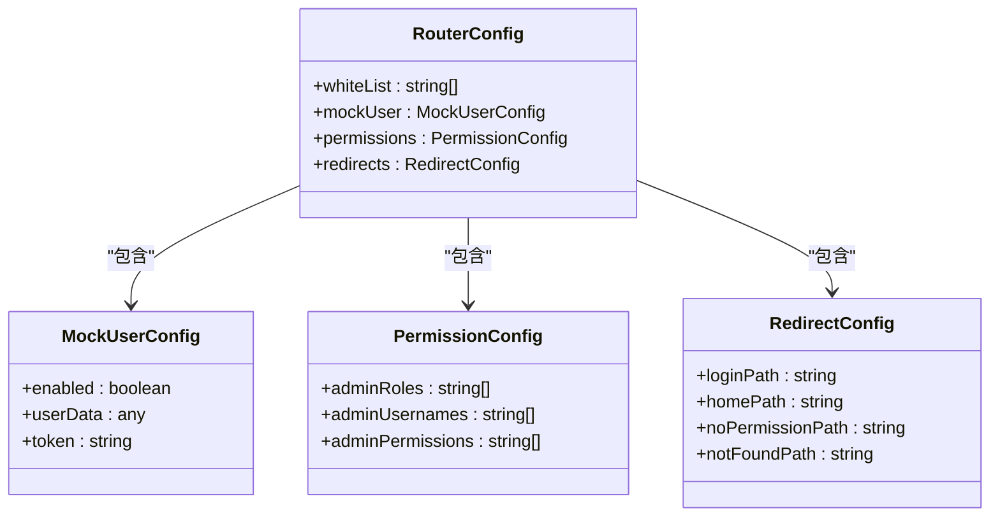
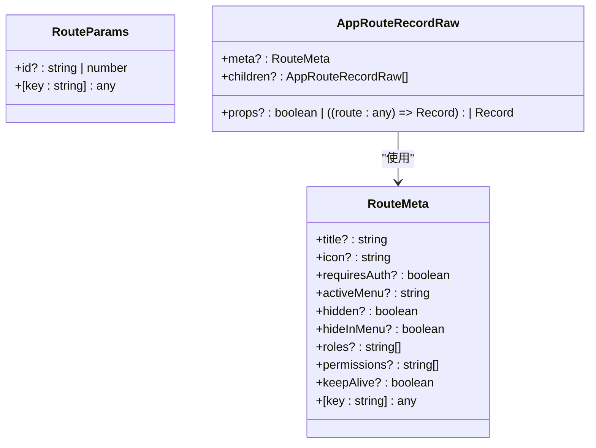
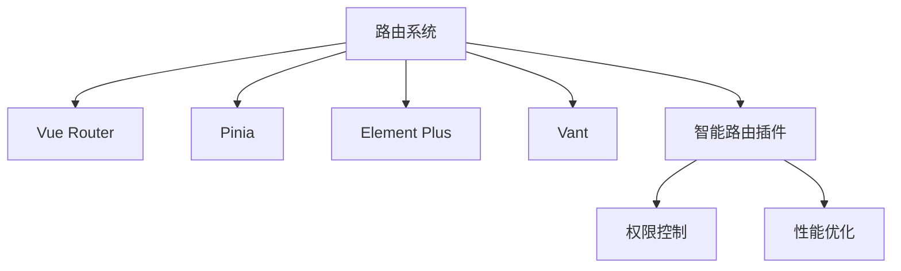

# 路由参数

<cite>
**本文档引用文件**   
- [router.ts](file://client/aimobile/router/index.ts)
- [main.ts](file://client/src/main.ts)
- [router.ts](file://client/demo/router.ts)
- [types/router.ts](file://client/src/types/router.ts)
- [config/router.ts](file://client/src/config/router.ts)
</cite>

## 目录
1. [引言](#引言)
2. [项目结构](#项目结构)
3. [核心组件](#核心组件)
4. [架构概述](#架构概述)
5. [详细组件分析](#详细组件分析)
6. [依赖分析](#依赖分析)
7. [性能考虑](#性能考虑)
8. [故障排除指南](#故障排除指南)
9. [结论](#结论)
10. [附录](#附录)（如有必要）

## 引言
本项目采用Vue Router实现前端路由系统，支持query参数和params参数两种动态数据传递方式。系统通过TypeScript接口定义路由参数结构，确保类型安全，并实现了响应式参数更新机制。路由配置采用模块化设计，支持环境特定配置和动态生成，满足开发、测试和生产环境的不同需求。

## 项目结构
项目路由系统采用分层架构，主要包含路由配置、路由定义和路由使用三个层次。核心路由配置位于`client/aimobile/router/index.ts`，类型定义位于`client/src/types/router.ts`，环境相关配置位于`client/src/config/router.ts`。

**Diagram sources**
- [config/router.ts](file://client/src/config/router.ts)
- [router/index.ts](file://client/aimobile/router/index.ts)
- [main.ts](file://client/src/main.ts)

**Section sources**
- [config/router.ts](file://client/src/config/router.ts)
- [router/index.ts](file://client/aimobile/router/index.ts)

## 核心组件
路由系统的核心组件包括路由实例创建、路由配置生成和路由参数处理。系统使用`createRouter`和`createWebHistory`创建路由实例，通过`generateRouterConfig`函数生成环境特定的路由配置，并在组件中通过`useRoute`和`useRouter`组合式API访问路由参数。

**Section sources**
- [router/index.ts](file://client/aimobile/router/index.ts)
- [config/router.ts](file://client/src/config/router.ts)

## 架构概述
系统采用Vue 3的组合式API和Vue Router 4实现路由功能，支持HTML5 History模式。路由配置包含白名单路由、权限配置和重定向配置，通过环境变量实现配置的动态化。

**Diagram sources**
- [main.ts](file://client/src/main.ts)
- [router/index.ts](file://client/aimobile/router/index.ts)

## 详细组件分析
### 路由配置分析
路由配置系统通过接口`RouterConfig`定义配置结构，包含白名单路由、模拟用户配置、权限配置和重定向配置。配置通过`generateRouterConfig`函数根据当前环境动态生成。

#### 配置接口定义

**Diagram sources**
- [config/router.ts](file://client/src/config/router.ts)

**Section sources**
- [config/router.ts](file://client/src/config/router.ts)

### 路由参数处理
系统通过`RouteParams`接口定义路由参数结构，支持id参数和任意键值对参数。组件中通过`useRoute`函数获取当前路由信息，包括params和query参数。

#### 参数类型定义

**Diagram sources**
- [types/router.ts](file://client/src/types/router.ts)

**Section sources**
- [types/router.ts](file://client/src/types/router.ts)

## 依赖分析
路由系统依赖Vue Router、Pinia状态管理、Element Plus UI组件库和Vant移动端UI组件库。通过插件机制集成智能路由功能，支持权限控制和性能优化。

**Diagram sources**
- [main.ts](file://client/src/main.ts)
- [config/router.ts](file://client/src/config/router.ts)

**Section sources**
- [main.ts](file://client/src/main.ts)

## 性能考虑
系统在移动端启动时异步加载性能监控模块，避免阻塞应用初始化。生产环境禁用HMR和WebSocket连接，减少不必要的网络请求。通过按需导入图标组件，优化打包体积。

## 故障排除指南
常见路由问题包括导航超时、权限错误和404页面。系统通过紧急修复模块解决localhost导航超时问题，使用详细的错误日志帮助定位问题。开发环境提供视觉调试工具，便于UI问题排查。

**Section sources**
- [navigation-timeout-emergency-fix](file://client/utils/navigation-timeout-emergency-fix)
- [visual-debugger](file://client/utils/visual-debugger)

## 结论
本项目路由系统设计合理，功能完整，支持动态参数传递和类型安全检查。通过模块化配置和环境适配，满足不同场景的需求。建议在实际使用中遵循参数命名规范，合理使用必选和可选参数，并实施参数验证策略确保数据安全。