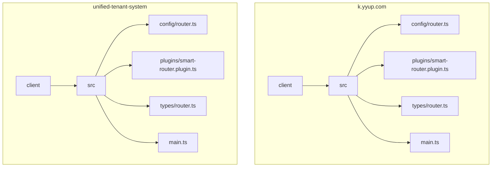
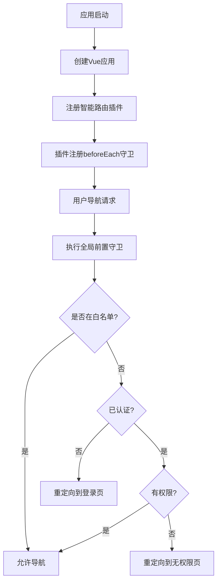
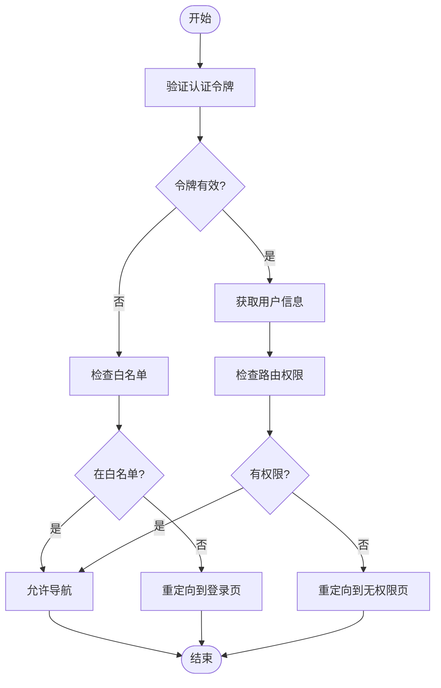
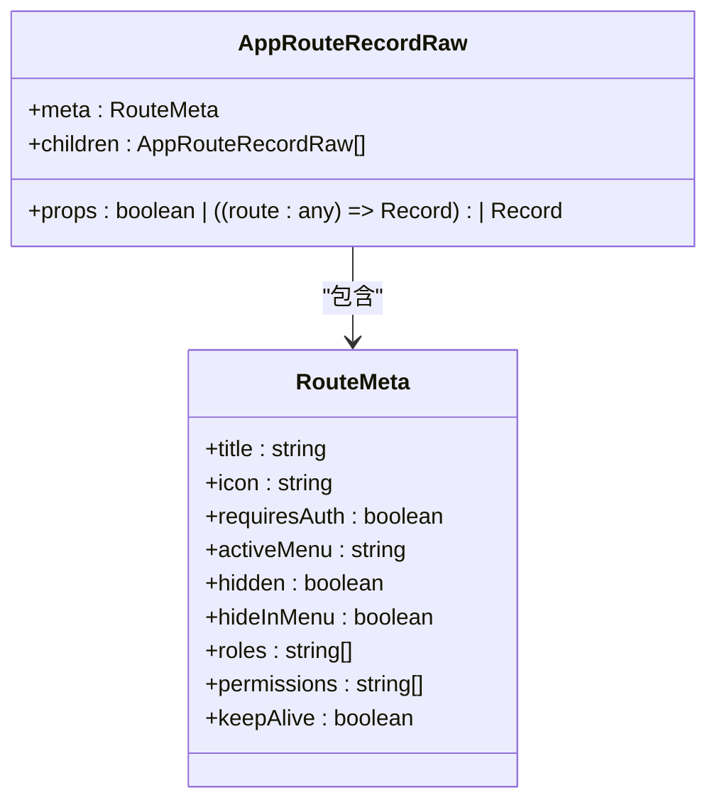
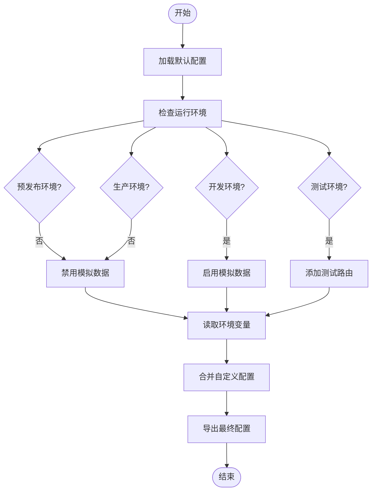
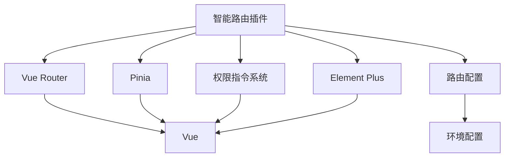

# 路由守卫

<cite>
**本文档引用的文件**   
- [router.ts](file://k.yyup.com/client/src/config/router.ts)
- [router.ts](file://unified-tenant-system/client/src/config/router.ts)
- [main.ts](file://k.yyup.com/client/src/main.ts)
- [main.ts](file://unified-tenant-system/client/src/main.ts)
- [smart-router.plugin.ts](file://k.yyup.com/client/plugins/smart-router.plugin.ts)
- [smart-router.plugin.ts](file://unified-tenant-system/client/plugins/smart-router.plugin.ts)
- [types/router.ts](file://k.yyup.com/client/src/types/router.ts)
- [types/router.ts](file://unified-tenant-system/client/src/types/router.ts)
</cite>

## 目录
1. [介绍](#介绍)
2. [项目结构](#项目结构)
3. [核心组件](#核心组件)
4. [架构概述](#架构概述)
5. [详细组件分析](#详细组件分析)
6. [依赖分析](#依赖分析)
7. [性能考虑](#性能考虑)
8. [故障排除指南](#故障排除指南)
9. [结论](#结论)
10. [附录](#附录)（如有必要）

## 介绍
本项目实现了完整的路由守卫机制，用于处理权限控制和导航拦截。系统采用Vue Router的导航守卫功能，结合自定义的智能路由插件，实现了全局前置守卫、路由独享守卫和组件内守卫的多层次权限控制体系。通过路由元信息（meta）传递权限要求，在导航前进行身份验证和权限检查，确保用户只能访问其权限范围内的页面。系统还支持模拟用户配置，便于开发和测试环境的快速验证。

## 项目结构
项目包含两个主要客户端应用：k.yyup.com和unified-tenant-system，它们共享相似的路由守卫实现模式。路由配置和守卫逻辑主要位于客户端的src目录下，通过插件机制集成到Vue应用中。

**图示来源**
- [k.yyup.com/client/src/config/router.ts](file://k.yyup.com/client/src/config/router.ts#L1-L180)
- [unified-tenant-system/client/src/config/router.ts](file://unified-tenant-system/client/src/config/router.ts#L1-L179)

**本节来源**
- [k.yyup.com/client/src/config/router.ts](file://k.yyup.com/client/src/config/router.ts#L1-L180)
- [unified-tenant-system/client/src/config/router.ts](file://unified-tenant-system/client/src/config/router.ts#L1-L179)

## 核心组件
系统的核心路由守卫功能由智能路由插件（smart-router.plugin.ts）实现，该插件在应用启动时被注册。插件通过beforeEach全局前置守卫拦截所有导航请求，结合路由配置中的白名单、权限要求等信息进行身份验证和权限检查。路由元信息扩展了标准的RouteMeta接口，增加了权限相关字段，如roles、permissions等，用于定义路由的访问控制策略。

**本节来源**
- [smart-router.plugin.ts](file://k.yyup.com/client/plugins/smart-router.plugin.ts)
- [smart-router.plugin.ts](file://unified-tenant-system/client/plugins/smart-router.plugin.ts)
- [types/router.ts](file://k.yyup.com/client/src/types/router.ts#L1-L45)

## 架构概述
系统的路由守卫架构采用分层设计，从应用入口到具体守卫逻辑形成完整的控制链。在应用初始化时，智能路由插件被注册并接收路由器实例，插件内部实现全局前置守卫逻辑。当用户尝试导航时，守卫函数根据目标路由的元信息和用户当前的认证状态进行决策，决定是否允许导航、重定向到登录页或显示无权限页面。

**图示来源**
- [main.ts](file://k.yyup.com/client/src/main.ts#L1-L231)
- [smart-router.plugin.ts](file://k.yyup.com/client/plugins/smart-router.plugin.ts)

## 详细组件分析
### 全局前置守卫分析
全局前置守卫是权限控制的核心，它在每次路由跳转前执行，确保用户身份和权限的合法性。守卫函数接收to、from、next三个参数，通过分析目标路由的元信息和当前用户状态，决定导航行为。

#### 守卫函数实现

**图示来源**
- [smart-router.plugin.ts](file://k.yyup.com/client/plugins/smart-router.plugin.ts)
- [router.ts](file://k.yyup.com/client/src/config/router.ts#L129-L153)

### 路由元信息分析
系统扩展了Vue Router的元信息接口，增加了权限控制所需的字段，使每个路由可以定义自己的访问策略。

#### 路由元信息结构

**图示来源**
- [types/router.ts](file://k.yyup.com/client/src/types/router.ts#L5-L15)
- [types/router.ts](file://k.yyup.com/client/src/types/router.ts#L25-L40)

### 路由配置分析
路由配置文件定义了系统的全局守卫策略，包括白名单路由、管理员角色、重定向路径等关键配置。

#### 配置生成流程

**图示来源**
- [router.ts](file://k.yyup.com/client/src/config/router.ts#L79-L126)
- [router.ts](file://k.yyup.com/client/src/config/router.ts#L37-L76)

**本节来源**
- [router.ts](file://k.yyup.com/client/src/config/router.ts#L1-L180)
- [types/router.ts](file://k.yyup.com/client/src/types/router.ts#L1-L45)

## 依赖分析
路由守卫系统依赖于多个核心模块，包括Vue Router、Pinia状态管理、Element Plus UI组件库以及自定义的权限指令系统。这些依赖通过插件机制在应用启动时被正确初始化和注册。

**图示来源**
- [main.ts](file://k.yyup.com/client/src/main.ts#L3-L4)
- [main.ts](file://k.yyup.com/client/src/main.ts#L184-L190)
- [main.ts](file://k.yyup.com/client/src/main.ts#L68)

## 性能考虑
路由守卫的实现考虑了性能优化，避免在每次导航时进行昂贵的计算或异步操作。权限检查逻辑被设计为同步执行，确保导航响应的及时性。对于需要异步验证的场景，系统采用预加载策略，在应用启动时获取用户信息并缓存，减少导航时的等待时间。

## 故障排除指南
在使用路由守卫时可能遇到一些常见问题，如无限重定向、权限判断错误等。这些问题通常源于配置错误或状态管理问题。确保路由白名单配置正确，避免将登录页等公共页面遗漏。检查用户认证状态的存储和读取逻辑，确保在页面刷新后能正确恢复。对于异步守卫，务必正确调用next函数，避免导航挂起。

**本节来源**
- [smart-router.plugin.ts](file://k.yyup.com/client/plugins/smart-router.plugin.ts)
- [router.ts](file://k.yyup.com/client/src/config/router.ts)

## 结论
本项目的路由守卫实现提供了一个完整、灵活的权限控制解决方案。通过全局前置守卫、路由元信息和动态配置的结合，系统能够有效地保护应用资源，防止未授权访问。架构设计考虑了可维护性和扩展性，便于根据不同环境和需求调整权限策略。未来可以进一步增强权限检查的粒度，支持更复杂的访问控制规则。