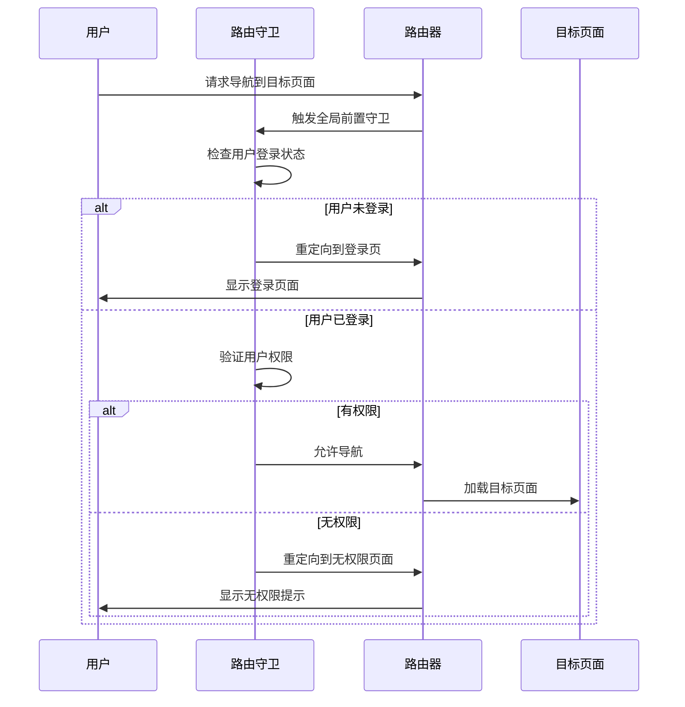
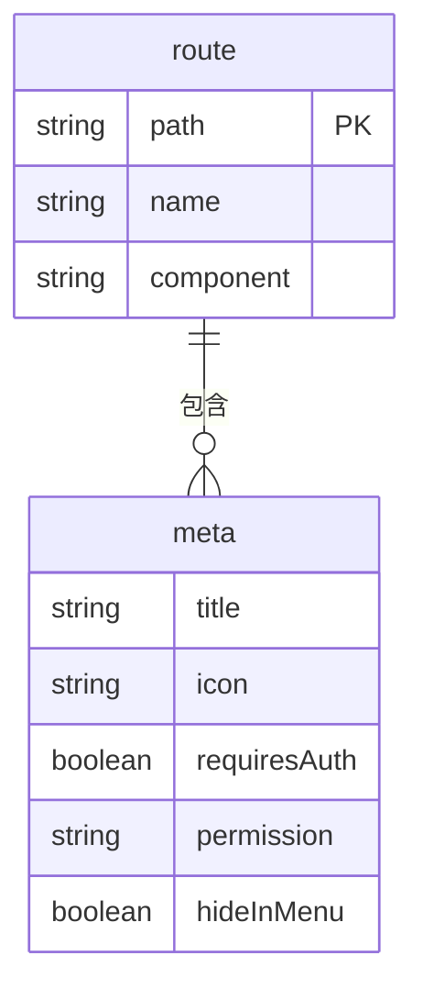

# 路由系统

<cite>
**本文档中引用的文件**  
- [router.ts](file://k.yyup.com/client/src/config/router.ts)
- [optimized-routes.ts](file://k.yyup.com/client/src/router/optimized-routes.ts)
- [mobile-routes.ts](file://k.yyup.com/client/src/router/mobile-routes.ts)
- [parent-center-routes.ts](file://k.yyup.com/client/src/router/parent-center-routes.ts)
- [teacher-center-routes.ts](file://k.yyup.com/client/src/router/teacher-center-routes.ts)
- [router.ts](file://k.yyup.com/client/src/types/router.ts)
- [route.ts](file://k.yyup.com/client/src/types/route.ts)
</cite>

## 目录
1. [路由配置结构](#路由配置结构)
2. [静态与动态路由定义](#静态与动态路由定义)
3. [路由守卫机制](#路由守卫机制)
4. [嵌套路由设计](#嵌套路由设计)
5. [路由懒加载与代码分割](#路由懒加载与代码分割)
6. [路由参数处理](#路由参数处理)
7. [路由元信息应用](#路由元信息应用)
8. [路由最佳实践](#路由最佳实践)
9. [路由结构图](#路由结构图)

## 路由配置结构

项目中的路由配置采用模块化设计，主要包含核心路由配置、移动端路由配置以及特定中心（如家长中心、教师中心）的独立路由模块。核心配置文件 `router.ts` 定义了全局路由行为，包括白名单路径、重定向规则、权限控制等。通过环境变量支持不同环境下的灵活配置，确保开发、测试和生产环境的一致性。

**Section sources**
- [router.ts](file://k.yyup.com/client/src/config/router.ts#L1-L180)

## 静态与动态路由定义

静态路由在 `optimized-routes.ts` 中通过 `RouteRecordRaw` 类型显式定义，每个路由对象包含路径、名称、组件和元信息。动态路由通过路径参数（如 `:id`）实现，允许在运行时传递参数并加载相应内容。例如，`/class/detail/:id` 可以根据不同的 `id` 值展示不同班级的详细信息。

**Section sources**
- [optimized-routes.ts](file://k.yyup.com/client/src/router/optimized-routes.ts#L1-L800)

## 路由守卫机制

路由守卫用于控制导航行为，确保用户权限和状态符合要求。项目中实现了全局前置守卫，检查用户是否登录及是否有访问权限。此外，还支持路由独享守卫和组件内守卫，分别在特定路由或组件中定义导航逻辑。例如，在进入需要权限的页面前，会验证用户角色和权限。



**Diagram sources**
- [router.ts](file://k.yyup.com/client/src/config/router.ts#L129-L154)

## 嵌套路由设计

嵌套路由通过 `children` 属性实现多级路由结构，适用于具有层级关系的页面。例如，家长中心 (`/parent-center`) 下包含多个子页面，如仪表板、孩子管理、测评中心等。每个子路由可以独立配置元信息，并通过嵌套结构组织内容，提升用户体验和代码可维护性。

```mermaid
graph TD
A[/parent-center] --> B[/parent-center/dashboard]
A --> C[/parent-center/children]
A --> D[/parent-center/assessment]
D --> E[/parent-center/assessment/development]
D --> F[/parent-center/assessment/school-readiness]
D --> G[/parent-center/assessment/academic]
A --> H[/parent-center/ai-assistant]
A --> I[/parent-center/games]
```

**Diagram sources**
- [parent-center-routes.ts](file://k.yyup.com/client/src/router/parent-center-routes.ts#L8-L452)

## 路由懒加载与代码分割

路由懒加载通过动态 `import()` 实现，将页面组件按需加载，减少初始包体积，提升加载性能。在 `optimized-routes.ts` 中，所有页面组件均使用箭头函数返回 `import()` 表达式，确保只有在访问对应路由时才加载组件代码。这种策略显著优化了首屏加载时间，符合现代Web应用的最佳实践。

**Section sources**
- [optimized-routes.ts](file://k.yyup.com/client/src/router/optimized-routes.ts#L13-L80)

## 路由参数处理

路由参数分为 `query` 参数和 `params` 参数。`query` 参数通过 URL 查询字符串传递，适用于非关键性数据；`params` 参数嵌入路径中，适合标识性数据。在组件中可通过 `$route.query` 和 `$route.params` 获取相应参数。例如，`/student/search?keyword=张三` 使用 `query` 参数进行搜索，而 `/class/detail/123` 使用 `params` 参数定位具体班级。

**Section sources**
- [optimized-routes.ts](file://k.yyup.com/client/src/router/optimized-routes.ts#L728-L738)

## 路由元信息应用

路由元信息（meta）用于存储附加数据，如页面标题、图标、权限要求等。通过扩展 `RouteMeta` 接口，项目支持自定义字段，如 `requiresAuth` 控制是否需要认证，`permission` 定义访问权限，`hideInMenu` 决定是否在菜单中显示。这些元信息在路由守卫和导航守卫中被读取，实现精细化的访问控制和UI展示。



**Diagram sources**
- [router.ts](file://k.yyup.com/client/src/types/router.ts#L4-L16)
- [route.ts](file://k.yyup.com/client/src/types/route.ts#L2-L12)

## 路由最佳实践

为确保路由系统的可维护性和一致性，建议遵循以下最佳实践：
- **命名规范**：路由名称采用 PascalCase，如 `ParentDashboard`。
- **路径设计**：路径简洁明了，避免深层嵌套，优先使用有意义的关键词。
- **权限管理**：通过 `meta.permission` 字段统一管理权限，结合后端接口验证。
- **代码组织**：按功能模块拆分路由配置，避免单一文件过大。
- **性能优化**：充分利用懒加载，减少不必要的资源加载。

**Section sources**
- [optimized-routes.ts](file://k.yyup.com/client/src/router/optimized-routes.ts)
- [parent-center-routes.ts](file://k.yyup.com/client/src/router/parent-center-routes.ts)

## 路由结构图

以下是项目主要路由路径及其层级关系的结构图：

```mermaid
graph TD
A[/] --> B[/dashboard]
A --> C[/class]
A --> D[/student]
A --> E[/teacher]
A --> F[/parent-center]
A --> G[/centers]
A --> H[/aiassistant]
F --> F1[/parent-center/dashboard]
F --> F2[/parent-center/children]
F --> F3[/parent-center/assessment]
F3 --> F3a[/parent-center/assessment/development]
F3 --> F3b[/parent-center/assessment/school-readiness]
F3 --> F3c[/parent-center/assessment/academic]
F --> F4[/parent-center/ai-assistant]
F --> F5[/parent-center/games]
G --> G1[/centers/enrollment-center]
G --> G2[/centers/personnel-center]
G --> G3[/centers/activity-center]
G --> G4[/centers/task-center]
G --> G5[/centers/marketing-center]
G --> G6[/centers/ai-center]
G --> G7[/centers/system-center]
G --> G8[/centers/customer-pool-center]
G --> G9[/centers/analytics-center]
G --> G10[/centers/inspection-center]
G --> G11[/centers/script-center]
G --> G12[/centers/finance-center]
G --> G13[/centers/call-center]
G --> G14[/centers/business-center]
G --> G15[/centers/teaching-center]
G --> G16[/centers/media-center]
G --> G17[/centers/attendance-center]
G --> G18[/centers/assessment-center]
G --> G19[/centers/document-collaboration]
G --> G20[/centers/document-editor]
G --> G21[/centers/document-center]
G --> G22[/centers/document-template-center]
G --> G23[/centers/document-instance-list]
G --> G24[/centers/document-statistics]
```

**Diagram sources**
- [optimized-routes.ts](file://k.yyup.com/client/src/router/optimized-routes.ts#L223-L800)
- [parent-center-routes.ts](file://k.yyup.com/client/src/router/parent-center-routes.ts#L8-L452)
- [mobile-routes.ts](file://k.yyup.com/client/src/router/mobile-routes.ts#L8-L881)