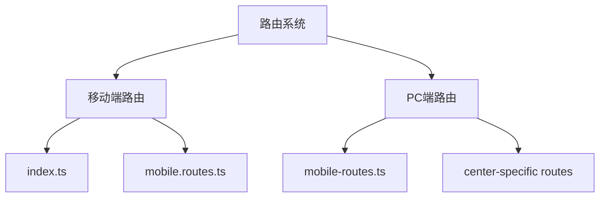
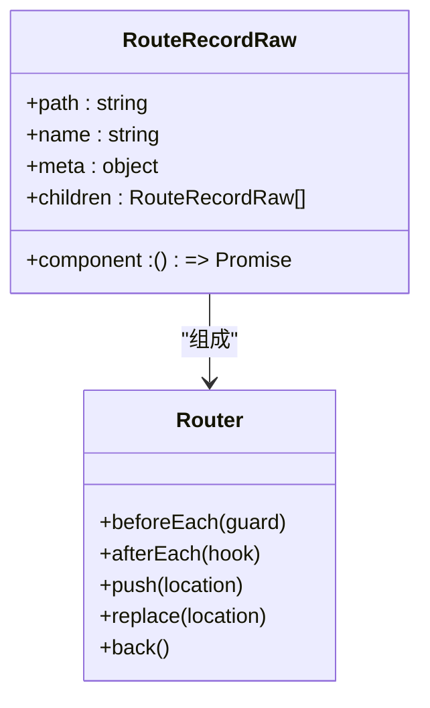
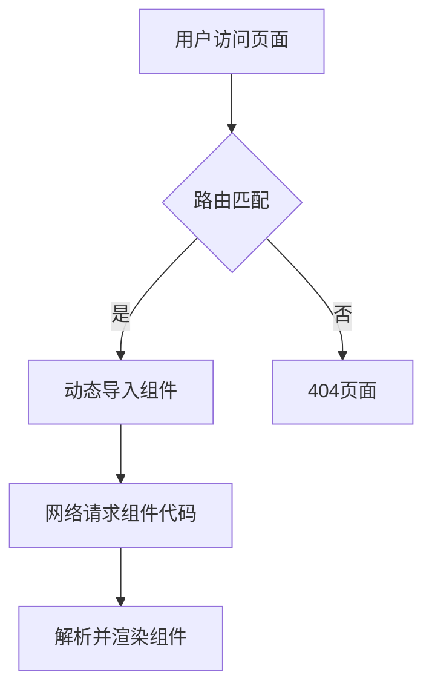
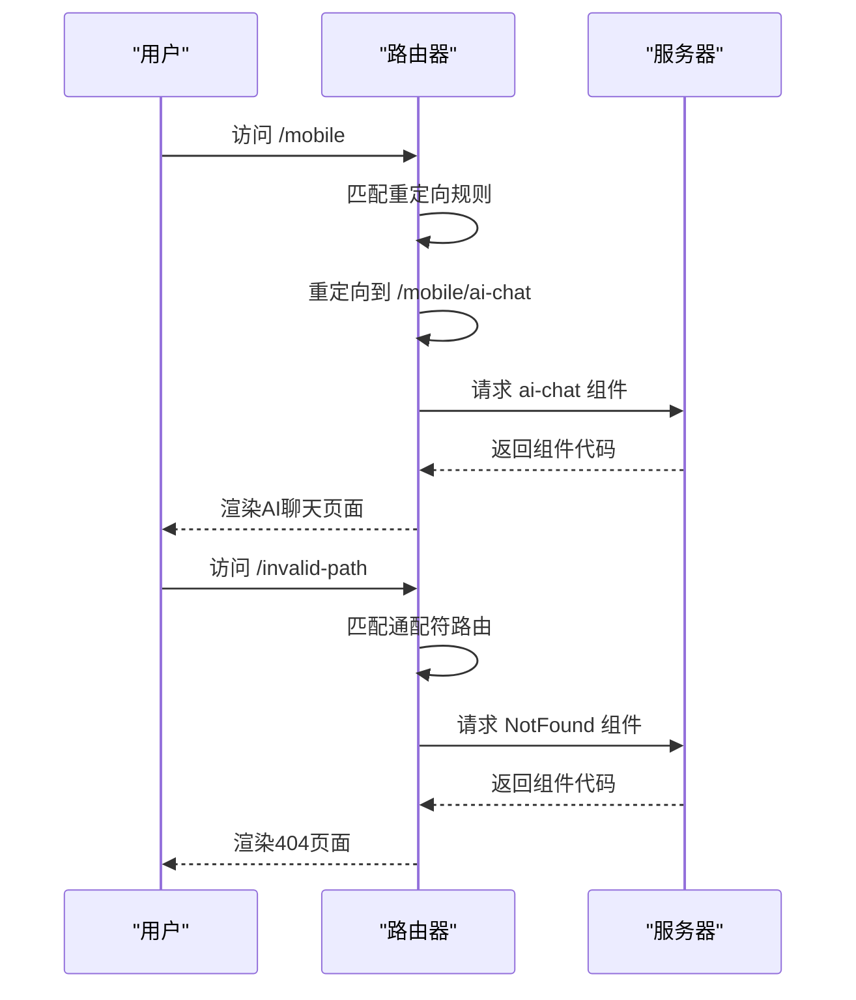
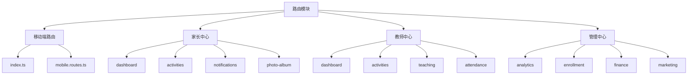
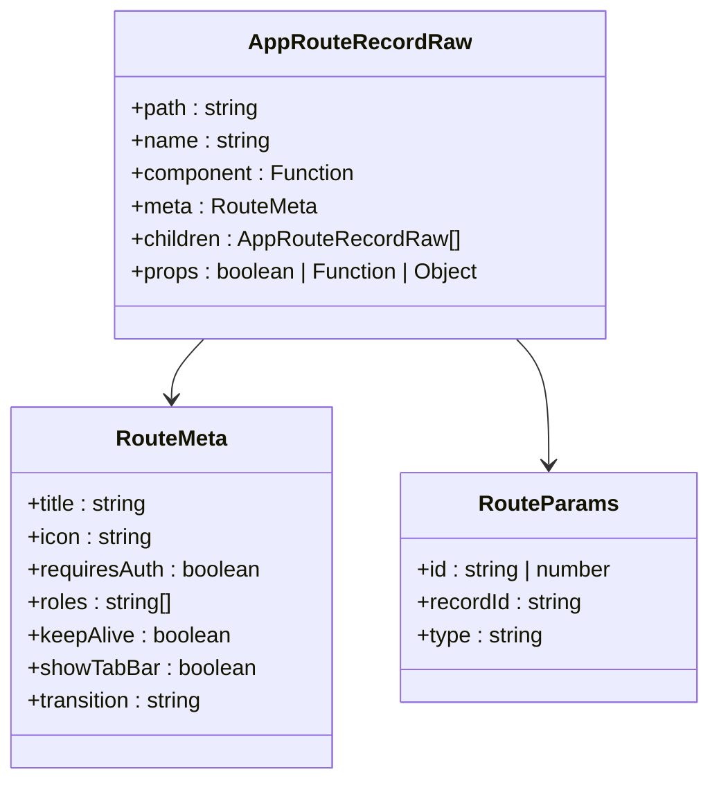
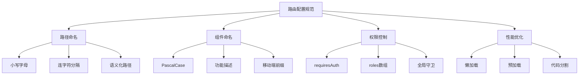

# 路由配置

<cite>
**本文档引用的文件**   
- [index.ts](file://k.yyup.com/client/aimobile/router/index.ts)
- [mobile.routes.ts](file://k.yyup.com/client/aimobile/router/mobile.routes.ts)
- [mobile-routes.ts](file://k.yyup.com/client/src/router/mobile-routes.ts)
- [parent-center-routes.ts](file://k.yyup.com/client/src/router/parent-center-routes.ts)
- [teacher-center-routes.ts](file://k.yyup.com/client/src/router/teacher-center-routes.ts)
- [centers-routes.ts](file://k.yyup.com/client/src/router/mobile/centers-routes.ts)
- [parent-center-routes.ts](file://k.yyup.com/client/src/router/mobile/parent-center-routes.ts)
- [teacher-center-routes.ts](file://k.yyup.com/client/src/router/mobile/teacher-center-routes.ts)
- [router.ts](file://k.yyup.com/client/src/types/router.ts)
</cite>

## 目录
1. [项目结构概述](#项目结构概述)
2. [Vue Router核心实现](#vue-router核心实现)
3. [路由懒加载机制](#路由懒加载机制)
4. [路由别名、重定向与通配符](#路由别名重定向与通配符)
5. [路由模块化组织策略](#路由模块化组织策略)
6. [路由参数与类型安全](#路由参数与类型安全)
7. [路由配置最佳实践](#路由配置最佳实践)

## 项目结构概述

本项目采用模块化路由设计，主要包含移动端和PC端两套独立的路由系统。移动端路由配置位于`client/aimobile/router/`目录下，PC端路由配置位于`client/src/router/`目录下。系统通过Vue Router实现SPA（单页应用）导航，支持嵌套路由、懒加载、权限控制等高级特性。

**图源**
- [index.ts](file://k.yyup.com/client/aimobile/router/index.ts)
- [mobile.routes.ts](file://k.yyup.com/client/aimobile/router/mobile.routes.ts)
- [mobile-routes.ts](file://k.yyup.com/client/src/router/mobile-routes.ts)

## Vue Router核心实现

项目使用Vue Router 4.x版本实现路由功能，通过`createRouter`和`createWebHistory`创建路由实例。路由配置采用声明式语法，每个路由对象包含路径、名称、组件和元数据等属性。

在移动端，路由系统专门针对移动设备特性进行了优化，支持页面转场动画、手势导航和深度链接。路由实例配置了基础路径`/aimobile/`，并通过`scrollBehavior`控制滚动行为。

**图源**
- [index.ts](file://k.yyup.com/client/aimobile/router/index.ts#L7-L178)
- [mobile.routes.ts](file://k.yyup.com/client/aimobile/router/mobile.routes.ts#L8-L122)

**本节源码**
- [index.ts](file://k.yyup.com/client/aimobile/router/index.ts#L7-L178)
- [mobile.routes.ts](file://k.yyup.com/client/aimobile/router/mobile.routes.ts#L8-L122)

## 路由懒加载机制

项目广泛采用路由懒加载技术，通过动态`import()`函数实现代码分割，优化首屏加载性能。每个路由组件都使用箭头函数包装`import()`调用，确保组件只在需要时才加载。

这种机制将应用代码分割成多个bundle，按需加载，显著减少初始加载时间。例如，移动端的`MobileHome`组件配置为`() => import('../pages/MobileHome.vue')`，只有当用户访问根路径时才会加载该组件。

**图源**
- [index.ts](file://k.yyup.com/client/aimobile/router/index.ts#L12-L21)
- [mobile.routes.ts](file://k.yyup.com/client/aimobile/router/mobile.routes.ts#L11-L24)

**本节源码**
- [index.ts](file://k.yyup.com/client/aimobile/router/index.ts#L12-L21)
- [mobile.routes.ts](file://k.yyup.com/client/aimobile/router/mobile.routes.ts#L11-L24)

## 路由别名、重定向与通配符

项目充分利用Vue Router的高级路由功能，包括别名、重定向和通配符路由。`redirect`属性用于设置重定向规则，如移动端主应用路由重定向到AI聊天页面。

通配符路由`/:pathMatch(.*)*`用于处理404页面，捕获所有未匹配的路径。这种配置确保用户访问不存在的页面时能获得友好的错误提示，而不是空白页面。

**图源**
- [mobile.routes.ts](file://k.yyup.com/client/aimobile/router/mobile.routes.ts#L48-L49)
- [index.ts](file://k.yyup.com/client/aimobile/router/index.ts#L162-L171)

**本节源码**
- [mobile.routes.ts](file://k.yyup.com/client/aimobile/router/mobile.routes.ts#L48-L49)
- [index.ts](file://k.yyup.com/client/aimobile/router/index.ts#L162-L171)

## 路由模块化组织策略

项目采用模块化路由组织策略，将路由按功能拆分为多个独立文件。移动端有专门的`mobile.routes.ts`文件，各中心模块也有独立的路由文件，如`parent-center-routes.ts`和`teacher-center-routes.ts`。

这种策略支持路由分组管理，每个中心模块的路由配置包含嵌套路由结构，最多支持三层嵌套。例如，家长中心路由包含子路由如活动、通知、相册等，形成清晰的层级结构。

**图源**
- [mobile-routes.ts](file://k.yyup.com/client/src/router/mobile-routes.ts)
- [parent-center-routes.ts](file://k.yyup.com/client/src/router/parent-center-routes.ts)
- [teacher-center-routes.ts](file://k.yyup.com/client/src/router/teacher-center-routes.ts)

**本节源码**
- [mobile-routes.ts](file://k.yyup.com/client/src/router/mobile-routes.ts)
- [parent-center-routes.ts](file://k.yyup.com/client/src/router/parent-center-routes.ts)
- [teacher-center-routes.ts](file://k.yyup.com/client/src/router/teacher-center-routes.ts)

## 路由参数与类型安全

项目通过TypeScript确保路由配置的类型安全。定义了`AppRouteRecordRaw`接口扩展Vue Router的`RouteRecordRaw`类型，添加了自定义元数据字段的类型定义。

路由参数通过`props: true`配置自动传递给组件，组件可以直接访问`$route.params`获取参数值。对于动态路由如`/chat/:expertId`，参数`expertId`会作为props传递给组件。

**图源**
- [router.ts](file://k.yyup.com/client/src/types/router.ts)
- [index.ts](file://k.yyup.com/client/aimobile/router/index.ts#L59-L63)

**本节源码**
- [router.ts](file://k.yyup.com/client/src/types/router.ts)
- [index.ts](file://k.yyup.com/client/aimobile/router/index.ts#L59-L63)

## 路由配置最佳实践

项目遵循一系列路由配置最佳实践，确保代码质量和用户体验。路径命名采用小写字母和连字符分隔的规范，如`/mobile/ai-chat`。组件命名采用PascalCase，如`MobileAIChat`。

路由权限通过`meta.requiresAuth`和`meta.roles`字段控制，结合全局前置守卫实现认证检查。页面标题通过`meta.title`配置，并在路由守卫中动态设置`document.title`。

性能优化方面，除了路由懒加载，还实现了路由预加载功能，通过`preloadRoute`工具函数预加载关键路由组件，提升用户体验。

**图源**
- [index.ts](file://k.yyup.com/client/aimobile/router/index.ts)
- [mobile.routes.ts](file://k.yyup.com/client/aimobile/router/mobile.routes.ts)

**本节源码**
- [index.ts](file://k.yyup.com/client/aimobile/router/index.ts)
- [mobile.routes.ts](file://k.yyup.com/client/aimobile/router/mobile.routes.ts)