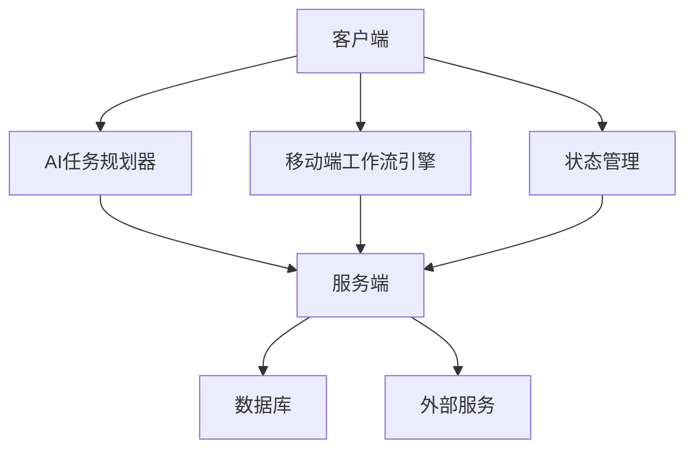
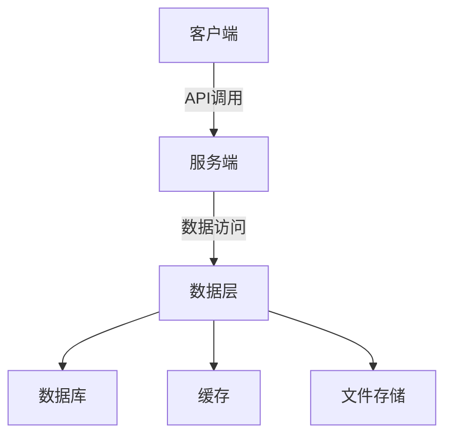
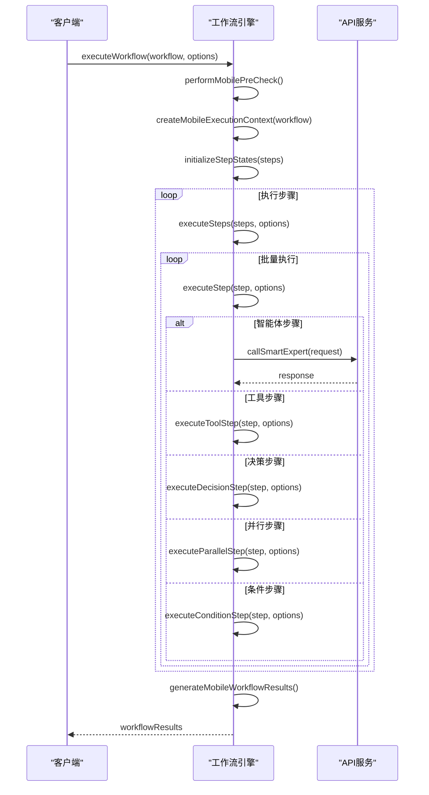
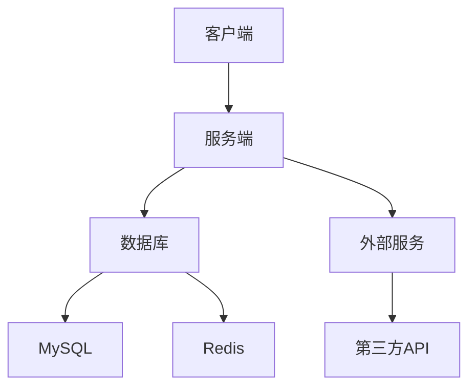

# AI任务规划API

<cite>
**本文档引用的文件**  
- [ai-task-planner.service.ts](file://k.yyup.com/client/aimobile/services/ai-task-planner.service.ts)
- [mobile-workflow-engine.service.ts](file://k.yyup.com/client/aimobile/services/mobile-workflow-engine.service.ts)
- [mobile-workflow.ts](file://k.yyup.com/client/aimobile/stores/mobile-workflow.ts)
- [mobile-workflow.config.ts](file://k.yyup.com/client/aimobile/config/mobile-workflow.config.ts)
- [mobile-workflow.ts](file://k.yyup.com/client/aimobile/types/mobile-workflow.ts)
- [mobile-api.service.ts](file://k.yyup.com/client/aimobile/services/mobile-api.service.ts)
</cite>

## 目录
1. [简介](#简介)
2. [项目结构](#项目结构)
3. [核心组件](#核心组件)
4. [架构概述](#架构概述)
5. [详细组件分析](#详细组件分析)
6. [依赖分析](#依赖分析)
7. [性能考虑](#性能考虑)
8. [故障排除指南](#故障排除指南)
9. [结论](#结论)

## 简介
AI任务规划API是一个智能工作流编排引擎，能够理解复杂任务、自动分解、动态规划和智能执行。该系统专为移动端设计，支持离线模式、性能优化和电池管理等特性。它通过将用户请求分解为原子操作来实现多步骤任务的执行，包括任务调度、状态跟踪和结果聚合。

## 项目结构
项目结构主要由客户端和服务端组成，其中客户端包含AI任务规划器、移动端工作流引擎和状态管理模块。服务端负责处理API请求和权限控制。整体架构采用微服务设计，确保高可用性和可扩展性。



**图表来源**  
- [ai-task-planner.service.ts](file://k.yyup.com/client/aimobile/services/ai-task-planner.service.ts)
- [mobile-workflow-engine.service.ts](file://k.yyup.com/client/aimobile/services/mobile-workflow-engine.service.ts)

**章节来源**
- [ai-task-planner.service.ts](file://k.yyup.com/client/aimobile/services/ai-task-planner.service.ts)
- [mobile-workflow-engine.service.ts](file://k.yyup.com/client/aimobile/services/mobile-workflow-engine.service.ts)

## 核心组件
核心组件包括AI任务规划器、移动端工作流引擎和状态管理模块。这些组件协同工作，实现任务的智能分解和执行。AI任务规划器负责生成执行计划，移动端工作流引擎负责执行计划，状态管理模块负责跟踪任务状态。

**章节来源**
- [ai-task-planner.service.ts](file://k.yyup.com/client/aimobile/services/ai-task-planner.service.ts)
- [mobile-workflow-engine.service.ts](file://k.yyup.com/client/aimobile/services/mobile-workflow-engine.service.ts)
- [mobile-workflow.ts](file://k.yyup.com/client/aimobile/stores/mobile-workflow.ts)

## 架构概述
系统架构采用分层设计，包括客户端、服务端和数据层。客户端负责用户交互和任务提交，服务端负责任务调度和执行，数据层负责数据存储和检索。各层之间通过API进行通信，确保松耦合和高内聚。



**图表来源**  
- [mobile-api.service.ts](file://k.yyup.com/client/aimobile/services/mobile-api.service.ts)

## 详细组件分析
### AI任务规划器分析
AI任务规划器是系统的核心组件，负责生成和执行任务计划。它通过分析用户请求，生成执行步骤，并优化执行顺序。任务计划包括任务描述、任务类型、执行步骤和上下文信息。

#### 类图
```mermaid
classDiagram
class AITaskPlannerService {
+activePlans : Map<string, ExecutionPlan>
+executionHistory : ExecutionResult[]
+generatePlan(taskDescription : string, userRequirements : Record<string, any>) : Promise<ExecutionPlan>
+executePlan(planId : string, onProgress? : (step : TaskStep, progress : number) => void) : Promise<ExecutionResult>
+classifyTask(taskDescription : string) : Promise<TaskType>
+analyzeRequirements(taskDescription : string, userRequirements : Record<string, any>) : Promise<Record<string, any>>
+generateSteps(taskType : TaskType, requirements : Record<string, any>) : Promise<TaskStep[]>
+canExecuteStep(step : TaskStep, plan : ExecutionPlan) : boolean
+executeStep(step : TaskStep, plan : ExecutionPlan) : Promise<void>
}
class ExecutionPlan {
+id : string
+taskDescription : string
+taskType : TaskType
+steps : TaskStep[]
+context : TaskContext
+metadata : {
estimatedDuration : number
complexity : 'low' | 'medium' | 'high'
requiredTools : ToolType[]
requiredExperts : (AgentType | ExpertConsultationType)[]
createdAt : string
}
}
class TaskStep {
+id : string
+name : string
+description : string
+type : 'expert' | 'tool' | 'analysis' | 'integration'
+dependencies : string[]
+inputs : Record<string, any>
+outputs : Record<string, any>
+status : 'pending' | 'running' | 'completed' | 'failed'
+result? : any
+error? : string
+executionTime? : number
+retryCount? : number
}
class TaskContext {
+originalRequest : string
+userRequirements : Record<string, any>
+intermediateResults : Record<string, any>
+sharedData : Record<string, any>
+constraints : Record<string, any>
}
AITaskPlannerService --> ExecutionPlan : "生成"
AITaskPlannerService --> TaskStep : "执行"
AITaskPlannerService --> TaskContext : "使用"
```

**图表来源**  
- [ai-task-planner.service.ts](file://k.yyup.com/client/aimobile/services/ai-task-planner.service.ts)

### 移动端工作流引擎分析
移动端工作流引擎是专为移动端设计的工作流执行引擎，支持离线模式、性能优化和电池管理等特性。它通过执行工作流定义来实现任务的自动化执行。

#### 序列图


**图表来源**  
- [mobile-workflow-engine.service.ts](file://k.yyup.com/client/aimobile/services/mobile-workflow-engine.service.ts)
- [mobile-api.service.ts](file://k.yyup.com/client/aimobile/services/mobile-api.service.ts)

**章节来源**
- [mobile-workflow-engine.service.ts](file://k.yyup.com/client/aimobile/services/mobile-workflow-engine.service.ts)
- [mobile-api.service.ts](file://k.yyup.com/client/aimobile/services/mobile-api.service.ts)

## 依赖分析
系统依赖主要包括客户端和服务端之间的API调用，以及服务端对数据库和外部服务的依赖。客户端通过API调用服务端，服务端通过数据访问层与数据库和外部服务进行交互。



**图表来源**  
- [mobile-api.service.ts](file://k.yyup.com/client/aimobile/services/mobile-api.service.ts)

**章节来源**
- [mobile-api.service.ts](file://k.yyup.com/client/aimobile/services/mobile-api.service.ts)

## 性能考虑
系统在设计时充分考虑了性能因素，包括任务调度的效率、状态跟踪的实时性和结果聚合的速度。通过优化执行顺序和并发执行，提高了任务执行的效率。同时，系统还支持离线模式和电池管理，确保在移动端的高性能运行。

## 故障排除指南
当遇到问题时，可以参考以下步骤进行排查：
1. 检查网络连接是否正常。
2. 检查API服务是否可用。
3. 检查数据库连接是否正常。
4. 查看日志文件，定位具体错误信息。
5. 根据错误信息，采取相应的解决措施。

**章节来源**
- [ai-task-planner.service.ts](file://k.yyup.com/client/aimobile/services/ai-task-planner.service.ts)
- [mobile-workflow-engine.service.ts](file://k.yyup.com/client/aimobile/services/mobile-workflow-engine.service.ts)

## 结论
AI任务规划API通过智能工作流编排引擎实现了多步骤任务的自动分解和执行。系统设计充分考虑了移动端的特性和需求，支持离线模式、性能优化和电池管理。通过详细的架构设计和组件分析，确保了系统的高可用性和可扩展性。未来可以进一步优化任务调度算法，提高任务执行的效率和准确性。