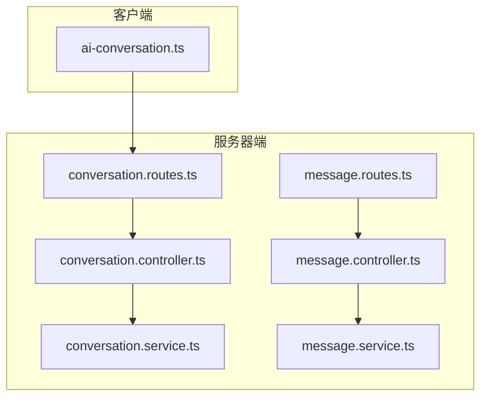
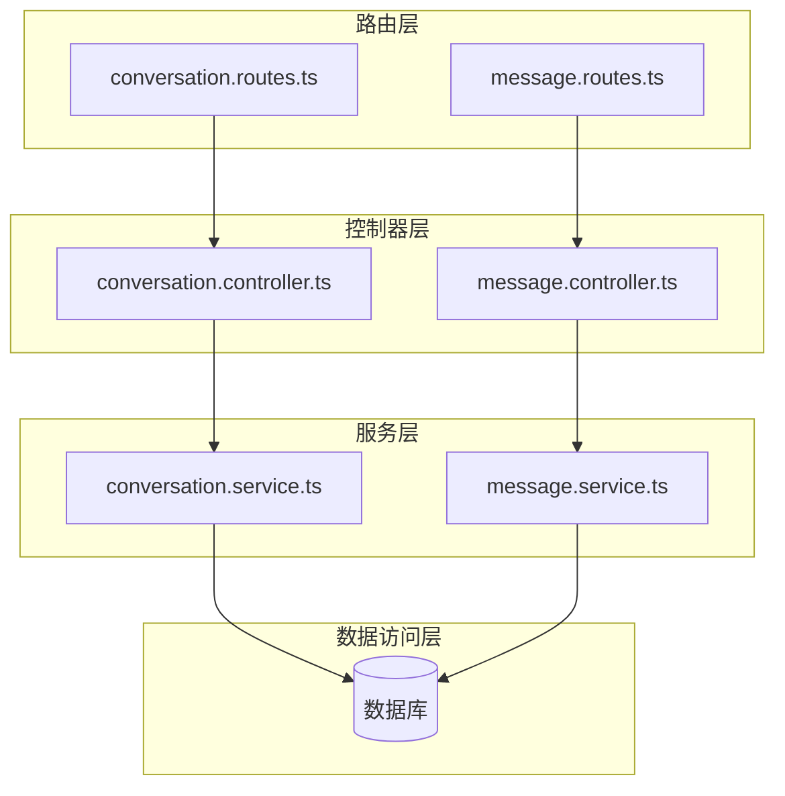
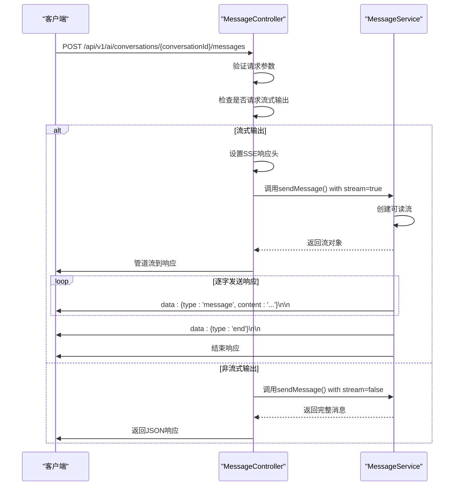
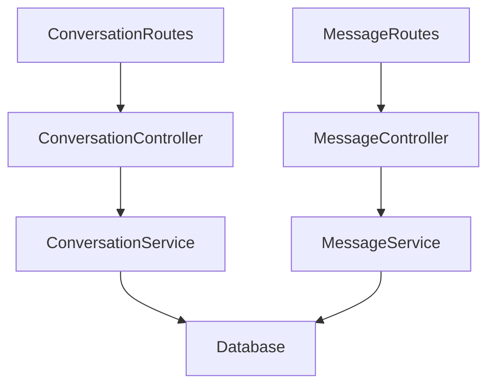

# AI对话API

<cite>
**本文档引用的文件**   
- [conversation.controller.ts](file://server/src/controllers/ai/conversation.controller.ts)
- [conversation.service.ts](file://server/src/services/ai/conversation.service.ts)
- [conversation.routes.ts](file://server/src/routes/ai/conversation.routes.ts)
- [ai-conversation.ts](file://client/src/api/modules/ai-conversation.ts)
- [message.controller.ts](file://server/src/controllers/ai/message.controller.ts)
- [message.service.ts](file://server/src/services/ai/message.service.ts)
- [message.routes.ts](file://server/src/routes/ai/message.routes.ts)
</cite>

## 目录
1. [引言](#引言)
2. [项目结构](#项目结构)
3. [核心组件](#核心组件)
4. [架构概述](#架构概述)
5. [详细组件分析](#详细组件分析)
6. [依赖分析](#依赖分析)
7. [性能考虑](#性能考虑)
8. [故障排除指南](#故障排除指南)
9. [结论](#结论)

## 引言
本文档详细描述了AI对话API的实现机制，重点介绍实时对话交互的实现方式。文档涵盖了SSE（Server-Sent Events）流式响应协议设计、连接保持和错误重连策略，以及对话上下文管理机制。同时，文档还解释了前端如何处理流式数据并实时渲染AI响应，提供了完整的请求/响应示例，并说明了对话安全过滤机制和性能指标。

## 项目结构
AI对话API的项目结构清晰地分为客户端和服务器端两个主要部分。服务器端实现了RESTful API和SSE流式响应，而客户端提供了相应的API调用接口。



**图表来源**
- [conversation.routes.ts](file://server/src/routes/ai/conversation.routes.ts#L1-L368)
- [conversation.controller.ts](file://server/src/controllers/ai/conversation.controller.ts#L1-L306)
- [conversation.service.ts](file://server/src/services/ai/conversation.service.ts#L1-L199)
- [message.routes.ts](file://server/src/routes/ai/message.routes.ts#L1-L796)
- [message.controller.ts](file://server/src/controllers/ai/message.controller.ts#L1-L305)
- [message.service.ts](file://server/src/services/ai/message.service.ts#L1-L143)
- [ai-conversation.ts](file://client/src/api/modules/ai-conversation.ts#L1-L241)

**章节来源**
- [conversation.routes.ts](file://server/src/routes/ai/conversation.routes.ts#L1-L368)
- [conversation.controller.ts](file://server/src/controllers/ai/conversation.controller.ts#L1-L306)
- [conversation.service.ts](file://server/src/services/ai/conversation.service.ts#L1-L199)

## 核心组件
AI对话API的核心组件包括会话管理、消息处理和流式响应三大模块。会话管理负责创建、获取、更新和删除会话；消息处理负责在会话中创建、获取和删除消息；流式响应则通过SSE协议实现实时的AI响应输出。

**章节来源**
- [conversation.controller.ts](file://server/src/controllers/ai/conversation.controller.ts#L1-L306)
- [conversation.service.ts](file://server/src/services/ai/conversation.service.ts#L1-L199)
- [message.controller.ts](file://server/src/controllers/ai/message.controller.ts#L1-L305)
- [message.service.ts](file://server/src/services/ai/message.service.ts#L1-L143)

## 架构概述
AI对话API采用分层架构设计，包括路由层、控制器层、服务层和数据访问层。这种设计模式使得代码结构清晰，职责分明，便于维护和扩展。



**图表来源**
- [conversation.routes.ts](file://server/src/routes/ai/conversation.routes.ts#L1-L368)
- [conversation.controller.ts](file://server/src/controllers/ai/conversation.controller.ts#L1-L306)
- [conversation.service.ts](file://server/src/services/ai/conversation.service.ts#L1-L199)
- [message.routes.ts](file://server/src/routes/ai/message.routes.ts#L1-L796)
- [message.controller.ts](file://server/src/controllers/ai/message.controller.ts#L1-L305)
- [message.service.ts](file://server/src/services/ai/message.service.ts#L1-L143)

## 详细组件分析

### 会话管理分析
会话管理组件负责处理会话的生命周期，包括创建、获取、更新和删除会话。该组件通过RESTful API提供标准的CRUD操作。

#### 会话管理类图
```mermaid
classDiagram
class ConversationController {
+listConversations(req, res, next) void
+getConversationById(req, res, next) void
+createConversation(req, res, next) void
+updateConversation(req, res, next) void
+deleteConversation(req, res, next) void
}
class ConversationService {
+createConversation(userIdOrData, title) Promise~any~
+getConversations(userId) Promise~any[]~
+getUserConversations(userId, options) Promise~{conversations : any[], total : number}~
+getConversation(conversationId) Promise~any~
+updateConversation(conversationId, data) Promise~any~
+deleteConversation(conversationId) Promise~boolean~
+addMessage(data) Promise~any~
+getMessages(conversationId) Promise~any[]~
+getRecentConversations(userId, limit) Promise~any[]~
+updateConversationTitle(conversationId, title) Promise~any~
+updateConversationSummary(conversationId, summary) Promise~any~
+archiveConversation(conversationId) Promise~any~
+unarchiveConversation(conversationId) Promise~any~
}
ConversationController --> ConversationService : "使用"
```

**图表来源**
- [conversation.controller.ts](file://server/src/controllers/ai/conversation.controller.ts#L1-L306)
- [conversation.service.ts](file://server/src/services/ai/conversation.service.ts#L1-L199)

**章节来源**
- [conversation.controller.ts](file://server/src/controllers/ai/conversation.controller.ts#L1-L306)
- [conversation.service.ts](file://server/src/services/ai/conversation.service.ts#L1-L199)

### 消息处理分析
消息处理组件负责在会话中创建、获取和删除消息。该组件支持多种消息类型，包括文本、图片、音频、视频和文件。

#### 消息处理类图
```mermaid
classDiagram
class MessageController {
+listMessages(req, res, next) void
+createMessage(req, res, next) void
+deleteMessage(req, res, next) void
}
class MessageService {
+saveMessage(message) Promise~any~
+getMessages(userId) Promise~Message[]~
+sendMessage(dataOrConversationId, contentOrStream, role) Promise~Message | any~
+getConversationMessages(conversationId, userId, options) Promise~{messages : Message[], total : number}~
+getMessage(messageId) Promise~Message | null~
+deleteMessage(messageId) Promise~boolean~
+createMessage(data) Promise~Message~
+updateMessageStatus(messageId, status) Promise~boolean~
+updateMessageMetadata(messageId, metadata) Promise~boolean~
}
MessageController --> MessageService : "使用"
```

**图表来源**
- [message.controller.ts](file://server/src/controllers/ai/message.controller.ts#L1-L305)
- [message.service.ts](file://server/src/services/ai/message.service.ts#L1-L143)

**章节来源**
- [message.controller.ts](file://server/src/controllers/ai/message.controller.ts#L1-L305)
- [message.service.ts](file://server/src/services/ai/message.service.ts#L1-L143)

### 流式响应分析
流式响应组件通过SSE（Server-Sent Events）协议实现实时的AI响应输出。当客户端请求流式输出时，服务器会设置相应的响应头，并通过流式响应将AI的响应逐字发送给客户端。

#### 流式响应序列图


**图表来源**
- [message.controller.ts](file://server/src/controllers/ai/message.controller.ts#L168-L253)
- [message.service.ts](file://server/src/services/ai/message.service.ts#L39-L84)

**章节来源**
- [message.controller.ts](file://server/src/controllers/ai/message.controller.ts#L168-L253)
- [message.service.ts](file://server/src/services/ai/message.service.ts#L39-L84)

### 前端处理分析
前端通过API模块处理流式数据并实时渲染AI响应。客户端API提供了创建会话、发送消息、获取消息列表等方法。

#### 前端处理类图
```mermaid
classDiagram
class AIConversationService {
+getConversations(params) Promise~ApiResponse~Conversation[]~~
+createConversation(data) Promise~ApiResponse~Conversation~~
+updateConversationTitle(conversationId, data) Promise~ApiResponse~Conversation~~
+deleteConversation(conversationId) Promise~ApiResponse~null~~
+getConversationMessages(conversationId, params) Promise~ApiResponse~{conversation : Conversation, messages : Message[]}~~
+addMessage(conversationId, data) Promise~ApiResponse~Message~~
+getConversation(conversationId) Promise~ApiResponse~Conversation~~
+archiveConversation(conversationId) Promise~ApiResponse~null~~
+unarchiveConversation(conversationId) Promise~ApiResponse~Conversation~~
+clearConversationMessages(conversationId) Promise~ApiResponse~null~~
+bulkDeleteConversations(conversationIds) Promise~ApiResponse~null~~
+getConversationStats(conversationId) Promise~ApiResponse~{messageCount : number, tokenCount : number, lastActivityTime : string, averageResponseTime : number}~~
+searchConversations(query, params) Promise~ApiResponse~Conversation[]~~
+exportConversation(conversationId, format) Promise~Blob~
+importConversation(file) Promise~ApiResponse~Conversation~~
+duplicateConversation(conversationId, newTitle) Promise~ApiResponse~Conversation~~
+mergeConversations(sourceConversationIds, targetConversationId, newTitle) Promise~ApiResponse~Conversation~~
}
class ApiResponse {
+success : boolean
+data? : T
+message? : string
+error? : string
+meta? : {page : number, pageSize : number, totalItems : number, totalPages : number}
}
class Conversation {
+id : string
+userId : number
+title : string | null
+summary : string | null
+lastMessageAt : string
+messageCount : number
+isArchived : boolean
+lastPagePath? : string | null
+pageContext? : string | null
+lastPageUpdateAt? : string | null
+usedMemoryIds? : number[] | null
+metadata? : Record~string, any~ | null
+createdAt : string
+updatedAt : string
+messages? : Message[]
}
class Message {
+id : number
+conversationId : string
+userId : number
+role : 'user' | 'assistant' | 'system' | 'tool'
+content : string
+messageType : 'text' | 'image' | 'audio' | 'video' | 'file'
+mediaUrl? : string | null
+metadata? : any | null
+tokens : number
+status : 'sending' | 'delivered' | 'failed'
+isDeleted : boolean
+createdAt : string
+updatedAt : string
}
AIConversationService --> ApiResponse : "使用"
AIConversationService --> Conversation : "使用"
AIConversationService --> Message : "使用"
```

**图表来源**
- [ai-conversation.ts](file://client/src/api/modules/ai-conversation.ts#L1-L241)

**章节来源**
- [ai-conversation.ts](file://client/src/api/modules/ai-conversation.ts#L1-L241)

## 依赖分析
AI对话API的组件之间存在明确的依赖关系。路由层依赖于控制器层，控制器层依赖于服务层，服务层最终依赖于数据库。



**图表来源**
- [conversation.routes.ts](file://server/src/routes/ai/conversation.routes.ts#L1-L368)
- [conversation.controller.ts](file://server/src/controllers/ai/conversation.controller.ts#L1-L306)
- [conversation.service.ts](file://server/src/services/ai/conversation.service.ts#L1-L199)
- [message.routes.ts](file://server/src/routes/ai/message.routes.ts#L1-L796)
- [message.controller.ts](file://server/src/controllers/ai/message.controller.ts#L1-L305)
- [message.service.ts](file://server/src/services/ai/message.service.ts#L1-L143)

**章节来源**
- [conversation.routes.ts](file://server/src/routes/ai/conversation.routes.ts#L1-L368)
- [conversation.controller.ts](file://server/src/controllers/ai/conversation.controller.ts#L1-L306)
- [conversation.service.ts](file://server/src/services/ai/conversation.service.ts#L1-L199)
- [message.routes.ts](file://server/src/routes/ai/message.routes.ts#L1-L796)
- [message.controller.ts](file://server/src/controllers/ai/message.controller.ts#L1-L305)
- [message.service.ts](file://server/src/services/ai/message.service.ts#L1-L143)

## 性能考虑
AI对话API在设计时考虑了多项性能优化措施。SSE流式响应减少了客户端等待时间，提高了用户体验。会话和消息的分页查询避免了大数据量的传输，提高了响应速度。此外，API还支持按消息类型、状态和角色进行过滤，进一步优化了查询性能。

## 故障排除指南
在使用AI对话API时，可能会遇到一些常见问题。以下是一些故障排除建议：

1. **SSE连接失败**：检查客户端是否正确设置了SSE请求头，服务器是否正确设置了SSE响应头。
2. **消息发送失败**：检查请求参数是否完整，特别是conversationId和content字段。
3. **会话无法创建**：检查用户是否已登录，是否有创建会话的权限。
4. **流式响应中断**：检查网络连接是否稳定，服务器是否有足够的资源处理流式请求。

**章节来源**
- [message.controller.ts](file://server/src/controllers/ai/message.controller.ts#L168-L253)
- [conversation.controller.ts](file://server/src/controllers/ai/conversation.controller.ts#L1-L306)

## 结论
AI对话API通过RESTful API和SSE流式响应提供了完整的会话管理和消息处理功能。API设计合理，结构清晰，易于使用和维护。通过SSE协议，API能够实现实时的AI响应输出，大大提升了用户体验。未来可以进一步优化性能，增加更多的消息类型和过滤选项，以满足更多应用场景的需求。