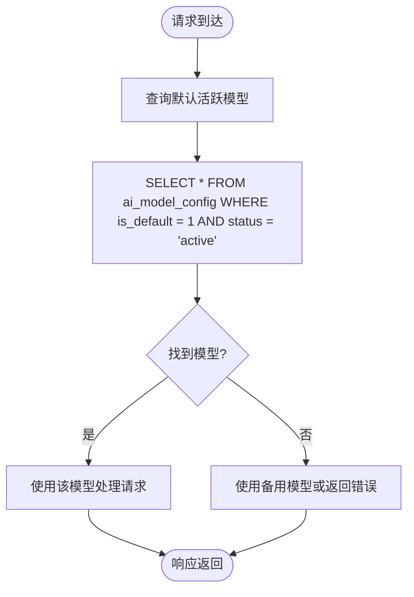
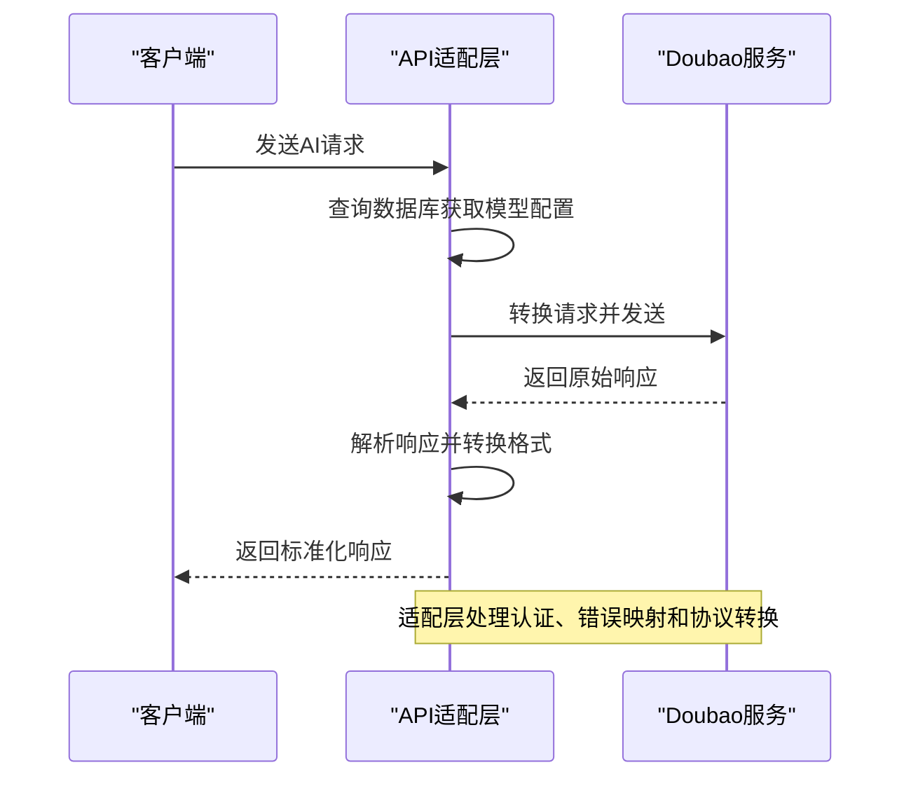
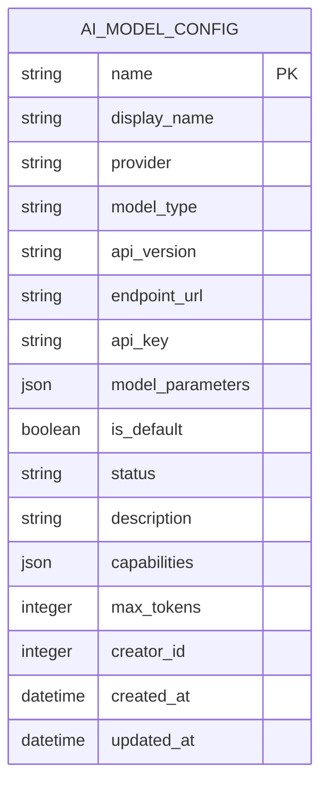

# AI模型集成API

<cite>
**本文档引用的文件**  
- [add-doubao-model.js](file://k.yyup.com/add-doubao-model.js)
- [setup-doubao-model.js](file://k.yyup.com/setup-doubao-model.js)
- [update-doubao-endpoint.js](file://k.yyup.com/update-doubao-endpoint.js)
- [set-default-doubao-standard.js](file://k.yyup.com/set-default-doubao-standard.js)
</cite>

## 目录
1. [简介](#简介)
2. [多模型支持与第三方集成](#多模型支持与第三方集成)
3. [模型路由策略](#模型路由策略)
4. [API适配层设计](#api适配层设计)
5. [模型配置管理](#模型配置管理)
6. [安全最佳实践](#安全最佳实践)
7. [性能监控与告警](#性能监控与告警)

## 简介
本文档详细描述了AI模型集成API的实现机制，重点涵盖多模型支持、第三方AI服务（如Doubao）集成、模型路由策略、API适配层设计、配置管理及安全实践。系统通过数据库配置管理多个AI模型，支持动态更新模型参数、API端点和认证密钥，并实现了灵活的模型选择与默认模型设置机制。

## 多模型支持与第三方集成
系统通过数据库表`ai_model_config`集中管理所有AI模型的配置信息，支持多种模型共存和第三方服务集成。每个模型配置包含名称、显示名称、提供商、API端点、认证密钥、模型参数和功能能力等属性。系统特别集成了字节跳动的Doubao AI服务，通过脚本化方式实现模型的添加、更新和配置管理。

**节来源**
- [add-doubao-model.js](file://k.yyup.com/add-doubao-model.js#L1-L182)
- [setup-doubao-model.js](file://k.yyup.com/setup-doubao-model.js#L1-L171)

## 模型路由策略
系统通过数据库字段`is_default`标识默认使用的AI模型，实现简单的路由策略。当需要处理AI请求时，系统查询当前`is_default = 1`且`status = 'active'`的模型作为首选模型。通过`set-default-doubao-standard.js`脚本可动态切换默认模型，先清除所有模型的默认标记，再将指定模型（如`doubao-seed-1.6-250615`）设置为默认。这种基于状态和默认标记的路由机制支持基于任务需求、成本和性能的模型选择。

**图来源**
- [set-default-doubao-standard.js](file://k.yyup.com/set-default-doubao-standard.js#L15-L72)
- [add-doubao-model.js](file://k.yyup.com/add-doubao-model.js#L25-L30)

**节来源**
- [set-default-doubao-standard.js](file://k.yyup.com/set-default-doubao-standard.js#L15-L72)
- [add-doubao-model.js](file://k.yyup.com/add-doubao-model.js#L23-L30)

## API适配层设计
系统通过统一的API适配层与第三方AI服务（如Doubao）进行交互。适配层负责请求转换、响应解析和错误映射。所有模型的API端点、版本和参数通过数据库集中配置，适配层根据当前激活的模型动态构建请求。例如，Doubao模型使用`https://ark.cn-beijing.volces.com/api/v3/chat/completions`作为API端点，适配层将内部请求格式转换为符合Volc Engine API规范的格式，并处理认证、超时和重试逻辑。

**图来源**
- [update-doubao-endpoint.js](file://k.yyup.com/update-doubao-endpoint.js#L24-L30)
- [setup-doubao-model.js](file://k.yyup.com/setup-doubao-model.js#L34-L54)

**节来源**
- [update-doubao-endpoint.js](file://k.yyup.com/update-doubao-endpoint.js#L15-L76)
- [setup-doubao-model.js](file://k.yyup.com/setup-doubao-model.js#L15-L171)

## 模型配置管理
系统通过数据库驱动的配置管理机制实现模型配置的动态更新。关键配置项如API密钥、端点URL和模型参数均存储在`ai_model_config`表中，可通过脚本或管理界面更新。系统支持API密钥轮换，通过更新`api_key`字段实现密钥更新。速率限制和配额监控目前未在代码中直接实现，但可通过在模型配置中添加`rate_limit`和`quota`字段进行扩展。配置更新后，系统通过重启或配置热加载机制应用新设置。

**图来源**
- [add-doubao-model.js](file://k.yyup.com/add-doubao-model.js#L70-L123)
- [setup-doubao-model.js](file://k.yyup.com/setup-doubao-model.js#L69-L122)

**节来源**
- [add-doubao-model.js](file://k.yyup.com/add-doubao-model.js#L1-L182)
- [update-doubao-endpoint.js](file://k.yyup.com/update-doubao-endpoint.js#L1-L76)

## 安全最佳实践
系统在模型配置管理中实施了多项安全实践。API密钥通过数据库字段`api_key`安全存储，建议在生产环境中使用加密存储。系统通过`is_default`和`status`字段实现访问控制，确保只有激活状态的模型可被使用。异常调用检测机制未在当前代码中实现，但可通过日志分析和监控系统扩展。所有数据库操作均使用参数化查询或ORM，防止SQL注入攻击。系统还实现了完整的错误处理和日志记录，便于安全审计和问题排查。

**节来源**
- [add-doubao-model.js](file://k.yyup.com/add-doubao-model.js#L164-L169)
- [setup-doubao-model.js](file://k.yyup.com/setup-doubao-model.js#L153-L158)

## 性能监控与告警
虽然当前代码未直接实现性能监控，但系统设计支持通过日志和外部监控工具进行性能指标收集。关键监控指标包括API响应时间、错误率、调用频率和模型使用率。可通过在请求处理流程中添加计时器和计数器来收集这些指标。告警机制可基于监控数据设置阈值，当响应时间超过预设值或错误率升高时触发告警。未来可扩展模型配置表，添加`performance_score`或`latency_threshold`等字段，实现基于性能的智能路由。

**节来源**
- [add-doubao-model.js](file://k.yyup.com/add-doubao-model.js#L128-L163)
- [setup-doubao-model.js](file://k.yyup.com/setup-doubao-model.js#L127-L152)