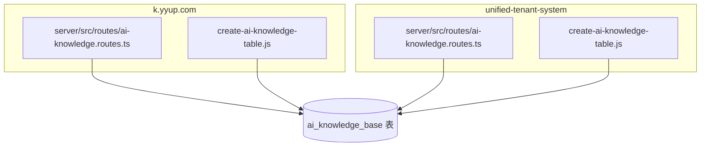
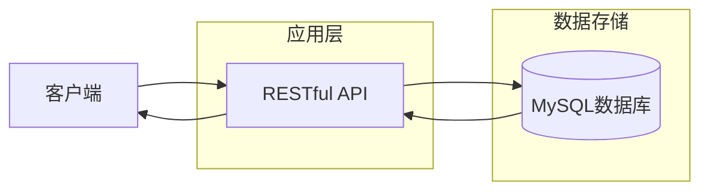
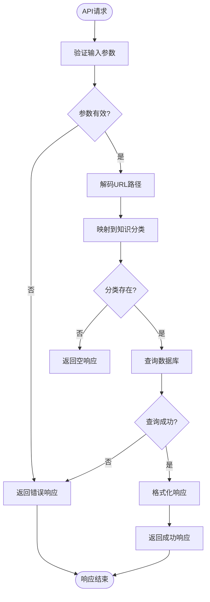
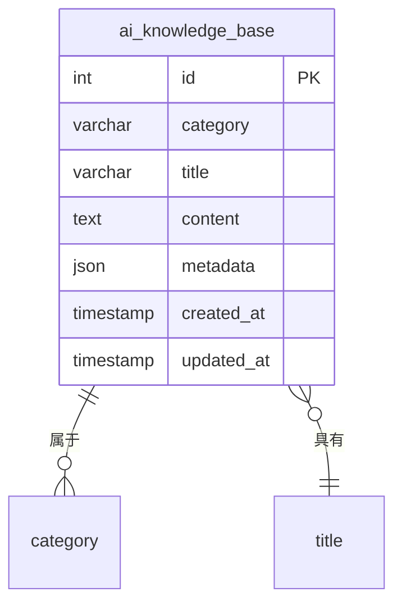
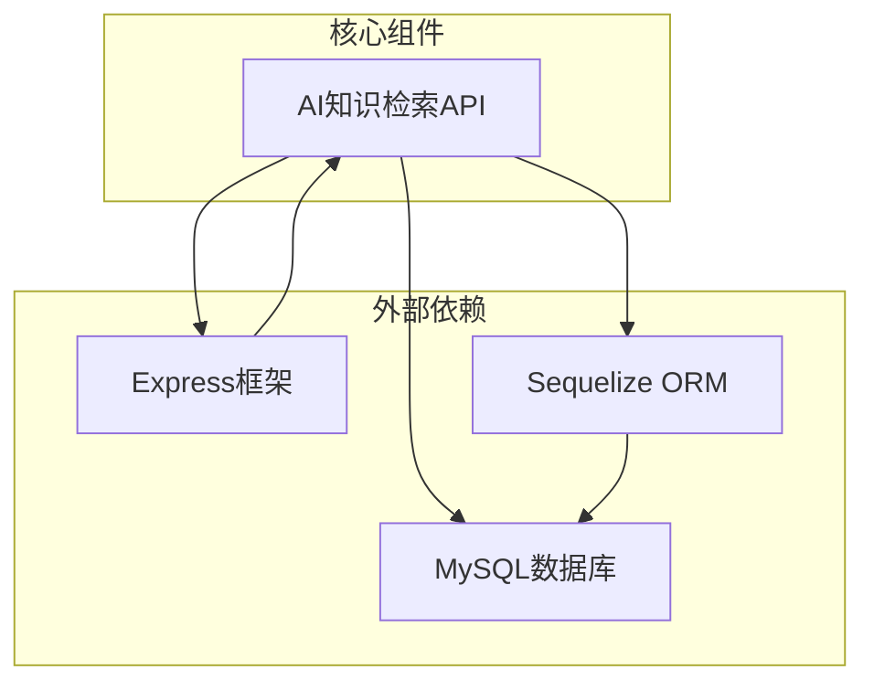

# AI知识检索API

<cite>
**本文档引用的文件**
- [ai-knowledge.routes.ts](file://k.yyup.com/server/src/routes/ai-knowledge.routes.ts)
- [create-ai-knowledge-table.js](file://k.yyup.com/create-ai-knowledge-table.js)
- [ai-knowledge.routes.ts](file://unified-tenant-system/server/src/routes/ai-knowledge.routes.ts)
- [create-ai-knowledge-table.js](file://unified-tenant-system/create-ai-knowledge-table.js)
</cite>

## 目录
1. [简介](#简介)
2. [项目结构](#项目结构)
3. [核心组件](#核心组件)
4. [架构概述](#架构概述)
5. [详细组件分析](#详细组件分析)
6. [依赖分析](#依赖分析)
7. [性能考虑](#性能考虑)
8. [故障排除指南](#故障排除指南)
9. [结论](#结论)

## 简介
本文档详细描述了AI知识检索API的实现机制，重点介绍知识库查询与检索增强生成（RAG）的实现。文档涵盖了知识索引的构建过程、查询理解模块、检索结果排序算法、相关性评分和上下文注入策略。同时提供了性能优化建议和知识库更新流程，确保知识的时效性。

## 项目结构
项目结构包含两个主要部分：k.yyup.com 和 unified-tenant-system。两个系统都实现了AI知识检索功能，具有相似的文件结构和功能模块。

**图示来源**
- [ai-knowledge.routes.ts](file://k.yyup.com/server/src/routes/ai-knowledge.routes.ts)
- [create-ai-knowledge-table.js](file://k.yyup.com/create-ai-knowledge-table.js)
- [ai-knowledge.routes.ts](file://unified-tenant-system/server/src/routes/ai-knowledge.routes.ts)
- [create-ai-knowledge-table.js](file://unified-tenant-system/create-ai-knowledge-table.js)

**本节来源**
- [ai-knowledge.routes.ts](file://k.yyup.com/server/src/routes/ai-knowledge.routes.ts)
- [create-ai-knowledge-table.js](file://k.yyup.com/create-ai-knowledge-table.js)

## 核心组件
AI知识检索API的核心组件包括知识库路由处理、知识库表结构定义和知识库文档查询功能。系统通过REST API提供知识检索服务，支持按页面路径、分类等多种方式查询知识文档。

**本节来源**
- [ai-knowledge.routes.ts](file://k.yyup.com/server/src/routes/ai-knowledge.routes.ts)
- [create-ai-knowledge-table.js](file://k.yyup.com/create-ai-knowledge-table.js)

## 架构概述
AI知识检索系统的架构基于客户端-服务器模式，通过RESTful API提供服务。知识库数据存储在MySQL数据库中，通过Sequelize ORM进行访问。系统支持多租户架构，可在k.yyup.com和unified-tenant-system两个系统中独立运行。

**图示来源**
- [ai-knowledge.routes.ts](file://k.yyup.com/server/src/routes/ai-knowledge.routes.ts)
- [create-ai-knowledge-table.js](file://k.yyup.com/create-ai-knowledge-table.js)

## 详细组件分析
### AI知识库路由组件分析
AI知识库路由组件负责处理所有与知识检索相关的API请求。组件实现了三个主要的API端点：按页面路径查询、获取所有知识文档和按分类查询。

#### 路由处理逻辑

**图示来源**
- [ai-knowledge.routes.ts](file://k.yyup.com/server/src/routes/ai-knowledge.routes.ts)

**本节来源**
- [ai-knowledge.routes.ts](file://k.yyup.com/server/src/routes/ai-knowledge.routes.ts)

### 知识库表结构分析
知识库表结构定义了AI知识库的数据模型，包括文档分类、标题、内容、元数据等字段。

#### 表结构定义

**图示来源**
- [create-ai-knowledge-table.js](file://k.yyup.com/create-ai-knowledge-table.js)

**本节来源**
- [create-ai-knowledge-table.js](file://k.yyup.com/create-ai-knowledge-table.js)

## 依赖分析
AI知识检索API依赖于多个核心组件和外部服务。系统使用Sequelize作为ORM框架与MySQL数据库交互，依赖Express框架处理HTTP请求。

**图示来源**
- [ai-knowledge.routes.ts](file://k.yyup.com/server/src/routes/ai-knowledge.routes.ts)
- [create-ai-knowledge-table.js](file://k.yyup.com/create-ai-knowledge-table.js)

**本节来源**
- [ai-knowledge.routes.ts](file://k.yyup.com/server/src/routes/ai-knowledge.routes.ts)
- [create-ai-knowledge-table.js](file://k.yyup.com/create-ai-knowledge-table.js)

## 性能考虑
AI知识检索API在设计时考虑了性能优化。数据库表已建立适当的索引以提高查询效率，包括category和title字段的索引。系统还实现了UNIQUE约束以防止重复的知识文档。

对于大规模知识库，建议实施以下优化策略：
- 实现缓存机制，如Redis缓存常用查询结果
- 对知识文档内容进行分页查询
- 定期优化数据库索引
- 监控查询性能并优化慢查询

**本节来源**
- [create-ai-knowledge-table.js](file://k.yyup.com/create-ai-knowledge-table.js)

## 故障排除指南
当AI知识检索API出现问题时，可以参考以下常见问题和解决方案：

1. **API返回404错误**：检查请求的页面路径是否正确，确认路径映射表中是否存在对应的分类映射。
2. **数据库连接失败**：检查数据库连接配置，确保数据库服务正常运行。
3. **查询性能低下**：检查数据库索引是否正常，考虑优化查询语句或增加缓存层。
4. **知识文档未更新**：确认知识库表结构是否正确，检查数据导入流程。

**本节来源**
- [ai-knowledge.routes.ts](file://k.yyup.com/server/src/routes/ai-knowledge.routes.ts)
- [create-ai-knowledge-table.js](file://k.yyup.com/create-ai-knowledge-table.js)

## 结论
AI知识检索API提供了一个完整的知识库查询解决方案，支持按页面路径和分类检索知识文档。系统架构清晰，易于维护和扩展。通过合理的数据库设计和索引策略，系统能够高效地处理知识检索请求。未来可以考虑引入向量化搜索和更高级的RAG技术来进一步提升检索质量和用户体验。