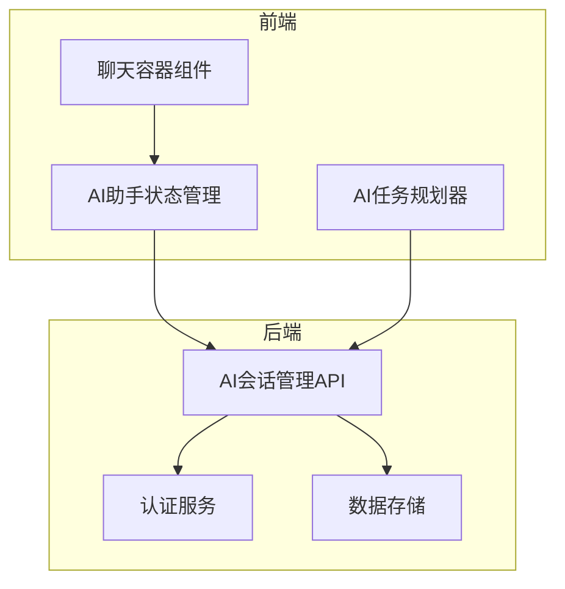
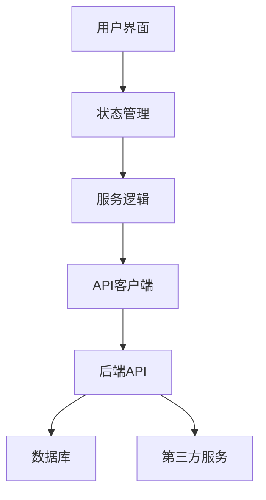
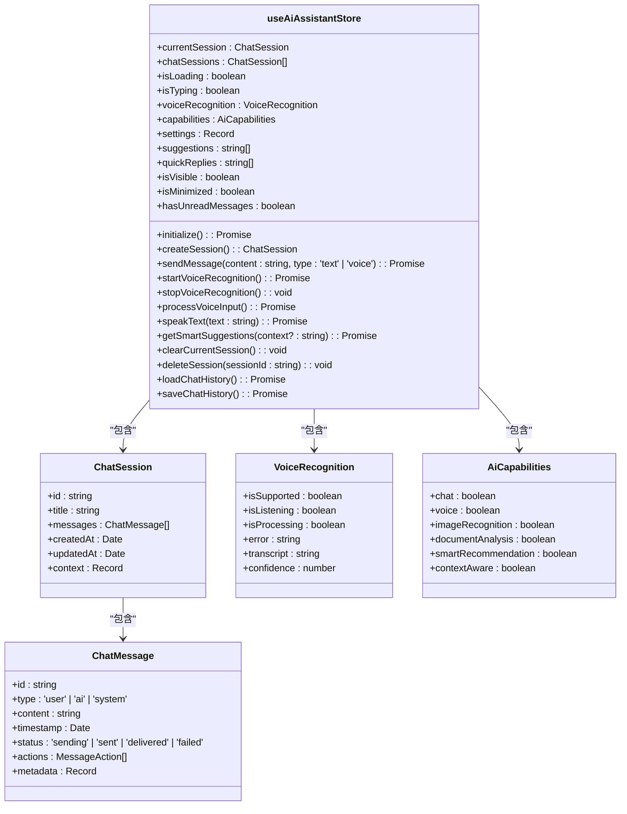
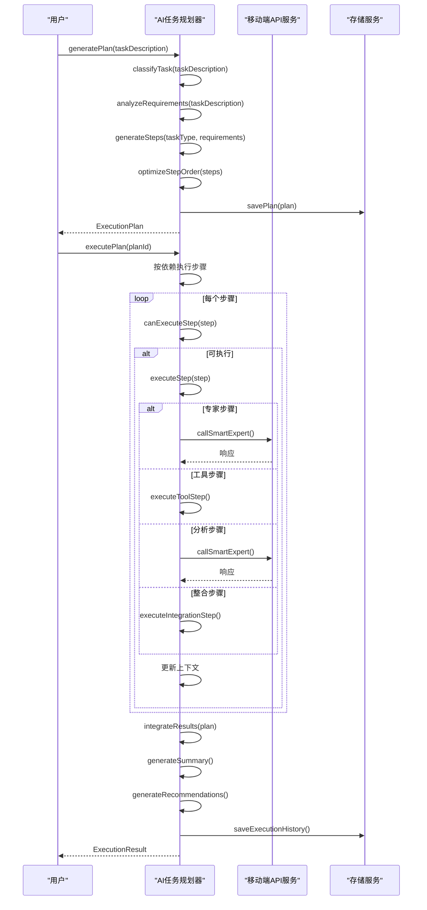
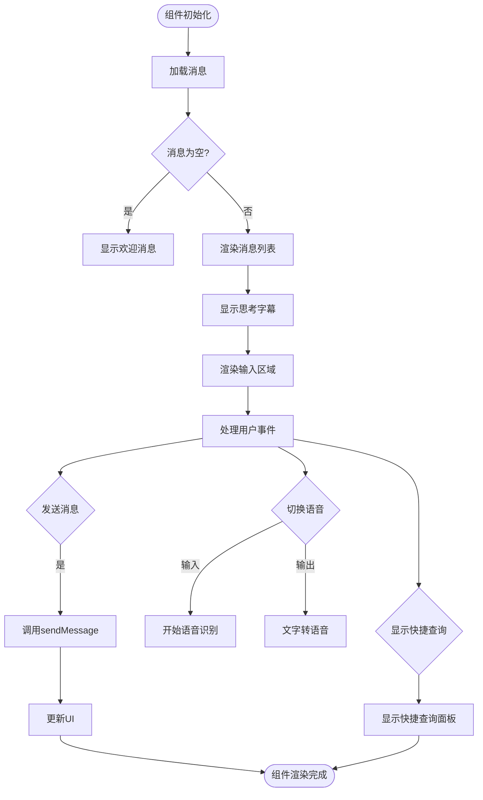
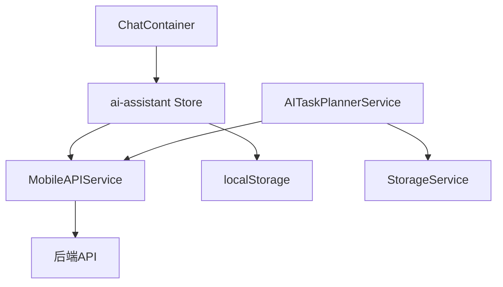

# AI集成API

<cite>
**本文档引用的文件**  
- [ai-assistant.ts](file://k.yyup.com/client/aimobile/stores/ai-assistant.ts)
- [ai-task-planner.service.ts](file://k.yyup.com/client/aimobile/services/ai-task-planner.service.ts)
- [ChatContainer.vue](file://k.yyup.com/client/backups/src/components/ai-assistant/chat/ChatContainer.vue)
- [ai-conversation.comprehensive.test.ts](file://k.yyup.com/server/APItest/comprehensive/ai-conversation.comprehensive.test.ts)
</cite>

## 目录
1. [简介](#简介)
2. [项目结构](#项目结构)
3. [核心组件](#核心组件)
4. [架构概述](#架构概述)
5. [详细组件分析](#详细组件分析)
6. [依赖分析](#依赖分析)
7. [性能考虑](#性能考虑)
8. [故障排除指南](#故障排除指南)
9. [结论](#结论)
10. [附录](#附录)（如有必要）

## 简介
本文档详细介绍了AI集成API的设计与实现，涵盖AI助手、智能建议和自动化操作等功能。系统基于移动端AI服务，实现了对话上下文管理、智能任务规划和会话状态维护等核心功能。前端采用Vue 3和Pinia状态管理，后端提供完整的RESTful API接口用于会话管理。系统支持语音识别与合成、智能任务分解和多专家协作，为用户提供全方位的智能辅助。

## 项目结构
项目采用前后端分离架构，前端位于`k.yyup.com/client`目录，后端API测试位于`k.yyup.com/server/APItest`目录。AI相关功能主要集中在移动端组件中，包括状态管理、服务逻辑和UI组件。

**图表来源**  
- [ai-assistant.ts](file://k.yyup.com/client/aimobile/stores/ai-assistant.ts)
- [ai-task-planner.service.ts](file://k.yyup.com/client/aimobile/services/ai-task-planner.service.ts)
- [ai-conversation.comprehensive.test.ts](file://k.yyup.com/server/APItest/comprehensive/ai-conversation.comprehensive.test.ts)

**章节来源**
- [ai-assistant.ts](file://k.yyup.com/client/aimobile/stores/ai-assistant.ts)
- [ai-task-planner.service.ts](file://k.yyup.com/client/aimobile/services/ai-task-planner.service.ts)

## 核心组件
系统核心组件包括AI助手状态管理、AI任务规划器和聊天界面。AI助手状态管理负责维护会话状态、语音识别和用户偏好；AI任务规划器实现复杂任务的智能分解与执行；聊天界面提供用户交互入口。这些组件通过移动端API服务与后端进行通信，实现完整的AI功能闭环。

**章节来源**
- [ai-assistant.ts](file://k.yyup.com/client/aimobile/stores/ai-assistant.ts)
- [ai-task-planner.service.ts](file://k.yyup.com/client/aimobile/services/ai-task-planner.service.ts)
- [ChatContainer.vue](file://k.yyup.com/client/backups/src/components/ai-assistant/chat/ChatContainer.vue)

## 架构概述
系统采用分层架构设计，前端负责用户交互和状态管理，后端提供RESTful API接口。AI功能通过专家系统实现，支持任务分解、多步骤执行和结果整合。会话管理API提供完整的CRUD操作，支持分页查询和状态过滤。

**图表来源**  
- [ai-assistant.ts](file://k.yyup.com/client/aimobile/stores/ai-assistant.ts)
- [ai-task-planner.service.ts](file://k.yyup.com/client/aimobile/services/ai-task-planner.service.ts)
- [ai-conversation.comprehensive.test.ts](file://k.yyup.com/server/APItest/comprehensive/ai-conversation.comprehensive.test.ts)

## 详细组件分析

### AI助手状态管理分析
AI助手状态管理使用Pinia实现，维护会话、语音识别和用户设置等状态。支持会话创建、消息发送、语音识别和智能建议等功能。

**图表来源**  
- [ai-assistant.ts](file://k.yyup.com/client/aimobile/stores/ai-assistant.ts)

**章节来源**
- [ai-assistant.ts](file://k.yyup.com/client/aimobile/stores/ai-assistant.ts)

### AI任务规划器分析
AI任务规划器负责复杂任务的智能分解与执行。它将用户请求分解为多个步骤，按依赖关系执行，并整合最终结果。

**图表来源**  
- [ai-task-planner.service.ts](file://k.yyup.com/client/aimobile/services/ai-task-planner.service.ts)

**章节来源**
- [ai-task-planner.service.ts](file://k.yyup.com/client/aimobile/services/ai-task-planner.service.ts)

### 聊天容器组件分析
聊天容器组件负责渲染聊天界面，包括消息列表、输入区域和思考字幕。

**图表来源**  
- [ChatContainer.vue](file://k.yyup.com/client/backups/src/components/ai-assistant/chat/ChatContainer.vue)

**章节来源**
- [ChatContainer.vue](file://k.yyup.com/client/backups/src/components/ai-assistant/chat/ChatContainer.vue)

## 依赖分析
系统依赖关系清晰，前端组件之间通过服务进行通信，与后端通过RESTful API交互。AI功能依赖移动端API服务，状态管理依赖Pinia。

**图表来源**  
- [ai-assistant.ts](file://k.yyup.com/client/aimobile/stores/ai-assistant.ts)
- [ai-task-planner.service.ts](file://k.yyup.com/client/aimobile/services/ai-task-planner.service.ts)
- [ChatContainer.vue](file://k.yyup.com/client/backups/src/components/ai-assistant/chat/ChatContainer.vue)

**章节来源**
- [ai-assistant.ts](file://k.yyup.com/client/aimobile/stores/ai-assistant.ts)
- [ai-task-planner.service.ts](file://k.yyup.com/client/aimobile/services/ai-task-planner.service.ts)

## 性能考虑
系统在性能方面进行了多项优化。会话管理API响应时间应小于3秒，列表查询响应时间应小于2秒。支持并发查询，3个并发请求总时间应小于6秒。本地存储用于缓存聊天历史和执行计划，减少网络请求。语音识别和合成在客户端处理，降低服务器负载。

## 故障排除指南
常见问题包括认证失败、会话创建失败和语音识别问题。认证失败通常由无效token引起，应检查认证流程。会话创建失败可能由于参数验证错误，需检查请求参数。语音识别问题通常与浏览器兼容性有关，应检查浏览器是否支持Web Speech API。对于任务执行失败，可检查执行计划的状态和错误信息。

**章节来源**
- [ai-conversation.comprehensive.test.ts](file://k.yyup.com/server/APItest/comprehensive/ai-conversation.comprehensive.test.ts)
- [ai-assistant.ts](file://k.yyup.com/client/aimobile/stores/ai-assistant.ts)

## 结论
AI集成API提供了一套完整的智能辅助功能，包括会话管理、任务规划和语音交互。系统架构清晰，组件职责明确，易于维护和扩展。通过专家系统和智能规划，能够处理复杂的用户请求，提供高质量的AI服务。未来可进一步优化性能，增加更多专家类型和工具支持。

## 附录
### API端点列表
| 端点 | 方法 | 描述 |
|------|------|------|
| /ai/conversations | POST | 创建AI会话 |
| /ai/conversations | GET | 获取AI会话列表 |
| /ai/conversations/:id | GET | 获取AI会话详情 |
| /ai/conversations/:id | PATCH | 更新AI会话 |
| /ai/conversations/:id | DELETE | 删除AI会话 |

### 状态码说明
- 200: 请求成功
- 201: 资源创建成功
- 400: 请求参数错误
- 401: 未认证
- 403: 无权限
- 404: 资源不存在
- 422: 数据验证失败