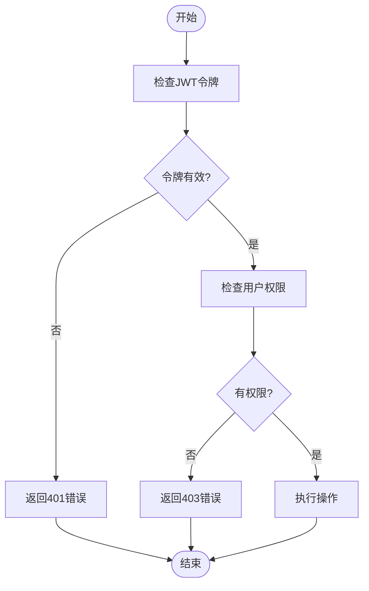

# API端点

<cite>
**本文档引用的文件**   
- [server.ts](file://k.yyup.com/server/src/server.ts)
- [index.ts](file://k.yyup.com/server/src/routes/index.ts)
- [auth.middleware.ts](file://k.yyup.com/server/src/middlewares/auth.middleware.ts)
- [jwt.config.ts](file://k.yyup.com/server/src/config/jwt.config.ts)
- [auth.routes.ts](file://k.yyup.com/server/src/routes/auth.routes.ts)
- [auth.controller.ts](file://k.yyup.com/server/src/controllers/auth.controller.ts)
- [apiResponseEnhanced.ts](file://k.yyup.com/server/src/utils/apiResponseEnhanced.ts)
- [paginationHelper.ts](file://k.yyup.com/server/src/utils/paginationHelper.ts)
</cite>

## 目录
1. [简介](#简介)
2. [项目结构](#项目结构)
3. [核心组件](#核心组件)
4. [架构概述](#架构概述)
5. [详细组件分析](#详细组件分析)
6. [依赖分析](#依赖分析)
7. [性能考虑](#性能考虑)
8. [故障排除指南](#故障排除指南)
9. [结论](#结论)
10. [附录](#附录)（如有必要）

## 简介
本文档详细描述了k.yyup.com子系统的API端点，涵盖基于Express的RESTful API架构。文档包括路由组织结构、版本控制策略、端点分类方式、认证要求、速率限制、分页策略和过滤参数。同时，文档还解释了API与前端组件的集成模式以及如何扩展和添加新的API端点。

## 项目结构
k.yyup.com子系统的API端点主要位于`server/src`目录下，采用模块化路由设计。系统通过Express框架构建，使用TypeScript编写，实现了清晰的分层架构。

**图源**
- [server.ts](file://k.yyup.com/server/src/server.ts#L1-L562)
- [index.ts](file://k.yyup.com/server/src/routes/index.ts#L1-L427)

**节源**
- [server.ts](file://k.yyup.com/server/src/server.ts#L1-L562)
- [index.ts](file://k.yyup.com/server/src/routes/index.ts#L1-L427)

## 核心组件
k.yyup.com子系统的核心组件包括Express应用、路由系统、认证中间件、控制器和模型。这些组件共同构成了系统的API端点。

**节源**
- [server.ts](file://k.yyup.com/server/src/server.ts#L1-L562)
- [index.ts](file://k.yyup.com/server/src/routes/index.ts#L1-L427)

## 架构概述
k.yyup.com子系统采用基于Express的RESTful API架构，实现了模块化路由设计。系统通过中间件处理认证、日志记录和租户解析，确保了安全性和可维护性。

**图源**
- [server.ts](file://k.yyup.com/server/src/server.ts#L1-L562)
- [index.ts](file://k.yyup.com/server/src/routes/index.ts#L1-L427)

## 详细组件分析
### 认证模块分析
认证模块负责处理用户登录、登出和权限验证。系统采用JWT进行认证，通过统一租户系统进行用户管理。

#### 认证流程

**图源**
- [auth.routes.ts](file://k.yyup.com/server/src/routes/auth.routes.ts#L1-L143)
- [auth.controller.ts](file://k.yyup.com/server/src/controllers/auth.controller.ts#L1-L91)

#### 权限验证

**图源**
- [auth.middleware.ts](file://k.yyup.com/server/src/middlewares/auth.middleware.ts#L1-L1378)

**节源**
- [auth.middleware.ts](file://k.yyup.com/server/src/middlewares/auth.middleware.ts#L1-L1378)
- [auth.routes.ts](file://k.yyup.com/server/src/routes/auth.routes.ts#L1-L143)

### 用户管理模块分析
用户管理模块负责处理用户信息的创建、读取、更新和删除操作。系统通过统一的API响应格式确保数据一致性。

**节源**
- [apiResponseEnhanced.ts](file://k.yyup.com/server/src/utils/apiResponseEnhanced.ts#L1-L363)
- [paginationHelper.ts](file://k.yyup.com/server/src/utils/paginationHelper.ts#L1-L100)

## 依赖分析
k.yyup.com子系统依赖于多个外部服务和库，包括Express、JWT、Axios等。系统通过中间件和服务层与这些依赖进行交互。

**图源**
- [server.ts](file://k.yyup.com/server/src/server.ts#L1-L562)
- [auth.middleware.ts](file://k.yyup.com/server/src/middlewares/auth.middleware.ts#L1-L1378)

**节源**
- [server.ts](file://k.yyup.com/server/src/server.ts#L1-L562)
- [auth.middleware.ts](file://k.yyup.com/server/src/middlewares/auth.middleware.ts#L1-L1378)

## 性能考虑
系统在设计时考虑了性能优化，包括数据库连接池、缓存机制和异步处理。通过预热AI模型缓存和优化数据库查询，系统能够高效处理大量请求。

**节源**
- [server.ts](file://k.yyup.com/server/src/server.ts#L1-L562)
- [auth.middleware.ts](file://k.yyup.com/server/src/middlewares/auth.middleware.ts#L1-L1378)

## 故障排除指南
### 常见问题
1. **认证失败**：检查JWT令牌是否正确，确保用户凭证有效。
2. **权限不足**：确认用户角色和权限设置正确。
3. **数据库连接失败**：检查数据库配置和网络连接。

**节源**
- [server.ts](file://k.yyup.com/server/src/server.ts#L1-L562)
- [auth.middleware.ts](file://k.yyup.com/server/src/middlewares/auth.middleware.ts#L1-L1378)

## 结论
k.yyup.com子系统的API端点设计合理，采用模块化路由和统一的响应格式，确保了系统的可维护性和扩展性。通过JWT认证和权限验证，系统能够安全地处理用户请求。