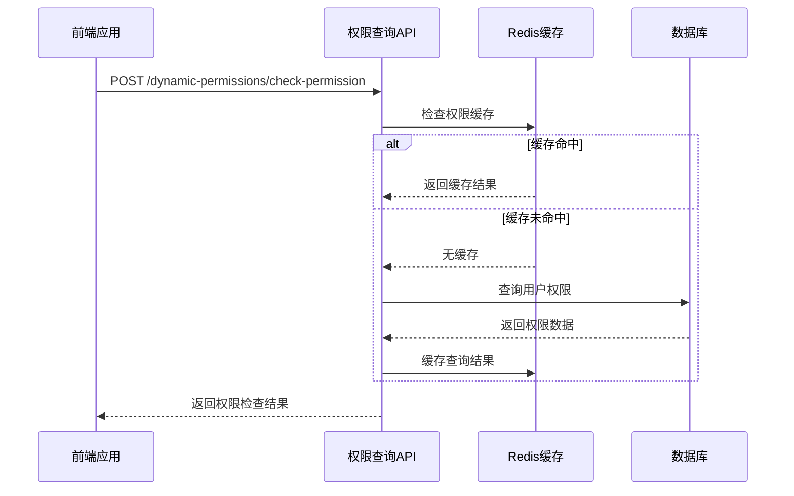
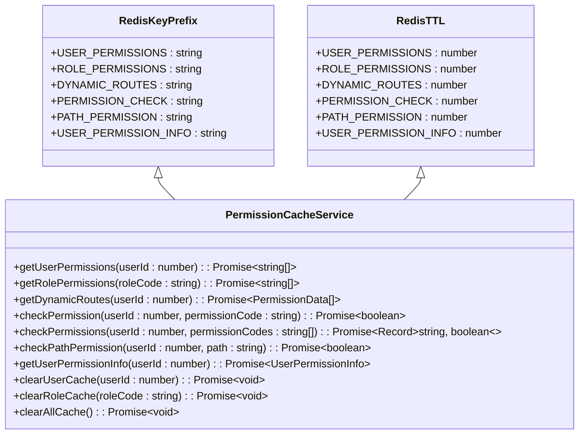
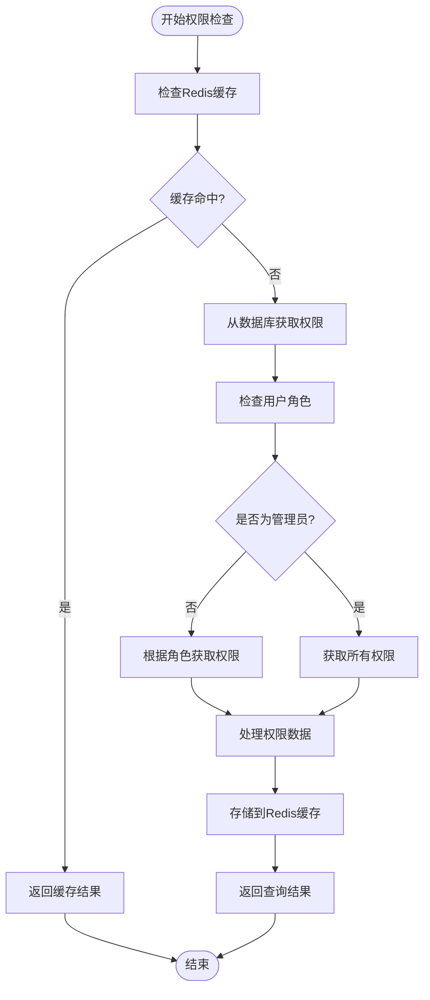
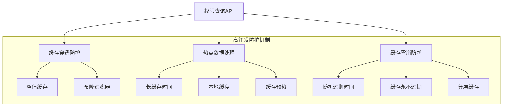
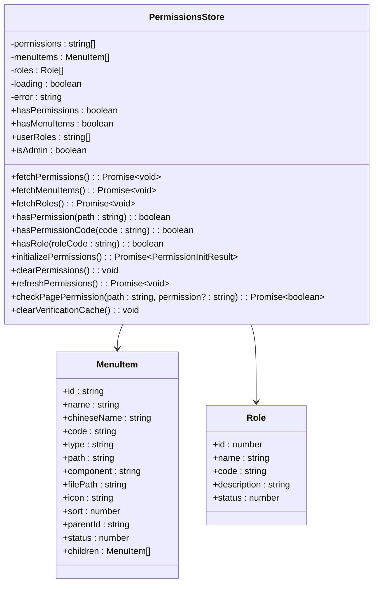

# 权限查询API

<cite>
**本文档引用的文件**
- [permission-cache.controller.ts](file://k.yyup.com/backup/permission-system/permission-cache.controller.ts)
- [permission-cache.service.ts](file://k.yyup.com/backup/permission-system/permission-cache.service.ts)
- [permissions.ts](file://k.yyup.com/backup/permission-system/permissions.ts)
- [cache-invalidation.middleware.ts](file://k.yyup.com/backup/permission-system/cache-invalidation.middleware.ts)
- [redis.config.ts](file://k.yyup.com/server/src/config/redis.config.ts)
- [auth-permissions.ts](file://k.yyup.com/client/src/api/modules/auth-permissions.ts)
- [route-cache.service.ts](file://k.yyup.com/server/src/services/route-cache.service.ts)
</cite>

## 目录
1. [简介](#简介)
2. [权限查询端点](#权限查询端点)
3. [权限缓存机制](#权限缓存机制)
4. [性能优化方案](#性能优化方案)
5. [API调用示例](#api调用示例)
6. [高并发场景下的性能考虑](#高并发场景下的性能考虑)
7. [前端集成](#前端集成)
8. [结论](#结论)

## 简介

权限查询API是系统权限管理的核心组件，负责处理权限检查、用户权限列表获取和操作可行性验证等关键功能。该API通过高效的缓存机制和优化的查询策略，确保在高并发场景下仍能提供快速的权限验证服务。系统采用Redis作为缓存存储，通过合理的缓存键设计和失效策略，实现了权限数据的高效管理和实时更新。

**Section sources**
- [permissions.ts](file://k.yyup.com/backup/permission-system/permissions.ts#L1-L513)
- [permission-cache.service.ts](file://k.yyup.com/backup/permission-system/permission-cache.service.ts#L1-L572)

## 权限查询端点

权限查询API提供了多个端点来满足不同的权限验证需求：

### 权限检查端点
`POST /dynamic-permissions/check-permission` 用于检查用户是否具有访问特定路径的权限。该端点接受路径和权限代码作为参数，返回布尔值表示是否有权限。

### 用户权限列表获取
`GET /user/permissions` 用于获取当前用户的权限列表。返回一个包含所有权限代码的数组，前端可以使用这些代码来控制UI元素的显示和交互。

### 操作可行性验证
`POST /dynamic-permissions/check-permission` 也可用于验证特定操作的可行性，如检查用户是否具有"招生计划编辑"或"财务报表导出"等特定权限。



**Diagram sources**
- [permission-cache.service.ts](file://k.yyup.com/backup/permission-system/permission-cache.service.ts#L306-L331)
- [permissions.ts](file://k.yyup.com/backup/permission-system/permissions.ts#L335-L408)

**Section sources**
- [permission-cache.service.ts](file://k.yyup.com/backup/permission-system/permission-cache.service.ts#L306-L402)
- [permissions.ts](file://k.yyup.com/backup/permission-system/permissions.ts#L335-L408)

## 权限缓存机制

权限缓存机制是权限查询API性能优化的核心，通过Redis缓存减少数据库查询次数，提高响应速度。

### Redis存储结构设计
系统使用不同的Redis键前缀来组织权限相关的缓存数据：
- `user:permissions:` 用于存储用户权限列表
- `role:permissions:` 用于存储角色权限列表
- `dynamic:routes:` 用于存储用户动态路由
- `permission:check:` 用于存储权限检查结果
- `path:permission:` 用于存储路径权限检查结果

### 缓存键命名策略
缓存键采用统一的命名规范：`{前缀}:{用户ID}:{其他参数}`。例如，用户权限缓存键为`user:permissions:123`，权限检查缓存键为`permission:check:123:enrollment:edit`。

### 失效时间配置
不同的缓存数据设置了不同的过期时间：
- 用户权限列表：3600秒（1小时）
- 角色权限列表：7200秒（2小时）
- 动态路由：1800秒（30分钟）
- 权限检查结果：600秒（10分钟）
- 路径权限检查结果：600秒（10分钟）



**Diagram sources**
- [redis.config.ts](file://k.yyup.com/server/src/config/redis.config.ts)
- [permission-cache.service.ts](file://k.yyup.com/backup/permission-system/permission-cache.service.ts#L11-L15)

**Section sources**
- [permission-cache.service.ts](file://k.yyup.com/backup/permission-system/permission-cache.service.ts#L50-L484)
- [redis.config.ts](file://k.yyup.com/server/src/config/redis.config.ts)

## 性能优化方案

为了提高权限查询的性能，系统实现了多种优化方案：

### 批量权限查询
`checkPermissions`方法支持批量检查多个权限，通过一次性获取用户的所有权限，然后在内存中进行多次检查，避免了多次数据库查询或缓存访问。

### 预加载机制
系统在用户登录时预加载权限数据，包括：
- 用户权限列表
- 用户角色信息
- 动态路由配置

这减少了后续权限检查时的延迟，提高了用户体验。

### 缓存预热
管理员可以调用`/api/admin/warmup-cache`端点来预热权限缓存，将常用的权限数据提前加载到Redis中，避免在高并发时出现缓存击穿。



**Diagram sources**
- [permission-cache.service.ts](file://k.yyup.com/backup/permission-system/permission-cache.service.ts#L50-L484)
- [permission-cache.controller.ts](file://k.yyup.com/backup/permission-system/permission-cache.controller.ts#L274-L294)

**Section sources**
- [permission-cache.service.ts](file://k.yyup.com/backup/permission-system/permission-cache.service.ts#L339-L355)
- [permission-cache.controller.ts](file://k.yyup.com/backup/permission-system/permission-cache.controller.ts#L274-L294)

## API调用示例

以下是前端如何调用权限查询API的示例：

### 检查"招生计划编辑"权限
```javascript
// 使用权限检查函数
const hasEnrollmentEditPermission = await checkPagePermission('/enrollment/plan', 'enrollment:edit');

if (hasEnrollmentEditPermission) {
  // 显示编辑按钮
  showEditButton();
} else {
  // 隐藏编辑按钮或显示提示信息
  hideEditButton();
  showPermissionDeniedMessage();
}
```

### 检查"财务报表导出"权限
```javascript
// 批量检查多个权限
const permissionsToCheck = ['finance:export', 'finance:view'];
const permissionResults = await PermissionCacheService.checkPermissions(userId, permissionsToCheck);

if (permissionResults['finance:export']) {
  // 显示导出按钮
  showExportButton();
}

if (permissionResults['finance:view']) {
  // 加载财务报表数据
  loadFinancialReports();
}
```

### 获取用户权限列表
```javascript
// 获取当前用户的权限列表
const userPermissions = await PermissionCacheService.getUserPermissions(userId);

// 检查是否具有特定权限
if (userPermissions.includes('enrollment:edit')) {
  // 用户可以编辑招生计划
  enableEnrollmentEdit();
}
```

**Section sources**
- [permissions.ts](file://k.yyup.com/backup/permission-system/permissions.ts#L335-L408)
- [auth-permissions.ts](file://k.yyup.com/client/src/api/modules/auth-permissions.ts)

## 高并发场景下的性能考虑

在高并发场景下，权限查询API需要考虑以下性能问题：

### 缓存穿透防护
为了防止恶意请求查询不存在的权限导致数据库压力过大，系统实现了缓存穿透防护：
- 对于查询结果为空的情况，也会在Redis中设置一个空值缓存，有效期较短（如60秒）
- 使用布隆过滤器预判请求的合法性

### 热点数据处理
对于访问频率极高的权限数据（如管理员权限），系统采用以下策略：
- 设置较长的缓存时间
- 使用本地缓存作为第一层缓存
- 实现缓存预热机制，定期更新热点数据

### 缓存雪崩防护
为了避免大量缓存同时失效导致数据库压力骤增，系统采用：
- 随机化的缓存过期时间，在基础过期时间上增加随机偏移
- 缓存永不过期策略，通过后台任务定期更新缓存
- 分层缓存架构，结合Redis和本地缓存



**Diagram sources**
- [permission-cache.service.ts](file://k.yyup.com/backup/permission-system/permission-cache.service.ts)
- [cache-invalidation.middleware.ts](file://k.yyup.com/backup/permission-system/cache-invalidation.middleware.ts)

**Section sources**
- [permission-cache.service.ts](file://k.yyup.com/backup/permission-system/permission-cache.service.ts#L50-L484)
- [cache-invalidation.middleware.ts](file://k.yyup.com/backup/permission-system/cache-invalidation.middleware.ts)

## 前端集成

权限查询API与前端v-permission指令深度集成，实现细粒度的UI元素控制。

### v-permission指令实现
v-permission指令通过调用权限查询API来决定是否显示或启用UI元素：
```javascript
// v-permission指令定义
const vPermission = {
  mounted(el, binding) {
    const { value } = binding;
    const hasPermission = usePermissionsStore().hasPermissionCode(value);
    
    if (!hasPermission) {
      el.style.display = 'none';
    }
  },
  updated(el, binding) {
    const { value } = binding;
    const hasPermission = usePermissionsStore().hasPermissionCode(value);
    
    if (!hasPermission) {
      el.style.display = 'none';
    } else {
      el.style.display = '';
    }
  }
};
```

### UI元素控制示例
```html
<!-- 招生计划编辑按钮 -->
<button v-permission="'enrollment:edit'">编辑招生计划</button>

<!-- 财务报表导出按钮 -->
<button v-permission="'finance:export'">导出报表</button>

<!-- 管理员专属功能 -->
<div v-permission="'admin'">
  <admin-panel />
</div>
```

### 权限状态管理
系统使用Pinia store管理权限状态，包括：
- 用户权限列表
- 用户角色信息
- 菜单权限
- 权限验证缓存



**Diagram sources**
- [permissions.ts](file://k.yyup.com/backup/permission-system/permissions.ts#L53-L513)
- [auth-permissions.ts](file://k.yyup.com/client/src/api/modules/auth-permissions.ts)

**Section sources**
- [permissions.ts](file://k.yyup.com/backup/permission-system/permissions.ts#L53-L513)
- [auth-permissions.ts](file://k.yyup.com/client/src/api/modules/auth-permissions.ts)

## 结论

权限查询API通过高效的缓存机制和优化的查询策略，为系统提供了可靠的权限管理服务。Redis缓存的使用显著减少了数据库查询次数，提高了响应速度。批量查询和预加载机制进一步优化了性能，确保在高并发场景下仍能提供稳定的服务。与前端v-permission指令的深度集成，实现了细粒度的UI元素控制，提升了用户体验。系统的缓存穿透防护和热点数据处理机制，有效应对了高并发场景下的性能挑战，保证了系统的稳定性和可靠性。