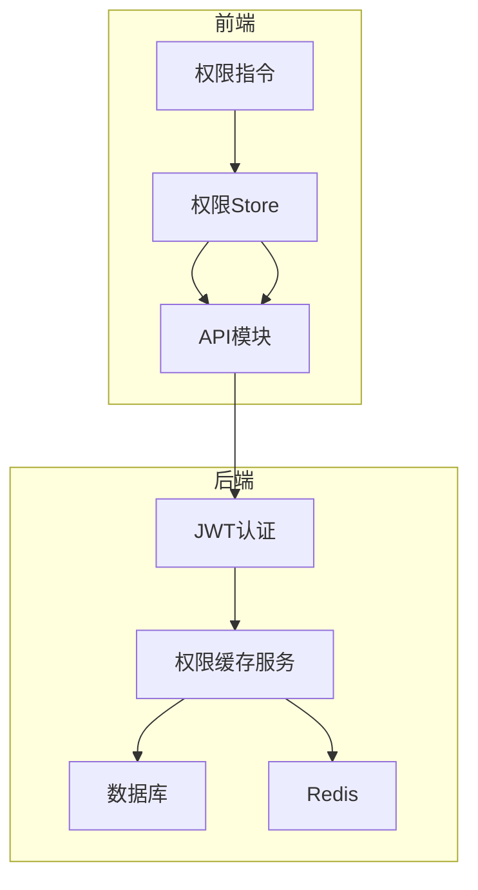
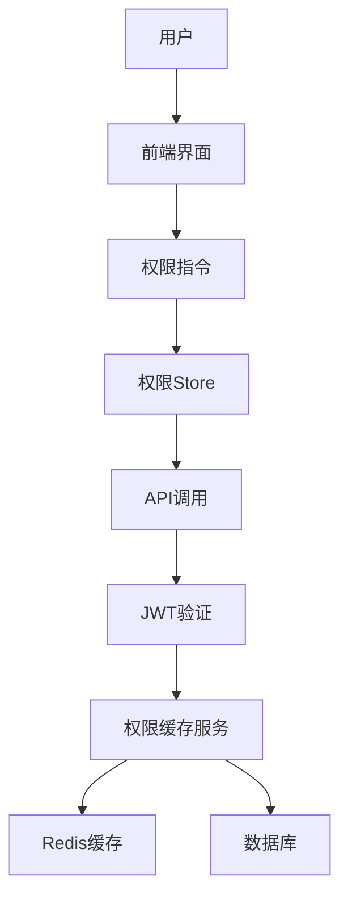
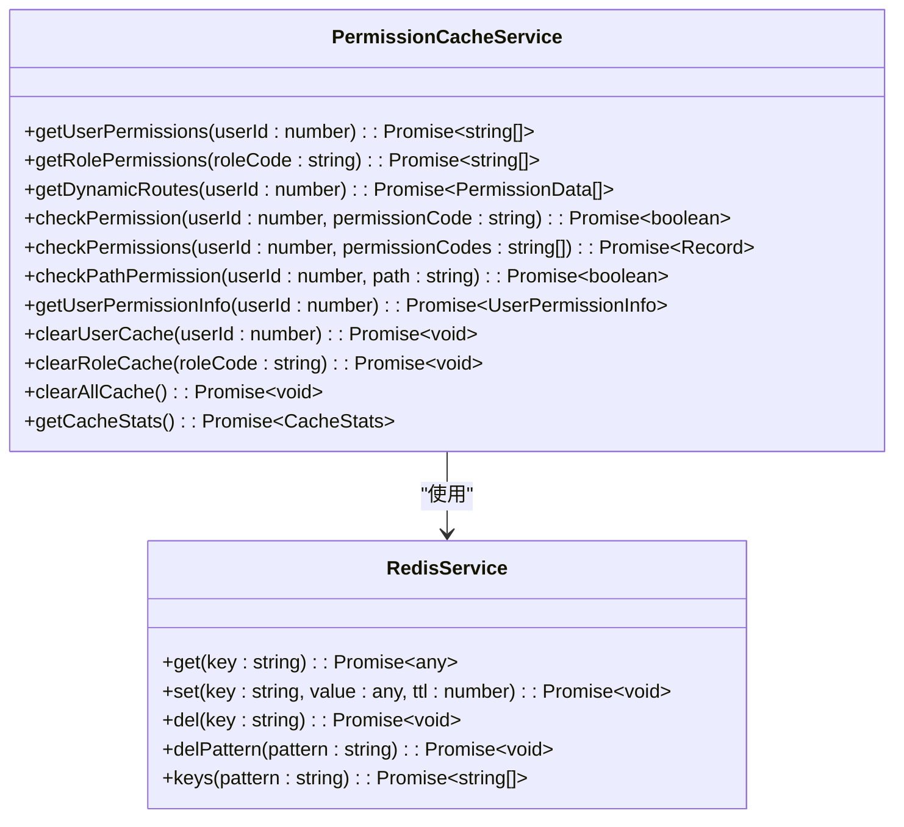
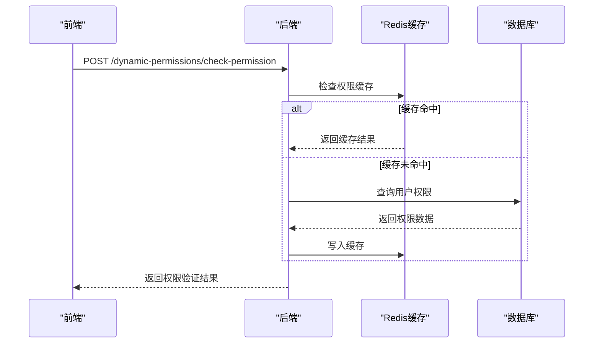
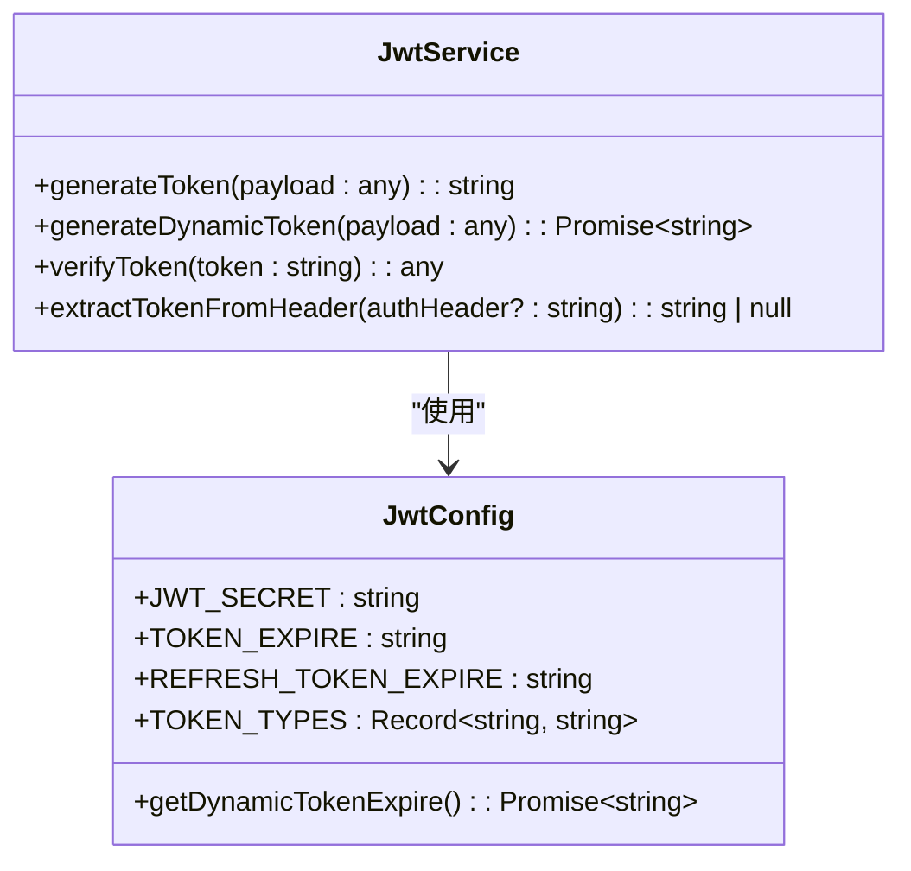
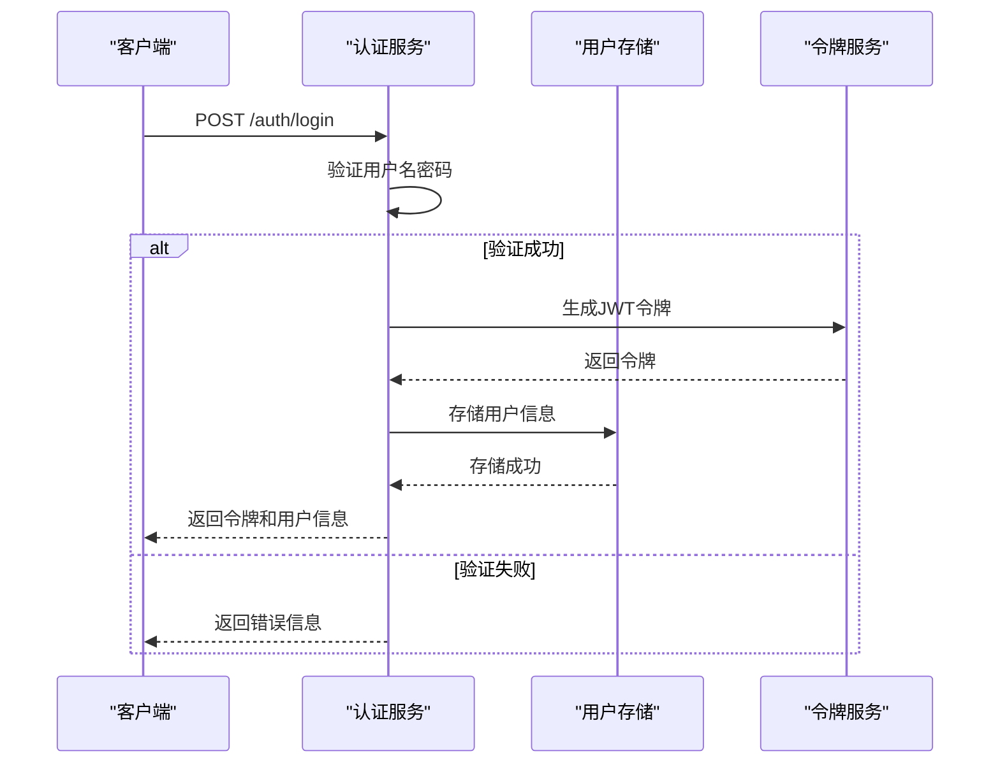
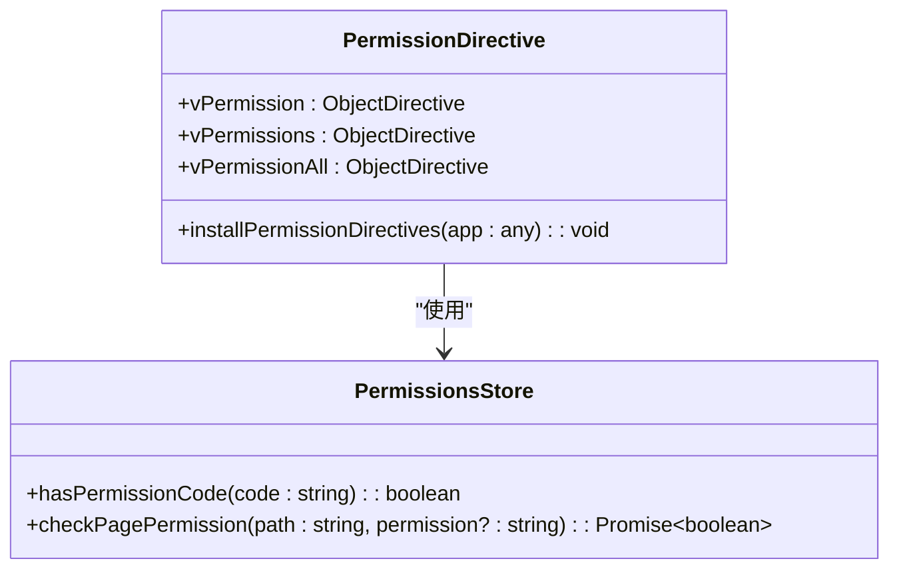
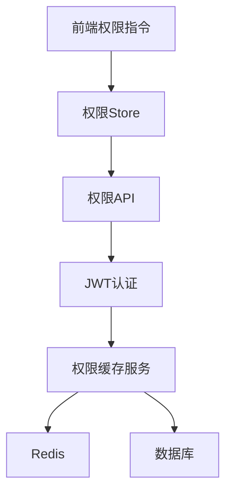

# 权限管理API

<cite>
**本文档引用的文件**   
- [permissions.ts](file://k.yyup.com/backup/permission-system/permissions.ts)
- [permission-cache.service.ts](file://k.yyup.com/backup/permission-system/permission-cache.service.ts)
- [permission-cache.controller.ts](file://k.yyup.com/backup/permission-system/permission-cache.controller.ts)
- [role-cache.service.ts](file://k.yyup.com/backup/permission-system/role-cache.service.ts)
- [route-cache.service.ts](file://k.yyup.com/backup/permission-system/route-cache.service.ts)
- [jwt.config.ts](file://k.yyup.com/server/src/config/jwt.config.ts)
- [jwt.ts](file://k.yyup.com/server/src/utils/jwt.ts)
- [auth-permissions.ts](file://k.yyup.com/client/src/api/modules/auth-permissions.ts)
- [auth.ts](file://k.yyup.com/client/src/api/modules/auth.ts)
- [permission.ts](file://k.yyup.com/client/src/directives/permission.ts)
</cite>

## 目录
1. [简介](#简介)
2. [项目结构](#项目结构)
3. [核心组件](#核心组件)
4. [架构概述](#架构概述)
5. [详细组件分析](#详细组件分析)
6. [依赖分析](#依赖分析)
7. [性能考虑](#性能考虑)
8. [故障排除指南](#故障排除指南)
9. [结论](#结论)
10. [附录](#附录) (如有必要)

## 简介
本文档详细描述了基于角色的访问控制（RBAC）系统的RESTful接口实现。系统通过JWT令牌实现用户认证，结合Redis缓存机制提升权限验证性能。文档涵盖用户认证、角色分配、权限查询和访问验证等核心功能，并说明API与前端权限指令的集成方式，实现动态菜单和按钮级控制。

## 项目结构
权限管理系统主要由前端权限管理、后端服务和缓存机制三部分组成。前端通过Pinia存储管理权限状态，后端提供RESTful API接口，Redis用于缓存权限数据以提高性能。

**图表来源**
- [permissions.ts](file://k.yyup.com/backup/permission-system/permissions.ts)
- [auth-permissions.ts](file://k.yyup.com/client/src/api/modules/auth-permissions.ts)
- [jwt.config.ts](file://k.yyup.com/server/src/config/jwt.config.ts)

**章节来源**
- [permissions.ts](file://k.yyup.com/backup/permission-system/permissions.ts)
- [auth-permissions.ts](file://k.yyup.com/client/src/api/modules/auth-permissions.ts)

## 核心组件
系统核心组件包括权限缓存服务、JWT认证机制和前端权限指令。权限缓存服务通过Redis存储用户权限数据，JWT认证机制负责用户身份验证和令牌管理，前端权限指令实现按钮级权限控制。

**章节来源**
- [permission-cache.service.ts](file://k.yyup.com/backup/permission-system/permission-cache.service.ts)
- [jwt.ts](file://k.yyup.com/server/src/utils/jwt.ts)
- [permission.ts](file://k.yyup.com/client/src/directives/permission.ts)

## 架构概述
系统采用分层架构设计，前端通过API调用与后端交互，后端服务通过缓存层访问数据库。权限验证分为多个层级，从菜单访问到按钮操作都有相应的控制机制。

**图表来源**
- [permission-cache.service.ts](file://k.yyup.com/backup/permission-system/permission-cache.service.ts)
- [jwt.ts](file://k.yyup.com/server/src/utils/jwt.ts)
- [permission.ts](file://k.yyup.com/client/src/directives/permission.ts)

## 详细组件分析

### 权限缓存服务分析
权限缓存服务是系统性能优化的核心，通过Redis缓存用户权限数据，避免频繁的数据库查询。

#### 权限缓存服务类图

**图表来源**
- [permission-cache.service.ts](file://k.yyup.com/backup/permission-system/permission-cache.service.ts)

#### 权限验证流程序列图

**图表来源**
- [permission-cache.service.ts](file://k.yyup.com/backup/permission-system/permission-cache.service.ts)
- [permission-cache.controller.ts](file://k.yyup.com/backup/permission-system/permission-cache.controller.ts)

### JWT认证机制分析
JWT认证机制负责用户身份验证和令牌管理，支持令牌生成、验证和刷新功能。

#### JWT服务类图

**图表来源**
- [jwt.ts](file://k.yyup.com/server/src/utils/jwt.ts)
- [jwt.config.ts](file://k.yyup.com/server/src/config/jwt.config.ts)

#### 用户登录流程序列图

**图表来源**
- [auth.ts](file://k.yyup.com/client/src/api/modules/auth.ts)
- [jwt.ts](file://k.yyup.com/server/src/utils/jwt.ts)

### 前端权限指令分析
前端权限指令实现按钮级权限控制，支持多种权限验证方式。

#### 权限指令类图

**图表来源**
- [permission.ts](file://k.yyup.com/client/src/directives/permission.ts)
- [permissions.ts](file://k.yyup.com/backup/permission-system/permissions.ts)

**章节来源**
- [permission.ts](file://k.yyup.com/client/src/directives/permission.ts)
- [permissions.ts](file://k.yyup.com/backup/permission-system/permissions.ts)

## 依赖分析
系统依赖关系清晰，前端组件依赖后端API，后端服务依赖数据库和缓存系统。

**图表来源**
- [permission.ts](file://k.yyup.com/client/src/directives/permission.ts)
- [permissions.ts](file://k.yyup.com/backup/permission-system/permissions.ts)
- [auth-permissions.ts](file://k.yyup.com/client/src/api/modules/auth-permissions.ts)

**章节来源**
- [permission.ts](file://k.yyup.com/client/src/directives/permission.ts)
- [permissions.ts](file://k.yyup.com/backup/permission-system/permissions.ts)

## 性能考虑
系统通过多级缓存机制优化性能，包括Redis缓存和内存缓存。权限数据在Redis中设置合理的过期时间，避免数据陈旧。同时，系统提供缓存刷新接口，管理员可以手动刷新缓存。

**章节来源**
- [permission-cache.service.ts](file://k.yyup.com/backup/permission-system/permission-cache.service.ts)
- [route-cache.service.ts](file://k.yyup.com/backup/permission-system/route-cache.service.ts)

## 故障排除指南
常见问题包括权限缓存不一致、JWT令牌验证失败等。对于缓存问题，可以通过管理员接口刷新缓存；对于令牌问题，需要检查密钥配置和令牌过期时间。

**章节来源**
- [permission-cache.controller.ts](file://k.yyup.com/backup/permission-system/permission-cache.controller.ts)
- [jwt.ts](file://k.yyup.com/server/src/utils/jwt.ts)

## 结论
本权限管理系统通过RBAC模型实现了细粒度的访问控制，结合JWT认证和Redis缓存，既保证了安全性又提升了性能。系统架构清晰，组件职责明确，易于维护和扩展。