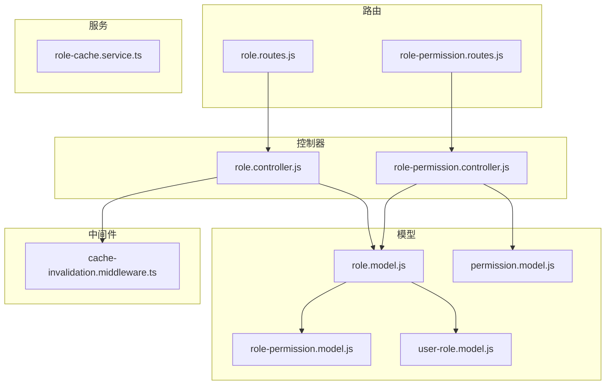
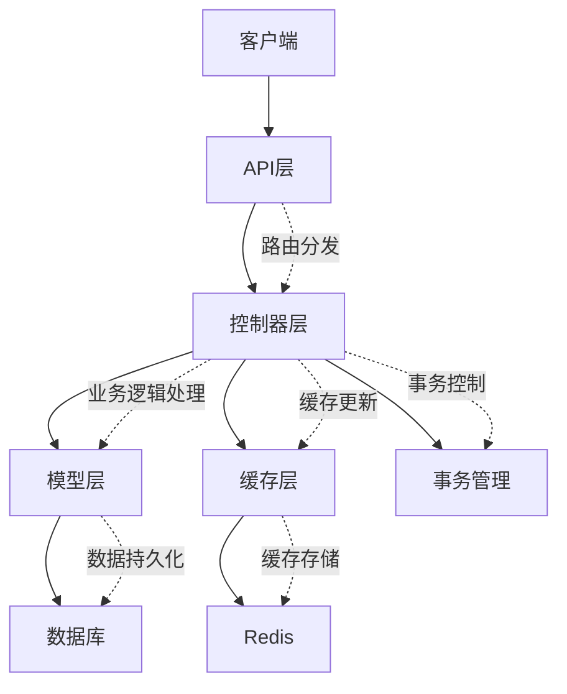
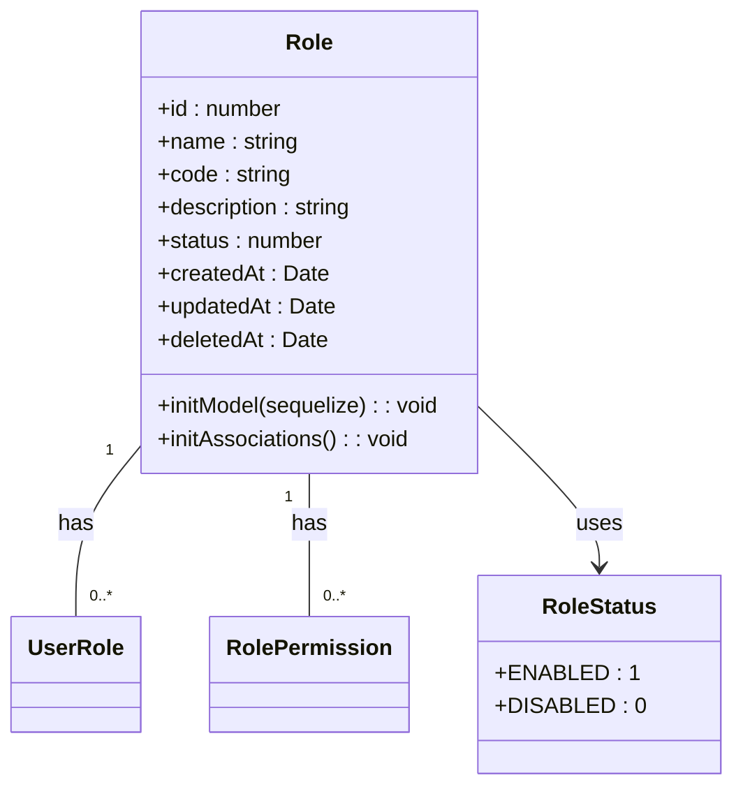
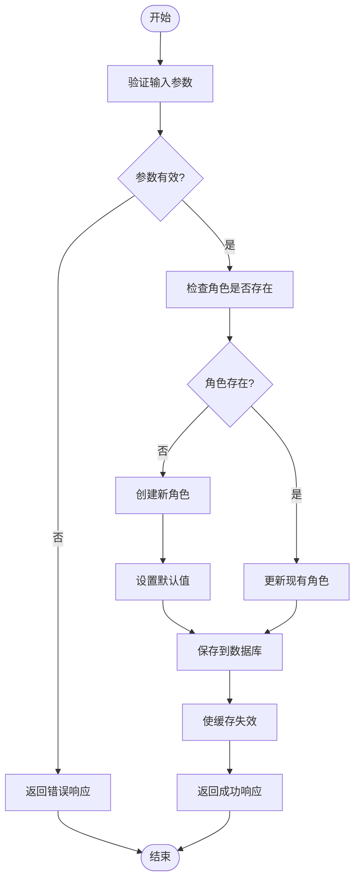
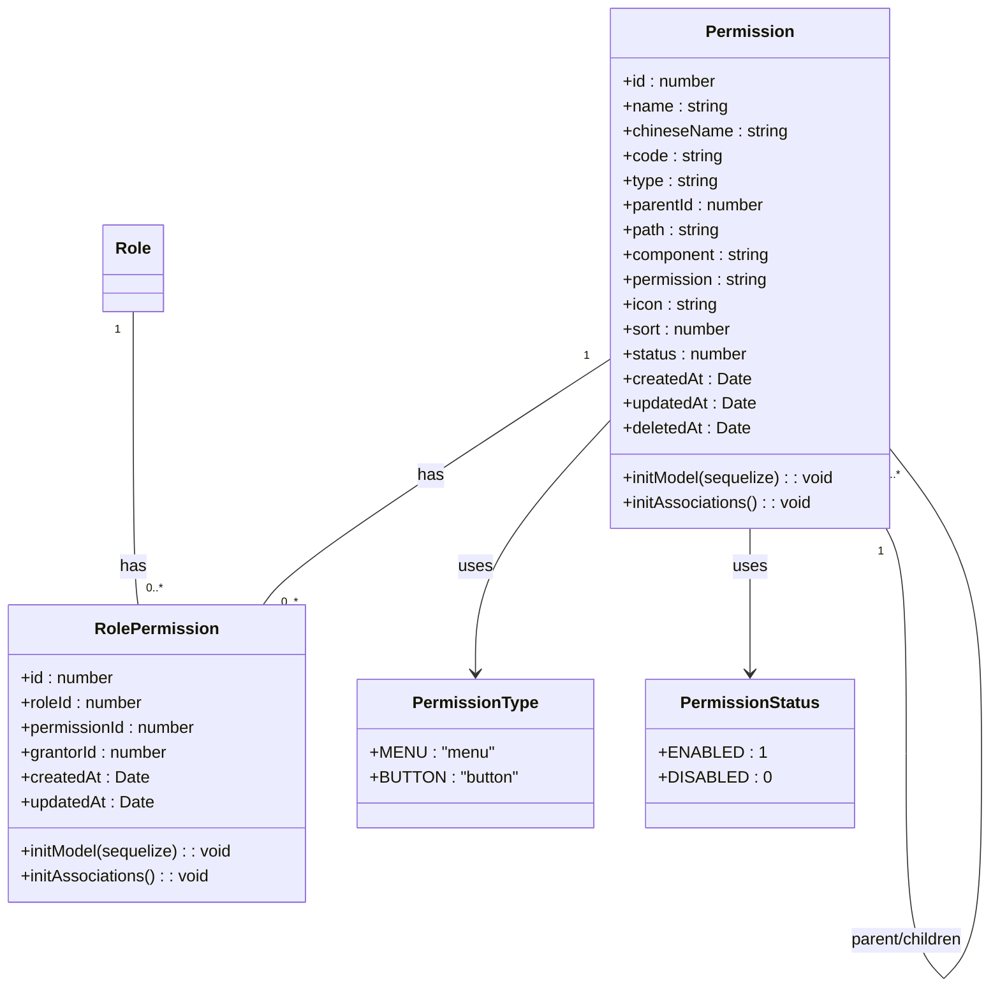
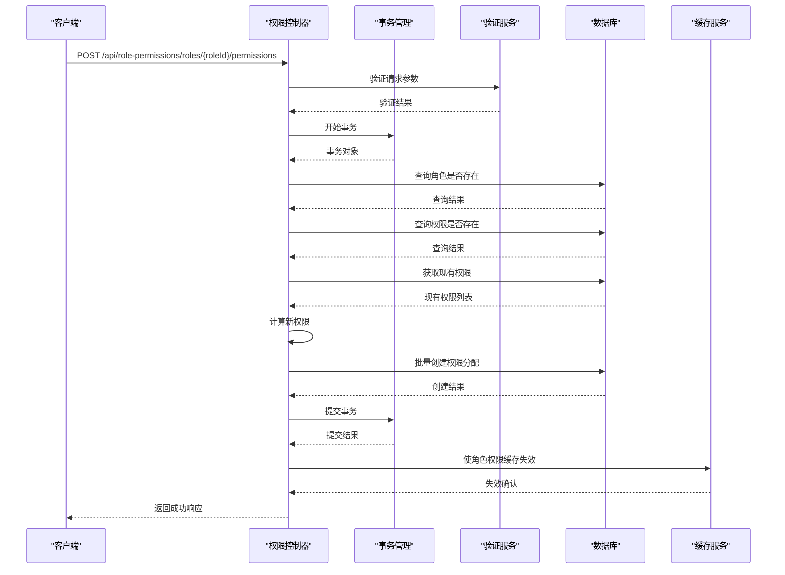
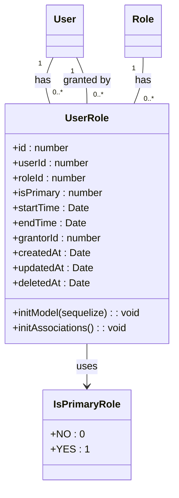
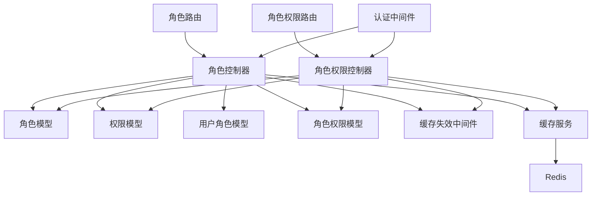
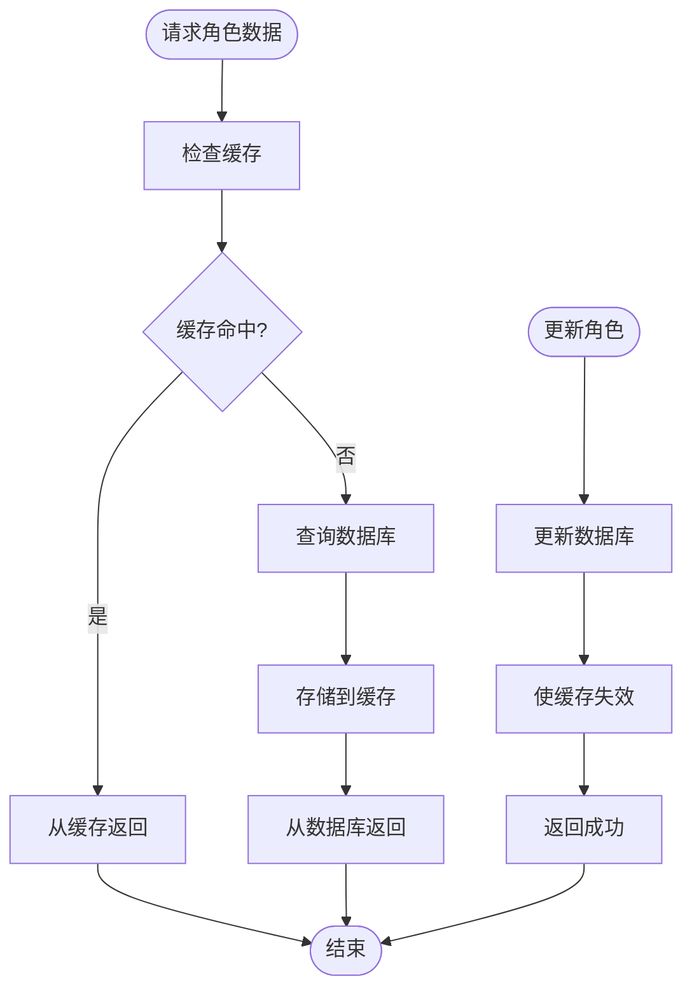

# 角色管理API

<cite>
**本文档引用的文件**   
- [role.controller.js](file://server/dist/controllers/role.controller.js)
- [role.routes.js](file://server/dist/routes/role.routes.js)
- [role.model.js](file://server/dist/models/role.model.js)
- [role-permission.controller.js](file://server/dist/controllers/role-permission.controller.js)
- [role-permission.routes.js](file://server/dist/routes/role-permission.routes.js)
- [role-permission.model.js](file://server/dist/models/role-permission.model.js)
- [permission.model.js](file://server/dist/models/permission.model.js)
- [user-role.model.js](file://server/dist/models/user-role.model.js)
- [cache-invalidation.middleware.ts](file://backup/permission-system/cache-invalidation.middleware.ts)
- [role-cache.service.ts](file://backup/permission-system/role-cache.service.ts)
</cite>

## 目录
1. [简介](#简介)
2. [项目结构](#项目结构)
3. [核心组件](#核心组件)
4. [架构概述](#架构概述)
5. [详细组件分析](#详细组件分析)
6. [依赖分析](#依赖分析)
7. [性能考虑](#性能考虑)
8. [故障排除指南](#故障排除指南)
9. [结论](#结论)

## 简介
角色管理API为系统提供了一套完整的角色生命周期管理功能，包括角色的创建、更新、删除和查询操作。该系统支持复杂的权限管理机制，允许通过批量权限分配和继承式权限模型来管理不同层级用户的权限。系统设计支持园长、教师、管理员等不同层级的权限划分，确保每个角色都能获得适当的系统访问权限。API设计遵循RESTful原则，提供清晰的端点来管理角色和权限的关联。系统还实现了数据验证规则，如角色名称唯一性约束和系统保留角色保护，确保数据的完整性和安全性。角色变更时的缓存更新策略和实时生效机制保证了权限变更的即时性。

## 项目结构
角色管理API的文件组织遵循典型的分层架构模式，将控制器、路由、模型和中间件分离到不同的目录中。核心功能分布在服务器端的`dist`目录下，包括控制器、路由、模型等关键组件。

**Diagram sources**
- [role.controller.js](file://server/dist/controllers/role.controller.js)
- [role.routes.js](file://server/dist/routes/role.routes.js)
- [role.model.js](file://server/dist/models/role.model.js)
- [role-permission.controller.js](file://server/dist/controllers/role-permission.controller.js)
- [role-permission.routes.js](file://server/dist/routes/role-permission.routes.js)
- [role-permission.model.js](file://server/dist/models/role-permission.model.js)
- [permission.model.js](file://server/dist/models/permission.model.js)
- [user-role.model.js](file://server/dist/models/user-role.model.js)
- [cache-invalidation.middleware.ts](file://backup/permission-system/cache-invalidation.middleware.ts)
- [role-cache.service.ts](file://backup/permission-system/role-cache.service.ts)

**Section sources**
- [role.controller.js](file://server/dist/controllers/role.controller.js)
- [role.routes.js](file://server/dist/routes/role.routes.js)
- [role.model.js](file://server/dist/models/role.model.js)

## 核心组件
角色管理API的核心组件包括角色控制器、角色权限控制器、角色模型和权限模型。角色控制器负责处理角色的基本CRUD操作，包括创建、读取、更新和删除角色。角色权限控制器管理角色与权限之间的关联，支持批量权限分配和继承式权限模型。角色模型定义了角色的数据结构和验证规则，确保角色数据的完整性和一致性。权限模型定义了系统中所有可用权限的结构，包括菜单权限和按钮权限。这些组件通过清晰的接口相互协作，提供了一套完整的角色管理解决方案。

**Section sources**
- [role.controller.js](file://server/dist/controllers/role.controller.js)
- [role-permission.controller.js](file://server/dist/controllers/role-permission.controller.js)
- [role.model.js](file://server/dist/models/role.model.js)
- [permission.model.js](file://server/dist/models/permission.model.js)

## 架构概述
角色管理API采用分层架构设计，将业务逻辑、数据访问和网络通信分离。API层通过Express路由接收HTTP请求，并将其转发给相应的控制器。控制器层处理业务逻辑，调用模型层进行数据操作。模型层使用Sequelize ORM与数据库交互，确保数据的一致性和完整性。缓存层通过中间件和缓存服务实现，确保角色和权限数据的高效访问。

**Diagram sources**
- [role.routes.js](file://server/dist/routes/role.routes.js)
- [role.controller.js](file://server/dist/controllers/role.controller.js)
- [role.model.js](file://server/dist/models/role.model.js)
- [role-permission.model.js](file://server/dist/models/role-permission.model.js)
- [cache-invalidation.middleware.ts](file://backup/permission-system/cache-invalidation.middleware.ts)

## 详细组件分析

### 角色管理组件分析
角色管理组件提供了完整的角色生命周期管理功能。系统支持创建、更新、删除和查询角色的操作。角色创建时需要提供角色名称和代码，系统会自动验证角色代码的唯一性。角色更新允许修改角色的名称和描述。角色删除采用软删除策略，将角色状态设置为禁用，而不是从数据库中物理删除。系统还实现了严格的权限控制，只有具有ROLE_MANAGE权限的用户才能执行角色管理操作。

#### 角色模型

**Diagram sources**
- [role.model.js](file://server/dist/models/role.model.js)

#### 角色控制器操作流程

**Diagram sources**
- [role.controller.js](file://server/dist/controllers/role.controller.js)
- [role.model.js](file://server/dist/models/role.model.js)
- [cache-invalidation.middleware.ts](file://backup/permission-system/cache-invalidation.middleware.ts)

**Section sources**
- [role.controller.js](file://server/dist/controllers/role.controller.js)
- [role.model.js](file://server/dist/models/role.model.js)

### 权限管理组件分析
权限管理组件实现了复杂的权限分配和继承机制。系统支持批量权限分配，允许一次性为角色分配多个权限。继承式权限模型允许子权限自动继承父权限的访问控制。系统还提供了权限冲突检测功能，防止互斥权限被同时分配给同一角色。权限分配历史记录功能允许审计权限变更，确保系统的安全性和合规性。

#### 权限与角色权限模型

**Diagram sources**
- [permission.model.js](file://server/dist/models/permission.model.js)
- [role-permission.model.js](file://server/dist/models/role-permission.model.js)

#### 权限分配操作流程

**Diagram sources**
- [role-permission.controller.js](file://server/dist/controllers/role-permission.controller.js)
- [role-permission.model.js](file://server/dist/models/role-permission.model.js)
- [role-cache.service.ts](file://backup/permission-system/role-cache.service.ts)

**Section sources**
- [role-permission.controller.js](file://server/dist/controllers/role-permission.controller.js)
- [role-permission.model.js](file://server/dist/models/role-permission.model.js)
- [permission.model.js](file://server/dist/models/permission.model.js)

### 用户角色关联组件分析
用户角色关联组件管理用户与角色之间的多对多关系。系统支持用户拥有多个角色，并可以指定主角色。权限检查时，系统会合并用户所有角色的权限，确保用户能够访问其所有角色授权的资源。系统还支持角色授权的时间范围控制，允许设置角色的有效期。

#### 用户角色模型

**Diagram sources**
- [user-role.model.js](file://server/dist/models/user-role.model.js)

**Section sources**
- [user-role.model.js](file://server/dist/models/user-role.model.js)

## 依赖分析
角色管理API的组件之间存在清晰的依赖关系。控制器层依赖于模型层进行数据操作，模型层依赖于数据库进行数据持久化。缓存层依赖于Redis进行数据存储，确保高性能的缓存访问。系统还依赖于JWT认证中间件进行用户身份验证，确保只有授权用户才能访问敏感操作。

**Diagram sources**
- [role.controller.js](file://server/dist/controllers/role.controller.js)
- [role-permission.controller.js](file://server/dist/controllers/role-permission.controller.js)
- [role.model.js](file://server/dist/models/role.model.js)
- [permission.model.js](file://server/dist/models/permission.model.js)
- [user-role.model.js](file://server/dist/models/user-role.model.js)
- [role-permission.model.js](file://server/dist/models/role-permission.model.js)
- [cache-invalidation.middleware.ts](file://backup/permission-system/cache-invalidation.middleware.ts)
- [role-cache.service.ts](file://backup/permission-system/role-cache.service.ts)

**Section sources**
- [role.controller.js](file://server/dist/controllers/role.controller.js)
- [role-permission.controller.js](file://server/dist/controllers/role-permission.controller.js)
- [role.model.js](file://server/dist/models/role.model.js)
- [permission.model.js](file://server/dist/models/permission.model.js)
- [user-role.model.js](file://server/dist/models/user-role.model.js)
- [role-permission.model.js](file://server/dist/models/role-permission.model.js)

## 性能考虑
角色管理API在设计时充分考虑了性能因素。系统使用缓存机制来减少数据库查询，特别是在频繁访问的角色和权限数据上。批量操作支持减少了网络往返次数，提高了大规模权限分配的效率。数据库查询经过优化，使用索引和适当的查询条件来提高查询性能。事务管理确保了数据一致性，同时尽量减少锁的持有时间。

### 缓存策略

**Diagram sources**
- [cache-invalidation.middleware.ts](file://backup/permission-system/cache-invalidation.middleware.ts)
- [role-cache.service.ts](file://backup/permission-system/role-cache.service.ts)

## 故障排除指南
当遇到角色管理API的问题时，可以按照以下步骤进行排查：

1. **检查认证信息**：确保请求包含有效的JWT令牌，且令牌未过期。
2. **验证权限**：确认当前用户具有执行操作所需的权限（如ROLE_MANAGE）。
3. **检查参数**：验证请求参数是否符合API规范，特别是角色ID、权限ID等关键参数。
4. **查看日志**：检查服务器日志中的错误信息，定位问题根源。
5. **验证数据完整性**：确保引用的角色和权限在数据库中存在且状态为启用。
6. **检查缓存状态**：如果遇到数据不一致问题，尝试清除相关缓存。

**Section sources**
- [role.controller.js](file://server/dist/controllers/role.controller.js)
- [role-permission.controller.js](file://server/dist/controllers/role-permission.controller.js)
- [apiError.js](file://server/dist/utils/apiError.js)

## 结论
角色管理API提供了一套完整、安全、高效的角色和权限管理解决方案。系统通过清晰的分层架构和模块化设计，实现了角色的全生命周期管理。继承式权限模型和批量权限分配功能大大简化了权限管理的复杂性。严格的验证规则和缓存机制确保了系统的安全性和性能。该API能够满足园长、教师、管理员等不同层级用户的权限管理需求，为系统的安全访问控制提供了坚实的基础。