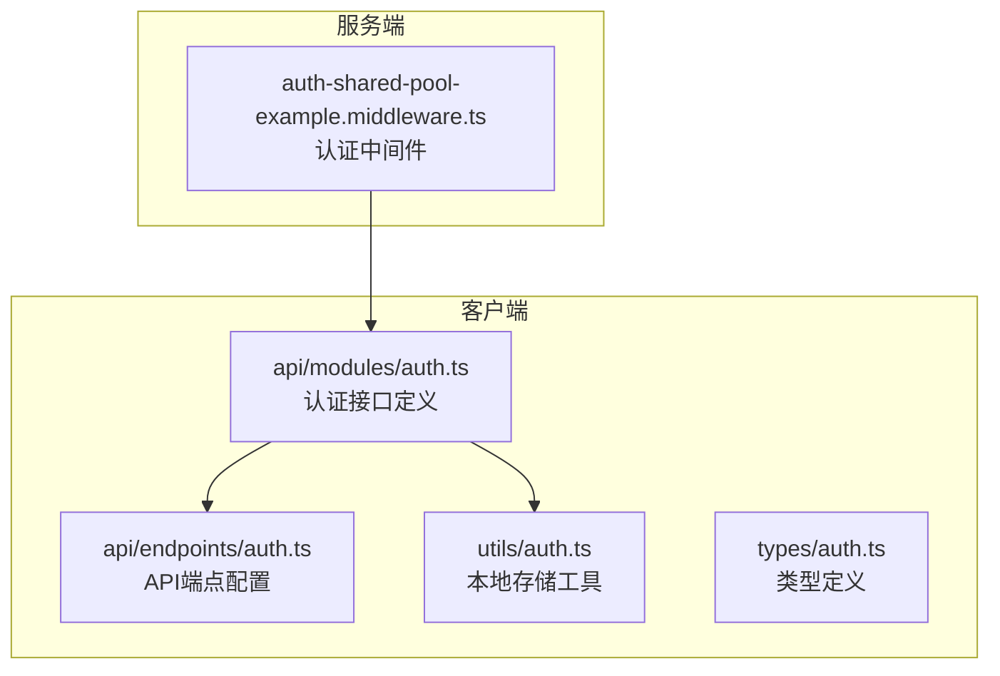
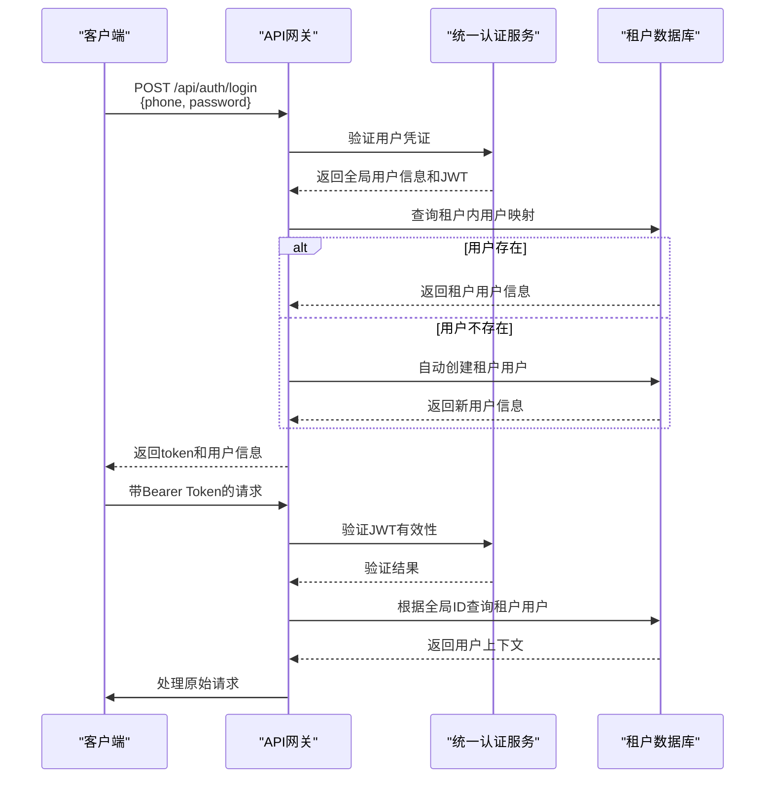
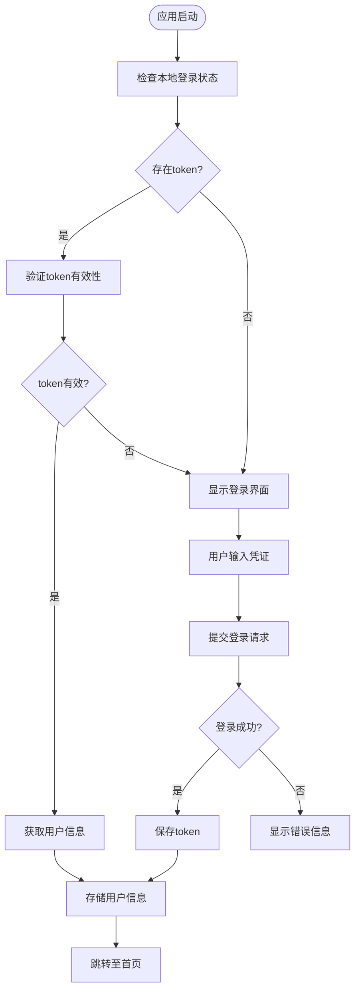
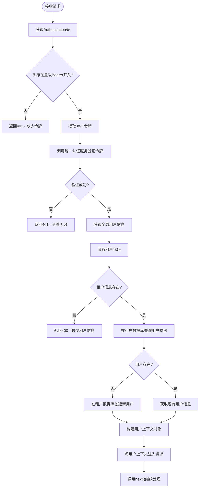
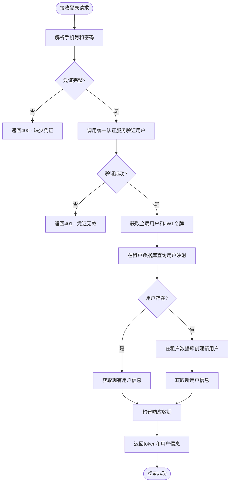
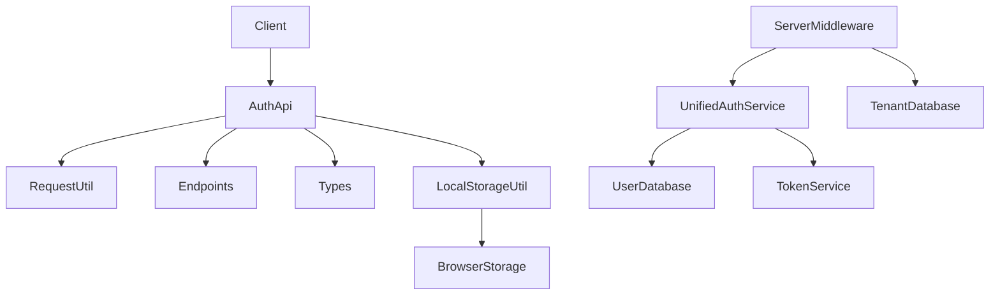

# 认证API

<cite>
**本文档引用的文件**  
- [auth-shared-pool-example.middleware.ts](file://auth-shared-pool-example.middleware.ts)
- [auth.ts](file://k.yyup.com/client/src/api/modules/auth.ts)
- [auth.ts](file://unified-tenant-system/client/src/api/modules/auth.ts)
- [endpoints/auth.ts](file://k.yyup.com/client/src/api/endpoints/auth.ts)
- [types/auth.ts](file://k.yyup.com/client/src/types/auth.ts)
- [utils/auth.ts](file://k.yyup.com/client/src/utils/auth.ts)
</cite>

## 目录
1. [简介](#简介)
2. [项目结构](#项目结构)
3. [核心组件](#核心组件)
4. [架构概述](#架构概述)
5. [详细组件分析](#详细组件分析)
6. [依赖分析](#依赖分析)
7. [性能考虑](#性能考虑)
8. [故障排除指南](#故障排除指南)
9. [结论](#结论)

## 简介
本文档详细描述了系统的认证API，涵盖用户登录、登出、令牌刷新和会话管理等核心功能。文档重点说明了JWT令牌的生成与验证流程、多租户环境下的用户身份映射机制以及安全最佳实践。系统采用统一认证服务与租户本地用户数据库相结合的方式，确保跨租户身份的一致性与安全性。

## 项目结构
认证功能分布在客户端与服务端多个模块中，采用分层架构设计，分离接口定义、业务逻辑与工具函数。



**Diagram sources**
- [auth.ts](file://k.yyup.com/client/src/api/modules/auth.ts)
- [endpoints/auth.ts](file://k.yyup.com/client/src/api/endpoints/auth.ts)
- [utils/auth.ts](file://k.yyup.com/client/src/utils/auth.ts)
- [auth-shared-pool-example.middleware.ts](file://auth-shared-pool-example.middleware.ts)

**Section sources**
- [auth-shared-pool-example.middleware.ts](file://auth-shared-pool-example.middleware.ts)
- [auth.ts](file://k.yyup.com/client/src/api/modules/auth.ts)
- [endpoints/auth.ts](file://k.yyup.com/client/src/api/endpoints/auth.ts)

## 核心组件
系统认证体系由客户端API封装、服务端中间件和统一认证服务三部分构成。客户端负责发起认证请求并管理本地会话状态，服务端中间件验证JWT令牌并映射租户用户上下文，统一认证服务处理核心的身份验证逻辑。

**Section sources**
- [auth-shared-pool-example.middleware.ts](file://auth-shared-pool-example.middleware.ts)
- [auth.ts](file://k.yyup.com/client/src/api/modules/auth.ts)

## 架构概述
系统采用基于JWT的无状态认证架构，结合多租户数据库隔离策略，实现安全高效的用户身份验证。



**Diagram sources**
- [auth-shared-pool-example.middleware.ts](file://auth-shared-pool-example.middleware.ts)
- [auth.ts](file://k.yyup.com/client/src/api/modules/auth.ts)

## 详细组件分析

### 客户端认证模块分析
客户端通过模块化方式组织认证逻辑，分离接口、类型和本地状态管理。

#### 接口定义
```mermaid
classDiagram
class LoginRequest {
+username : string
+password : string
}
class LoginResponse {
+token : string
+refreshToken? : string
+user : User
}
class User {
+id : string | number
+username : string
+email? : string
+realName? : string
+phone? : string
+role? : string
+roles : Role[]
+permissions? : string[]
}
class Role {
+id : string | number
+name : string
+code : string
}
class authApi {
+login(data : LoginRequest) : Promise~ApiResponse~LoginResponse~~
+logout() : Promise~ApiResponse~
+getUserInfo() : Promise~ApiResponse~User~~
+refreshToken(data : { refreshToken : string }) : Promise~ApiResponse~{ token : string; refreshToken? : string }~~
}
LoginResponse --> User
User --> Role : "包含"
authApi --> LoginRequest : "使用"
authApi --> LoginResponse : "返回"
```

**Diagram sources**
- [auth.ts](file://k.yyup.com/client/src/api/modules/auth.ts)
- [types/auth.ts](file://k.yyup.com/client/src/types/auth.ts)

#### 本地状态管理


**Diagram sources**
- [utils/auth.ts](file://k.yyup.com/client/src/utils/auth.ts)

### 服务端认证中间件分析
服务端认证中间件实现了JWT验证、租户用户映射和上下文注入的完整流程。

#### Token验证流程


**Diagram sources**
- [auth-shared-pool-example.middleware.ts](file://auth-shared-pool-example.middleware.ts#L19-L136)

#### 登录处理流程


**Diagram sources**
- [auth-shared-pool-example.middleware.ts](file://auth-shared-pool-example.middleware.ts#L140-L253)

## 依赖分析
认证系统依赖多个外部服务和内部组件，形成清晰的依赖关系。



**Diagram sources**
- [auth-shared-pool-example.middleware.ts](file://auth-shared-pool-example.middleware.ts)
- [auth.ts](file://k.yyup.com/client/src/api/modules/auth.ts)
- [utils/auth.ts](file://k.yyup.com/client/src/utils/auth.ts)

**Section sources**
- [auth-shared-pool-example.middleware.ts](file://auth-shared-pool-example.middleware.ts)
- [auth.ts](file://k.yyup.com/client/src/api/modules/auth.ts)
- [utils/auth.ts](file://k.yyup.com/client/src/utils/auth.ts)

## 性能考虑
认证流程经过优化，采用连接池和缓存策略减少数据库查询开销。JWT验证为无状态操作，不依赖服务器会话存储，支持水平扩展。租户数据库查询使用参数化语句和索引，确保查询效率。

## 故障排除指南
常见认证问题包括令牌无效、租户信息缺失和用户映射失败。排查时应首先检查请求头格式，确认Authorization头以"Bearer "开头。其次验证租户上下文是否正确传递。最后检查统一认证服务的可用性及网络连通性。

**Section sources**
- [auth-shared-pool-example.middleware.ts](file://auth-shared-pool-example.middleware.ts)
- [utils/auth.ts](file://k.yyup.com/client/src/utils/auth.ts)

## 结论
本认证系统通过JWT令牌、统一认证服务和租户用户映射机制，实现了安全、可扩展的多租户身份验证解决方案。系统设计考虑了自动用户创建、上下文注入和错误处理等关键场景，为应用程序提供了可靠的认证基础。