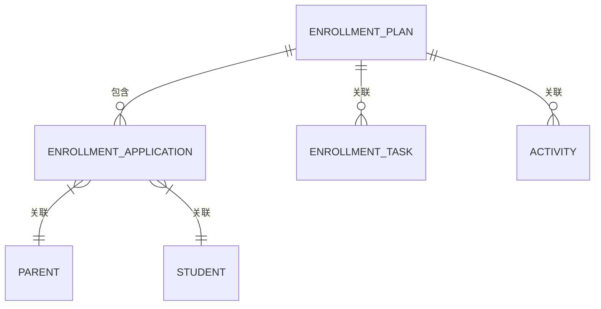
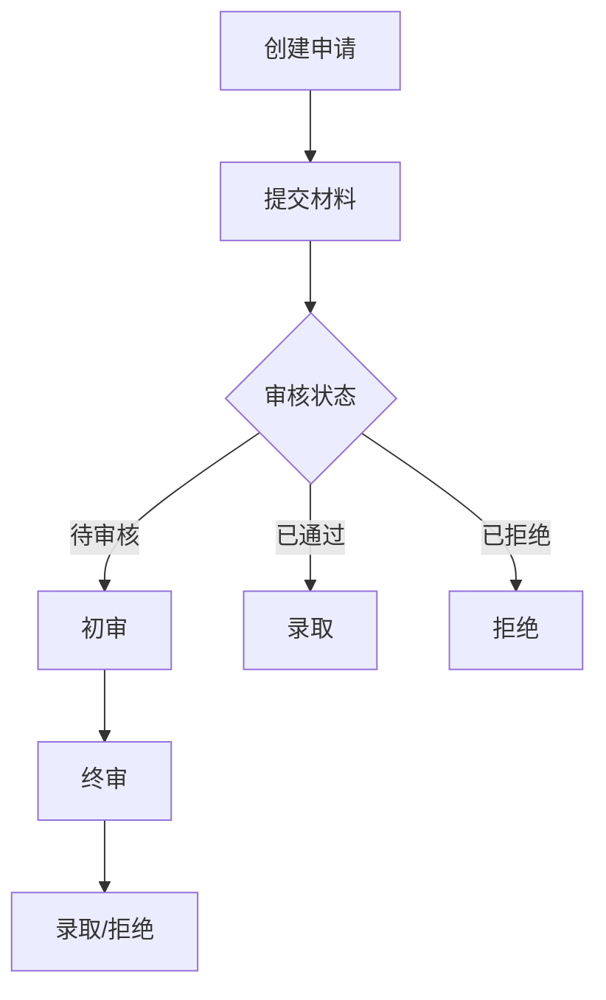
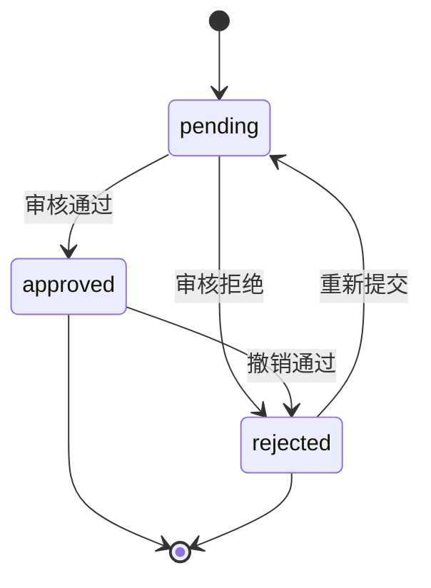
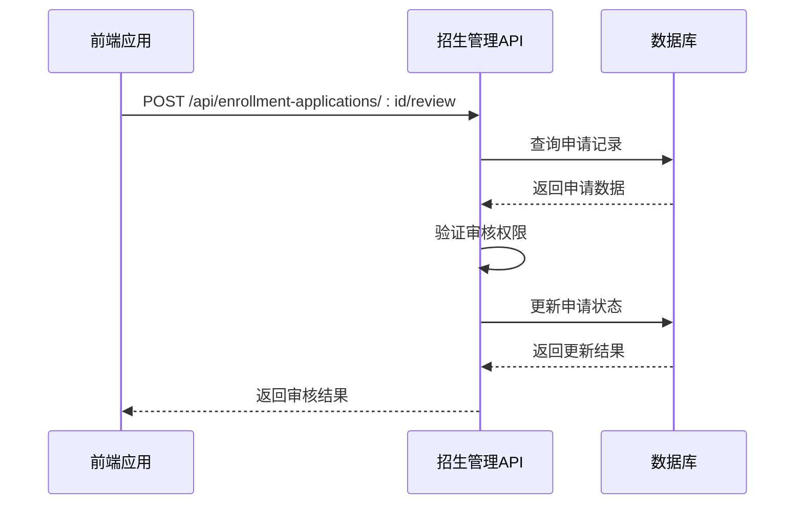

# 招生管理API

<cite>
**本文档引用文件**   
- [enrollment-application.controller.ts](file://server/src/controllers/enrollment-application.controller.ts)
- [enrollment-plan.controller.ts](file://server/src/controllers/enrollment-plan.controller.ts)
- [enrollment-statistics.controller.ts](file://server/src/controllers/enrollment-statistics.controller.ts)
- [enrollment-application.model.ts](file://server/src/models/enrollment-application.model.ts)
- [enrollment-plan.model.ts](file://server/src/models/enrollment-plan.model.ts)
- [enrollment.ts](file://client/src/api/endpoints/enrollment.ts)
- [enrollment-center.ts](file://client/src/api/enrollment-center.ts)
- [enrollment-plan.ts](file://client/src/api/enrollment-plan.ts)
- [enrollment.ts](file://client/src/types/enrollment.ts)
</cite>

## 目录
1. [简介](#简介)
2. [核心API端点](#核心api端点)
3. [招生计划管理](#招生计划管理)
4. [报名申请管理](#报名申请管理)
5. [审批流程处理](#审批流程处理)
6. [统计查询功能](#统计查询功能)
7. [数据模型与关联](#数据模型与关联)
8. [前端调用示例](#前端调用示例)
9. [状态机与流程图](#状态机与流程图)

## 简介
招生管理API提供了一套完整的招生流程管理解决方案，涵盖招生计划创建、报名申请提交、审批流程处理和统计查询等核心功能。系统通过RESTful API接口实现前后端分离架构，支持多角色权限控制和数据可视化分析。

**Section sources**
- [enrollment-application.controller.ts](file://server/src/controllers/enrollment-application.controller.ts#L1-L709)
- [enrollment-plan.controller.ts](file://server/src/controllers/enrollment-plan.controller.ts#L1-L408)

## 核心API端点
招生管理API提供以下核心端点，支持CRUD操作和业务流程处理：

### 招生计划端点


**Diagram sources**
- [enrollment-plan.model.ts](file://server/src/models/enrollment-plan.model.ts#L1-L279)
- [enrollment-application.model.ts](file://server/src/models/enrollment-application.model.ts#L1-L173)

### 报名申请端点


**Diagram sources**
- [enrollment-application.controller.ts](file://server/src/controllers/enrollment-application.controller.ts#L1-L709)

## 招生计划管理
招生计划管理API支持招生计划的全生命周期管理。

### 创建招生计划
**HTTP方法**: POST  
**URL路径**: `/api/enrollment-plans`  
**请求头**: `Authorization: Bearer <token>`  
**请求体结构**:
```json
{
  "title": "2024年春季招生计划",
  "year": 2024,
  "semester": 1,
  "startDate": "2024-01-01",
  "endDate": "2024-03-31",
  "targetCount": 100,
  "ageRange": "3-6岁",
  "requirements": "身体健康，无传染病",
  "description": "春季招生计划详情"
}
```

**响应格式**:
```json
{
  "success": true,
  "message": "创建招生计划成功",
  "data": {
    "id": 1,
    "title": "2024年春季招生计划",
    "year": 2024,
    "semester": 1,
    "startDate": "2024-01-01",
    "endDate": "2024-03-31",
    "targetCount": 100,
    "currentCount": 0,
    "status": "draft",
    "createdAt": "2024-01-01T00:00:00Z",
    "updatedAt": "2024-01-01T00:00:00Z"
  }
}
```

### 更新招生计划状态
**HTTP方法**: PUT  
**URL路径**: `/api/enrollment-plans/:id/status`  
**请求体结构**:
```json
{
  "status": "active"
}
```

**有效状态值**:
- `draft`: 草稿
- `pending`: 待开始
- `in_progress`: 进行中
- `finished`: 已结束
- `cancelled`: 已取消

**Section sources**
- [enrollment-plan.controller.ts](file://server/src/controllers/enrollment-plan.controller.ts#L355-L390)
- [enrollment-plan.model.ts](file://server/src/models/enrollment-plan.model.ts#L22-L28)

## 报名申请管理
报名申请管理API支持学生报名申请的全流程管理。

### 提交报名申请
**HTTP方法**: POST  
**URL路径**: `/api/enrollment-applications`  
**请求头**: `Authorization: Bearer <token>`  
**请求体结构**:
```json
{
  "studentName": "张小明",
  "gender": "male",
  "birthDate": "2020-01-01",
  "parentId": 1,
  "planId": 1,
  "contactPhone": "13800000001",
  "applicationSource": "web"
}
```

**响应格式**:
```json
{
  "success": true,
  "message": "创建报名申请成功",
  "data": {
    "id": 1,
    "studentName": "张小明",
    "gender": "male",
    "birthDate": "2020-01-01",
    "parentId": 1,
    "planId": 1,
    "contactPhone": "13800000001",
    "applicationSource": "web",
    "status": "pending",
    "applyDate": "2024-01-01T00:00:00Z",
    "createdAt": "2024-01-01T00:00:00Z",
    "updatedAt": "2024-01-01T00:00:00Z"
  }
}
```

### 分页查询申请列表
**HTTP方法**: GET  
**URL路径**: `/api/enrollment-applications`  
**查询参数**:
- `page`: 页码（默认1）
- `pageSize`: 每页数量（默认10）
- `status`: 申请状态过滤
- `planId`: 招生计划ID过滤

**响应格式**:
```json
{
  "success": true,
  "message": "获取申请列表成功",
  "data": {
    "total": 5,
    "items": [
      {
        "id": 1,
        "studentName": "测试学生1",
        "gender": "male",
        "birthDate": "2020-01-01",
        "status": "pending",
        "applyDate": "2024-01-01T00:00:00Z",
        "parent": {
          "name": "测试家长1",
          "phone": "13800000001"
        }
      }
    ],
    "page": 1,
    "pageSize": 10
  }
}
```

**Section sources**
- [enrollment-application.controller.ts](file://server/src/controllers/enrollment-application.controller.ts#L386-L431)
- [enrollment-application.model.ts](file://server/src/models/enrollment-application.model.ts#L1-L173)

## 审批流程处理
审批流程API支持招生申请的审核和状态转换。

### 审核申请
**HTTP方法**: PUT  
**URL路径**: `/api/enrollment-applications/:id/review`  
**请求体结构**:
```json
{
  "status": "approved",
  "reviewNotes": "材料齐全，符合入学条件"
}
```

**状态转换规则**:
- `pending` → `approved`: 通过审核
- `pending` → `rejected`: 拒绝申请
- `approved` → `rejected`: 撤销通过（需特殊权限）

**响应格式**:
```json
{
  "success": true,
  "message": "审核申请成功",
  "data": {
    "id": 1,
    "status": "approved",
    "reviewNotes": "材料齐全，符合入学条件",
    "reviewerId": 1,
    "reviewDate": "2024-01-02T00:00:00Z"
  }
}
```

### 添加申请材料
**HTTP方法**: POST  
**URL路径**: `/api/enrollment-applications/:id/materials`  
**请求体结构**:
```json
{
  "materialType": "身份证",
  "filePath": "/uploads/materials/123.jpg",
  "fileName": "身份证.jpg"
}
```

**Section sources**
- [enrollment-application.controller.ts](file://server/src/controllers/enrollment-application.controller.ts#L439-L472)
- [enrollment-application.controller.ts](file://server/src/controllers/enrollment-application.controller.ts#L481-L521)

## 统计查询功能
统计查询API提供招生数据的多维度分析。

### 获取申请统计
**HTTP方法**: GET  
**URL路径**: `/api/enrollment-applications/statistics`  
**响应格式**:
```json
{
  "success": true,
  "message": "获取申请统计成功",
  "data": {
    "total": 100,
    "pending": 20,
    "approved": 60,
    "rejected": 15,
    "reviewing": 5,
    "byMonth": [
      {
        "month": "2024-01",
        "count": 30
      }
    ],
    "bySource": [
      {
        "source": "web",
        "count": 50
      }
    ]
  }
}
```

### 获取招生计划统计
**HTTP方法**: GET  
**URL路径**: `/api/enrollment-plans/:id/statistics`  
**响应格式**:
```json
{
  "success": true,
  "message": "获取招生计划统计成功",
  "data": {
    "totalApplications": 75,
    "approvedApplications": 50,
    "rejectedApplications": 15,
    "pendingApplications": 10,
    "completionRate": 0.5
  }
}
```

**Section sources**
- [enrollment-application.controller.ts](file://server/src/controllers/enrollment-application.controller.ts#L643-L708)
- [enrollment-plan.controller.ts](file://server/src/controllers/enrollment-plan.controller.ts#L165-L186)

## 数据模型与关联
招生管理系统的数据模型设计遵循规范化原则，确保数据一致性和完整性。

### EnrollmentApplication模型
```typescript
export class EnrollmentApplication extends Model {
  declare id: number;
  declare planId: number;
  declare parentId: number | null;
  declare studentName: string;
  declare gender: string;
  declare birthDate: Date;
  declare status: ApplicationStatus;
  declare applyDate: Date;
  declare contactPhone: string;
  declare applicationSource: string | null;
  declare createdBy: number;
}
```

### EnrollmentPlan模型
```typescript
export class EnrollmentPlan extends Model {
  declare id: number;
  declare kindergartenId: number;
  declare title: string;
  declare year: number;
  declare semester: Semester;
  declare startDate: Date;
  declare endDate: Date;
  declare targetCount: number;
  declare ageRange: string;
  declare status: EnrollmentPlanStatus;
}
```

**模型关联**:
- 招生计划(EnrollmentPlan)与报名申请(EnrollmentApplication)为一对多关系
- 报名申请与家长(Parent)、学生(Student)为多对一关系
- 报名申请与申请材料(Material)为一对多关系

**Section sources**
- [enrollment-application.model.ts](file://server/src/models/enrollment-application.model.ts#L27-L55)
- [enrollment-plan.model.ts](file://server/src/models/enrollment-plan.model.ts#L41-L75)

## 前端调用示例
以下是Vue组件中使用Axios调用招生管理API的示例。

### 创建招生计划
```vue
<script setup lang="ts">
import { ref } from 'vue'
import { request } from '@/utils/request'

const createPlan = async () => {
  const planData = {
    title: '2024年春季招生计划',
    year: 2024,
    semester: 1,
    startDate: '2024-01-01',
    endDate: '2024-03-31',
    targetCount: 100,
    ageRange: '3-6岁'
  }

  try {
    const response = await request.post('/api/enrollment-plans', planData)
    if (response.success) {
      console.log('创建成功:', response.data)
    }
  } catch (error) {
    console.error('创建失败:', error)
  }
}
</script>
```

### 查询报名申请列表
```typescript
import { getEnrollmentApplications } from '@/api/enrollment-plan'

const fetchApplications = async () => {
  try {
    const response = await getEnrollmentApplications({
      page: 1,
      pageSize: 10,
      status: 'pending'
    })
    
    if (response.success) {
      applications.value = response.data.items
      total.value = response.data.total
    }
  } catch (error) {
    console.error('获取申请列表失败:', error)
  }
}
```

**Section sources**
- [enrollment-center.ts](file://client/src/api/enrollment-center.ts#L228-L437)
- [enrollment-plan.ts](file://client/src/api/enrollment-plan.ts#L27-L398)

## 状态机与流程图
招生审批流程遵循严格的状态转换规则。

### 招生申请状态机


**状态说明**:
- `pending`: 待审核状态，申请已提交但未审核
- `approved`: 已通过状态，申请审核通过
- `rejected`: 已拒绝状态，申请审核未通过

### 审批流程序列图


**Diagram sources**
- [enrollment-application.controller.ts](file://server/src/controllers/enrollment-application.controller.ts#L439-L472)