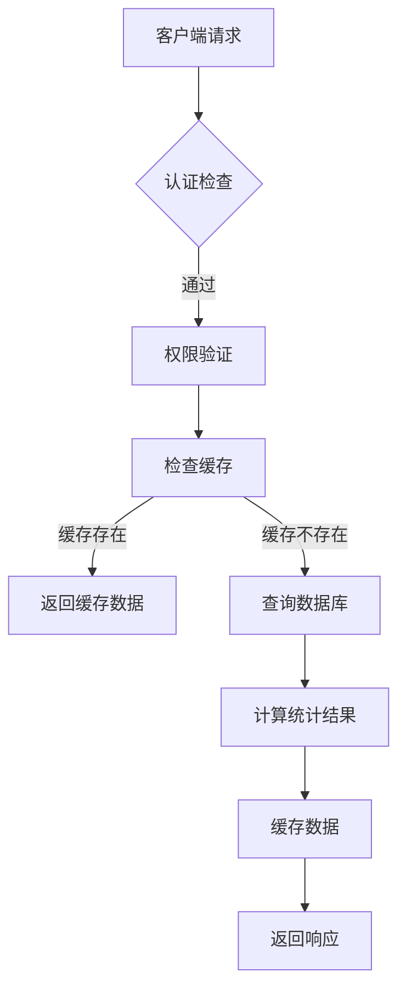
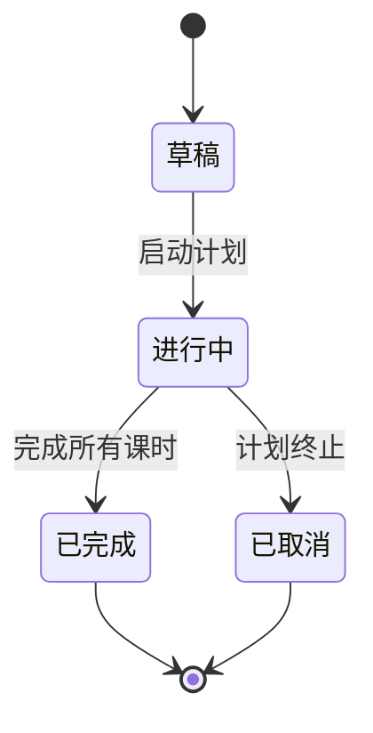
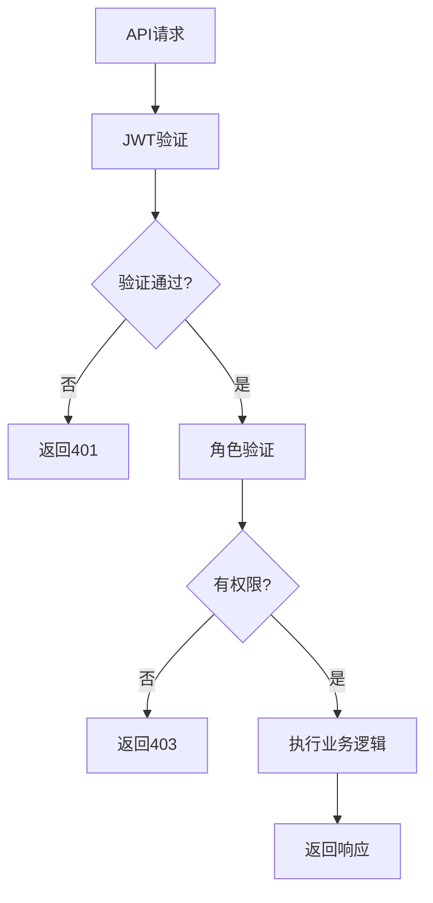
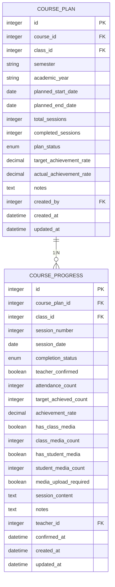

# 教学计划API

<cite>
**本文档引用的文件**   
- [teaching-center.controller.ts](file://k.yyup.com/server/src/controllers/teaching-center.controller.ts)
- [teaching-center.service.ts](file://k.yyup.com/server/src/services/teaching-center.service.ts)
- [teaching-center.routes.ts](file://k.yyup.com/server/src/routes/teaching-center.routes.ts)
- [teaching-center.ts](file://k.yyup.com/client/src/api/endpoints/teaching-center.ts)
- [course-plan.model.ts](file://k.yyup.com/server/src/models/course-plan.model.ts)
- [course-progress.model.ts](file://k.yyup.com/server/src/models/course-progress.model.ts)
</cite>

## 目录
1. [简介](#简介)
2. [核心功能概述](#核心功能概述)
3. [API端点详细说明](#api端点详细说明)
4. [教学计划状态管理](#教学计划状态管理)
5. [权限验证规则](#权限验证规则)
6. [API与数据模型映射](#api与数据模型映射)
7. [前端调用示例](#前端调用示例)
8. [日历视图集成](#日历视图集成)

## 简介
教学计划API为幼儿园管理系统提供完整的教学进度跟踪和课程管理功能。该API支持课程计划创建、教学进度跟踪、教案管理与共享等核心功能，帮助教师和管理人员有效监控教学活动的执行情况。

**API特点：**
- 支持多维度教学数据统计
- 提供详细的课程进度跟踪
- 实现教学媒体文件的管理
- 支持户外训练和校外展示活动记录
- 完善的权限控制机制

## 核心功能概述
教学计划API主要包含以下核心功能模块：

1. **课程进度管理**：跟踪课程计划的执行情况，记录每节课的完成状态、出勤率和达标率
2. **教学媒体管理**：上传和管理与课程相关的照片、视频等媒体文件
3. **户外训练记录**：记录班级户外训练活动的详细信息
4. **校外展示管理**：管理班级参加校外展示活动的情况
5. **锦标赛组织**：支持全员锦标赛的创建和状态管理

这些功能共同构成了完整的教学活动跟踪体系，为教学质量管理提供数据支持。

## API端点详细说明

### 课程进度相关API

#### 获取课程进度统计数据


**HTTP方法**: GET  
**URL路径**: `/api/teaching-center/course-progress`  
**请求头**: 
- `Authorization: Bearer <token>`

**请求参数**:
- `semester` (可选): 学期，如"2024春季"
- `academic_year` (可选): 学年，如"2024-2025"
- `class_id` (可选): 班级ID

**响应格式**:
```json
{
  "success": true,
  "data": {
    "overall_stats": {
      "total_plans": 5,
      "active_plans": 3,
      "completed_plans": 2,
      "total_sessions": 80,
      "completed_sessions": 60,
      "confirmed_sessions": 55,
      "overall_completion_rate": 75,
      "overall_confirmation_rate": 69,
      "overall_achievement_rate": 82,
      "plans_with_media": 4
    },
    "course_plans": [
      {
        "plan_id": 1,
        "course_id": 101,
        "class_id": 201,
        "semester": "2024春季",
        "academic_year": "2024-2025",
        "total_sessions": 16,
        "completed_sessions": 12,
        "confirmed_sessions": 11,
        "completion_rate": 75,
        "confirmation_rate": 69,
        "avg_achievement_rate": 85,
        "plan_status": "active",
        "has_media": true,
        "media_stats": {
          "class_photo": 24,
          "class_video": 8,
          "student_photo": 48,
          "student_video": 12
        }
      }
    ]
  }
}
```

**Section sources**
- [teaching-center.controller.ts](file://k.yyup.com/server/src/controllers/teaching-center.controller.ts#L14-L56)
- [teaching-center.service.ts](file://k.yyup.com/server/src/services/teaching-center.service.ts#L22-L119)
- [teaching-center.routes.ts](file://k.yyup.com/server/src/routes/teaching-center.routes.ts#L116-L135)

#### 获取班级详细进度
**HTTP方法**: GET  
**URL路径**: `/api/teaching-center/class-progress/{classId}/{coursePlanId}`  
**请求头**: 
- `Authorization: Bearer <token>`

**路径参数**:
- `classId`: 班级ID
- `coursePlanId`: 课程计划ID

**响应格式**:
```json
{
  "success": true,
  "data": {
    "class_info": {
      "id": 201,
      "name": "小班A",
      "student_count": 25
    },
    "course_plan": {
      "id": 1,
      "course": {
        "id": 101,
        "course_name": "脑科学课程",
        "course_description": "基础脑科学启蒙课程"
      },
      "semester": "2024春季",
      "academic_year": "2024-2025",
      "target_achievement_rate": 80,
      "total_sessions": 16,
      "completed_sessions": 12
    },
    "student_progress": [
      {
        "student_id": 301,
        "student_name": "张小明",
        "student_no": "S001",
        "photo_url": "/uploads/photos/301.jpg",
        "attended_sessions": 12,
        "achieved_sessions": 10,
        "achievement_rate": 83,
        "is_target_achieved": true
      }
    ],
    "summary": {
      "total_students": 25,
      "achieved_students": 20,
      "class_achievement_rate": 80
    }
  }
}
```

**Section sources**
- [teaching-center.controller.ts](file://k.yyup.com/server/src/controllers/teaching-center.controller.ts#L61-L83)
- [teaching-center.service.ts](file://k.yyup.com/server/src/services/teaching-center.service.ts#L272-L339)

#### 教师确认完成课程
**HTTP方法**: PUT  
**URL路径**: `/api/teaching-center/confirm-completion/{progressId}`  
**请求头**: 
- `Authorization: Bearer <token>`

**路径参数**:
- `progressId`: 进度记录ID

**请求体**:
```json
{
  "attendance_count": 24,
  "target_achieved_count": 20,
  "session_content": "本节课学习了基础认知技能，通过游戏方式进行了实践",
  "notes": "大部分学生表现良好，个别学生需要额外关注"
}
```

**响应格式**:
```json
{
  "success": true,
  "message": "课程完成确认成功",
  "data": {
    "progress_id": 501,
    "completion_status": "completed",
    "achievement_rate": 83,
    "confirmed_at": "2024-03-15T10:30:00.000Z"
  }
}
```

**Section sources**
- [teaching-center.controller.ts](file://k.yyup.com/server/src/controllers/teaching-center.controller.ts#L89-L132)
- [teaching-center.service.ts](file://k.yyup.com/server/src/services/teaching-center.service.ts#L370-L425)

### 户外训练相关API

#### 获取户外训练统计数据
**HTTP方法**: GET  
**URL路径**: `/api/teaching-center/outdoor-training`  
**请求头**: 
- `Authorization: Bearer <token>`

**请求参数**:
- `semester` (可选): 学期
- `academic_year` (可选): 学年

**响应格式**:
```json
{
  "success": true,
  "message": "获取户外训练统计成功",
  "data": {
    "overview": {
      "total_weeks": 16,
      "outdoor_training": {
        "completed_weeks": 12,
        "average_rate": 85
      },
      "departure_display": {
        "completed_weeks": 10,
        "average_rate": 78
      }
    },
    "class_statistics": [
      {
        "class_id": 201,
        "class_name": "小班A",
        "outdoor_training_completed": 12,
        "departure_display_completed": 10,
        "outdoor_training_rate": 85,
        "departure_display_rate": 78,
        "total_completed": 22,
        "total_rate": 82,
        "has_media": true,
        "media_count": 15
      }
    ]
  }
}
```

**Section sources**
- [teaching-center.controller.ts](file://k.yyup.com/server/src/controllers/teaching-center.controller.ts#L140-L169)
- [teaching-center.service.ts](file://k.yyup.com/server/src/services/teaching-center.service.ts#L449-L568)

#### 记录户外训练活动
**HTTP方法**: POST  
**URL路径**: `/api/teaching-center/outdoor-training`  
**请求头**: 
- `Authorization: Bearer <token>`

**请求体**:
```json
{
  "class_id": 201,
  "week_number": 5,
  "training_type": "outdoor_training",
  "training_date": "2024-03-15",
  "location": "幼儿园操场",
  "attendance_count": 24,
  "target_achieved_count": 22,
  "activities_content": "进行户外体能训练，包括跑步、跳跃等",
  "notes": "天气晴朗，学生参与度高"
}
```

**响应格式**:
```json
{
  "success": true,
  "message": "户外训练记录成功",
  "data": {
    "id": 601,
    "training_type": "outdoor_training",
    "completion_status": "completed",
    "achievement_rate": 92,
    "created_at": "2024-03-15T10:30:00.000Z"
  }
}
```

**Section sources**
- [teaching-center.controller.ts](file://k.yyup.com/server/src/controllers/teaching-center.controller.ts#L204-L233)
- [teaching-center.service.ts](file://k.yyup.com/server/src/services/teaching-center.service.ts#L628-L647)

### 校外展示相关API

#### 获取校外展示统计数据
**HTTP方法**: GET  
**URL路径**: `/api/teaching-center/external-display`  
**请求头**: 
- `Authorization: Bearer <token>`

**请求参数**:
- `semester` (可选): 学期
- `academic_year` (可选): 学年

**响应格式**:
```json
{
  "success": true,
  "message": "获取校外展示统计成功",
  "data": {
    "overview": {
      "total_activities": 8,
      "completed_activities": 6,
      "completion_rate": 75,
      "average_achievement_rate": 82,
      "semester_total_outings": 6,
      "all_time_total_outings": 24
    },
    "class_statistics": [
      {
        "class_id": 201,
        "class_name": "小班A",
        "semester_outings": 3,
        "total_outings": 12,
        "achievement_rate": 85,
        "has_media": true,
        "media_count": 8
      }
    ]
  }
}
```

**Section sources**
- [teaching-center.controller.ts](file://k.yyup.com/server/src/controllers/teaching-center.controller.ts#L242-L269)
- [teaching-center.service.ts](file://k.yyup.com/server/src/services/teaching-center.service.ts#L654-L773)

### 锦标赛相关API

#### 创建锦标赛
**HTTP方法**: POST  
**URL路径**: `/api/teaching-center/championship`  
**请求头**: 
- `Authorization: Bearer <token>`

**请求体**:
```json
{
  "championship_name": "春季全员锦标赛",
  "championship_type": "sports",
  "championship_date": "2024-06-15",
  "location": "市体育馆",
  "target_participant_count": 100,
  "budget_amount": 5000,
  "awards_description": "一等奖3名，二等奖5名，三等奖10名",
  "notes": "需要提前准备奖品和场地"
}
```

**响应格式**:
```json
{
  "success": true,
  "message": "锦标赛创建成功",
  "data": {
    "id": 701,
    "championship_name": "春季全员锦标赛",
    "status": "pending",
    "created_at": "2024-03-15T10:30:00.000Z"
  }
}
```

**Section sources**
- [teaching-center.controller.ts](file://k.yyup.com/server/src/controllers/teaching-center.controller.ts#L403-L433)
- [teaching-center.service.ts](file://k.yyup.com/server/src/services/teaching-center.service.ts#L415-L424)

### 教学媒体管理API

#### 上传教学媒体文件
**HTTP方法**: POST  
**URL路径**: `/api/teaching-center/media`  
**请求头**: 
- `Authorization: Bearer <token>`
- `Content-Type: multipart/form-data`

**请求体**:
- `file`: 媒体文件
- `recordType`: 记录类型 (course_progress, outdoor_training, external_display)
- `recordId`: 记录ID
- `mediaType`: 媒体类型 (class_photo, class_video, student_photo, student_video)
- `description`: 描述

**响应格式**:
```json
{
  "success": true,
  "message": "媒体文件上传成功",
  "data": {
    "id": 801,
    "file_url": "/uploads/media/801.jpg",
    "media_type": "class_photo",
    "description": "第5课时班级合影",
    "uploaded_at": "2024-03-15T10:30:00.000Z"
  }
}
```

**Section sources**
- [teaching-center.controller.ts](file://k.yyup.com/server/src/controllers/teaching-center.controller.ts#L469-L503)
- [teaching-center.service.ts](file://k.yyup.com/server/src/services/teaching-center.service.ts#L483-L490)

## 教学计划状态管理
教学计划API实现了完整的状态管理机制，确保教学活动的有序进行。

### 状态流转


### 状态定义
- **草稿(draft)**: 计划已创建但未启动，可进行编辑
- **进行中(active)**: 计划已启动，正在执行中
- **已完成(completed)**: 计划已成功完成所有课时
- **已取消(cancelled)**: 计划因故终止

### 状态转换规则
1. 草稿 → 进行中：当计划的开始日期到达或手动启动时
2. 进行中 → 已完成：当所有课时完成且达标率达到目标值时
3. 进行中 → 已取消：当计划因特殊原因需要终止时

**Section sources**
- [course-plan.model.ts](file://k.yyup.com/server/src/models/course-plan.model.ts#L18-L173)

## 权限验证规则
教学计划API实施了严格的权限控制，确保数据安全和操作合规。

### 角色权限矩阵
| 功能 | 园长 | 教师 | 管理员 |
|------|------|------|--------|
| 查看所有数据 | ✓ | ✗ | ✓ |
| 查看负责班级数据 | ✓ | ✓ | ✓ |
| 创建课程计划 | ✓ | ✓ | ✓ |
| 确认课程完成 | ✓ | ✓ | ✓ |
| 创建锦标赛 | ✓ | ✗ | ✓ |
| 记录户外训练 | ✓ | ✓ | ✓ |

### 权限验证流程


**Section sources**
- [teaching-center.routes.ts](file://k.yyup.com/server/src/routes/teaching-center.routes.ts#L133-L134)
- [teaching-center.routes.ts](file://k.yyup.com/server/src/routes/teaching-center.routes.ts#L281-L282)

## API与数据模型映射
教学计划API与后端数据模型紧密对应，确保数据的一致性和完整性。

### 主要数据模型


### 模型属性说明
**课程计划模型(CoursePlan)**
- `id`: 计划唯一标识
- `course_id`: 关联的课程ID
- `class_id`: 关联的班级ID
- `semester`: 学期
- `academic_year`: 学年
- `total_sessions`: 总课时数
- `completed_sessions`: 已完成课时数
- `plan_status`: 计划状态

**课程进度模型(CourseProgress)**
- `id`: 进度记录唯一标识
- `course_plan_id`: 关联的课程计划ID
- `session_number`: 第几课时
- `attendance_count`: 出勤人数
- `target_achieved_count`: 达标人数
- `achievement_rate`: 达标率
- `teacher_confirmed`: 教师确认状态

**Section sources**
- [course-plan.model.ts](file://k.yyup.com/server/src/models/course-plan.model.ts)
- [course-progress.model.ts](file://k.yyup.com/server/src/models/course-progress.model.ts)

## 前端调用示例
以下示例展示如何在Vue组件中使用Axios调用教学计划API。

### 基础API调用
```javascript
// api/teaching-center.js
import axios from 'axios';

const apiClient = axios.create({
  baseURL: '/api',
  headers: {
    'Content-Type': 'application/json'
  }
});

// 请求拦截器
apiClient.interceptors.request.use(
  config => {
    const token = localStorage.getItem('token');
    if (token) {
      config.headers.Authorization = `Bearer ${token}`;
    }
    return config;
  },
  error => Promise.reject(error)
);

// 响应拦截器
apiClient.interceptors.response.use(
  response => response,
  error => {
    if (error.response?.status === 401) {
      // 未授权，跳转到登录页
      localStorage.removeItem('token');
      window.location.href = '/login';
    }
    return Promise.reject(error);
  }
);

export default {
  // 获取课程进度统计数据
  getCourseProgressStats(params) {
    return apiClient.get('/teaching-center/course-progress', { params });
  },

  // 获取班级详细进度
  getClassDetailedProgress(classId, coursePlanId) {
    return apiClient.get(`/teaching-center/class-progress/${classId}/${coursePlanId}`);
  },

  // 教师确认完成课程
  confirmCourseCompletion(progressId, data) {
    return apiClient.put(`/teaching-center/confirm-completion/${progressId}`, data);
  }
};
```

### Vue组件集成
```vue
<template>
  <div class="teaching-plan">
    <h2>教学计划管理</h2>
    
    <!-- 课程进度统计 -->
    <div class="stats-card">
      <h3>课程进度统计</h3>
      <div v-if="loading">加载中...</div>
      <div v-else-if="error">{{ error }}</div>
      <div v-else>
        <p>总计划数: {{ stats.overall_stats.total_plans }}</p>
        <p>完成率: {{ stats.overall_stats.overall_completion_rate }}%</p>
        <p>平均达标率: {{ stats.overall_stats.overall_achievement_rate }}%</p>
      </div>
    </div>

    <!-- 课程计划列表 -->
    <div class="plan-list">
      <h3>课程计划</h3>
      <ul>
        <li v-for="plan in stats.course_plans" :key="plan.plan_id">
          <span>{{ plan.course_id }}</span>
          <span>完成: {{ plan.completed_sessions }}/{{ plan.total_sessions }}</span>
          <span>达标率: {{ plan.avg_achievement_rate }}%</span>
          <button @click="viewDetails(plan.class_id, plan.plan_id)">
            查看详情
          </button>
        </li>
      </ul>
    </div>
  </div>
</template>

<script>
import teachingCenterApi from '@/api/teaching-center';

export default {
  name: 'TeachingPlan',
  data() {
    return {
      stats: null,
      loading: false,
      error: null
    };
  },
  async mounted() {
    await this.loadStats();
  },
  methods: {
    async loadStats() {
      this.loading = true;
      this.error = null;
      
      try {
        const response = await teachingCenterApi.getCourseProgressStats({
          semester: '2024春季'
        });
        
        if (response.data.success) {
          this.stats = response.data.data;
        } else {
          this.error = response.data.message;
        }
      } catch (err) {
        this.error = '获取数据失败，请重试';
        console.error('Error loading stats:', err);
      } finally {
        this.loading = false;
      }
    },
    
    async viewDetails(classId, coursePlanId) {
      try {
        const response = await teachingCenterApi.getClassDetailedProgress(
          classId, 
          coursePlanId
        );
        
        if (response.data.success) {
          // 处理详情数据
          console.log('班级详细进度:', response.data.data);
        }
      } catch (err) {
        console.error('Error loading details:', err);
      }
    }
  }
};
</script>
```

**Section sources**
- [teaching-center.ts](file://k.yyup.com/client/src/api/endpoints/teaching-center.ts)

## 日历视图集成
教学计划API可以与日历视图组件集成，提供直观的教学进度展示。

### 日历数据格式化
```javascript
// utils/calendar.js
export function formatTeachingCalendarData(stats) {
  const events = [];
  
  // 将课程计划转换为日历事件
  stats.course_plans.forEach(plan => {
    // 假设每节课间隔一周
    const startDate = new Date();
    for (let i = 1; i <= plan.total_sessions; i++) {
      const sessionDate = new Date(startDate);
      sessionDate.setDate(startDate.getDate() + (i - 1) * 7);
      
      events.push({
        id: `${plan.plan_id}-${i}`,
        title: `第${i}课时`,
        start: sessionDate,
        end: sessionDate,
        className: getEventClass(plan, i),
        extendedProps: {
          planId: plan.plan_id,
          sessionId: i,
          completionRate: plan.completion_rate,
          achievementRate: plan.avg_achievement_rate
        }
      });
    }
  });
  
  return events;
}

function getEventClass(plan, sessionId) {
  if (sessionId <= plan.completed_sessions) {
    return 'event-completed'; // 已完成
  } else if (sessionId === plan.completed_sessions + 1) {
    return 'event-current'; // 当前课时
  } else {
    return 'event-upcoming'; // 未开始
  }
}
```

### FullCalendar集成
```vue
<template>
  <div class="calendar-view">
    <FullCalendar
      :options="calendarOptions"
      @event-click="handleEventClick"
    />
  </div>
</template>

<script>
import FullCalendar from '@fullcalendar/vue3';
import dayGridPlugin from '@fullcalendar/daygrid';
import interactionPlugin from '@fullcalendar/interaction';
import { formatTeachingCalendarData } from '@/utils/calendar';

export default {
  components: {
    FullCalendar
  },
  data() {
    return {
      calendarOptions: {
        plugins: [dayGridPlugin, interactionPlugin],
        initialView: 'dayGridMonth',
        headerToolbar: {
          left: 'prev,next today',
          center: 'title',
          right: 'dayGridMonth,dayGridWeek'
        },
        events: [],
        eventClassNames: ['teaching-event'],
        eventClick: this.handleEventClick
      }
    };
  },
  async mounted() {
    await this.loadCalendarData();
  },
  methods: {
    async loadCalendarData() {
      try {
        const response = await this.$api.teachingCenter.getCourseProgressStats();
        if (response.data.success) {
          const events = formatTeachingCalendarData(response.data.data);
          this.calendarOptions.events = events;
        }
      } catch (err) {
        console.error('Failed to load calendar data:', err);
      }
    },
    
    handleEventClick(info) {
      const event = info.event;
      const planId = event.extendedProps.planId;
      const sessionId = event.extendedProps.sessionId;
      
      // 显示课时详情
      this.$emit('session-selected', { planId, sessionId });
    }
  }
};
</script>

<style>
.teaching-event {
  border-radius: 4px;
  font-size: 12px;
}

.event-completed {
  background-color: #4CAF50;
  color: white;
}

.event-current {
  background-color: #2196F3;
  color: white;
}

.event-upcoming {
  background-color: #9E9E9E;
  color: white;
}
</style>
```

**Section sources**
- [teaching-center.ts](file://k.yyup.com/client/src/api/endpoints/teaching-center.ts)