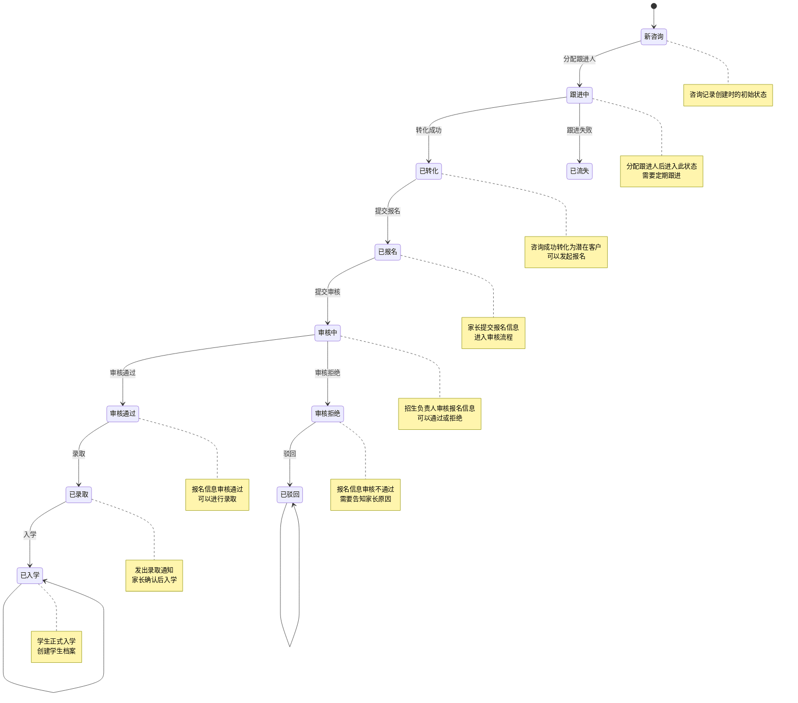
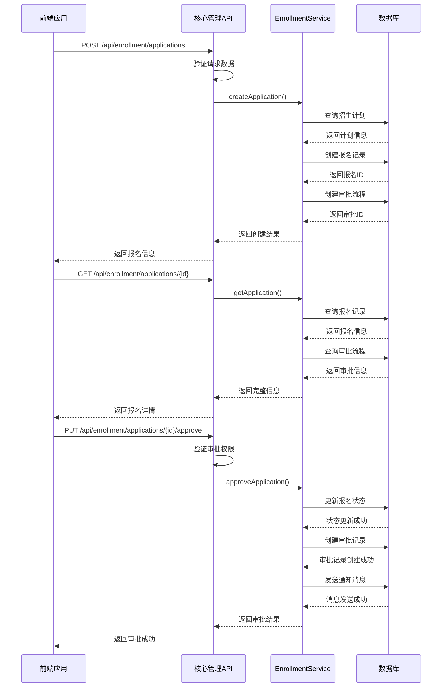

# 核心管理API

<cite>
**本文档引用文件**   
- [student.controller.ts](file://unified-tenant-system/server/src/controllers/student.controller.ts)
- [enrollment-center.controller.ts](file://unified-tenant-system/server/src/controllers/enrollment-center.controller.ts)
- [class.controller.ts](file://unified-tenant-system/server/src/controllers/class.controller.ts)
- [activity-checkin.controller.ts](file://unified-tenant-system/server/src/controllers/activity-checkin.controller.ts)
- [api-response.ts](file://unified-tenant-system/server/src/utils/apiResponse.ts)
- [apiError.ts](file://unified-tenant-system/server/src/utils/apiError.ts)
- [student.ts](file://unified-tenant-system/server/src/types/student.ts)
- [class.ts](file://unified-tenant-system/server/src/types/class.ts)
- [enrollment-plan.model.ts](file://unified-tenant-system/server/src/models/enrollment-plan.model.ts)
- [enrollment-application.model.ts](file://unified-tenant-system/server/src/models/enrollment-application.model.ts)
- [enrollment-consultation.model.ts](file://unified-tenant-system/server/src/models/enrollment-consultation.model.ts)
</cite>

## 目录
1. [引言](#引言)
2. [API通用规范](#api通用规范)
3. [招生管理API](#招生管理api)
4. [教学计划API](#教学计划api)
5. [学生管理API](#学生管理api)
6. [考勤记录API](#考勤记录api)
7. [前端调用示例](#前端调用示例)
8. [状态机与流程](#状态机与流程)
9. [错误码说明](#错误码说明)
10. [附录](#附录)

## 引言
本文档详细描述了幼儿园管理系统的核心管理API，涵盖招生管理、教学计划、学生管理和考勤记录等核心业务功能。文档提供了每个API端点的详细信息，包括HTTP方法、URL路径、请求头、请求体结构和响应格式，并包含实际的JSON请求/响应示例。同时，文档解释了业务验证规则、状态转换逻辑以及API与数据库模型的映射关系。

## API通用规范

### 响应格式
所有API响应均遵循统一的JSON格式，包含`success`、`data`、`message`和`code`字段。

```json
{
  "success": true,
  "data": {},
  "message": "操作成功",
  "code": "SUCCESS"
}
```

### 分页参数
分页查询支持以下通用参数：
- `page`: 当前页码，从1开始
- `pageSize`: 每页记录数
- `keyword`: 搜索关键词

### 请求头
所有请求必须包含以下请求头：
- `Authorization`: Bearer token，用于身份验证
- `Content-Type`: application/json

**Section sources**
- [api-response.ts](file://unified-tenant-system/server/src/utils/apiResponse.ts)

## 招生管理API

### 招生中心概览
获取招生中心的概览数据，包括咨询量、申请量、试听量和转化率等统计信息。

**HTTP方法**: `GET`  
**URL路径**: `/api/enrollment/overview`  
**请求头**: `Authorization: Bearer <token>`  
**查询参数**:
- `timeRange`: 时间范围（week, month, quarter, year）
- `kindergartenId`: 幼儿园ID

**响应格式**:
```json
{
  "success": true,
  "data": {
    "statistics": {
      "totalConsultations": { "value": 120, "trend": 15.5, "trendText": "较上月" },
      "applications": { "value": 80, "trend": 12.3, "trendText": "较上月" },
      "trials": { "value": 45, "trend": 8.7, "trendText": "较上月" },
      "conversionRate": { "value": 66.7, "trend": 3.2, "trendText": "较上月" }
    },
    "charts": {
      "enrollmentTrend": {
        "categories": ["1月", "2月", "3月", "4月", "5月", "6月"],
        "series": [
          { "name": "咨询量", "data": [120, 132, 101, 134, 90, 230] },
          { "name": "申请量", "data": [80, 98, 75, 95, 65, 156] }
        ]
      }
    },
    "quickStats": {
      "pendingApplications": 15,
      "todayConsultations": 8,
      "upcomingInterviews": 8
    }
  },
  "message": "获取概览数据成功",
  "code": "SUCCESS"
}
```

**Section sources**
- [enrollment-center.controller.ts](file://unified-tenant-system/server/src/controllers/enrollment-center.controller.ts#L21-L103)

### 招生计划列表
获取招生计划的分页列表。

**HTTP方法**: `GET`  
**URL路径**: `/api/enrollment/plans`  
**请求头**: `Authorization: Bearer <token>`  
**查询参数**:
- `page`: 页码
- `pageSize`: 每页数量
- `search`: 搜索关键词
- `year`: 年份
- `semester`: 学期
- `status`: 状态
- `sortBy`: 排序字段
- `sortOrder`: 排序顺序

**响应格式**:
```json
{
  "success": true,
  "data": {
    "data": [
      {
        "id": 1,
        "title": "2024年春季招生计划",
        "year": 2024,
        "semester": "spring",
        "targetCount": 50,
        "appliedCount": 35,
        "progress": 70,
        "status": "active",
        "createdAt": "2024-01-15T08:00:00Z"
      }
    ],
    "pagination": {
      "total": 1,
      "page": 1,
      "pageSize": 10,
      "totalPages": 1
    }
  },
  "message": "获取计划列表成功",
  "code": "SUCCESS"
}
```

**Section sources**
- [enrollment-center.controller.ts](file://unified-tenant-system/server/src/controllers/enrollment-center.controller.ts#L109-L223)

### 申请列表
获取招生申请的分页列表。

**HTTP方法**: `GET`  
**URL路径**: `/api/enrollment/applications`  
**请求头**: `Authorization: Bearer <token>`  
**查询参数**:
- `page`: 页码
- `pageSize`: 每页数量
- `search`: 搜索关键词
- `planId`: 招生计划ID
- `status`: 申请状态
- `applicationDateFrom`: 申请日期起始
- `applicationDateTo`: 申请日期结束

**响应格式**:
```json
{
  "success": true,
  "data": {
    "data": [
      {
        "id": 1,
        "studentName": "张小明",
        "parentName": "张伟",
        "planId": 1,
        "status": "pending",
        "planTitle": "2024年春季招生计划",
        "materialsCount": 0,
        "interviewScheduled": false,
        "createdAt": "2024-01-16T09:30:00Z"
      }
    ],
    "pagination": {
      "total": 1,
      "page": 1,
      "pageSize": 10,
      "totalPages": 1
    }
  },
  "message": "获取申请列表成功",
  "code": "SUCCESS"
}
```

**Section sources**
- [enrollment-center.controller.ts](file://unified-tenant-system/server/src/controllers/enrollment-center.controller.ts#L229-L349)

### 咨询统计
获取咨询相关的统计数据。

**HTTP方法**: `GET`  
**URL路径**: `/api/enrollment/consultations/statistics`  
**请求头**: `Authorization: Bearer <token>`

**响应格式**:
```json
{
  "success": true,
  "data": {
    "todayConsultations": 8,
    "pendingFollowUp": 28,
    "monthlyConversions": 12,
    "averageResponseTime": 2.5,
    "sourceAnalysis": [
      { "source": "官网", "count": 45, "conversionRate": 68.5 },
      { "source": "微信", "count": 32, "conversionRate": 72.1 },
      { "source": "电话", "count": 28, "conversionRate": 65.3 },
      { "source": "推荐", "count": 15, "conversionRate": 85.2 }
    ],
    "statusDistribution": [
      { "status": "新咨询", "count": 23, "percentage": 35.2 },
      { "status": "跟进中", "count": 28, "percentage": 42.8 },
      { "status": "已转化", "count": 12, "percentage": 18.3 },
      { "status": "已流失", "count": 2, "percentage": 3.7 }
    ]
  },
  "message": "获取咨询统计成功",
  "code": "SUCCESS"
}
```

**Section sources**
- [enrollment-center.controller.ts](file://unified-tenant-system/server/src/controllers/enrollment-center.controller.ts#L355-L425)

### 咨询列表
获取咨询记录的分页列表。

**HTTP方法**: `GET`  
**URL路径**: `/api/enrollment/consultations`  
**请求头**: `Authorization: Bearer <token>`  
**查询参数**:
- `page`: 页码
- `pageSize`: 每页数量
- `search`: 搜索关键词
- `status`: 咨询状态
- `followupStatus`: 跟进状态

**响应格式**:
```json
{
  "success": true,
  "data": {
    "items": [
      {
        "id": 1,
        "name": "李小红",
        "phone": "13800138001",
        "source": "官网",
        "status": "new",
        "followupStatus": 1,
        "followupCount": 0,
        "lastFollowupTime": null,
        "createdAt": "2024-01-15T10:00:00Z",
        "updatedAt": "2024-01-15T10:00:00Z"
      }
    ],
    "total": 1,
    "page": 1,
    "pageSize": 10,
    "totalPages": 1
  },
  "message": "获取咨询列表成功",
  "code": "SUCCESS"
}
```

**Section sources**
- [enrollment-center.controller.ts](file://unified-tenant-system/server/src/controllers/enrollment-center.controller.ts#L431-L452)

## 教学计划API

### 创建班级
创建新的班级。

**HTTP方法**: `POST`  
**URL路径**: `/api/classes`  
**请求头**: `Authorization: Bearer <token>`  
**请求体**:
```json
{
  "name": "大班",
  "kindergartenId": 1,
  "type": 1,
  "grade": "大班",
  "teacherId": 1,
  "capacity": 30,
  "classroom": "101教室",
  "description": "大班教学班级"
}
```

**响应格式**:
```json
{
  "success": true,
  "data": {
    "id": 1,
    "name": "大班",
    "code": "CLASS_1705324800000",
    "kindergartenId": 1,
    "kindergarten": {
      "id": 1,
      "name": "阳光幼儿园"
    },
    "type": 1,
    "grade": "大班",
    "headTeacherId": 1,
    "assistantTeacherId": null,
    "capacity": 30,
    "currentStudentCount": 0,
    "classroom": "101教室",
    "description": "大班教学班级",
    "imageUrl": null,
    "status": 1,
    "teachers": [
      {
        "id": 1,
        "name": "张老师",
        "position": "班主任",
        "teacherNo": "T001",
        "isMainTeacher": true,
        "subject": null
      }
    ],
    "createdAt": "2024-01-16T08:00:00Z",
    "updatedAt": "2024-01-16T08:00:00Z"
  },
  "message": "创建班级成功",
  "code": "SUCCESS"
}
```

**业务验证规则**:
- 班级名称和幼儿园ID为必填字段
- 班级容量必须在1-50之间
- 班级名称长度不能超过50字符
- 班级名称在同一个幼儿园内不能重复

**Section sources**
- [class.controller.ts](file://unified-tenant-system/server/src/controllers/class.controller.ts#L26-L224)

### 获取班级列表
获取班级的分页列表。

**HTTP方法**: `GET`  
**URL路径**: `/api/classes`  
**请求头**: `Authorization: Bearer <token>`  
**查询参数**:
- `page`: 页码
- `pageSize`: 每页数量
- `keyword`: 搜索关键词
- `kindergartenId`: 幼儿园ID
- `status`: 班级状态

**响应格式**:
```json
{
  "success": true,
  "data": {
    "items": [
      {
        "id": 1,
        "name": "大班",
        "code": "CLASS_1705324800000",
        "kindergartenId": 1,
        "kindergarten": {
          "id": 1,
          "name": "阳光幼儿园"
        },
        "type": 1,
        "grade": "大班",
        "headTeacherId": 1,
        "assistantTeacherId": null,
        "capacity": 30,
        "currentStudentCount": 0,
        "classroom": "101教室",
        "description": "大班教学班级",
        "imageUrl": null,
        "status": 1,
        "createdAt": "2024-01-16T08:00:00Z",
        "updatedAt": "2024-01-16T08:00:00Z"
      }
    ],
    "total": 1,
    "page": 1,
    "pageSize": 10,
    "totalPages": 1
  },
  "message": "获取班级列表成功",
  "code": "SUCCESS"
}
```

**权限控制**:
- 非超级管理员用户只能查看自己幼儿园的班级
- 超级管理员可以查看所有幼儿园的班级

**Section sources**
- [class.controller.ts](file://unified-tenant-system/server/src/controllers/class.controller.ts#L231-L404)

### 获取班级详情
获取指定班级的详细信息。

**HTTP方法**: `GET`  
**URL路径**: `/api/classes/{id}`  
**请求头**: `Authorization: Bearer <token>`

**响应格式**:
```json
{
  "success": true,
  "data": {
    "id": 1,
    "name": "大班",
    "code": "CLASS_1705324800000",
    "kindergartenId": 1,
    "kindergarten": {
      "id": 1,
      "name": "阳光幼儿园"
    },
    "type": 1,
    "grade": "大班",
    "headTeacherId": 1,
    "assistantTeacherId": null,
    "capacity": 30,
    "currentStudentCount": 0,
    "classroom": "101教室",
    "description": "大班教学班级",
    "imageUrl": null,
    "status": 1,
    "students": [
      {
        "id": 1,
        "name": "张小明",
        "studentNo": "S001",
        "birthday": "2020-01-01",
        "gender": "male",
        "status": 1
      }
    ],
    "teachers": [
      {
        "id": 1,
        "name": "张老师",
        "position": "班主任",
        "teacherNo": "T001",
        "isMainTeacher": true,
        "subject": null
      }
    ],
    "createdAt": "2024-01-16T08:00:00Z",
    "updatedAt": "2024-01-16T08:00:00Z"
  },
  "message": "获取班级详情成功",
  "code": "SUCCESS"
}
```

**Section sources**
- [class.controller.ts](file://unified-tenant-system/server/src/controllers/class.controller.ts#L411-L513)

### 更新班级信息
更新指定班级的信息。

**HTTP方法**: `PUT`  
**URL路径**: `/api/classes/{id}`  
**请求头**: `Authorization: Bearer <token>`  
**请求体**:
```json
{
  "name": "大班（升级版）",
  "capacity": 35,
  "classroom": "201教室",
  "description": "升级版大班教学班级"
}
```

**响应格式**:
```json
{
  "success": true,
  "data": {
    "id": 1,
    "name": "大班（升级版）",
    "code": "CLASS_1705324800000",
    "kindergartenId": 1,
    "kindergarten": {
      "id": 1,
      "name": "阳光幼儿园"
    },
    "type": 1,
    "grade": "大班",
    "headTeacherId": 1,
    "assistantTeacherId": null,
    "capacity": 35,
    "currentStudentCount": 0,
    "classroom": "201教室",
    "description": "升级版大班教学班级",
    "imageUrl": null,
    "status": 1,
    "teachers": [
      {
        "id": 1,
        "name": "张老师",
        "position": "班主任",
        "teacherNo": "T001",
        "isMainTeacher": true,
        "subject": null
      }
    ],
    "createdAt": "2024-01-16T08:00:00Z",
    "updatedAt": "2024-01-16T09:00:00Z"
  },
  "message": "更新班级信息成功",
  "code": "SUCCESS"
}
```

**业务验证规则**:
- 如果更新班级名称，需要检查在同一个幼儿园内是否已存在相同名称的班级
- 如果更新幼儿园，需要检查目标幼儿园是否存在

**Section sources**
- [class.controller.ts](file://unified-tenant-system/server/src/controllers/class.controller.ts#L520-L796)

## 学生管理API

### 创建学生
创建新的学生记录。

**HTTP方法**: `POST`  
**URL路径**: `/api/students`  
**请求头**: `Authorization: Bearer <token>`  
**请求体**:
```json
{
  "name": "张小明",
  "studentNo": "S001",
  "gender": "male",
  "birthDate": "2020-01-01",
  "classId": 1,
  "parentId": 1,
  "contactPhone": "13800138001",
  "address": "北京市朝阳区"
}
```

**响应格式**:
```json
{
  "success": true,
  "data": {
    "id": 1,
    "name": "张小明",
    "studentNo": "S001",
    "gender": "male",
    "birthDate": "2020-01-01",
    "classId": 1,
    "className": "大班",
    "status": 1,
    "parentId": 1,
    "parentName": "张伟",
    "contactPhone": "13800138001",
    "address": "北京市朝阳区",
    "createdAt": "2024-01-16T10:00:00Z",
    "updatedAt": "2024-01-16T10:00:00Z"
  },
  "message": "创建学生成功",
  "code": "SUCCESS"
}
```

**业务验证规则**:
- 学生姓名和学号为必填字段
- 学号在系统内必须唯一
- 出生日期不能为未来日期
- 如果指定了班级，需要检查班级是否存在

**Section sources**
- [student.controller.ts](file://unified-tenant-system/server/src/controllers/student.controller.ts#L22-L34)

### 获取学生列表
获取学生的分页列表。

**HTTP方法**: `GET`  
**URL路径**: `/api/students`  
**请求头**: `Authorization: Bearer <token>`  
**查询参数**:
- `page`: 页码
- `pageSize`: 每页数量
- `keyword`: 搜索关键词
- `classId`: 班级ID
- `status`: 学生状态

**响应格式**:
```json
{
  "success": true,
  "data": {
    "data": [
      {
        "id": 1,
        "name": "张小明",
        "studentNo": "S001",
        "gender": "male",
        "birthDate": "2020-01-01",
        "classId": 1,
        "className": "大班",
        "status": 1,
        "parentId": 1,
        "parentName": "张伟",
        "contactPhone": "13800138001",
        "address": "北京市朝阳区",
        "createdAt": "2024-01-16T10:00:00Z",
        "updatedAt": "2024-01-16T10:00:00Z"
      }
    ],
    "pagination": {
      "total": 1,
      "page": 1,
      "pageSize": 10,
      "totalPages": 1
    }
  },
  "message": "获取学生列表成功",
  "code": "SUCCESS"
}
```

**Section sources**
- [student.controller.ts](file://unified-tenant-system/server/src/controllers/student.controller.ts#L39-L46)

### 搜索学生
根据关键词搜索学生。

**HTTP方法**: `GET`  
**URL路径**: `/api/students/search`  
**请求头**: `Authorization: Bearer <token>`  
**查询参数**:
- `q`: 搜索关键词
- `classId`: 班级ID（可选）

**响应格式**:
```json
{
  "success": true,
  "data": {
    "data": [
      {
        "id": 1,
        "name": "张小明",
        "studentNo": "S001",
        "className": "大班",
        "status": 1
      }
    ],
    "total": 1,
    "page": 1,
    "pageSize": 10,
    "totalPages": 1
  },
  "message": "搜索学生成功",
  "code": "SUCCESS"
}
```

**Section sources**
- [student.controller.ts](file://unified-tenant-system/server/src/controllers/student.controller.ts#L51-L58)

### 获取学生详情
获取指定学生的详细信息。

**HTTP方法**: `GET`  
**URL路径**: `/api/students/{id}`  
**请求头**: `Authorization: Bearer <token>`

**响应格式**:
```json
{
  "success": true,
  "data": {
    "id": 1,
    "name": "张小明",
    "studentNo": "S001",
    "gender": "male",
    "birthDate": "2020-01-01",
    "classId": 1,
    "className": "大班",
    "status": 1,
    "parents": [
      {
        "id": 1,
        "name": "张伟",
        "relationship": "父亲",
        "contactPhone": "13800138001",
        "email": "zhangwei@example.com"
      }
    ],
    "contactPhone": "13800138001",
    "address": "北京市朝阳区",
    "medicalHistory": "无",
    "allergies": "无",
    "createdAt": "2024-01-16T10:00:00Z",
    "updatedAt": "2024-01-16T10:00:00Z"
  },
  "message": "获取学生详情成功",
  "code": "SUCCESS"
}
```

**Section sources**
- [student.controller.ts](file://unified-tenant-system/server/src/controllers/student.controller.ts#L75-L90)

### 更新学生信息
更新指定学生的信息。

**HTTP方法**: `PUT`  
**URL路径**: `/api/students/{id}`  
**请求头**: `Authorization: Bearer <token>`  
**请求体**:
```json
{
  "name": "张小明（升级版）",
  "contactPhone": "13800138002",
  "address": "北京市海淀区"
}
```

**响应格式**:
```json
{
  "success": true,
  "data": {
    "id": 1,
    "name": "张小明（升级版）",
    "studentNo": "S001",
    "gender": "male",
    "birthDate": "2020-01-01",
    "classId": 1,
    "className": "大班",
    "status": 1,
    "parents": [
      {
        "id": 1,
        "name": "张伟",
        "relationship": "父亲",
        "contactPhone": "13800138001",
        "email": "zhangwei@example.com"
      }
    ],
    "contactPhone": "13800138002",
    "address": "北京市海淀区",
    "medicalHistory": "无",
    "allergies": "无",
    "createdAt": "2024-01-16T10:00:00Z",
    "updatedAt": "2024-01-16T11:00:00Z"
  },
  "message": "更新学生信息成功",
  "code": "SUCCESS"
}
```

**业务验证规则**:
- 请求体不能为空
- 如果更新学号，需要检查学号是否已存在

**Section sources**
- [student.controller.ts](file://unified-tenant-system/server/src/controllers/student.controller.ts#L115-L141)

### 删除学生
删除指定学生。

**HTTP方法**: `DELETE`  
**URL路径**: `/api/students/{id}`  
**请求头**: `Authorization: Bearer <token>`

**响应格式**:
```json
{
  "success": true,
  "message": "删除学生成功",
  "code": "SUCCESS"
}
```

**业务验证规则**:
- 需要检查学生是否已关联到其他业务数据（如考勤记录、成绩记录等），如果有则不能直接删除

**Section sources**
- [student.controller.ts](file://unified-tenant-system/server/src/controllers/student.controller.ts#L146-L166)

### 为学生分配班级
为单个学生分配班级。

**HTTP方法**: `POST`  
**URL路径**: `/api/students/assign-class`  
**请求头**: `Authorization: Bearer <token>`  
**请求体**:
```json
{
  "studentId": 1,
  "classId": 1
}
```

**响应格式**:
```json
{
  "success": true,
  "data": {
    "studentId": 1,
    "classId": 1,
    "className": "大班",
    "previousClassId": null,
    "previousClassName": null,
    "changeReason": null,
    "changeDate": "2024-01-16T12:00:00Z"
  },
  "message": "分配班级成功",
  "code": "SUCCESS"
}
```

**业务验证规则**:
- 学生ID和班级ID都是必填项
- 需要检查班级容量是否已满
- 需要检查学生是否已在该班级

**Section sources**
- [student.controller.ts](file://unified-tenant-system/server/src/controllers/student.controller.ts#L171-L204)

### 批量为学生分配班级
批量为多个学生分配班级。

**HTTP方法**: `POST`  
**URL路径**: `/api/students/batch-assign-class`  
**请求头**: `Authorization: Bearer <token>`  
**请求体**:
```json
{
  "studentIds": [1, 2, 3],
  "classId": 1
}
```

**响应格式**:
```json
{
  "success": true,
  "data": {
    "assignedCount": 3,
    "failedCount": 0,
    "details": [
      {
        "studentId": 1,
        "studentName": "张小明",
        "classId": 1,
        "className": "大班",
        "status": "success",
        "message": "分配成功"
      },
      {
        "studentId": 2,
        "studentName": "李小红",
        "classId": 1,
        "className": "大班",
        "status": "success",
        "message": "分配成功"
      },
      {
        "studentId": 3,
        "studentName": "王小强",
        "classId": 1,
        "className": "大班",
        "status": "success",
        "message": "分配成功"
      }
    ]
  },
  "message": "批量分配班级成功",
  "code": "SUCCESS"
}
```

**业务验证规则**:
- 学生ID列表和班级ID都是必填项
- 学生ID列表必须是非空数组
- 需要检查班级容量是否足够
- 需要检查是否有重复的学生ID

**Section sources**
- [student.controller.ts](file://unified-tenant-system/server/src/controllers/student.controller.ts#L209-L256)

### 更新学生状态
更新学生状态（在读、休学、离园）。

**HTTP方法**: `POST`  
**URL路径**: `/api/students/update-status`  
**请求头**: `Authorization: Bearer <token>`  
**请求体**:
```json
{
  "studentId": 1,
  "status": 1
}
```

**响应格式**:
```json
{
  "success": true,
  "data": {
    "studentId": 1,
    "previousStatus": 0,
    "currentStatus": 1,
    "statusText": "在读",
    "changeDate": "2024-01-16T13:00:00Z"
  },
  "message": "更新学生状态成功",
  "code": "SUCCESS"
}
```

**状态值说明**:
- `0`: 离园
- `1`: 在读
- `2`: 休学

**Section sources**
- [student.controller.ts](file://unified-tenant-system/server/src/controllers/student.controller.ts#L261-L296)

## 考勤记录API

### 签到
为活动报名记录进行签到。

**HTTP方法**: `PUT`  
**URL路径**: `/api/activity-checkin/{id}`  
**请求头**: `Authorization: Bearer <token>`  
**请求体**:
```json
{
  "location": "阳光幼儿园正门"
}
```

**响应格式**:
```json
{
  "success": true,
  "data": {
    "id": 1,
    "activityId": 1,
    "contactName": "张伟",
    "contactPhone": "13800138001",
    "checkInTime": "2024-01-16T14:00:00Z",
    "checkInLocation": "阳光幼儿园正门",
    "activityTitle": "亲子运动会"
  },
  "message": "签到成功",
  "code": "SUCCESS"
}
```

**业务验证规则**:
- 签到地点不能为空
- 需要检查报名记录是否存在

**Section sources**
- [activity-checkin.controller.ts](file://unified-tenant-system/server/src/controllers/activity-checkin.controller.ts#L15-L76)

### 批量签到
为多个活动报名记录进行批量签到。

**HTTP方法**: `POST`  
**URL路径**: `/api/activity-checkin/batch`  
**请求头**: `Authorization: Bearer <token>`  
**请求体**:
```json
{
  "registrationIds": [1, 2, 3],
  "location": "阳光幼儿园正门"
}
```

**响应格式**:
```json
{
  "success": true,
  "data": {
    "successCount": 3,
    "failureCount": 0,
    "details": [
      {
        "id": 1,
        "contactName": "张伟",
        "checkInTime": "2024-01-16T14:00:00Z"
      },
      {
        "id": 2,
        "contactName": "李强",
        "checkInTime": "2024-01-16T14:01:00Z"
      },
      {
        "id": 3,
        "contactName": "王芳",
        "checkInTime": "2024-01-16T14:02:00Z"
      }
    ]
  },
  "message": "批量签到处理完成",
  "code": "SUCCESS"
}
```

**业务验证规则**:
- 报名ID列表不能为空
- 签到地点不能为空
- 需要检查每个报名记录是否存在

**Section sources**
- [activity-checkin.controller.ts](file://unified-tenant-system/server/src/controllers/activity-checkin.controller.ts#L83-L136)

### 获取活动签到列表
获取指定活动的签到列表。

**HTTP方法**: `GET`  
**URL路径**: `/api/activity-checkin`  
**请求头**: `Authorization: Bearer <token>`  
**查询参数**:
- `activityId`: 活动ID
- `page`: 页码
- `limit`: 每页数量

**响应格式**:
```json
{
  "success": true,
  "data": {
    "items": [
      {
        "id": 1,
        "contactName": "张伟",
        "contactPhone": "13800138001",
        "childName": "张小明",
        "checkInTime": "2024-01-16T14:00:00Z",
        "checkInLocation": "阳光幼儿园正门",
        "registrationTime": "2024-01-15T10:00:00Z",
        "activityTitle": "亲子运动会"
      }
    ],
    "page": 1,
    "limit": 10,
    "total": 1,
    "totalPages": 1
  },
  "message": "获取活动签到列表成功",
  "code": "SUCCESS"
}
```

**Section sources**
- [activity-checkin.controller.ts](file://unified-tenant-system/server/src/controllers/activity-checkin.controller.ts#L147-L212)

### 获取活动签到统计数据
获取指定活动的签到统计数据。

**HTTP方法**: `GET`  
**URL路径**: `/api/activity-checkin/stats/{activityId}`  
**请求头**: `Authorization: Bearer <token>`

**响应格式**:
```json
{
  "success": true,
  "data": {
    "totalRegistrations": 50,
    "checkedInCount": 45,
    "notCheckedInCount": 5,
    "checkInRate": 0.9
  },
  "message": "获取活动签到统计数据成功",
  "code": "SUCCESS"
}
```

**Section sources**
- [activity-checkin.controller.ts](file://unified-tenant-system/server/src/controllers/activity-checkin.controller.ts#L219-L261)

### 导出签到数据
导出指定活动的签到数据。

**HTTP方法**: `GET`  
**URL路径**: `/api/activity-checkin/export/{activityId}`  
**请求头**: `Authorization: Bearer <token>`

**响应格式**:
```json
{
  "success": true,
  "data": {
    "fileName": "activity_1_checkin_data.xlsx",
    "records": [
      {
        "contactName": "张伟",
        "contactPhone": "13800138001",
        "childName": "张小明",
        "childAge": 4,
        "registrationTime": "2024-01-15T10:00:00Z",
        "checkInTime": "2024-01-16T14:00:00Z",
        "checkInLocation": "阳光幼儿园正门",
        "activityTitle": "亲子运动会"
      }
    ],
    "totalCount": 45
  },
  "message": "导出签到数据成功",
  "code": "SUCCESS"
}
```

**Section sources**
- [activity-checkin.controller.ts](file://unified-tenant-system/server/src/controllers/activity-checkin.controller.ts#L268-L304)

### 根据手机号签到
根据手机号为活动报名记录进行签到。

**HTTP方法**: `POST`  
**URL路径**: `/api/activity-checkin/phone/{activityId}`  
**请求头**: `Authorization: Bearer <token>`  
**请求体**:
```json
{
  "phone": "13800138001",
  "location": "阳光幼儿园正门"
}
```

**响应格式**:
```json
{
  "success": true,
  "data": {
    "id": 1,
    "contactName": "张伟",
    "contactPhone": "13800138001",
    "checkInTime": "2024-01-16T15:00:00Z",
    "checkInLocation": "阳光幼儿园正门"
  },
  "message": "签到成功",
  "code": "SUCCESS"
}
```

**业务验证规则**:
- 活动ID和手机号不能为空
- 需要检查手机号对应的报名记录是否存在
- 如果报名记录已签到，则不能重复签到

**Section sources**
- [activity-checkin.controller.ts](file://unified-tenant-system/server/src/controllers/activity-checkin.controller.ts#L311-L392)

## 前端调用示例

### Vue组件中使用Axios调用API
以下是在Vue组件中使用Axios调用核心管理API的示例：

```vue
<template>
  <div class="student-management">
    <el-button @click="getStudents">获取学生列表</el-button>
    <el-button @click="createStudent">创建学生</el-button>
    <el-table :data="students" style="width: 100%">
      <el-table-column prop="name" label="姓名"></el-table-column>
      <el-table-column prop="studentNo" label="学号"></el-table-column>
      <el-table-column prop="className" label="班级"></el-table-column>
      <el-table-column prop="status" label="状态">
        <template #default="scope">
          {{ getStatusText(scope.row.status) }}
        </template>
      </el-table-column>
    </el-table>
  </div>
</template>

<script setup>
import { ref, onMounted } from 'vue'
import axios from 'axios'

// 设置默认的请求配置
axios.defaults.baseURL = 'https://api.kindergarten.com'
axios.defaults.headers.common['Authorization'] = `Bearer ${localStorage.getItem('token')}`
axios.defaults.headers.post['Content-Type'] = 'application/json'

const students = ref([])

// 获取学生列表
const getStudents = async () => {
  try {
    const response = await axios.get('/api/students', {
      params: {
        page: 1,
        pageSize: 10
      }
    })
    
    if (response.data.success) {
      students.value = response.data.data.data
    } else {
      ElMessage.error(response.data.message)
    }
  } catch (error) {
    console.error('获取学生列表失败:', error)
    ElMessage.error('获取学生列表失败')
  }
}

// 创建学生
const createStudent = async () => {
  try {
    const newStudent = {
      name: '新学生',
      studentNo: 'S999',
      gender: 'male',
      birthDate: '2020-01-01',
      classId: 1
    }
    
    const response = await axios.post('/api/students', newStudent)
    
    if (response.data.success) {
      ElMessage.success('创建学生成功')
      getStudents() // 刷新列表
    } else {
      ElMessage.error(response.data.message)
    }
  } catch (error) {
    console.error('创建学生失败:', error)
    ElMessage.error('创建学生失败')
  }
}

// 获取状态文本
const getStatusText = (status) => {
  const statusMap = {
    0: '离园',
    1: '在读',
    2: '休学'
  }
  return statusMap[status] || '未知'
}

// 组件挂载时获取学生列表
onMounted(() => {
  getStudents()
})
</script>
```

**Section sources**
- [student.controller.ts](file://unified-tenant-system/server/src/controllers/student.controller.ts)

## 状态机与流程

### 招生流程审批链
招生流程包含多个状态，通过审批链进行状态转换。



**Diagram sources**
- [enrollment-consultation.model.ts](file://unified-tenant-system/server/src/models/enrollment-consultation.model.ts)
- [enrollment-application.model.ts](file://unified-tenant-system/server/src/models/enrollment-application.model.ts)

### 招生审批调用序列
以下序列图展示了招生审批的调用流程：



**Diagram sources**
- [enrollment-center.controller.ts](file://unified-tenant-system/server/src/controllers/enrollment-center.controller.ts)
- [enrollment-application.model.ts](file://unified-tenant-system/server/src/models/enrollment-application.model.ts)

## 错误码说明

### 通用错误码
| 错误码 | 说明 | HTTP状态码 |
|--------|------|----------|
| SUCCESS | 操作成功 | 200 |
| INTERNAL_ERROR | 内部服务器错误 | 500 |
| DATABASE_CONNECTION_ERROR | 数据库连接失败 | 500 |
| TABLE_NOT_EXISTS | 数据库表不存在 | 500 |
| ASSOCIATION_ERROR | 模型关联配置错误 | 500 |

### 招生管理错误码
| 错误码 | 说明 | HTTP状态码 |
|--------|------|----------|
| MISSING_REQUIRED_FIELDS | 缺少必填字段 | 400 |
| INVALID_CAPACITY | 班级容量无效 | 400 |
| NAME_TOO_LONG | 名称长度过长 | 400 |
| KINDERGARTEN_NOT_FOUND | 幼儿园不存在 | 400 |
| CLASS_NAME_EXISTS | 班级名称已存在 | 400 |
| CLASS_CODE_EXISTS | 班级代码已存在 | 400 |
| FOREIGN_KEY_ERROR | 关联数据不存在 | 400 |

### 学生管理错误码
| 错误码 | 说明 | HTTP状态码 |
|--------|------|----------|
| INVALID_STUDENT_ID | 无效的学生ID | 400 |
| UNAUTHORIZED | 无法获取用户ID | 401 |
| STUDENT_NOT_FOUND | 学生不存在 | 404 |
| CLASS_FULL | 班级已满 | 400 |
| STUDENT_ALREADY_IN_CLASS | 学生已在该班级 | 400 |

### 考勤管理错误码
| 错误码 | 说明 | HTTP状态码 |
|--------|------|----------|
| CHECKIN_LOCATION_REQUIRED | 签到地点不能为空 | 400 |
| REGISTRATION_NOT_FOUND | 报名记录不存在 | 404 |
| ALREADY_CHECKED_IN | 该报名记录已签到 | 400 |

**Section sources**
- [apiError.ts](file://unified-tenant-system/server/src/utils/apiError.ts)

## 附录

### 数据库模型映射
核心管理API与数据库模型的映射关系如下：

- **学生管理**: `StudentController` ↔ `Student` 模型 ↔ `students` 表
- **班级管理**: `ClassController` ↔ `Class` 模型 ↔ `classes` 表
- **招生管理**: `EnrollmentCenterController` ↔ `EnrollmentPlan`, `EnrollmentApplication`, `EnrollmentConsultation` 模型 ↔ `enrollment_plans`, `enrollment_applications`, `enrollment_consultations` 表
- **考勤管理**: `ActivityCheckinController` ↔ `ActivityRegistration` 模型 ↔ `activity_registrations` 表

### 关联数据查询
API通过以下方式处理关联数据查询：

1. **Sequelize关联查询**: 使用`include`选项在查询时自动关联相关模型
2. **原生SQL查询**: 对于复杂查询，使用原生SQL语句进行多表联查
3. **服务层聚合**: 在服务层调用多个查询，然后聚合数据

例如，在获取班级详情时，会同时查询班级信息、学生列表和教师列表，然后将结果聚合到一个响应对象中。

**Section sources**
- [student.controller.ts](file://unified-tenant-system/server/src/controllers/student.controller.ts)
- [class.controller.ts](file://unified-tenant-system/server/src/controllers/class.controller.ts)
- [enrollment-center.controller.ts](file://unified-tenant-system/server/src/controllers/enrollment-center.controller.ts)
- [activity-checkin.controller.ts](file://unified-tenant-system/server/src/controllers/activity-checkin.controller.ts)