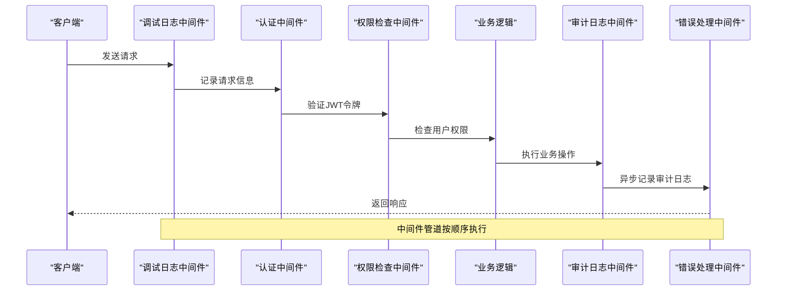
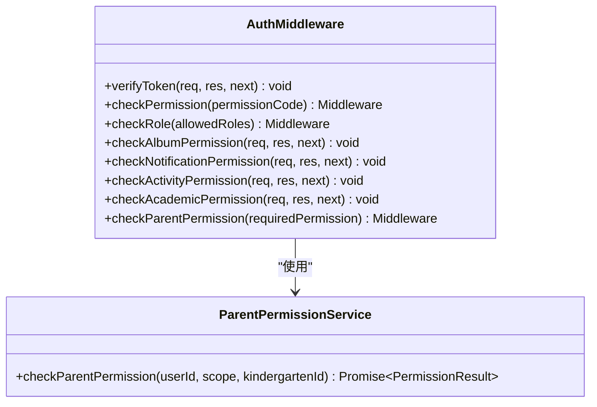
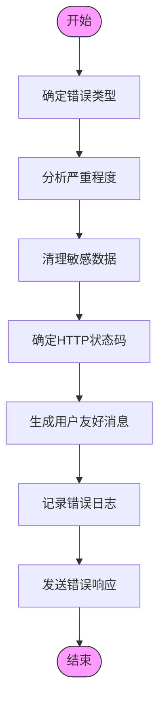
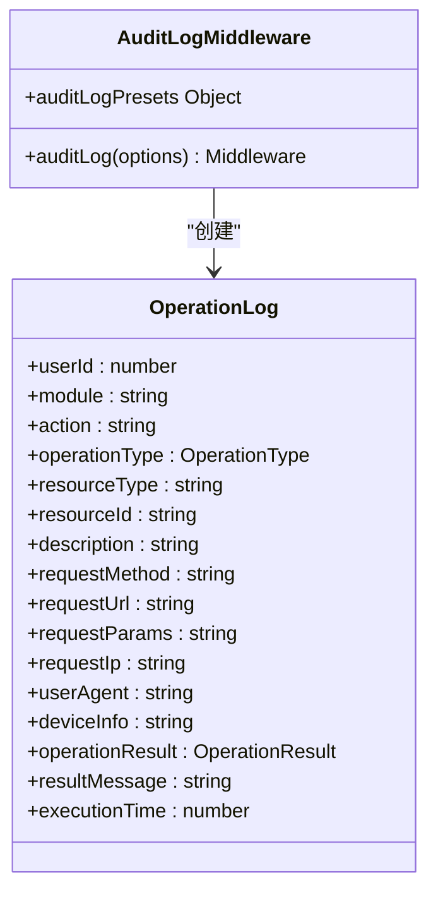
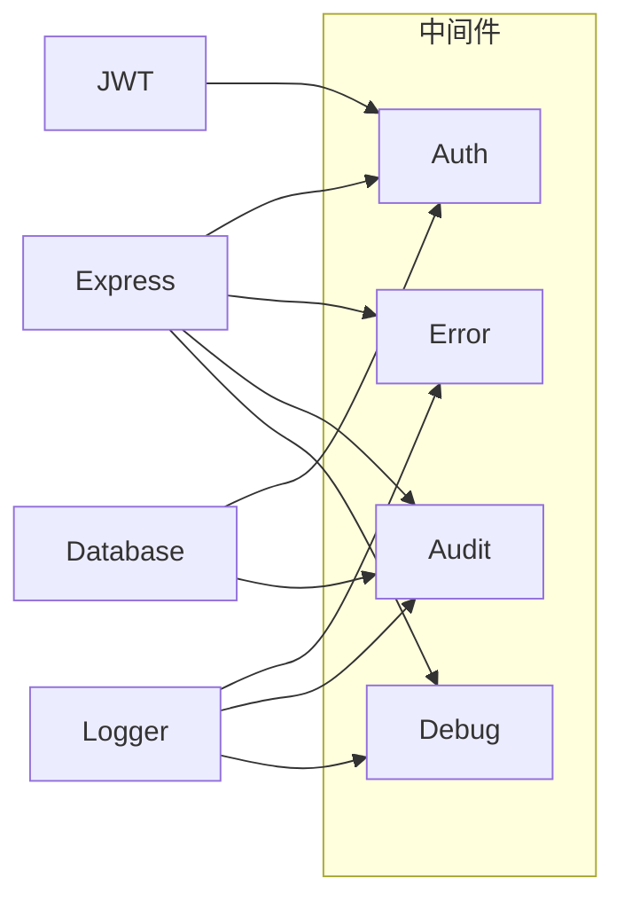

# 中间件系统

<cite>
**本文档中引用的文件**  
- [auth.middleware.ts](file://k.yyup.com/server/src/middlewares/auth.middleware.ts)
- [error.middleware.ts](file://k.yyup.com/server/src/middlewares/error.middleware.ts)
- [auth-simplified.middleware.ts](file://k.yyup.com/server/src/middlewares/auth-simplified.middleware.ts)
- [audit-log.middleware.ts](file://k.yyup.com/server/src/middlewares/audit-log.middleware.ts)
- [debug-log.middleware.ts](file://k.yyup.com/server/src/middlewares/debug-log.middleware.ts)
</cite>

## 目录
1. [简介](#简介)
2. [项目结构](#项目结构)
3. [核心组件](#核心组件)
4. [架构概述](#架构概述)
5. [详细组件分析](#详细组件分析)
6. [依赖分析](#依赖分析)
7. [性能考虑](#性能考虑)
8. [故障排除指南](#故障排除指南)
9. [结论](#结论)

## 简介
本文档全面记录了后端中间件系统的架构和实现。重点解释Express中间件管道的工作机制，包括执行顺序、错误处理中间件的特殊位置以及中间件组合模式。深入分析认证中间件（JWT验证）、权限中间件（RBAC检查）、日志记录中间件和错误处理中间件的实现细节。说明自定义中间件的创建方法和注册流程。提供中间件链的调试技巧和性能监控方法。文档涵盖中间件的复用策略和在不同路由上的应用方式。

## 项目结构
项目中的中间件主要位于`server/src/middlewares/`目录下，采用模块化设计，每个中间件负责特定的功能。中间件系统与认证、权限、审计日志等核心功能紧密集成，通过共享连接池模式支持多租户架构。

```mermaid
graph TB
subgraph "中间件目录"
auth[auth.middleware.ts]
error[error.middleware.ts]
audit[audit-log.middleware.ts]
debug[debug-log.middleware.ts]
simplified[auth-simplified.middleware.ts]
end
subgraph "核心功能"
auth --> "认证与权限"
error --> "错误处理"
audit --> "审计日志"
debug --> "调试日志"
simplified --> "简化认证"
end
```

**图示来源**
- [auth.middleware.ts](file://k.yyup.com/server/src/middlewares/auth.middleware.ts)
- [error.middleware.ts](file://k.yyup.com/server/src/middlewares/error.middleware.ts)
- [audit-log.middleware.ts](file://k.yyup.com/server/src/middlewares/audit-log.middleware.ts)
- [debug-log.middleware.ts](file://k.yyup.com/server/src/middlewares/debug-log.middleware.ts)
- [auth-simplified.middleware.ts](file://k.yyup.com/server/src/middlewares/auth-simplified.middleware.ts)

**章节来源**
- [k.yyup.com/server/src/middlewares/](file://k.yyup.com/server/src/middlewares/)

## 核心组件
中间件系统包含认证、权限检查、审计日志、错误处理和调试日志等核心组件。这些组件通过Express的中间件管道协同工作，确保系统的安全性、可靠性和可维护性。

**章节来源**
- [auth.middleware.ts](file://k.yyup.com/server/src/middlewares/auth.middleware.ts#L1-L1378)
- [error.middleware.ts](file://k.yyup.com/server/src/middlewares/error.middleware.ts#L1-L213)

## 架构概述
中间件系统采用分层架构，从请求进入开始，依次经过调试日志、认证、权限检查、业务处理，最后由错误处理中间件捕获异常。审计日志中间件在请求完成时异步记录操作日志。



**图示来源**
- [auth.middleware.ts](file://k.yyup.com/server/src/middlewares/auth.middleware.ts#L142-L799)
- [error.middleware.ts](file://k.yyup.com/server/src/middlewares/error.middleware.ts#L13-L85)
- [audit-log.middleware.ts](file://k.yyup.com/server/src/middlewares/audit-log.middleware.ts#L68-L168)

## 详细组件分析
### 认证中间件分析
认证中间件负责验证JWT令牌，支持内部服务调用绕过认证，并与统一租户系统集成进行用户认证。



**图示来源**
- [auth.middleware.ts](file://k.yyup.com/server/src/middlewares/auth.middleware.ts#L142-L799)

**章节来源**
- [auth.middleware.ts](file://k.yyup.com/server/src/middlewares/auth.middleware.ts#L142-L799)

### 错误处理中间件分析
错误处理中间件捕获所有异常，生成统一格式的错误响应，并记录详细的错误日志用于问题追踪。



**图示来源**
- [error.middleware.ts](file://k.yyup.com/server/src/middlewares/error.middleware.ts#L13-L85)

**章节来源**
- [error.middleware.ts](file://k.yyup.com/server/src/middlewares/error.middleware.ts#L13-L85)

### 审计日志中间件分析
审计日志中间件自动记录所有CRUD操作，包括操作类型、资源、用户、IP地址等信息，支持异步写入以提高性能。



**图示来源**
- [audit-log.middleware.ts](file://k.yyup.com/server/src/middlewares/audit-log.middleware.ts#L68-L186)

**章节来源**
- [audit-log.middleware.ts](file://k.yyup.com/server/src/middlewares/audit-log.middleware.ts#L68-L186)

## 依赖分析
中间件系统依赖于Express框架、JWT认证、数据库连接和日志服务。各中间件之间存在明确的依赖关系，如认证中间件依赖于JWT验证，权限检查依赖于认证结果。



**图示来源**
- [auth.middleware.ts](file://k.yyup.com/server/src/middlewares/auth.middleware.ts)
- [error.middleware.ts](file://k.yyup.com/server/src/middlewares/error.middleware.ts)
- [audit-log.middleware.ts](file://k.yyup.com/server/src/middlewares/audit-log.middleware.ts)
- [debug-log.middleware.ts](file://k.yyup.com/server/src/middlewares/debug-log.middleware.ts)

**章节来源**
- [auth.middleware.ts](file://k.yyup.com/server/src/middlewares/auth.middleware.ts)
- [error.middleware.ts](file://k.yyup.com/server/src/middlewares/error.middleware.ts)
- [audit-log.middleware.ts](file://k.yyup.com/server/src/middlewares/audit-log.middleware.ts)
- [debug-log.middleware.ts](file://k.yyup.com/server/src/middlewares/debug-log.middleware.ts)

## 性能考虑
中间件系统在设计时考虑了性能优化，如审计日志采用异步写入，避免阻塞主请求流程。错误处理中间件在生产环境中不返回详细错误信息，减少数据传输量。

## 故障排除指南
当遇到中间件相关问题时，可以启用调试日志中间件来查看请求和令牌信息。检查认证中间件的JWT密钥配置，确保与客户端一致。对于权限问题，确认用户角色和权限分配是否正确。

**章节来源**
- [debug-log.middleware.ts](file://k.yyup.com/server/src/middlewares/debug-log.middleware.ts#L19-L67)
- [auth.middleware.ts](file://k.yyup.com/server/src/middlewares/auth.middleware.ts#L142-L799)

## 结论
本文档详细介绍了后端中间件系统的架构和实现。通过Express中间件管道，系统实现了安全的认证、精细的权限控制、完整的审计日志和统一的错误处理。中间件设计遵循模块化原则，便于维护和扩展。建议在生产环境中禁用调试日志，定期审查权限配置，并监控审计日志以确保系统安全。