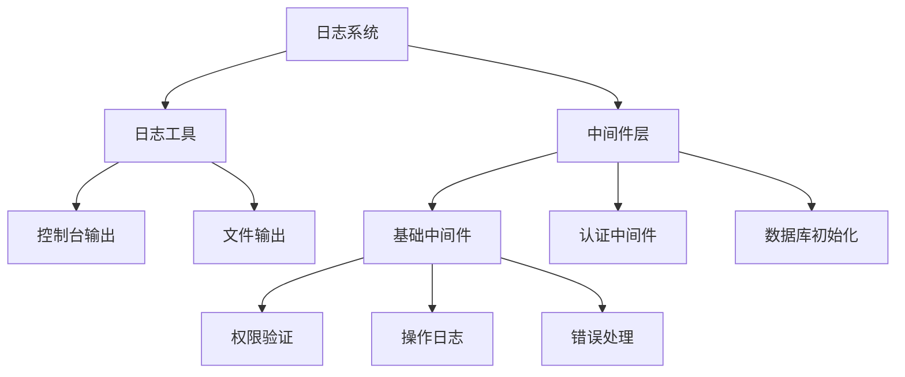
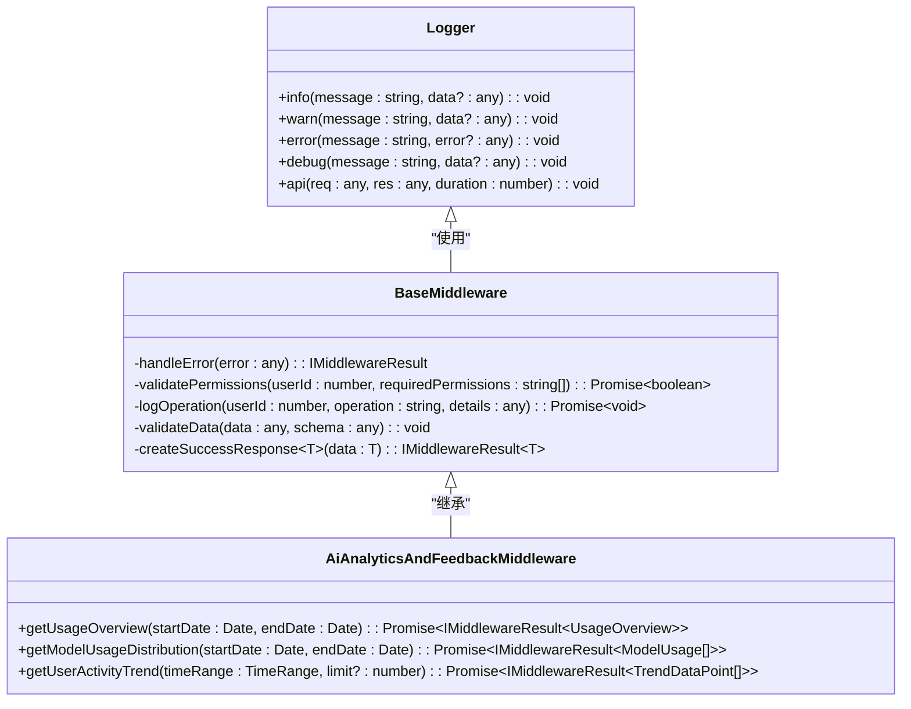
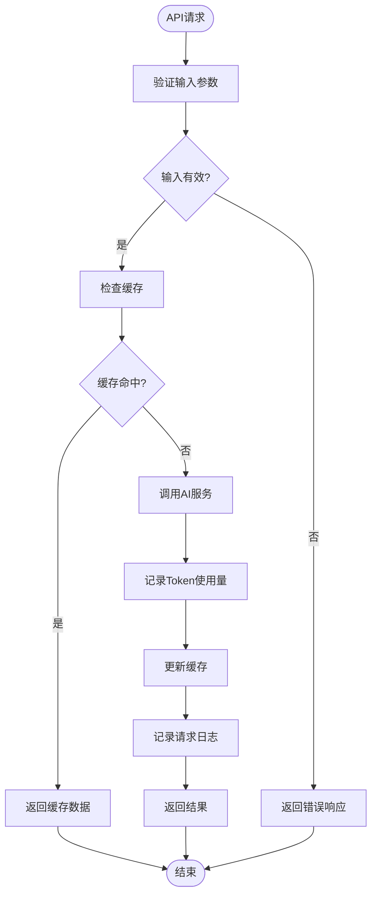
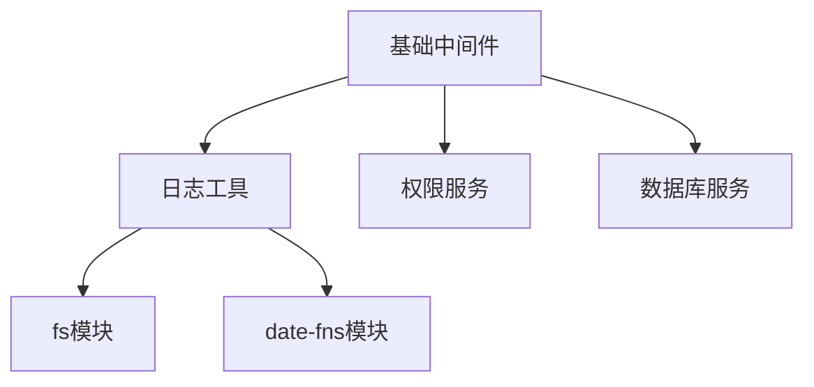

# 日志记录中间件

<cite>
**本文档引用的文件**
- [logger.ts](file://k.yyup.com/server/src/utils/logger.ts)
- [base.middleware.ts](file://k.yyup.com/server/src/middlewares/ai/base.middleware.ts)
- [auth-shared-pool-example.middleware.ts](file://auth-shared-pool-example.middleware.ts)
- [database-initialization.ts](file://database-initialization.ts)
</cite>

## 目录
1. [简介](#简介)
2. [项目结构](#项目结构)
3. [核心组件](#核心组件)
4. [架构概述](#架构概述)
5. [详细组件分析](#详细组件分析)
6. [依赖分析](#依赖分析)
7. [性能考虑](#性能考虑)
8. [故障排除指南](#故障排除指南)
9. [结论](#结论)

## 简介
本文档全面记录了日志记录中间件的设计与实现，特别关注AI请求日志的特殊处理。文档描述了请求日志的采集内容，包括请求方法、URL、请求体、响应状态码、响应时间等关键信息。解释了日志分级策略（debug、info、warn、error）和日志格式化规范。说明了日志输出目标（控制台、文件、远程服务）的配置方法。重点分析了AI请求日志的特殊字段记录，如模型调用信息、token使用量等。提供了日志轮转、归档和查询的管理方案，以及日志性能优化技巧。

## 项目结构
本项目中的日志系统主要由日志工具模块和中间件模块组成，通过统一的接口提供日志记录功能。日志工具位于`server/src/utils/logger.ts`，为整个系统提供基础的日志记录能力。中间件层通过继承基础中间件类来实现统一的错误处理和日志记录机制。



**图示来源**
- [logger.ts](file://k.yyup.com/server/src/utils/logger.ts#L1-L129)
- [base.middleware.ts](file://k.yyup.com/server/src/middlewares/ai/base.middleware.ts#L1-L202)

**本节来源**
- [logger.ts](file://k.yyup.com/server/src/utils/logger.ts#L1-L129)
- [base.middleware.ts](file://k.yyup.com/server/src/middlewares/ai/base.middleware.ts#L1-L202)

## 核心组件
日志记录系统的核心组件包括日志工具和基础中间件。日志工具提供了统一的日志记录接口，支持多种日志级别和输出目标。基础中间件封装了通用的错误处理、权限验证和日志记录功能，为上层业务逻辑提供一致的异常处理机制。

**本节来源**
- [logger.ts](file://k.yyup.com/server/src/utils/logger.ts#L1-L129)
- [base.middleware.ts](file://k.yyup.com/server/src/middlewares/ai/base.middleware.ts#L1-L202)

## 架构概述
日志系统的架构采用分层设计，上层中间件通过调用底层日志工具实现日志记录功能。这种设计实现了关注点分离，使得日志记录逻辑与业务逻辑解耦，提高了代码的可维护性和可扩展性。



**图示来源**
- [logger.ts](file://k.yyup.com/server/src/utils/logger.ts#L40-L129)
- [base.middleware.ts](file://k.yyup.com/server/src/middlewares/ai/base.middleware.ts#L80-L202)

## 详细组件分析

### 日志工具分析
日志工具组件提供了完整的日志记录功能，支持多种日志级别和输出目标。该组件自动创建日志目录，并根据日期生成不同的日志文件，便于日志管理和归档。

#### 日志工具类图
```mermaid
classDiagram
class Logger {
+info(message : string, data? : any) : void
+warn(message : string, data? : any) : void
+error(message : string, error? : any) : void
+debug(message : string, data? : any) : void
+api(req : any, res : any, duration : number) : void
-writeLog(filePath : string, message : string) : void
-getCurrentDate() : string
}
note right of Logger : 日志工具类提供统一的日志记录接口<br/>支持控制台和文件两种输出方式<br/>自动按日期轮转日志文件
```

**图示来源**
- [logger.ts](file://k.yyup.com/server/src/utils/logger.ts#L40-L129)

### 基础中间件分析
基础中间件为所有AI相关的中间件提供了统一的基类，封装了错误处理、权限验证、操作日志记录等通用功能。通过继承此基类，具体的中间件可以专注于业务逻辑的实现。

#### 基础中间件类图
```mermaid
classDiagram
class BaseMiddleware {
-handleError(error : any) : IMiddlewareResult
-validatePermissions(userId : number, requiredPermissions : string[]) : Promise~boolean~
-logOperation(userId : number, operation : string, details : any) : Promise~void~
-validateData(data : any, schema : any) : void
-createSuccessResponse~T~(data : T) : IMiddlewareResult~T~
}
note right of BaseMiddleware : 基础中间件类提供通用功能<br/>包括错误处理、权限验证、操作日志等<br/>所有AI中间件继承此类
```

**图示来源**
- [base.middleware.ts](file://k.yyup.com/server/src/middlewares/ai/base.middleware.ts#L80-L202)

### AI请求日志特殊处理
对于AI请求，系统特别记录了模型调用信息、token使用量等关键指标。这些信息对于分析AI服务的使用情况和成本控制至关重要。



**图示来源**
- [base.middleware.ts](file://k.yyup.com/server/src/middlewares/ai/base.middleware.ts#L148-L167)
- [logger.ts](file://k.yyup.com/server/src/utils/logger.ts#L102-L110)

**本节来源**
- [logger.ts](file://k.yyup.com/server/src/utils/logger.ts#L1-L129)
- [base.middleware.ts](file://k.yyup.com/server/src/middlewares/ai/base.middleware.ts#L1-L202)

## 依赖分析
日志系统依赖于Node.js的文件系统模块和日期处理库，通过这些基础模块实现日志文件的创建和管理。中间件层依赖于日志工具，实现了统一的日志记录机制。



**图示来源**
- [logger.ts](file://k.yyup.com/server/src/utils/logger.ts#L5-L7)
- [base.middleware.ts](file://k.yyup.com/server/src/middlewares/ai/base.middleware.ts#L6)

**本节来源**
- [logger.ts](file://k.yyup.com/server/src/utils/logger.ts#L1-L129)
- [base.middleware.ts](file://k.yyup.com/server/src/middlewares/ai/base.middleware.ts#L1-L202)

## 性能考虑
日志系统的性能优化主要体现在异步写入和环境感知两个方面。日志写入操作采用异步方式进行，避免阻塞主线程。调试日志仅在非生产环境下输出，减少生产环境的性能开销。

**本节来源**
- [logger.ts](file://k.yyup.com/server/src/utils/logger.ts#L88-L94)

## 故障排除指南
当遇到日志记录问题时，首先检查日志目录是否存在且有写入权限。其次确认环境变量NODE_ENV的设置是否正确，这会影响调试日志的输出。最后检查日志文件路径是否正确生成。

**本节来源**
- [logger.ts](file://k.yyup.com/server/src/utils/logger.ts#L10-L13)
- [logger.ts](file://k.yyup.com/server/src/utils/logger.ts#L88-L94)

## 结论
本文档详细介绍了日志记录中间件的设计与实现，特别关注了AI请求日志的特殊处理。系统通过分层架构实现了日志记录功能的解耦，提供了灵活的日志分级策略和输出目标配置。对于AI请求，系统特别记录了模型调用信息和token使用量等关键指标，为AI服务的分析和优化提供了数据支持。