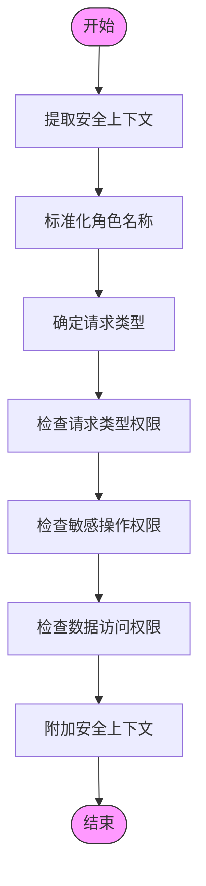
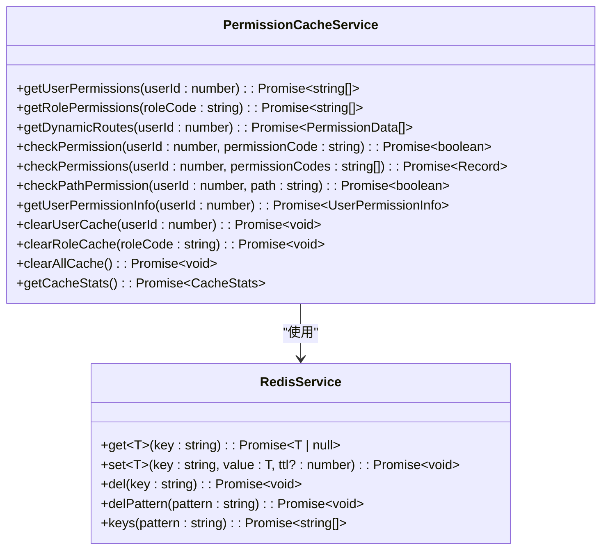
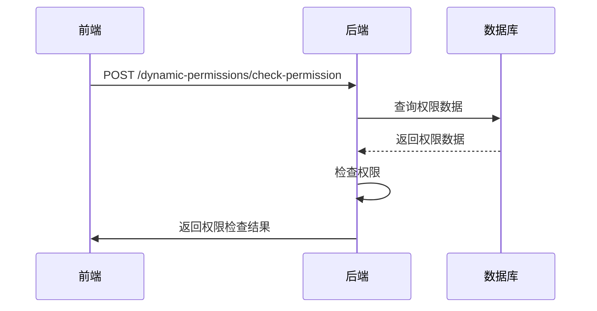
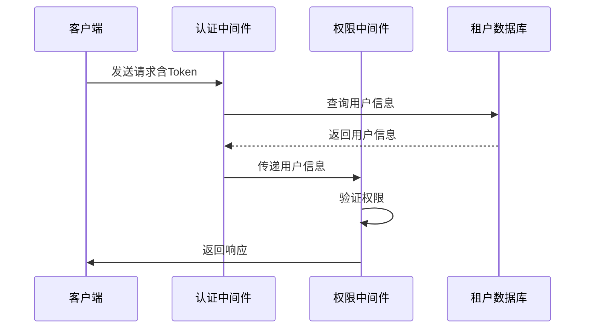
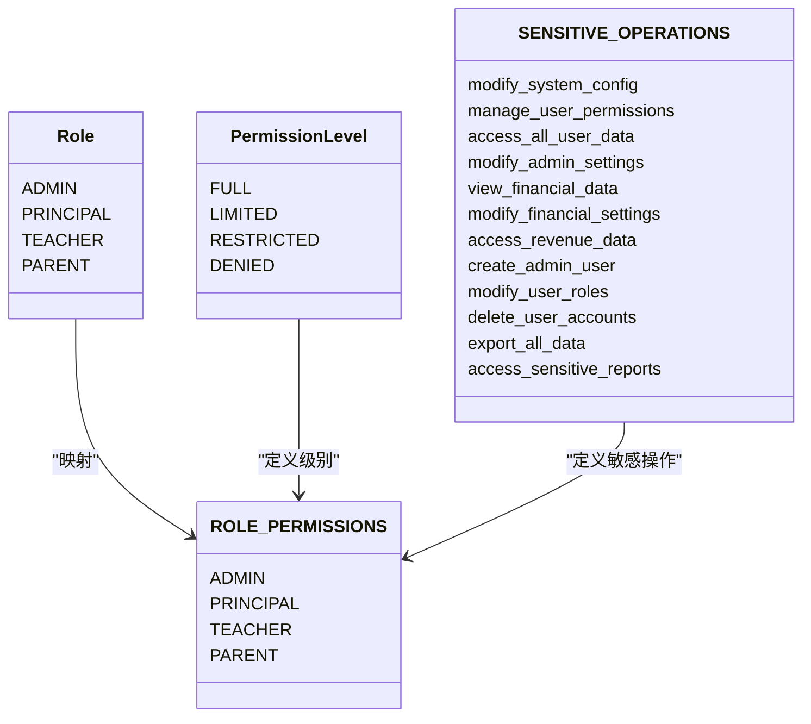
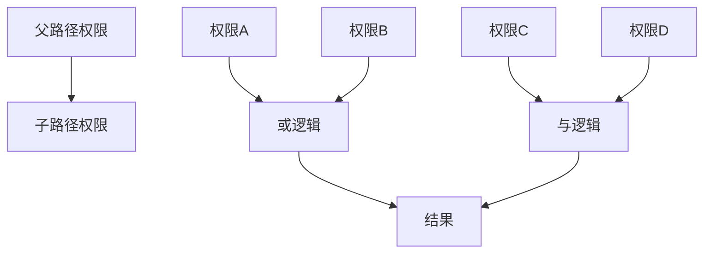
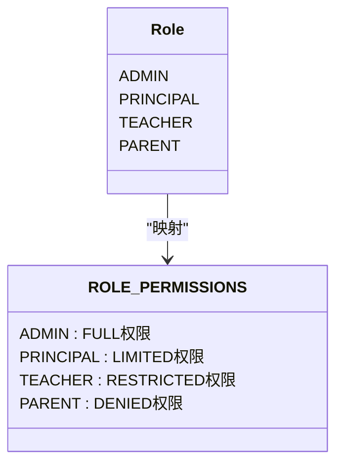
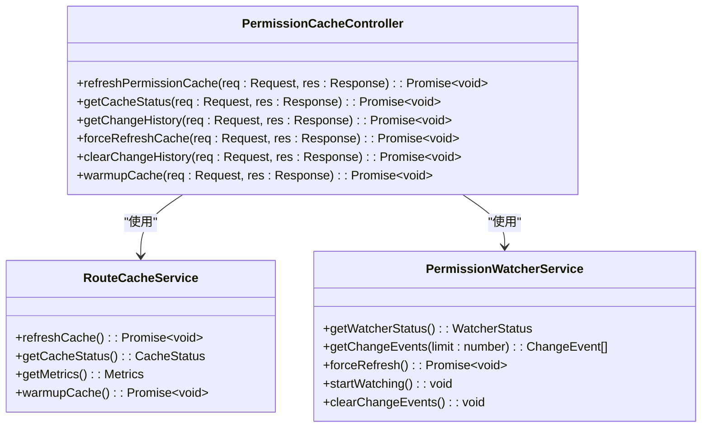

# 权限中间件

<cite>
**本文档引用的文件**   
- [rbac.middleware.ts](file://k.yyup.com/server/src/middlewares/rbac.middleware.ts)
- [permissions.ts](file://k.yyup.com/backup/permission-system/permissions.ts)
- [permission-cache.service.ts](file://k.yyup.com/backup/permission-system/permission-cache.service.ts)
- [permission-cache.controller.ts](file://k.yyup.com/backup/permission-system/permission-cache.controller.ts)
- [auth-shared-pool-example.middleware.ts](file://auth-shared-pool-example.middleware.ts)
- [auth-permissions.ts](file://k.yyup.com/client/src/api/modules/auth-permissions.ts)
- [permission.guard.ts](file://k.yyup.com/client/src/guards/permission.guard.ts)
- [permission.ts](file://k.yyup.com/client/src/directives/permission.ts)
</cite>

## 目录
1. [简介](#简介)
2. [权限检查执行流程](#权限检查执行流程)
3. [权限缓存机制](#权限缓存机制)
4. [动态权限验证](#动态权限验证)
5. [与认证中间件的协同工作](#与认证中间件的协同工作)
6. [权限策略配置与路由应用](#权限策略配置与路由应用)
7. [权限继承与组合逻辑](#权限继承与组合逻辑)
8. [特殊权限处理](#特殊权限处理)
9. [权限调试工具与问题排查](#权限调试工具与问题排查)

## 简介

权限中间件实现了基于角色的访问控制（RBAC）系统，为统一智能服务提供严格的角色权限控制。该系统通过定义角色、权限级别和敏感操作，实现细粒度的访问控制决策。权限中间件与认证中间件协同工作，获取当前用户信息并进行权限比对，确保只有授权用户才能访问特定资源。

**Section sources**
- [rbac.middleware.ts](file://k.yyup.com/server/src/middlewares/rbac.middleware.ts#L1-L568)

## 权限检查执行流程

权限中间件的执行流程包括以下几个步骤：

1. **提取安全上下文**：从请求中提取用户ID、角色、消息内容和请求路径等信息。
2. **标准化角色名称**：将各种角色名称标准化为预定义的角色枚举值。
3. **确定请求类型**：根据消息内容和请求路径确定请求类型，如系统管理、财务访问等。
4. **验证权限**：依次检查请求类型权限、敏感操作权限和数据访问权限。
5. **附加安全上下文**：将验证后的安全上下文附加到请求对象，供后续处理使用。

**Diagram sources **
- [rbac.middleware.ts](file://k.yyup.com/server/src/middlewares/rbac.middleware.ts#L211-L302)

**Section sources**
- [rbac.middleware.ts](file://k.yyup.com/server/src/middlewares/rbac.middleware.ts#L170-L205)

## 权限缓存机制

权限系统实现了多层缓存机制，以提高权限检查的性能和响应速度。缓存机制包括用户权限缓存、角色权限缓存、动态路由缓存和权限检查缓存。

**Diagram sources **
- [permission-cache.service.ts](file://k.yyup.com/backup/permission-system/permission-cache.service.ts#L44-L572)

**Section sources**
- [permission-cache.service.ts](file://k.yyup.com/backup/permission-system/permission-cache.service.ts#L50-L134)

## 动态权限验证

动态权限验证通过调用后端API实现，支持实时的权限检查和缓存。前端通过`checkPermission`函数调用后端API，验证用户是否有访问某个路径的权限。

**Diagram sources **
- [permissions.ts](file://k.yyup.com/backup/permission-system/permissions.ts#L335-L408)

**Section sources**
- [permissions.ts](file://k.yyup.com/backup/permission-system/permissions.ts#L331-L334)

## 与认证中间件的协同工作

权限中间件与认证中间件协同工作，认证中间件负责验证用户身份并提取用户信息，权限中间件则基于这些信息进行权限检查。认证中间件使用共享连接池访问租户数据库，确保在多租户环境下的数据隔离。

**Diagram sources **
- [auth-shared-pool-example.middleware.ts](file://auth-shared-pool-example.middleware.ts#L19-L136)

**Section sources**
- [auth-shared-pool-example.middleware.ts](file://auth-shared-pool-example.middleware.ts#L19-L136)

## 权限策略配置与路由应用

权限策略通过配置文件定义，包括角色权限映射、权限级别和敏感操作列表。在路由中应用权限控制时，可以通过装饰器或中间件的方式进行权限检查。

**Diagram sources **
- [rbac.middleware.ts](file://k.yyup.com/server/src/middlewares/rbac.middleware.ts#L26-L156)

**Section sources**
- [rbac.middleware.ts](file://k.yyup.com/server/src/middlewares/rbac.middleware.ts#L26-L156)

## 权限继承与组合逻辑

权限系统支持权限继承和组合逻辑。权限继承允许子路径继承父路径的权限，组合逻辑支持多个权限的"或"和"与"操作。

**Diagram sources **
- [permissions.ts](file://k.yyup.com/backup/permission-system/permissions.ts#L376-L397)

**Section sources**
- [permissions.ts](file://k.yyup.com/backup/permission-system/permissions.ts#L376-L397)

## 特殊权限处理

特殊权限如管理员特权通过角色权限映射实现。管理员拥有所有权限，可以访问所有功能和数据。其他角色的权限受到严格限制，确保系统的安全性和数据的隔离。

**Diagram sources **
- [rbac.middleware.ts](file://k.yyup.com/server/src/middlewares/rbac.middleware.ts#L65-L156)

**Section sources**
- [rbac.middleware.ts](file://k.yyup.com/server/src/middlewares/rbac.middleware.ts#L65-L156)

## 权限调试工具与问题排查

权限系统提供了多种调试工具和问题排查方法，包括权限缓存控制器、权限变更历史和缓存健康检查。管理员可以通过这些工具手动刷新缓存、查看缓存状态和获取权限变更历史。

**Diagram sources **
- [permission-cache.controller.ts](file://k.yyup.com/backup/permission-system/permission-cache.controller.ts#L16-L390)

**Section sources**
- [permission-cache.controller.ts](file://k.yyup.com/backup/permission-system/permission-cache.controller.ts#L22-L85)