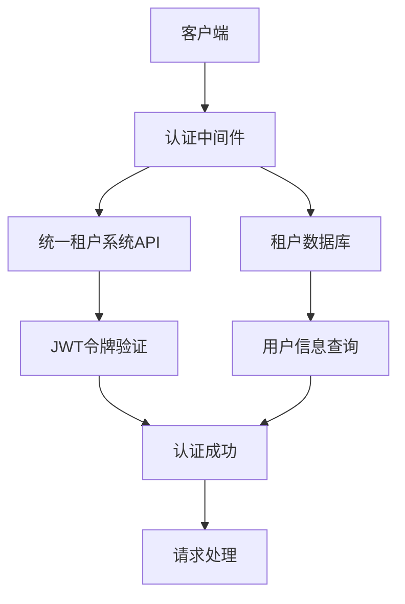
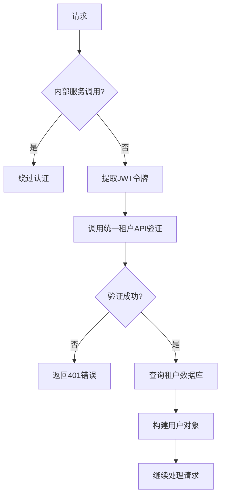
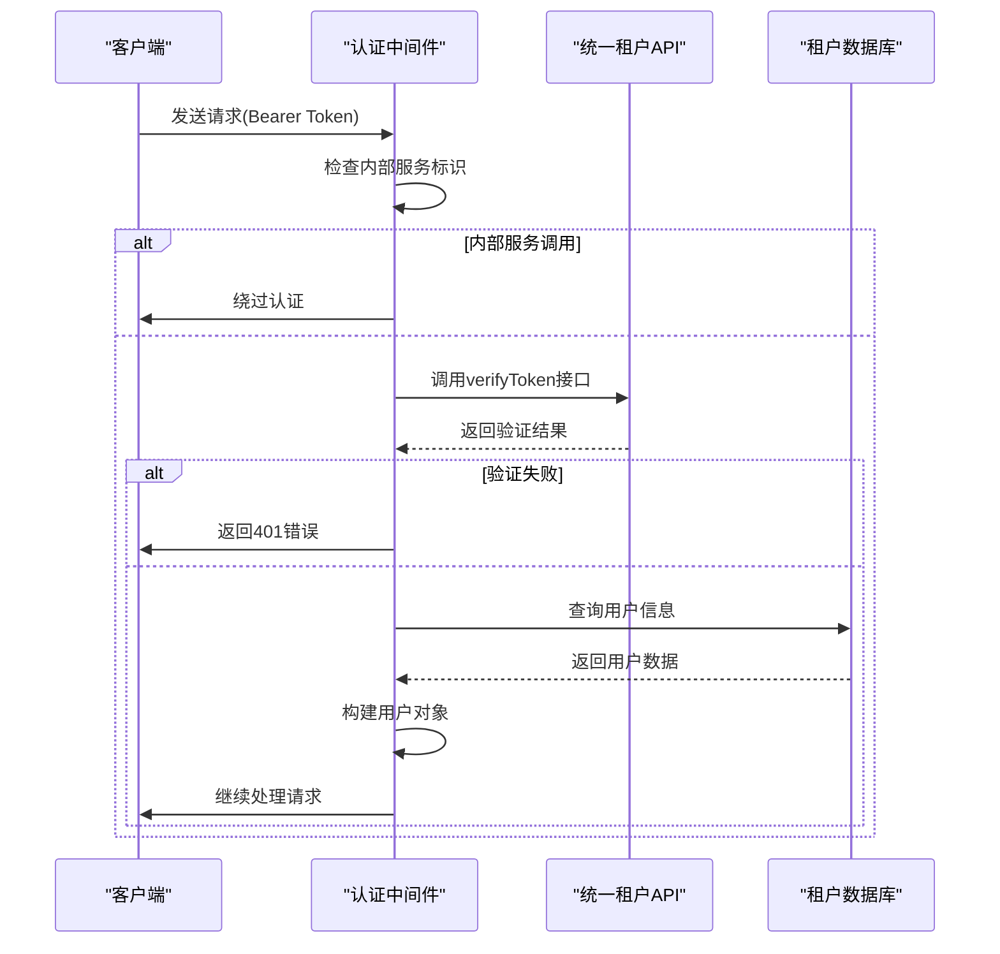
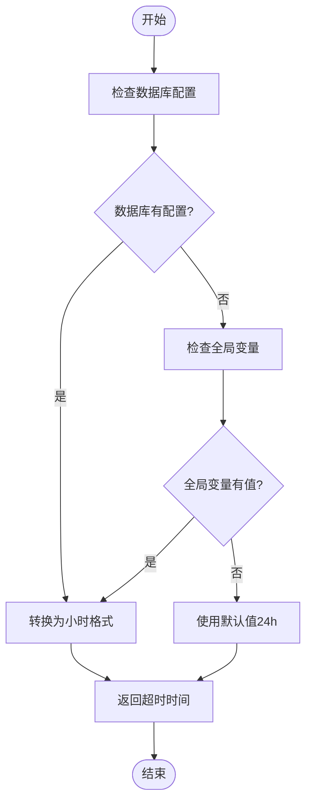
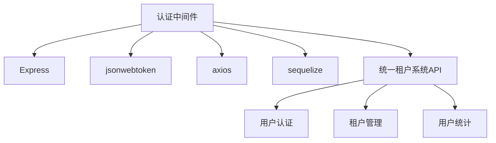

# 认证中间件

<cite>
**本文档引用的文件**  
- [auth.middleware.ts](file://k.yyup.com/server/src/middlewares/auth.middleware.ts)
- [jwt.config.ts](file://k.yyup.com/server/src/config/jwt.config.ts)
- [session.service.ts](file://k.yyup.com/server/src/services/session.service.ts)
- [auth-shared-pool-example.middleware.ts](file://auth-shared-pool-example.middleware.ts)
</cite>

## 目录
1. [简介](#简介)
2. [项目结构](#项目结构)
3. [核心组件](#核心组件)
4. [架构概述](#架构概述)
5. [详细组件分析](#详细组件分析)
6. [依赖分析](#依赖分析)
7. [性能考虑](#性能考虑)
8. [故障排除指南](#故障排除指南)
9. [结论](#结论)

## 简介
本文档深入分析了认证中间件的实现机制，重点描述了JWT令牌的验证流程、令牌刷新策略和会话管理。详细解释了如何从请求头中提取令牌、验证签名、检查过期时间以及解析用户信息。同时，文档还说明了认证中间件与用户服务的交互方式，包括用户状态检查和黑名单令牌验证。

## 项目结构
认证中间件主要位于`k.yyup.com/server/src/middlewares/`目录下，核心文件为`auth.middleware.ts`。该中间件依赖于JWT配置文件`jwt.config.ts`和会话服务`session.service.ts`。此外，系统还提供了`auth-shared-pool-example.middleware.ts`作为共享连接池模式的认证中间件示例。

**图表来源**  
- [auth.middleware.ts](file://k.yyup.com/server/src/middlewares/auth.middleware.ts#L142-L378)
- [jwt.config.ts](file://k.yyup.com/server/src/config/jwt.config.ts#L1-L61)

**章节来源**  
- [auth.middleware.ts](file://k.yyup.com/server/src/middlewares/auth.middleware.ts#L1-L1378)
- [auth-shared-pool-example.middleware.ts](file://auth-shared-pool-example.middleware.ts#L1-L255)

## 核心组件
认证中间件的核心功能包括JWT令牌验证、用户信息查询、权限检查和会话管理。中间件通过调用统一租户系统API验证令牌，并在租户数据库中查找或创建用户记录。系统支持内部服务调用绕过认证，并提供了详细的日志记录功能。

**章节来源**  
- [auth.middleware.ts](file://k.yyup.com/server/src/middlewares/auth.middleware.ts#L142-L378)
- [jwt.config.ts](file://k.yyup.com/server/src/config/jwt.config.ts#L1-L61)

## 架构概述
认证中间件采用分层架构设计，包括请求处理层、认证验证层、数据访问层和响应生成层。中间件首先从请求头中提取JWT令牌，然后调用统一租户系统API进行验证。验证通过后，系统会在租户数据库中查找用户信息，并构建用户对象供后续处理使用。

**图表来源**  
- [auth.middleware.ts](file://k.yyup.com/server/src/middlewares/auth.middleware.ts#L142-L378)

## 详细组件分析

### JWT令牌验证流程
认证中间件的JWT令牌验证流程包括多个步骤：首先检查请求头中的授权信息，然后调用统一租户系统API验证令牌，最后在租户数据库中查找用户信息。

#### 令牌验证序列图

**图表来源**  
- [auth.middleware.ts](file://k.yyup.com/server/src/middlewares/auth.middleware.ts#L142-L378)

#### 令牌刷新策略
系统采用24小时的访问令牌有效期和30天的刷新令牌有效期。通过`getDynamicTokenExpire`函数可以动态获取会话超时时间，优先从数据库配置中读取，其次检查全局变量，最后使用默认值。

**图表来源**  
- [jwt.config.ts](file://k.yyup.com/server/src/config/jwt.config.ts#L17-L43)

**章节来源**  
- [jwt.config.ts](file://k.yyup.com/server/src/config/jwt.config.ts#L1-L61)

### 会话管理
会话管理通过`SessionService`实现，支持用户状态检查和黑名单令牌验证。当用户登录时，系统会创建会话记录；当用户登出时，会话会被标记为无效。

**章节来源**  
- [session.service.ts](file://k.yyup.com/server/src/services/session.service.ts#L1-L100)

## 依赖分析
认证中间件依赖于多个外部服务和内部组件。主要依赖包括Express框架、JWT库、Axios HTTP客户端、Sequelize ORM和统一租户系统API。中间件通过`adminIntegrationService`对象封装了与统一租户系统的通信。

**图表来源**  
- [auth.middleware.ts](file://k.yyup.com/server/src/middlewares/auth.middleware.ts#L1-L10)
- [auth.middleware.ts](file://k.yyup.com/server/src/middlewares/auth.middleware.ts#L18-L140)

**章节来源**  
- [auth.middleware.ts](file://k.yyup.com/server/src/middlewares/auth.middleware.ts#L1-L1378)

## 性能考虑
认证中间件在设计时考虑了性能优化。通过共享连接池模式减少数据库连接开销，使用完整表名查询避免数据库切换。系统还实现了错误处理和日志记录，便于监控和调试。

## 故障排除指南
### 常见问题及解决方案
1. **令牌过期处理**：当令牌过期时，客户端应使用刷新令牌获取新的访问令牌。如果刷新令牌也过期，则需要重新登录。
2. **跨域认证问题**：确保CORS配置正确，允许认证相关的HTTP头通过。
3. **租户数据库访问失败**：检查租户代码格式是否正确，确保租户数据库存在且可访问。

**章节来源**  
- [auth.middleware.ts](file://k.yyup.com/server/src/middlewares/auth.middleware.ts#L142-L378)
- [auth.middleware.ts](file://k.yyup.com/server/src/middlewares/auth.middleware.ts#L825-L1005)

## 结论
认证中间件实现了安全可靠的用户认证机制，通过与统一租户系统的集成，提供了统一的认证体验。系统支持灵活的令牌策略和会话管理，能够满足多租户环境下的认证需求。建议在生产环境中禁用开发环境的测试绕过逻辑，确保系统的安全性。