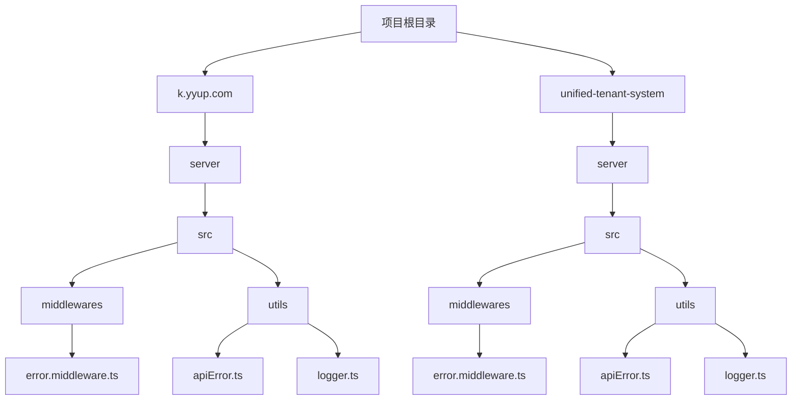
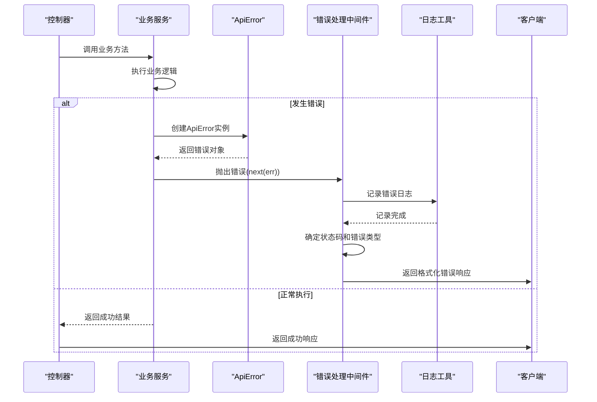
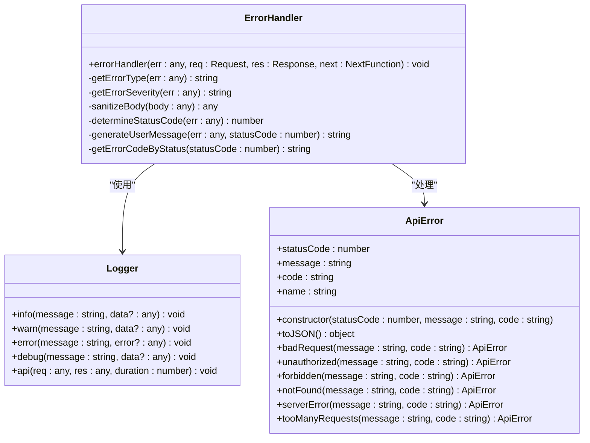
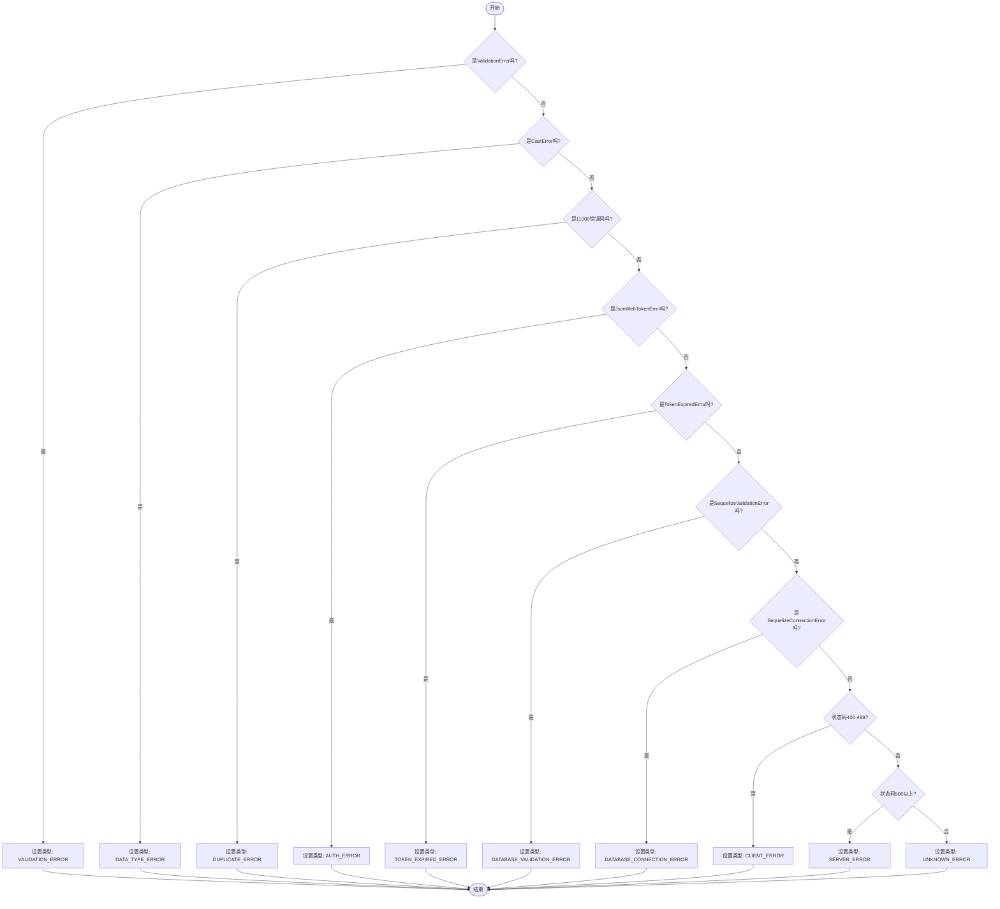
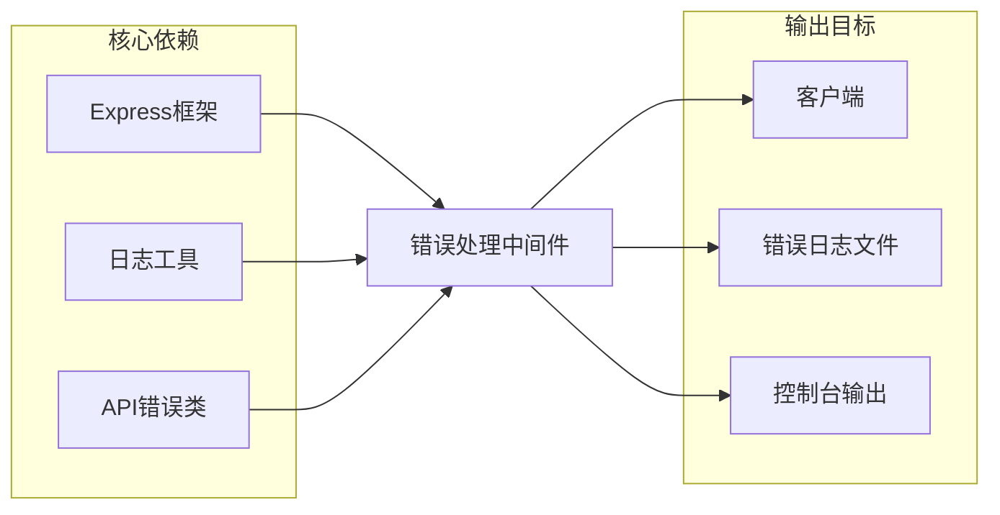

# 错误处理中间件

<cite>
**本文档引用的文件**
- [error.middleware.ts](file://k.yyup.com/server/src/middlewares/error.middleware.ts)
- [apiError.ts](file://k.yyup.com/server/src/utils/apiError.ts)
- [logger.ts](file://k.yyup.com/server/src/utils/logger.ts)
- [app.js](file://k.yyup.com/server/src/app.ts)
- [error.middleware.ts](file://unified-tenant-system/server/src/middlewares/error.middleware.ts)
- [apiError.ts](file://unified-tenant-system/server/src/utils/apiError.ts)
- [logger.ts](file://unified-tenant-system/server/src/utils/logger.ts)
</cite>

## 目录
1. [简介](#简介)
2. [项目结构](#项目结构)
3. [核心组件](#核心组件)
4. [架构概述](#架构概述)
5. [详细组件分析](#详细组件分析)
6. [依赖分析](#依赖分析)
7. [性能考虑](#性能考虑)
8. [故障排除指南](#故障排除指南)
9. [结论](#结论)

## 简介
本文档深入分析了Express错误处理中间件的架构和工作流程。重点解释了错误处理中间件的特殊性，包括其四参数签名和在中间件管道中的位置要求。文档详细描述了错误分类机制（客户端错误、服务器错误、验证错误等）和相应的HTTP状态码映射。同时说明了错误日志记录、错误响应格式化和敏感信息过滤的实现。提供了自定义错误类型定义方法和业务逻辑中抛出错误的最佳实践。包含错误堆栈跟踪、错误监控集成和错误报告生成的详细指南。

## 项目结构
本项目包含两个主要的应用系统：k.yyup.com和unified-tenant-system，两者都实现了相似的错误处理架构。错误处理相关的代码主要位于server/src/middlewares和server/src/utils目录下。



**图示来源**
- [error.middleware.ts](file://k.yyup.com/server/src/middlewares/error.middleware.ts)
- [apiError.ts](file://k.yyup.com/server/src/utils/apiError.ts)
- [logger.ts](file://k.yyup.com/server/src/utils/logger.ts)

**章节来源**
- [k.yyup.com/server](file://k.yyup.com/server)
- [unified-tenant-system/server](file://unified-tenant-system/server)

## 核心组件
本系统的错误处理系统由三个核心组件构成：全局错误处理中间件、API错误类和日志工具。这些组件协同工作，提供统一的错误处理机制。

**章节来源**
- [error.middleware.ts](file://k.yyup.com/server/src/middlewares/error.middleware.ts#L13-L85)
- [apiError.ts](file://k.yyup.com/server/src/utils/apiError.ts#L4-L65)
- [logger.ts](file://k.yyup.com/server/src/utils/logger.ts#L40-L129)

## 架构概述
系统的错误处理架构采用分层设计，从错误抛出到最终响应形成完整的处理链条。当业务逻辑中发生错误时，通过ApiError类创建结构化错误对象，由Express框架传递给全局错误处理中间件，中间件进行日志记录、错误分类和响应格式化。



**图示来源**
- [error.middleware.ts](file://k.yyup.com/server/src/middlewares/error.middleware.ts#L13-L85)
- [apiError.ts](file://k.yyup.com/server/src/utils/apiError.ts#L4-L65)

## 详细组件分析

### 错误处理中间件分析
错误处理中间件是整个错误处理系统的核心，负责捕获所有未处理的异常并生成统一的错误响应。

#### 中间件特性
Express错误处理中间件具有特殊的四参数签名(err, req, res, next)，这使其与其他中间件区分开来。只有具有这种签名的中间件才会被Express识别为错误处理中间件，并且必须在所有其他中间件和路由之后注册，以确保能够捕获前面中间件和路由处理中抛出的错误。



**图示来源**
- [error.middleware.ts](file://k.yyup.com/server/src/middlewares/error.middleware.ts#L13-L213)
- [apiError.ts](file://k.yyup.com/server/src/utils/apiError.ts#L4-L65)
- [logger.ts](file://k.yyup.com/server/src/utils/logger.ts#L40-L129)

**章节来源**
- [error.middleware.ts](file://k.yyup.com/server/src/middlewares/error.middleware.ts#L1-L213)

### 错误分类机制
系统实现了精细的错误分类机制，根据错误的性质和来源进行分类，便于日志分析和监控。



**图示来源**
- [error.middleware.ts](file://k.yyup.com/server/src/middlewares/error.middleware.ts#L90-L101)

**章节来源**
- [error.middleware.ts](file://k.yyup.com/server/src/middlewares/error.middleware.ts#L87-L101)

### HTTP状态码映射
系统实现了全面的HTTP状态码映射机制，确保不同类型的错误返回适当的状态码。

```mermaid
erDiagram
HTTP_STATUS ||--o{ ERROR_TYPE : 映射
HTTP_STATUS {
int code PK
string description
string category
}
ERROR_TYPE {
string name PK
string message
string code
}
HTTP_STATUS ||--o{ ERROR_RESPONSE : 生成
ERROR_RESPONSE {
string errorId
boolean success
object error
}
HTTP_STATUS {
400 "Bad Request" "客户端错误"
401 "Unauthorized" "认证错误"
403 "Forbidden" "权限错误"
404 "Not Found" "资源错误"
409 "Conflict" "冲突错误"
422 "Unprocessable Entity" "验证错误"
429 "Too Many Requests" "限流错误"
500 "Internal Server Error" "服务器错误"
503 "Service Unavailable" "服务错误"
}
ERROR_TYPE {
"ValidationError" "请求参数错误，请检查输入信息" "BAD_REQUEST"
"JsonWebTokenError" "登录已过期，请重新登录" "UNAUTHORIZED"
"ForbiddenError" "没有权限执行此操作" "FORBIDDEN"
"NotFoundError" "请求的资源不存在" "NOT_FOUND"
"ConflictError" "数据冲突，该信息可能已存在" "CONFLICT"
"SequelizeConnectionError" "服务暂时不可用，请稍后重试" "SERVICE_UNAVAILABLE"
"DatabaseError" "服务暂时不可用，请稍后重试" "SERVICE_UNAVAILABLE"
"default" "操作失败，请稍后重试" "INTERNAL_SERVER_ERROR"
}
```

**图示来源**
- [error.middleware.ts](file://k.yyup.com/server/src/middlewares/error.middleware.ts#L139-L162)
- [error.middleware.ts](file://k.yyup.com/server/src/middlewares/error.middleware.ts#L168-L194)

**章节来源**
- [error.middleware.ts](file://k.yyup.com/server/src/middlewares/error.middleware.ts#L136-L194)

## 依赖分析
错误处理系统依赖于Express框架的核心功能，并与日志系统紧密集成。



**图示来源**
- [error.middleware.ts](file://k.yyup.com/server/src/middlewares/error.middleware.ts#L5-L8)
- [app.js](file://k.yyup.com/server/src/app.ts)

**章节来源**
- [error.middleware.ts](file://k.yyup.com/server/src/middlewares/error.middleware.ts#L1-L85)
- [app.js](file://k.yyup.com/server/src/app.ts)

## 性能考虑
错误处理中间件在生产环境中经过优化，避免在正常请求流程中产生额外开销。只有在发生错误时才会执行完整的错误处理流程，包括日志记录和响应构建。

错误ID的生成采用高效算法，结合时间戳和随机字符串，确保唯一性的同时保持性能。敏感信息过滤功能只在错误发生时执行，避免对正常请求体进行不必要的处理。

在开发环境中，系统会输出详细的错误信息和堆栈跟踪，便于调试；而在生产环境中，这些敏感信息会被过滤，只返回用户友好的错误消息，既保护了系统安全，又减少了网络传输的数据量。

## 故障排除指南
当遇到错误处理相关问题时，可以按照以下步骤进行排查：

1. 检查错误处理中间件是否在应用启动时正确注册，必须在所有路由之后注册
2. 查看错误日志文件，定位错误发生的具体位置和上下文信息
3. 验证自定义错误是否正确继承ApiError类或设置了正确的statusCode属性
4. 检查敏感信息过滤是否正常工作，确保密码等敏感字段被正确脱敏
5. 验证错误响应格式是否符合API规范，特别是success字段和error对象结构

**章节来源**
- [error.middleware.ts](file://k.yyup.com/server/src/middlewares/error.middleware.ts#L46-L48)
- [logger.ts](file://k.yyup.com/server/src/utils/logger.ts#L68-L81)

## 结论
本系统的错误处理中间件设计充分考虑了可维护性、安全性和用户体验。通过统一的错误处理机制，确保了API响应的一致性；通过详细的错误分类和日志记录，提高了系统的可观测性；通过敏感信息过滤和用户友好消息，增强了系统的安全性。该设计模式可作为其他Node.js应用错误处理的参考实现。