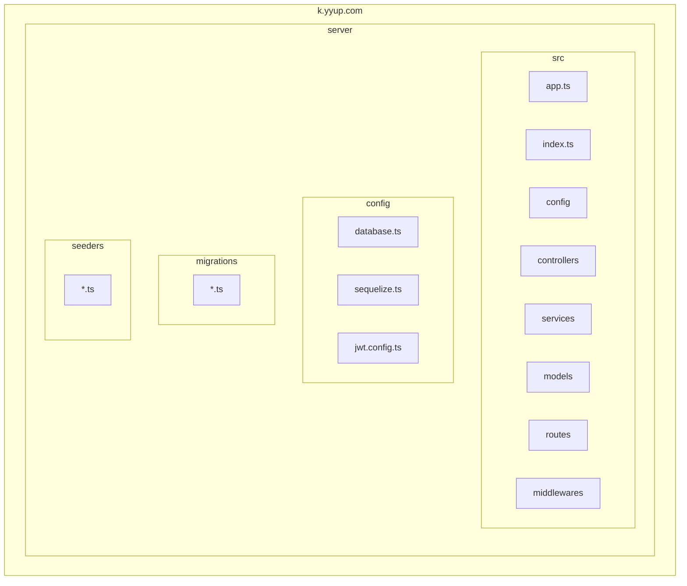
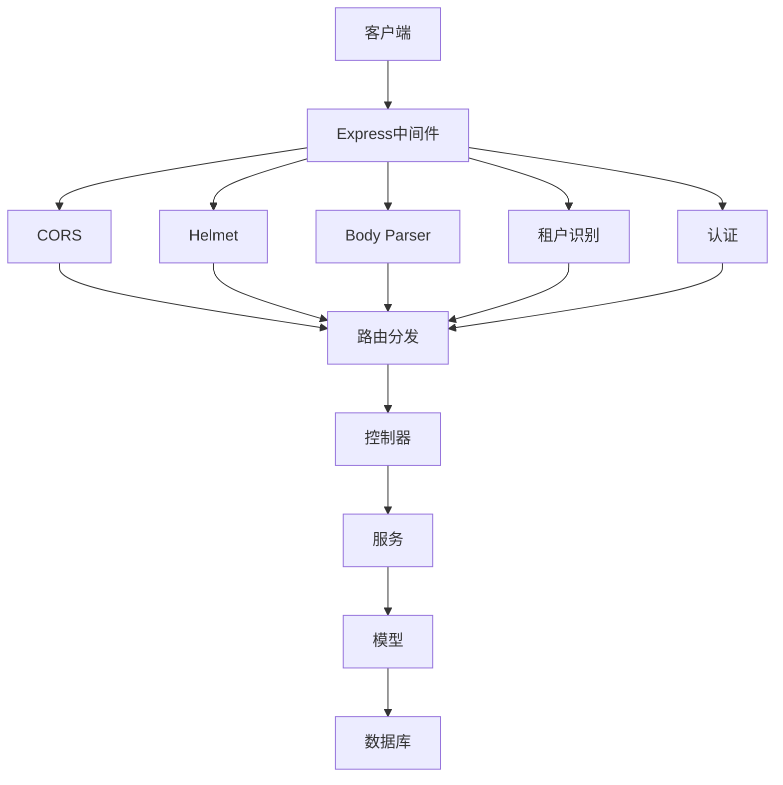
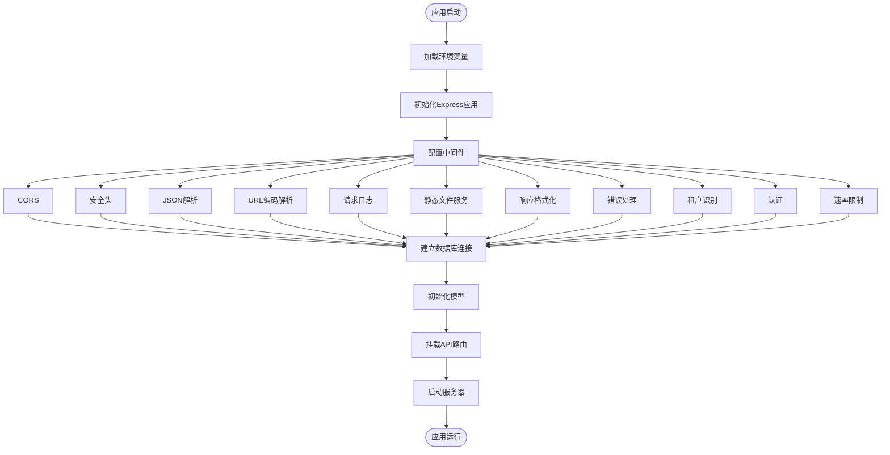
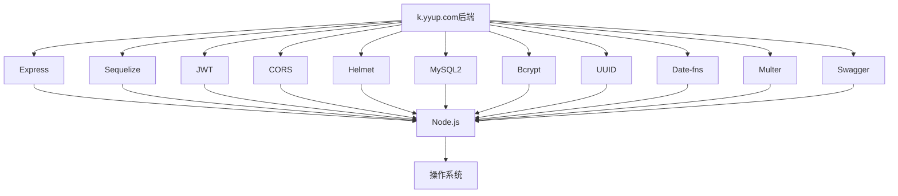

# 后端架构

<cite>
**本文档中引用的文件**   
- [app.ts](file://k.yyup.com/server/src/app.ts)
- [index.ts](file://k.yyup.com/server/src/index.ts)
- [database.ts](file://k.yyup.com/server/src/config/database.ts)
- [sequelize.ts](file://k.yyup.com/server/src/config/sequelize.ts)
- [jwt.config.ts](file://k.yyup.com/server/src/config/jwt.config.ts)
- [error.middleware.ts](file://k.yyup.com/server/src/middlewares/error.middleware.ts)
- [response-formatter.middleware.ts](file://k.yyup.com/server/src/middlewares/response-formatter.middleware.ts)
- [tenant-resolver.middleware.ts](file://k.yyup.com/server/src/middlewares/tenant-resolver.middleware.ts)
- [routes](file://k.yyup.com/server/src/routes)
- [controllers](file://k.yyup.com/server/src/controllers)
- [services](file://k.yyup.com/server/src/services)
- [models](file://k.yyup.com/server/src/models)
- [swagger.config.ts](file://k.yyup.com/server/src/config/swagger.config.ts)
</cite>

## 目录
1. [简介](#简介)
2. [项目结构](#项目结构)
3. [核心组件](#核心组件)
4. [架构概述](#架构概述)
5. [详细组件分析](#详细组件分析)
6. [依赖分析](#依赖分析)
7. [性能考虑](#性能考虑)
8. [故障排除指南](#故障排除指南)
9. [结论](#结论)

## 简介
k.yyup.com子系统是基于Express框架构建的后端服务，为幼儿园管理系统提供RESTful API接口。该系统采用TypeScript开发，结合Sequelize ORM实现数据库操作，支持多租户架构。后端架构设计遵循分层原则，包含控制器、服务、模型等组件，通过中间件处理认证、授权、日志记录等跨切面关注点。系统还集成了Swagger文档生成、AI助手功能和全面的测试套件，确保代码质量和可维护性。

## 项目结构
k.yyup.com子系统的后端代码位于`server`目录下，采用标准的Node.js项目结构。主要目录包括`src`（源代码）、`config`（配置文件）、`migrations`（数据库迁移脚本）和`seeders`（数据种子脚本）。源代码遵循MVC模式组织，包含`controllers`、`services`、`models`和`routes`等目录。系统使用TypeScript编译，配置文件包括`tsconfig.json`和`package.json`。



**图源**
- [app.ts](file://k.yyup.com/server/src/app.ts)
- [index.ts](file://k.yyup.com/server/src/index.ts)
- [database.ts](file://k.yyup.com/server/src/config/database.ts)
- [sequelize.ts](file://k.yyup.com/server/src/config/sequelize.ts)

**节源**
- [app.ts](file://k.yyup.com/server/src/app.ts)
- [index.ts](file://k.yyup.com/server/src/index.ts)

## 核心组件
后端系统的核心组件包括Express应用实例、Sequelize数据库连接、路由系统、控制器和服务层。应用启动时，通过`app.ts`或`index.ts`初始化Express实例，配置中间件，建立数据库连接，并挂载路由。系统使用环境变量管理配置，支持开发、测试和生产环境。错误处理通过专门的中间件实现，确保API响应格式统一。

**节源**
- [app.ts](file://k.yyup.com/server/src/app.ts)
- [index.ts](file://k.yyup.com/server/src/index.ts)
- [error.middleware.ts](file://k.yyup.com/server/src/middlewares/error.middleware.ts)
- [response-formatter.middleware.ts](file://k.yyup.com/server/src/middlewares/response-formatter.middleware.ts)

## 架构概述
k.yyup.com后端采用分层架构设计，从上到下依次为路由层、控制器层、服务层和模型层。请求首先经过Express中间件管道，包括CORS、安全头、JSON解析等。然后由路由系统分发到相应的控制器，控制器调用服务层处理业务逻辑，服务层通过模型层与数据库交互。系统还包含专门的中间件处理租户识别、认证和授权。



**图源**
- [app.ts](file://k.yyup.com/server/src/app.ts)
- [index.ts](file://k.yyup.com/server/src/index.ts)
- [middlewares](file://k.yyup.com/server/src/middlewares)

## 详细组件分析

### 应用启动流程
应用启动流程从`index.ts`或`app.ts`开始，首先加载环境变量，然后初始化Express应用实例。接着配置各种中间件，包括CORS、安全头、JSON解析和URL编码解析。之后建立数据库连接，初始化模型关联，并挂载所有API路由。最后启动HTTP服务器，监听指定端口。系统还配置了全局错误处理和进程信号监听，确保优雅关闭。



**图源**
- [index.ts](file://k.yyup.com/server/src/index.ts)
- [app.ts](file://k.yyup.com/server/src/app.ts)

**节源**
- [index.ts](file://k.yyup.com/server/src/index.ts)
- [app.ts](file://k.yyup.com/server/src/app.ts)

### 中间件管道
中间件管道是Express应用的核心，k.yyup.com系统配置了多个中间件来处理各种任务。CORS中间件允许跨域请求，Helmet添加安全HTTP头，body-parser解析请求体。系统还实现了自定义中间件，如响应格式化中间件确保API响应格式统一，租户识别中间件处理多租户逻辑，错误处理中间件捕获和处理异常。

**节源**
- [app.ts](file://k.yyup.com/server/src/app.ts)
- [index.ts](file://k.yyup.com/server/src/index.ts)
- [middlewares](file://k.yyup.com/server/src/middlewares)

### 路由系统
路由系统基于Express的Router实现，采用RESTful设计原则。API端点按功能模块组织在`routes`目录下，每个模块有独立的路由文件。系统支持API版本控制，通过路由前缀`/api`实现。路由文件导入相应的控制器，将HTTP方法和路径映射到控制器方法。Swagger文档自动生成，提供API的交互式文档。

```mermaid
graph TD
A[/api] --> B[用户管理]
A --> C[学生管理]
A --> D[教师管理]
A --> E[班级管理]
A --> F[招生管理]
A --> G[活动管理]
A --> H[AI助手]
A --> I[系统设置]
B --> B1[GET /users]
B --> B2[POST /users]
B --> B3[GET /users/:id]
B --> B4[PUT /users/:id]
B --> B5[DELETE /users/:id]
C --> C1[GET /students]
C --> C2[POST /students]
C --> C3[GET /students/:id]
C --> C4[PUT /students/:id]
C --> C5[DELETE /students/:id]
D --> D1[GET /teachers]
D --> D2[POST /teachers]
D --> D3[GET /teachers/:id]
D --> D4[PUT /teachers/:id]
D --> D5[DELETE /teachers/:id]
E --> E1[GET /classes]
E --> E2[POST /classes]
E --> E3[GET /classes/:id]
E --> E4[PUT /classes/:id]
E --> E5[DELETE /classes/:id]
F --> F1[GET /enrollment-plans]
F --> F2[POST /enrollment-plans]
F --> F3[GET /enrollment-applications]
F --> F4[POST /enrollment-applications]
F --> F5[GET /admission-results]
F --> F6[POST /admission-results]
G --> G1[GET /activities]
G --> G2[POST /activities]
G --> G3[GET /activity-registrations]
G --> G4[POST /activity-registrations]
H --> H1[POST /ai-query]
H --> H2[GET /ai-conversations]
H --> H3[POST /ai-conversations]
I --> I1[GET /system-settings]
I --> I2[PUT /system-settings]
```

**图源**
- [routes](file://k.yyup.com/server/src/routes)
- [app.ts](file://k.yyup.com/server/src/app.ts)

**节源**
- [routes](file://k.yyup.com/server/src/routes)
- [app.ts](file://k.yyup.com/server/src/app.ts)

### 控制器层
控制器层负责处理HTTP请求和响应，是路由和业务逻辑之间的桥梁。每个控制器方法验证请求数据，调用相应的服务方法处理业务逻辑，然后格式化响应数据。控制器遵循单一职责原则，每个方法只处理一个特定的API端点。系统使用Joi等库进行请求验证，确保输入数据的正确性。

**节源**
- [controllers](file://k.yyup.com/server/src/controllers)
- [validations](file://k.yyup.com/server/src/validations)

### 服务层
服务层封装业务逻辑，是应用程序的核心。每个服务类负责特定领域的业务规则和操作。服务层与模型层交互，执行数据库操作，同时可以调用其他服务。这种分层设计确保业务逻辑的可重用性和可测试性。服务层还负责事务管理，确保数据一致性。

**节源**
- [services](file://k.yyup.com/server/src/services)
- [models](file://k.yyup.com/server/src/models)

### 数据库交互
系统使用Sequelize ORM与MySQL数据库交互。模型层定义数据模型和关联关系，服务层通过模型执行CRUD操作。系统包含数据库迁移脚本，用于管理数据库模式的演进。数据种子脚本用于初始化测试数据。查询优化通过索引、连接池和缓存实现，确保数据库操作的性能。

**节源**
- [models](file://k.yyup.com/server/src/models)
- [database.ts](file://k.yyup.com/server/src/config/database.ts)
- [sequelize.ts](file://k.yyup.com/server/src/config/sequelize.ts)
- [migrations](file://k.yyup.com/server/src/migrations)
- [seeders](file://k.yyup.com/server/src/seeders)

## 依赖分析
后端系统依赖多个第三方包，包括Express、Sequelize、JWT、CORS等。这些依赖在`package.json`中定义，通过npm管理。系统还依赖数据库、缓存服务和文件存储等外部系统。依赖关系通过模块导入管理，确保代码的模块化和可维护性。



**图源**
- [package.json](file://k.yyup.com/package.json)

**节源**
- [package.json](file://k.yyup.com/package.json)

## 性能考虑
系统在设计时考虑了多项性能优化措施。数据库连接使用连接池，减少连接开销。查询通过索引优化，避免全表扫描。系统实现缓存机制，减少重复计算和数据库查询。API响应通过压缩和分页优化，减少网络传输量。静态文件通过Express的静态文件中间件高效服务。

## 故障排除指南
常见问题包括数据库连接失败、API响应超时和认证错误。数据库连接问题通常由环境变量配置错误或网络问题引起。API超时可能由于复杂查询或高负载导致，可通过优化查询和增加服务器资源解决。认证错误通常与JWT令牌过期或签名密钥不匹配有关。系统日志位于`logs`目录，可用于诊断问题。

**节源**
- [logs](file://k.yyup.com/server/logs)
- [error.middleware.ts](file://k.yyup.com/server/src/middlewares/error.middleware.ts)

## 结论
k.yyup.com后端架构采用现代Node.js技术栈，基于Express框架构建，具有良好的可扩展性和可维护性。分层设计分离关注点，中间件管道处理横切关注点，路由系统组织API端点。系统集成Swagger文档、全面的测试套件和CI/CD流程，确保代码质量和快速迭代。通过遵循最佳实践，该架构为幼儿园管理系统提供了稳定可靠的后端支持。