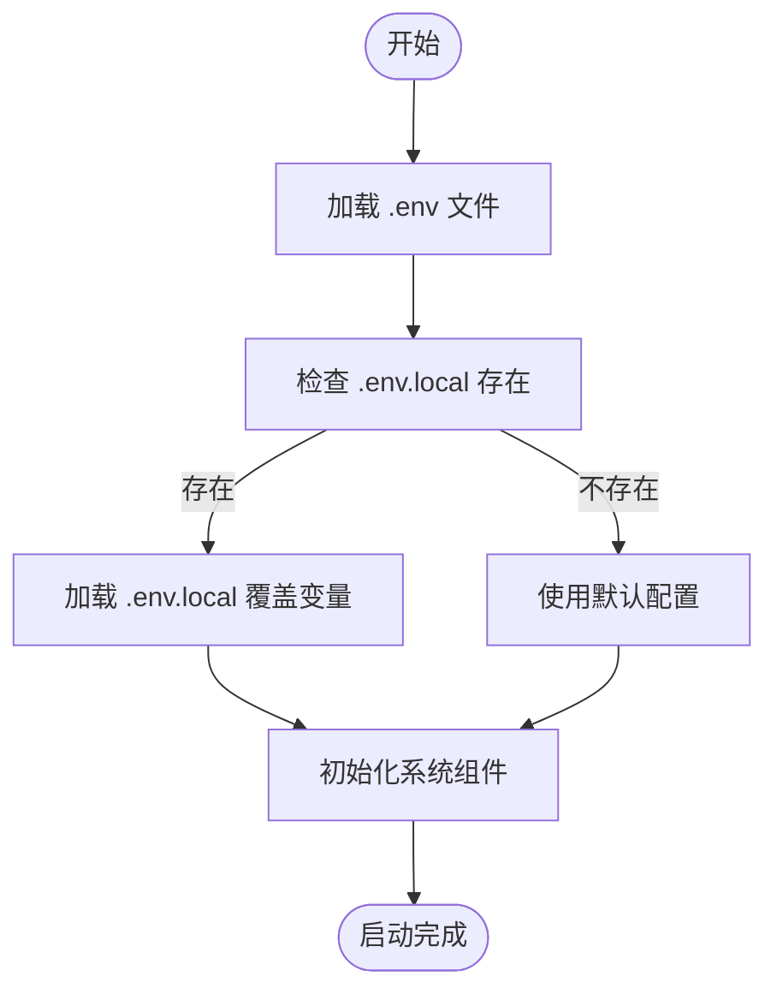
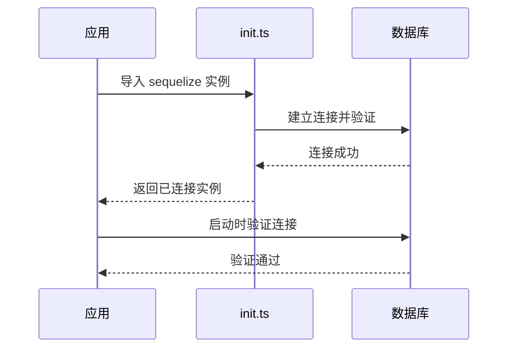
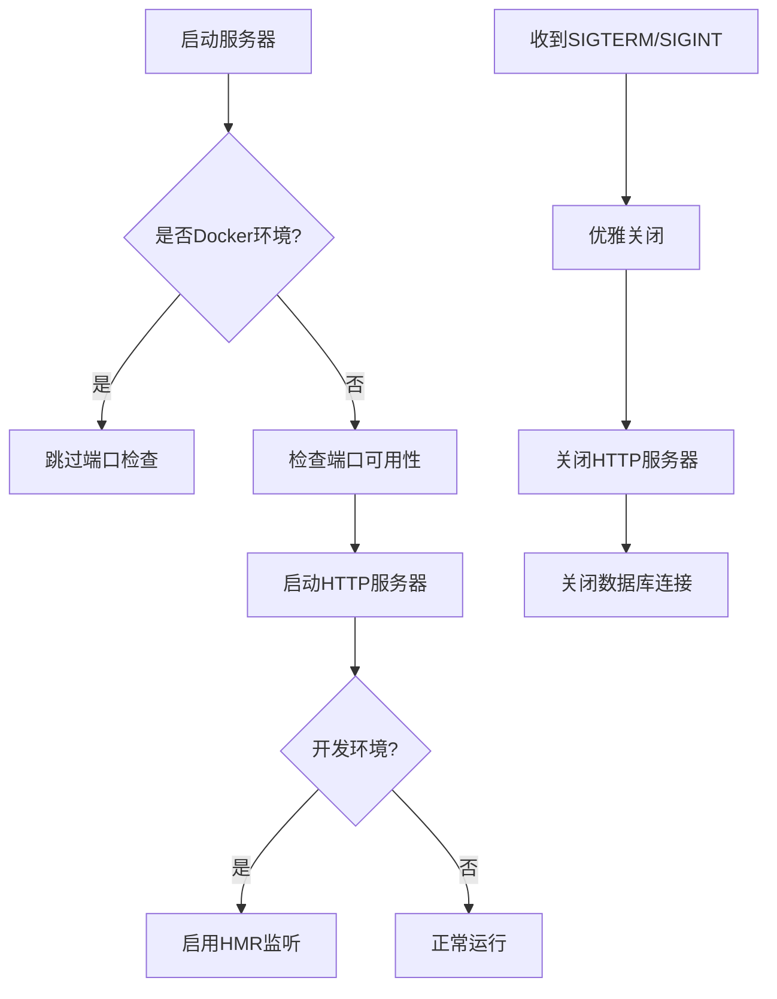

# 应用启动流程

<cite>
**本文档引用的文件**   
- [app.ts](file://k.yyup.com/server/src/app.ts)
- [server.ts](file://k.yyup.com/server/src/server.ts)
- [app.ts](file://unified-tenant-system/server/src/app.ts)
- [server.ts](file://unified-tenant-system/server/src/server.ts)
- [.env](file://k.yyup.com/.env)
- [.env.development](file://k.yyup.com/.env.development)
- [.env.production](file://k.yyup.com/.env.production)
- [.env](file://unified-tenant-system/.env)
- [.env.development](file://unified-tenant-system/.env.development)
- [.env.production](file://unified-tenant-system/.env.production)
- [init.ts](file://k.yyup.com/server/src/init.ts)
- [hmr.ts](file://k.yyup.com/server/src/hmr.ts)
</cite>

## 目录
1. [项目结构](#项目结构)
2. [启动流程概述](#启动流程概述)
3. [配置加载与环境管理](#配置加载与环境管理)
4. [服务器实例化与中间件注册](#服务器实例化与中间件注册)
5. [数据库连接与模型同步](#数据库连接与模型同步)
6. [路由挂载与服务启动](#路由挂载与服务启动)
7. [多实例部署与热重载支持](#多实例部署与热重载支持)
8. [常见问题排查指南](#常见问题排查指南)
9. [性能优化建议](#性能优化建议)

## 项目结构

通过分析项目结构，后端应用主要位于 `k.yyup.com/server` 和 `unified-tenant-system/server` 目录下，包含核心的启动文件、配置、路由、中间件和服务。应用采用模块化设计，分离了配置、数据库、路由和业务逻辑。

**Diagram sources**
- [server.ts](file://k.yyup.com/server/src/server.ts#L1-L562)
- [app.ts](file://k.yyup.com/server/src/app.ts#L1-L971)

**Section sources**
- [server.ts](file://k.yyup.com/server/src/server.ts#L1-L562)
- [app.ts](file://k.yyup.com/server/src/app.ts#L1-L971)

## 启动流程概述

后端应用的启动流程从 `server.ts` 入口文件开始，依次执行配置加载、环境变量解析、数据库连接、中间件注册、路由挂载和服务启动。整个流程设计为异步初始化，确保所有依赖项准备就绪后再启动HTTP服务器。

**Section sources**
- [server.ts](file://k.yyup.com/server/src/server.ts#L421-L555)
- [app.ts](file://k.yyup.com/server/src/app.ts#L28-L38)

## 配置加载与环境管理

应用通过 `dotenv` 模块加载 `.env` 文件中的环境变量，支持分层配置结构。配置优先级为：`.env.local` > `.env.{环境}` > `.env`。应用识别 `development`、`production` 等环境，并根据环境变量调整行为。

**Diagram sources**
- [server.ts](file://k.yyup.com/server/src/server.ts#L17-L28)
- [app.ts](file://k.yyup.com/server/src/app.ts#L51-L63)

**Section sources**
- [server.ts](file://k.yyup.com/server/src/server.ts#L16-L36)
- [app.ts](file://k.yyup.com/server/src/app.ts#L51-L63)

## 服务器实例化与中间件注册

应用使用 Express 框架实例化服务器，注册了安全、日志、CORS、请求解析等中间件。关键中间件包括 `helmet`（安全头）、`cors`（跨域支持）、`express.json()`（JSON解析）和自定义的请求日志中间件。

**Section sources**
- [app.ts](file://k.yyup.com/server/src/app.ts#L90-L142)
- [server.ts](file://k.yyup.com/server/src/server.ts#L126-L238)

## 数据库连接与模型同步

数据库连接通过 `sequelize` 实例在 `init.ts` 中预先配置和验证。应用启动时直接使用已初始化的连接实例，避免重复连接。模型同步在 `init.ts` 中完成，启动流程中仅进行连接验证。

**Diagram sources**
- [init.ts](file://k.yyup.com/server/src/init.ts)
- [app.ts](file://k.yyup.com/server/src/app.ts#L144-L217)

**Section sources**
- [app.ts](file://k.yyup.com/server/src/app.ts#L144-L217)
- [init.ts](file://k.yyup.com/server/src/init.ts)

## 路由挂载与服务启动

应用通过 `app.use('/api', routes)` 挂载所有API路由。启动流程包含重试机制，最多重试3次。服务器监听 `0.0.0.0` 地址，支持外部访问，并设置了2分钟的超时时间以避免页面加载超时。

**Section sources**
- [server.ts](file://k.yyup.com/server/src/server.ts#L421-L555)
- [app.ts](file://k.yyup.com/server/src/app.ts#L774-L777)

## 多实例部署与热重载支持

应用支持多实例部署，通过端口检查避免冲突。在开发环境下启用热模块替换（HMR），监听文件变更并自动重载。应用注册了 `SIGTERM` 和 `SIGINT` 信号处理器，实现优雅关闭。

**Diagram sources**
- [server.ts](file://k.yyup.com/server/src/server.ts#L431-L443)
- [server.ts](file://k.yyup.com/server/src/server.ts#L512-L520)
- [server.ts](file://k.yyup.com/server/src/server.ts#L544-L552)

**Section sources**
- [server.ts](file://k.yyup.com/server/src/server.ts#L421-L555)
- [hmr.ts](file://k.yyup.com/server/src/hmr.ts)

## 常见问题排查指南

| 问题现象 | 可能原因 | 解决方案 |
|--------|--------|--------|
| 端口被占用 | 其他进程占用端口 | 使用 `ensurePortAvailable` 工具释放端口或更换端口 |
| 数据库连接失败 | 数据库服务未启动或凭证错误 | 检查数据库配置，验证连接信息 |
| 环境变量未加载 | .env 文件路径错误 | 确认 .env 文件位于正确位置并被正确加载 |
| HMR 不工作 | 开发环境未启用 | 确保 `NODE_ENV=development` 并检查 HMR 配置 |
| 路由404 | 路由挂载路径错误 | 检查 `app.use('/api', routes)` 是否正确 |

**Section sources**
- [server.ts](file://k.yyup.com/server/src/server.ts#L479-L485)
- [server.ts](file://k.yyup.com/server/src/server.ts#L462-L463)
- [server.ts](file://k.yyup.com/server/src/server.ts#L18-L28)

## 性能优化建议

1. **连接池优化**：复用数据库连接，避免频繁创建销毁
2. **静态文件缓存**：为 `/uploads` 目录配置适当的缓存策略
3. **日志级别控制**：生产环境使用更严格的日志级别
4. **中间件精简**：移除不必要的中间件以减少请求处理时间
5. **HMR 选择性启用**：仅在开发环境启用热重载
6. **错误处理优化**：避免在错误处理中执行耗时操作

**Section sources**
- [server.ts](file://k.yyup.com/server/src/server.ts#L475-L477)
- [app.ts](file://k.yyup.com/server/src/app.ts#L78-L88)
- [server.ts](file://k.yyup.com/server/src/server.ts#L230-L231)