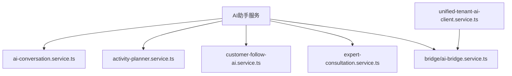
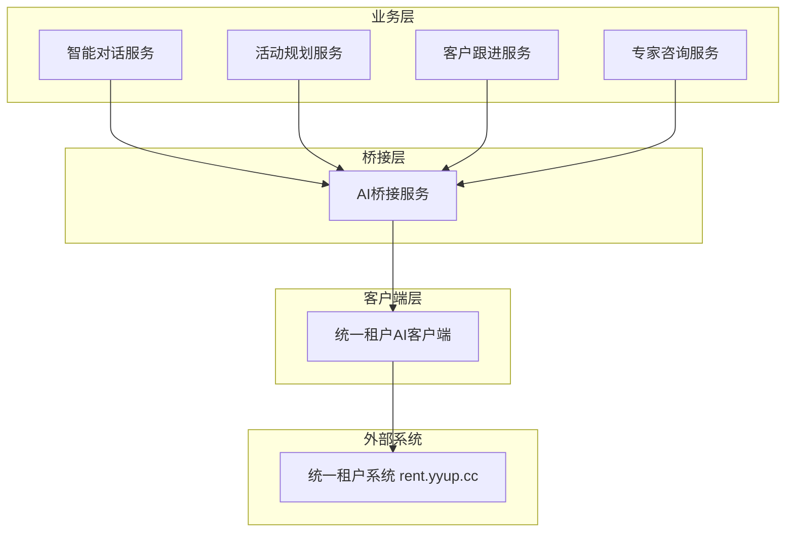
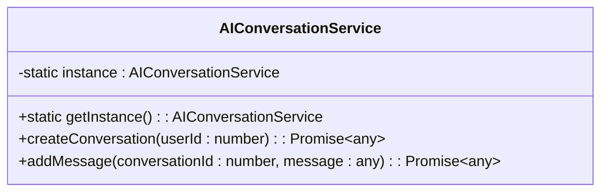
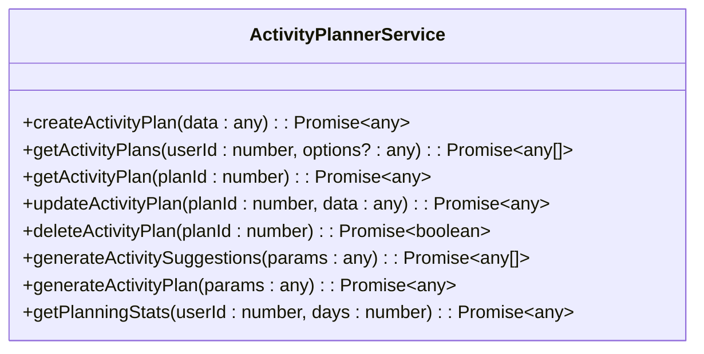
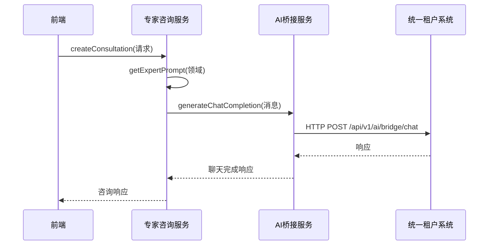
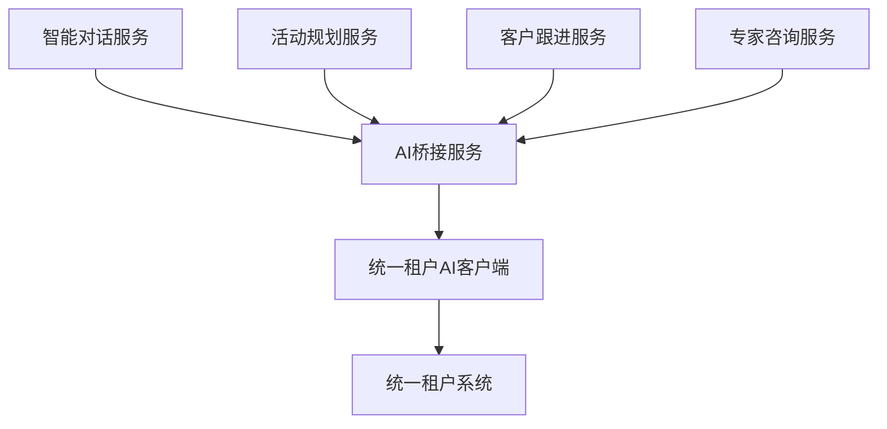

# AI助手服务

<cite>
**本文档引用文件**  
- [ai-conversation.service.ts](file://k.yyup.com/server/src/services/ai/ai-conversation.service.ts)
- [activity-planner.service.ts](file://k.yyup.com/server/src/services/ai/activity-planner.service.ts)
- [customer-follow-ai.service.ts](file://k.yyup.com/server/src/services/ai/customer-follow-ai.service.ts)
- [expert-consultation.service.ts](file://k.yyup.com/server/src/services/ai/expert-consultation.service.ts)
- [ai-bridge.service.ts](file://k.yyup.com/server/src/services/ai/bridge/ai-bridge.service.ts)
- [unified-tenant-ai-client.service.ts](file://k.yyup.com/server/src/services/unified-tenant-ai-client.service.ts)
</cite>

## 目录
1. [简介](#简介)
2. [项目结构](#项目结构)
3. [核心组件](#核心组件)
4. [架构概览](#架构概览)
5. [详细组件分析](#详细组件分析)
6. [依赖分析](#依赖分析)
7. [性能考量](#性能考量)
8. [故障排除指南](#故障排除指南)
9. [结论](#结论)

## 简介
本文档深入解析AI助手服务的核心功能与实现机制，涵盖智能对话、活动规划、客户跟进和专家咨询四大核心服务。通过分析服务间的调用关系与底层架构，帮助开发者理解系统设计并进行功能扩展。

## 项目结构
AI助手服务位于`k.yyup.com/server/src/services/ai/`目录下，采用模块化设计，各服务职责分明。系统通过AI桥接服务统一调用外部AI能力，实现功能解耦与集中管理。



**图示来源**  
- [ai-conversation.service.ts](file://k.yyup.com/server/src/services/ai/ai-conversation.service.ts#L1-L32)
- [activity-planner.service.ts](file://k.yyup.com/server/src/services/ai/activity-planner.service.ts#L1-L85)
- [customer-follow-ai.service.ts](file://k.yyup.com/server/src/services/ai/customer-follow-ai.service.ts#L1-L96)
- [expert-consultation.service.ts](file://k.yyup.com/server/src/services/ai/expert-consultation.service.ts#L1-L150)
- [ai-bridge.service.ts](file://k.yyup.com/server/src/services/ai/bridge/ai-bridge.service.ts#L1-L454)
- [unified-tenant-ai-client.service.ts](file://k.yyup.com/server/src/services/unified-tenant-ai-client.service.ts#L1-L300)

**本节来源**  
- [k.yyup.com/server/src/services/ai/](file://k.yyup.com/server/src/services/ai/)

## 核心组件
本文档重点分析四个核心AI服务组件：智能对话服务、活动规划服务、客户跟进AI服务和专家咨询服务。这些服务共同构成了幼儿园管理系统的智能化核心，提供从日常沟通到专业咨询的全方位AI支持。

**本节来源**  
- [ai-conversation.service.ts](file://k.yyup.com/server/src/services/ai/ai-conversation.service.ts#L1-L32)
- [activity-planner.service.ts](file://k.yyup.com/server/src/services/ai/activity-planner.service.ts#L1-L85)
- [customer-follow-ai.service.ts](file://k.yyup.com/server/src/services/ai/customer-follow-ai.service.ts#L1-L96)
- [expert-consultation.service.ts](file://k.yyup.com/server/src/services/ai/expert-consultation.service.ts#L1-L150)

## 架构概览
AI助手服务采用分层架构设计，上层为具体业务服务，中层为AI桥接服务，底层为统一租户AI客户端。这种设计实现了业务逻辑与AI能力调用的完全解耦。



**图示来源**  
- [ai-bridge.service.ts](file://k.yyup.com/server/src/services/ai/bridge/ai-bridge.service.ts#L1-L454)
- [unified-tenant-ai-client.service.ts](file://k.yyup.com/server/src/services/unified-tenant-ai-client.service.ts#L1-L300)

## 详细组件分析

### 智能对话服务分析
智能对话服务（ai-conversation.service.ts）负责管理用户与AI之间的对话会话。该服务采用单例模式，确保全局唯一实例，提供创建对话和添加消息的核心功能。



**图示来源**  
- [ai-conversation.service.ts](file://k.yyup.com/server/src/services/ai/ai-conversation.service.ts#L5-L32)

**本节来源**  
- [ai-conversation.service.ts](file://k.yyup.com/server/src/services/ai/ai-conversation.service.ts#L1-L32)

### 活动规划服务分析
活动规划服务（activity-planner.service.ts）为幼儿园提供教学和招生相关的智能计划生成功能。服务支持创建、查询、更新和删除活动计划，并能基于参数生成AI辅助的活动建议。



**图示来源**  
- [activity-planner.service.ts](file://k.yyup.com/server/src/services/ai/activity-planner.service.ts#L5-L85)

**本节来源**  
- [activity-planner.service.ts](file://k.yyup.com/server/src/services/ai/activity-planner.service.ts#L1-L85)

### 客户跟进AI服务分析
客户跟进AI服务（customer-follow-ai.service.ts）在家长沟通中提供自动化建议生成。服务通过分析客户信息和跟进阶段，生成个性化的沟通建议和话术，提升招生效率。

```mermaid
classDiagram
class CustomerFollowAIService {
-static instance : CustomerFollowAIService
+static getInstance() : CustomerFollowAIService
+getSuggestions(request : AISuggestionRequest) : Promise~AISuggestionResponse~
+getFollowUpSuggestions(request : AISuggestionRequest) : Promise~AISuggestionResponse~
+analyzeIntent(customerInfo : CustomerInfo) : Promise~{intentLevel : number, factors : string[]}~
+generateScript(customerInfo : CustomerInfo, scenario : string) : Promise~string~
}
class CustomerInfo {
+id : number
+name : string
+phone : string
+status? : string
+source? : string
+followUpCount? : number
+lastFollowUpDate? : Date
}
class AISuggestionRequest {
+customerId? : number
+customerInfo : CustomerInfo
+context? : any
+stage? : number
+subStage? : string
+currentContent? : string
}
class AISuggestionResponse {
+success : boolean
+suggestions? : string[]
+nextAction? : string
+priority? : 'high' | 'medium' | 'low'
+error? : string
}
CustomerFollowAIService --> CustomerInfo
CustomerFollowAIService --> AISuggestionRequest
CustomerFollowAIService --> AISuggestionResponse
```

**图示来源**  
- [customer-follow-ai.service.ts](file://k.yyup.com/server/src/services/ai/customer-follow-ai.service.ts#L5-L96)

**本节来源**  
- [customer-follow-ai.service.ts](file://k.yyup.com/server/src/services/ai/customer-follow-ai.service.ts#L1-L96)

### 专家咨询服务分析
专家咨询服务（expert-consultation.service.ts）通过调用AI桥接服务，提供教育、健康、心理等领域的专业咨询。服务根据咨询领域选择合适的系统提示，确保回答的专业性和准确性。



**图示来源**  
- [expert-consultation.service.ts](file://k.yyup.com/server/src/services/ai/expert-consultation.service.ts#L25-L58)
- [ai-bridge.service.ts](file://k.yyup.com/server/src/services/ai/bridge/ai-bridge.service.ts#L97-L145)

**本节来源**  
- [expert-consultation.service.ts](file://k.yyup.com/server/src/services/ai/expert-consultation.service.ts#L1-L150)

## 依赖分析
AI助手服务的依赖关系清晰，各服务通过AI桥接服务与外部系统通信，避免了直接依赖，提高了系统的可维护性和可扩展性。



**图示来源**  
- [ai-bridge.service.ts](file://k.yyup.com/server/src/services/ai/bridge/ai-bridge.service.ts#L6-L17)
- [expert-consultation.service.ts](file://k.yyup.com/server/src/services/ai/expert-consultation.service.ts#L6-L7)

## 性能考量
系统采用多种性能优化策略：统一租户AI客户端实现了模型列表的缓存机制，默认缓存5分钟，减少重复请求；AI桥接服务设置了60秒的请求超时，防止长时间阻塞；采用流式响应支持，提升用户体验。

**本节来源**  
- [unified-tenant-ai-client.service.ts](file://k.yyup.com/server/src/services/unified-tenant-ai-client.service.ts#L18-L19)
- [ai-bridge.service.ts](file://k.yyup.com/server/src/services/ai/bridge/ai-bridge.service.ts#L74-L75)

## 故障排除指南
常见问题包括AI服务调用失败、认证错误和模型加载问题。建议检查认证token的有效性、统一租户系统API的可达性，以及网络连接状态。系统提供了健康检查接口，可用于诊断服务状态。

**本节来源**  
- [ai-bridge.service.ts](file://k.yyup.com/server/src/services/ai/bridge/ai-bridge.service.ts#L142-L144)
- [unified-tenant-ai-client.service.ts](file://k.yyup.com/server/src/services/unified-tenant-ai-client.service.ts#L270-L277)

## 结论
AI助手服务通过模块化设计和分层架构，实现了功能的高内聚低耦合。各服务职责明确，通过统一的AI桥接层与外部系统交互，便于维护和扩展。建议在实际使用中充分利用缓存机制，优化API调用频率，提升系统整体性能。