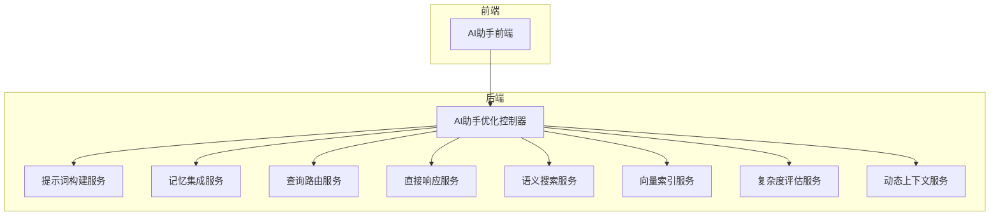
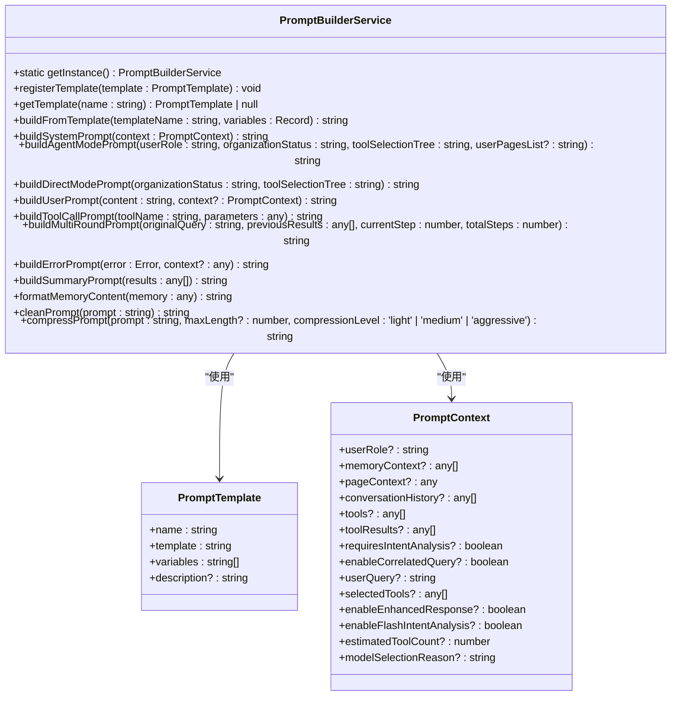
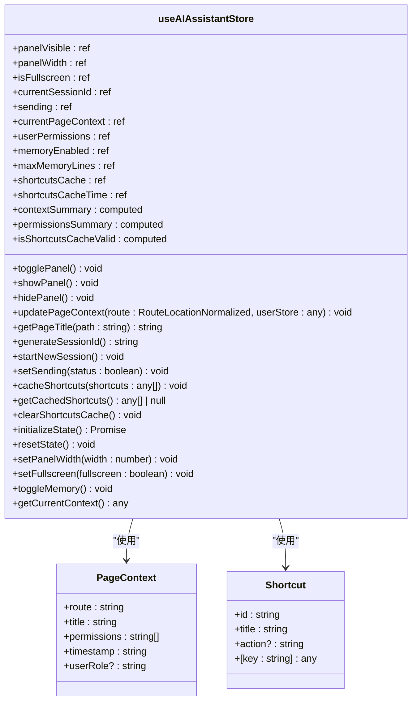
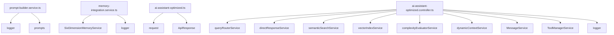

# AI服务

<cite>
**本文档引用的文件**
- [prompt-builder.service.ts](file://k.yyup.com/server/src/services/ai-operator/core/prompt-builder.service.ts)
- [memory-integration.service.ts](file://k.yyup.com/server/src/services/ai-operator/core/memory-integration.service.ts)
- [ai-assistant.ts](file://k.yyup.com/client/src/stores/ai-assistant.ts)
- [ai-assistant-optimized.ts](file://k.yyup.com/client/src/api/ai-assistant-optimized.ts)
- [ai-assistant-optimized.controller.ts](file://k.yyup.com/server/src/controllers/ai-assistant-optimized.controller.ts)
</cite>

## 目录
1. [简介](#简介)
2. [项目结构](#项目结构)
3. [核心组件](#核心组件)
4. [架构概述](#架构概述)
5. [详细组件分析](#详细组件分析)
6. [依赖分析](#依赖分析)
7. [性能考虑](#性能考虑)
8. [故障排除指南](#故障排除指南)
9. [结论](#结论)

## 简介
本文档深入解析了AI服务模块的架构与实现，详细描述了AI助手服务的核心功能，包括智能建议生成、自动化操作执行和数据分析能力。文档解释了提示词构建器（prompt-builder）的工作原理和模板管理机制，说明了AI模型服务的调用接口、参数配置和响应处理模式，并阐述了AI记忆服务的数据存储结构和上下文管理策略。此外，文档还提供了AI服务集成的最佳实践，包括错误处理、超时控制和成本优化建议，旨在帮助开发者理解如何扩展AI功能和定制智能行为。

## 项目结构
AI服务模块主要分布在`k.yyup.com`目录下的`client`和`server`子目录中。`client`目录包含了前端AI助手的实现，主要位于`client/src`和`client/aimobile`路径下。`server`目录则包含了后端AI服务的核心逻辑，主要位于`server/src/services/ai-operator`和`server/src/controllers`路径下。关键的AI服务文件包括提示词构建服务、记忆集成服务、AI助手状态管理和优化的AI助手控制器。

## 核心组件
AI服务的核心组件包括提示词构建器、记忆集成服务、AI助手状态管理、AI助手优化API和优化的AI助手控制器。这些组件协同工作，实现了智能建议生成、自动化操作执行和数据分析等核心功能。提示词构建器负责构建系统提示词和用户提示词，支持模板管理、动态生成和压缩优化。记忆集成服务负责六维记忆检索、记忆上下文格式化和记忆相关性排序。AI助手状态管理负责管理AI助手的面板状态、聊天状态和上下文状态。AI助手优化API提供了发送优化查询、获取性能统计和健康检查等功能。优化的AI助手控制器实现了三级分层处理，有效降低了Token消耗。

**核心组件**
- [prompt-builder.service.ts](file://k.yyup.com/server/src/services/ai-operator/core/prompt-builder.service.ts#L1-L1069)
- [memory-integration.service.ts](file://k.yyup.com/server/src/services/ai-operator/core/memory-integration.service.ts#L1-L494)
- [ai-assistant.ts](file://k.yyup.com/client/src/stores/ai-assistant.ts#L1-L426)
- [ai-assistant-optimized.ts](file://k.yyup.com/client/src/api/ai-assistant-optimized.ts#L1-L353)
- [ai-assistant-optimized.controller.ts](file://k.yyup.com/server/src/controllers/ai-assistant-optimized.controller.ts#L1-L1006)

## 架构概述
AI服务采用分层架构设计，前端通过API与后端进行通信，后端服务通过控制器、服务层和数据访问层进行解耦。前端AI助手通过`ai-assistant-optimized.ts`中的API类与后端进行交互，后端通过`ai-assistant-optimized.controller.ts`中的控制器处理请求，并调用相应的服务层进行业务逻辑处理。服务层包括提示词构建服务、记忆集成服务、查询路由服务、直接响应服务、语义搜索服务、向量索引服务、复杂度评估服务和动态上下文服务等。整个架构设计旨在实现高内聚、低耦合，便于维护和扩展。



**图表来源**
- [ai-assistant-optimized.controller.ts](file://k.yyup.com/server/src/controllers/ai-assistant-optimized.controller.ts#L1-L1006)
- [prompt-builder.service.ts](file://k.yyup.com/server/src/services/ai-operator/core/prompt-builder.service.ts#L1-L1069)
- [memory-integration.service.ts](file://k.yyup.com/server/src/services/ai-operator/core/memory-integration.service.ts#L1-L494)

## 详细组件分析

### 提示词构建器分析
提示词构建器是AI服务的核心组件之一，负责构建系统提示词和用户提示词。它支持模板管理、动态生成和压缩优化，能够根据不同的上下文和需求生成合适的提示词。提示词构建器通过注册和管理多个模板，实现了灵活的提示词生成机制。每个模板包含名称、模板内容、变量和描述等信息，通过变量替换和模板组合，能够生成复杂且准确的提示词。

#### 提示词构建器类图


**图表来源**
- [prompt-builder.service.ts](file://k.yyup.com/server/src/services/ai-operator/core/prompt-builder.service.ts#L1-L1069)

### 记忆集成服务分析
记忆集成服务负责六维记忆检索、记忆上下文格式化和记忆相关性排序。它集成了真实的六维记忆系统，能够根据用户查询和用户ID检索相关的记忆上下文，并按相关性进行排序。记忆集成服务还提供了缓存机制，能够有效提高检索性能。通过记忆集成服务，AI助手能够更好地理解用户的历史行为和偏好，提供更加个性化和连贯的服务。

#### 记忆集成服务类图
```mermaid
classDiagram
class MemoryIntegrationService {
+static getInstance() MemoryIntegrationService
+setMemorySystem(memorySystem : any) void
+retrieveMemoryContext(query : string, userId : string, options? : { dimensions? : string[]; limit? : number; minRelevance? : number; useCache? : boolean; }) Promise<MemoryContext>
+retrieveDimension(dimension : string, query : string, userId : string, limit : number) Promise<MemoryItem[]>
+extractContent(item : any, dimension : string) string
+extractTimestamp(item : any) number
+getDefaultDimensions() string[]
+sortByRelevance(items : MemoryItem[]) MemoryItem[]
+getEmptyContext(query : string) MemoryContext
+formatMemoryContext(context : MemoryContext) string
+groupByDimension(items : MemoryItem[]) Record<string, MemoryItem[]>
+getDimensionName(dimension : string) string
+formatAsSimpleList(context : MemoryContext) string[]
+formatAsStructured(context : MemoryContext) any[]
+calculateCoverage(context : MemoryContext) any
+filterMemories(context : MemoryContext, filters : { dimensions? : string[]; minRelevance? : number; maxAge? : number; }) MemoryContext
+mergeContexts(contexts : MemoryContext[]) MemoryContext
+getStats(context : MemoryContext) any
+clearExpiredCache() void
+clearAllCache() void
+getCacheStats() { size : number; timeout : number }
}
class MemoryItem {
+id : string
+dimension : string
+content : string
+relevance : number
+timestamp : number
+metadata? : any
}
class MemoryContext {
+items : MemoryItem[]
+totalCount : number
+dimensions : string[]
+query : string
}
MemoryIntegrationService --> MemoryItem : "使用"
MemoryIntegrationService --> MemoryContext : "使用"
```

**图表来源**
- [memory-integration.service.ts](file://k.yyup.com/server/src/services/ai-operator/core/memory-integration.service.ts#L1-L494)

### AI助手状态管理分析
AI助手状态管理负责管理AI助手的面板状态、聊天状态和上下文状态。它使用Pinia进行状态管理，提供了计算属性和动作方法，能够方便地管理AI助手的各种状态。通过AI助手状态管理，前端能够实时更新AI助手的显示状态、聊天状态和上下文状态，提供更好的用户体验。

#### AI助手状态管理类图


**图表来源**
- [ai-assistant.ts](file://k.yyup.com/client/src/stores/ai-assistant.ts#L1-L426)

### AI助手优化API分析
AI助手优化API提供了发送优化查询、获取性能统计和健康检查等功能。它通过HTTP请求与后端进行通信，提供了丰富的接口，能够满足各种需求。通过AI助手优化API，前端能够方便地调用后端服务，获取所需的数据和信息。

#### AI助手优化API类图
```mermaid
classDiagram
class AIAssistantOptimizedAPI {
+baseURL : string
+query(data : QueryRequest) Promise<ApiResponse<QueryResponse>>
+getPerformanceStats() Promise<ApiResponse<PerformanceStats>>
+healthCheck() Promise<ApiResponse<HealthCheckResponse>>
+testRoute(data : RouteTestRequest) Promise<ApiResponse<RouteTestResponse>>
+testDirect(data : DirectTestRequest) Promise<ApiResponse<DirectTestResponse>>
+getKeywords() Promise<{ success : boolean; data : KeywordsResponse; message? : string; }>
+saveConfig(config : any) Promise<{ success : boolean; message? : string; }>
+getConfig() Promise<{ success : boolean; data : any; message? : string; }>
+resetSystem() Promise<{ success : boolean; message? : string; }>
+exportPerformanceReport(format : 'json' | 'csv' | 'pdf') Promise<{ success : boolean; data? : any; downloadUrl? : string; message? : string; }>
+batchTest(queries : string[]) Promise<{ success : boolean; data : { results : Array<{ query : string; level : string; tokensUsed : number; processingTime : number; success : boolean; error? : string; }>; summary : { totalQueries : number; successCount : number; failureCount : number; averageTokens : number; averageTime : number; tokenSavingRate : number; }; }; message? : string; }>
+getRealtimeMetrics() Promise<{ success : boolean; data : { currentLoad : number; activeConnections : number; queueLength : number; memoryUsage : number; cpuUsage : number; responseTime : number; errorRate : number; }; message? : string; }>
+getHistoricalTrends(timeRange : '1h' | '24h' | '7d' | '30d') Promise<{ success : boolean; data : { timestamps : string[]; metrics : { queryCount : number[]; averageResponseTime : number[]; tokenUsage : number[]; errorRate : number[]; directQueryRate : number[]; }; }; message? : string; }>
+triggerOptimization(type : 'cache' | 'index' | 'keywords' | 'all') Promise<{ success : boolean; data : { optimizationType : string; startTime : string; estimatedDuration : number; status : 'started' | 'completed' | 'failed'; }; message? : string; }>
+getOptimizationSuggestions() Promise<{ success : boolean; data : { suggestions : Array<{ type : 'performance' | 'accuracy' | 'cost'; priority : 'high' | 'medium' | 'low'; title : string; description : string; impact : string; effort : string; action : string; }>; }; message? : string; }>
}
class QueryRequest {
+query : string
+conversationId : string
+userId : number
}
class QueryResponse {
+response : string
+level : 'direct' | 'semantic' | 'complex'
+tokensUsed : number
+tokensSaved : number
+processingTime : number
+savingRate : number
+optimizationInfo? : any
}
class PerformanceStats {
+performance : { totalQueries : number; directQueries : number; semanticQueries : number; complexQueries : number; averageResponseTime : number; totalTokensSaved : number; }
+router : { keywordCount : number; directMatchCount : number; complexityThreshold : number; }
+directService : { supportedActions : string[]; cacheHitRate : number; averageResponseTime : number; }
+semanticSearch? : { cache : { size : number; hitRate : number; totalQueries : number; totalHits : number; }; entityStats : { totalEntities : number; categoryCounts : { [category : string] : number }; }; }
+vectorIndex? : { totalItems : number; typeDistribution : { [type : string] : number }; averageSearchCount : number; lastBuildTime : string; isBuilding : boolean; }
+complexityEvaluator? : { totalEvaluations : number; levelDistribution : { [level : string] : number }; averageScore : number; averageConfidence : number; }
+dynamicContext? : { cacheSize : number; templateCount : number; averageTokens : number; }
+optimization : { tokenSavingRate : string; directQueryRate : string; semanticQueryRate? : string; complexQueryRate? : string; }
}
class RouteTestRequest {
+query : string
}
class RouteTestResponse {
+level : string
+confidence : number
+estimatedTokens : number
+matchedKeywords : string[]
+processingTime : number
}
class DirectTestRequest {
+action : string
+query : string
}
class DirectTestResponse {
+success : boolean
+response : string
+tokensUsed : number
+processingTime : number
}
class HealthCheckResponse {
+status : string
+timestamp : string
+version : string
+features : { directResponse : boolean; semanticRouting : boolean; complexAnalysis : boolean; performanceMonitoring : boolean; }
+stats : { uptime : number; totalQueries : number; averageResponseTime : number; }
}
class KeywordsResponse {
+action : string[]
+entity : string[]
+modifier : string[]
+directMatch : string[]
}
AIAssistantOptimizedAPI --> QueryRequest : "使用"
AIAssistantOptimizedAPI --> QueryResponse : "使用"
AIAssistantOptimizedAPI --> PerformanceStats : "使用"
AIAssistantOptimizedAPI --> RouteTestRequest : "使用"
AIAssistantOptimizedAPI --> RouteTestResponse : "使用"
AIAssistantOptimizedAPI --> DirectTestRequest : "使用"
AIAssistantOptimizedAPI --> DirectTestResponse : "使用"
AIAssistantOptimizedAPI --> HealthCheckResponse : "使用"
AIAssistantOptimizedAPI --> KeywordsResponse : "使用"
```

**图表来源**
- [ai-assistant-optimized.ts](file://k.yyup.com/client/src/api/ai-assistant-optimized.ts#L1-L353)

### 优化的AI助手控制器分析
优化的AI助手控制器实现了三级分层处理，有效降低了Token消耗。它通过查询路由服务、直接响应服务、语义搜索服务、向量索引服务、复杂度评估服务和动态上下文服务等，实现了智能的查询处理机制。优化的AI助手控制器能够根据查询的复杂度和上下文，选择合适的处理方式，提供高效且准确的响应。

#### 优化的AI助手控制器类图
```mermaid
classDiagram
class AIAssistantOptimizedController {
+messageService : MessageService
+toolManager : ToolManagerService
+performanceStats : PerformanceStats
+handleOptimizedQuery(req : Request, res : Response) Promise<void>
+handleDirectQuery(query : string, routeResult : any) Promise<any>
+handleSemanticQuery(query : string, routeResult : any, conversationId : string, userId : number) Promise<any>
+handleComplexQuery(query : string, routeResult : any, conversationId : string, userId : number, options : { allowTools : boolean; allowWebSearch : boolean; userRole : string; }) Promise<any>
+extractActionFromDirectResponse(directResponse : string) string | null
+buildLightContext(matchedKeywords : string[]) string
+buildEnhancedContext(matchedKeywords : string[], semanticMatches : any[]) string
+buildSimplifiedSystemPrompt(lightContext : string) string
+callAIWithLimitedContext(query : string, systemPrompt : string, userId : number, maxTokens : number) Promise<any>
+getConversationHistory(conversationId : string, limit : number) Promise<any[]>
+getUserMemory(userId : number, limit : number) Promise<any[]>
+isValidResponse(response : any) boolean
}
class PerformanceStats {
+totalQueries : number
+directQueries : number
+semanticQueries : number
+complexQueries : number
+fallbackToComplex : number
+totalTokensSaved : number
+averageResponseTime : number
}
AIAssistantOptimizedController --> PerformanceStats : "使用"
```

**图表来源**
- [ai-assistant-optimized.controller.ts](file://k.yyup.com/server/src/controllers/ai-assistant-optimized.controller.ts#L1-L1006)

## 依赖分析
AI服务模块的依赖关系较为复杂，前端依赖于后端提供的API，后端服务之间也存在相互依赖。提示词构建器依赖于日志服务和提示词模板，记忆集成服务依赖于六维记忆系统和日志服务，AI助手优化API依赖于HTTP请求库和类型定义，优化的AI助手控制器依赖于查询路由服务、直接响应服务、语义搜索服务、向量索引服务、复杂度评估服务、动态上下文服务、消息服务和工具管理服务等。通过合理的依赖管理，AI服务模块能够实现高内聚、低耦合，便于维护和扩展。



**图表来源**
- [prompt-builder.service.ts](file://k.yyup.com/server/src/services/ai-operator/core/prompt-builder.service.ts#L1-L1069)
- [memory-integration.service.ts](file://k.yyup.com/server/src/services/ai-operator/core/memory-integration.service.ts#L1-L494)
- [ai-assistant-optimized.ts](file://k.yyup.com/client/src/api/ai-assistant-optimized.ts#L1-L353)
- [ai-assistant-optimized.controller.ts](file://k.yyup.com/server/src/controllers/ai-assistant-optimized.controller.ts#L1-L1006)

## 性能考虑
AI服务模块在设计时充分考虑了性能因素，通过三级分层处理、缓存机制、智能压缩提示词等手段，有效降低了Token消耗和响应时间。提示词构建器支持智能压缩提示词，能够根据目标长度和压缩级别，保留核心信息，移除冗余内容。记忆集成服务提供了缓存机制，能够有效提高检索性能。优化的AI助手控制器实现了三级分层处理，能够根据查询的复杂度和上下文，选择合适的处理方式，提供高效且准确的响应。

## 故障排除指南
在使用AI服务模块时，可能会遇到各种问题，如提示词构建失败、记忆检索失败、API调用失败等。对于提示词构建失败，可以检查模板是否正确注册，变量是否正确替换。对于记忆检索失败，可以检查六维记忆系统是否正常运行，缓存是否有效。对于API调用失败，可以检查网络连接是否正常，请求参数是否正确。通过合理的故障排除，能够快速定位和解决问题，确保AI服务模块的正常运行。

**故障排除指南**
- [prompt-builder.service.ts](file://k.yyup.com/server/src/services/ai-operator/core/prompt-builder.service.ts#L1-L1069)
- [memory-integration.service.ts](file://k.yyup.com/server/src/services/ai-operator/core/memory-integration.service.ts#L1-L494)
- [ai-assistant-optimized.ts](file://k.yyup.com/client/src/api/ai-assistant-optimized.ts#L1-L353)
- [ai-assistant-optimized.controller.ts](file://k.yyup.com/server/src/controllers/ai-assistant-optimized.controller.ts#L1-L1006)

## 结论
本文档深入解析了AI服务模块的架构与实现，详细描述了AI助手服务的核心功能，包括智能建议生成、自动化操作执行和数据分析能力。通过提示词构建器、记忆集成服务、AI助手状态管理、AI助手优化API和优化的AI助手控制器等核心组件，AI服务模块实现了高效且准确的智能服务。通过合理的架构设计和性能优化，AI服务模块能够满足各种需求，为用户提供更好的体验。开发者可以通过扩展AI功能和定制智能行为，进一步提升AI服务模块的能力。