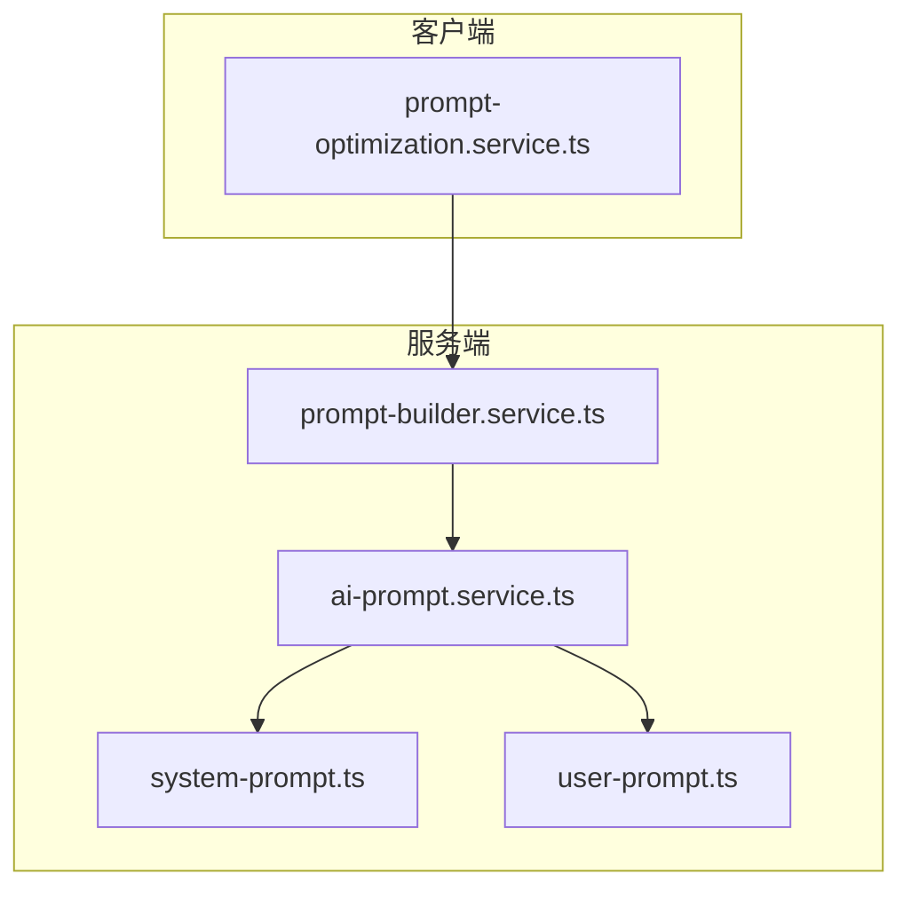
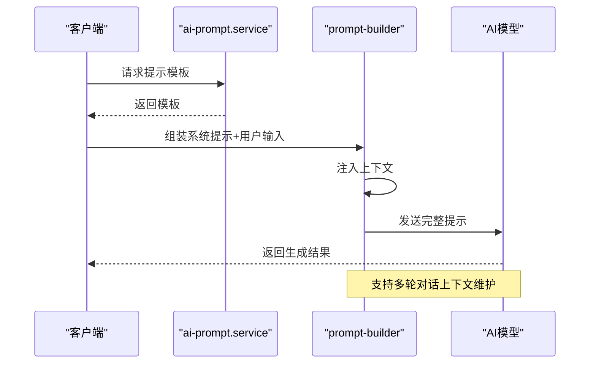
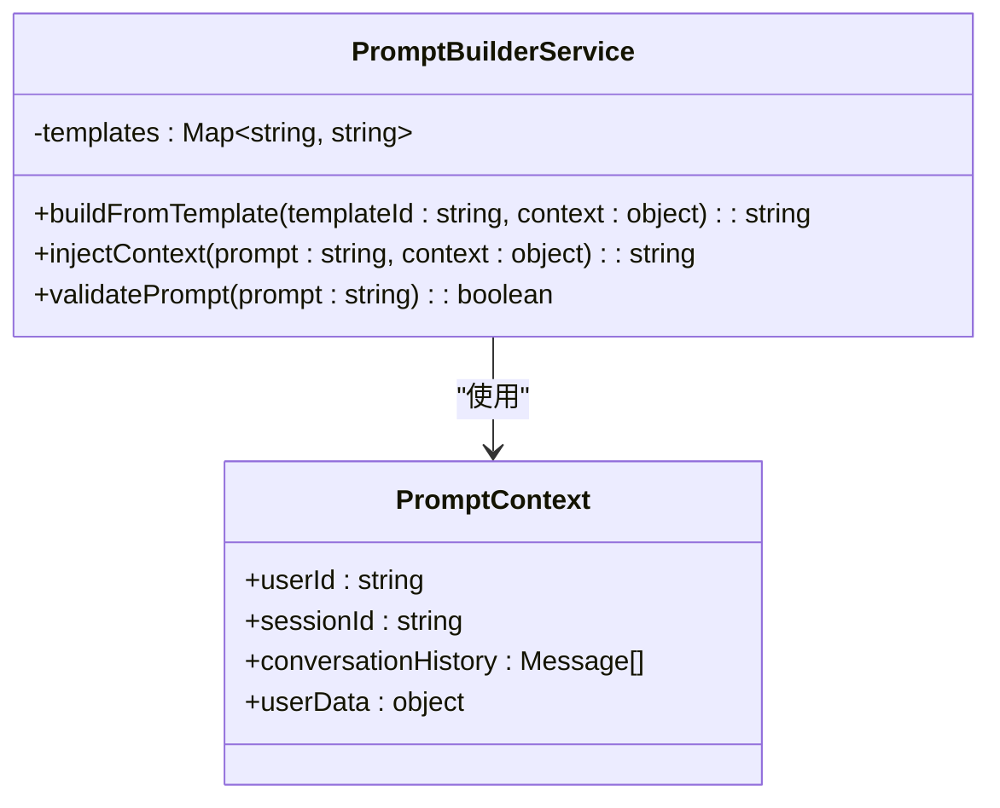
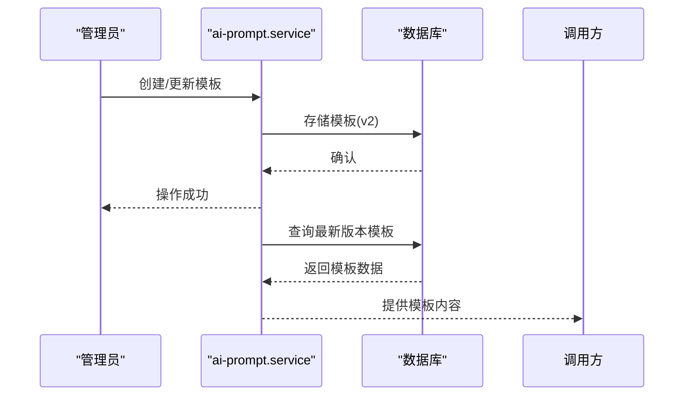
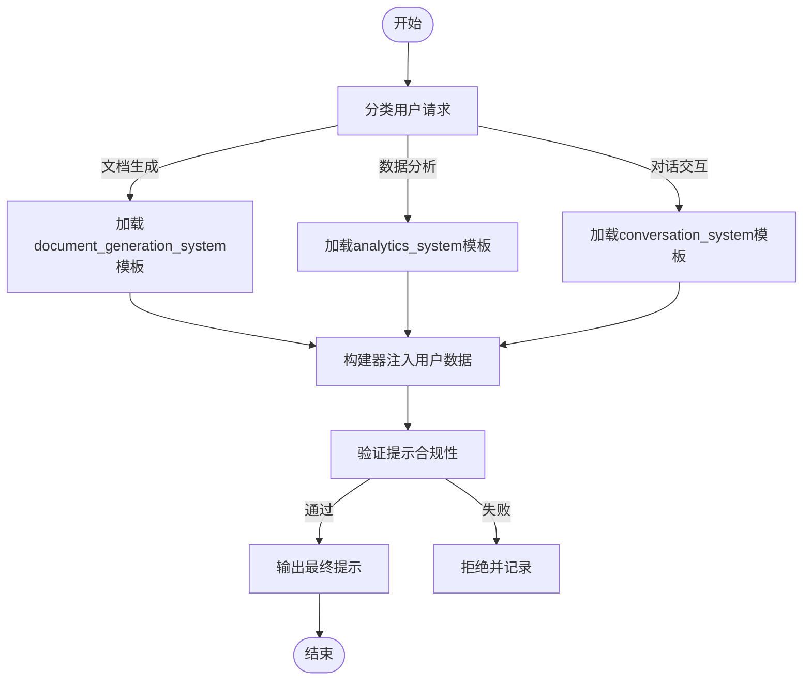
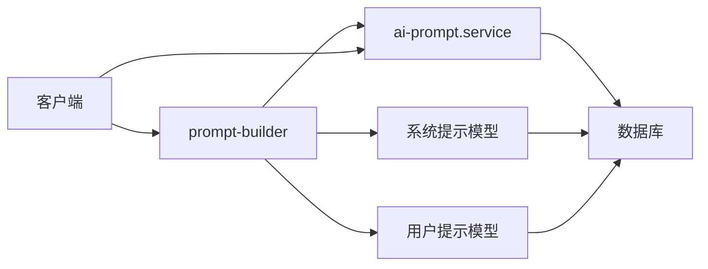

# 提示词管理

<cite>
**本文档引用文件**  
- [prompt-builder.service.ts](file://server/src/services/ai-operator/core/prompt-builder.service.ts)
- [ai-prompt.service.ts](file://server/src/services/ai-prompt.service.ts)
- [system-prompt.ts](file://server/src/models/system-prompt.ts)
- [user-prompt.ts](file://server/src/models/user-prompt.ts)
- [prompt-optimization.service.ts](file://client/src/services/prompt-optimization.service.ts)
</cite>

## 目录
1. [引言](#引言)
2. [项目结构](#项目结构)
3. [核心组件](#核心组件)
4. [架构概述](#架构概述)
5. [详细组件分析](#详细组件分析)
6. [依赖分析](#依赖分析)
7. [性能考虑](#性能考虑)
8. [故障排除指南](#故障排除指南)
9. [结论](#结论)

## 引言
本文档全面阐述了提示词管理系统的设计与运作机制。系统通过动态组装系统提示与用户输入，支持多轮对话和上下文注入，确保AI响应的准确性与场景适配性。文档详细说明了提示词构建器、提示模板服务、系统与用户提示的分类结构，并提供优化技巧与安全策略。

## 项目结构
提示词管理系统主要位于服务端 `server/src/services/ai-operator/` 目录下，核心功能模块包括提示词构建、模板管理与版本控制。客户端提供优化与调试支持。

**Diagram sources**
- [prompt-builder.service.ts](file://server/src/services/ai-operator/core/prompt-builder.service.ts)
- [ai-prompt.service.ts](file://server/src/services/ai-prompt.service.ts)

**Section sources**
- [prompt-builder.service.ts](file://server/src/services/ai-operator/core/prompt-builder.service.ts)
- [ai-prompt.service.ts](file://server/src/services/ai-prompt.service.ts)

## 核心组件
系统核心由提示词构建器（`prompt-builder.service.ts`）和提示服务（`ai-prompt.service.ts`）构成。构建器负责动态组装提示，服务层管理模板的存储、检索与版本控制。系统提示与用户提示分别定义了AI的行为准则与用户交互模式。

**Section sources**
- [prompt-builder.service.ts](file://server/src/services/ai-operator/core/prompt-builder.service.ts)
- [ai-prompt.service.ts](file://server/src/services/ai-prompt.service.ts)

## 架构概述
系统采用分层架构，客户端发起请求，服务端通过提示服务获取模板，由构建器动态生成最终提示词并注入上下文，最后交由AI模型处理。

**Diagram sources**
- [prompt-builder.service.ts](file://server/src/services/ai-operator/core/prompt-builder.service.ts)
- [ai-prompt.service.ts](file://server/src/services/ai-prompt.service.ts)

## 详细组件分析

### 提示词构建器分析
`prompt-builder.service.ts` 是系统的核心逻辑单元，负责将系统提示模板与用户输入进行动态拼接，并支持上下文注入。

#### 对象导向组件

**Diagram sources**
- [prompt-builder.service.ts](file://server/src/services/ai-operator/core/prompt-builder.service.ts)

**Section sources**
- [prompt-builder.service.ts](file://server/src/services/ai-operator/core/prompt-builder.service.ts)

### AI提示服务分析
`ai-prompt.service.ts` 负责提示模板的持久化存储、版本管理与检索。

#### 服务组件

**Diagram sources**
- [ai-prompt.service.ts](file://server/src/services/ai-prompt.service.ts)

**Section sources**
- [ai-prompt.service.ts](file://server/src/services/ai-prompt.service.ts)

### 系统与用户提示结构
系统定义了清晰的提示分类结构，以适配不同业务场景。

#### 逻辑流程

**Diagram sources**
- [system-prompt.ts](file://server/src/models/system-prompt.ts)
- [user-prompt.ts](file://server/src/models/user-prompt.ts)

**Section sources**
- [system-prompt.ts](file://server/src/models/system-prompt.ts)
- [user-prompt.ts](file://server/src/models/user-prompt.ts)

## 依赖分析
系统依赖于AI模型服务、数据库存储及客户端上下文提供。

**Diagram sources**
- [prompt-builder.service.ts](file://server/src/services/ai-operator/core/prompt-builder.service.ts)
- [ai-prompt.service.ts](file://server/src/services/ai-prompt.service.ts)

**Section sources**
- [prompt-builder.service.ts](file://server/src/services/ai-operator/core/prompt-builder.service.ts)
- [ai-prompt.service.ts](file://server/src/services/ai-prompt.service.ts)

## 性能考虑
- 提示模板采用内存缓存机制，减少数据库查询开销
- 构建过程进行输入验证与长度限制，防止资源耗尽
- 支持异步上下文加载，避免阻塞主流程

## 故障排除指南
- **提示生成失败**：检查模板ID是否存在，上下文数据格式是否正确
- **响应不准确**：验证系统提示是否覆盖当前业务场景
- **上下文丢失**：确认会话ID与历史记录是否正确传递
- **安全过滤触发**：检查用户输入是否包含敏感关键词

**Section sources**
- [prompt-optimization.service.ts](file://client/src/services/prompt-optimization.service.ts)
- [prompt-builder.service.ts](file://server/src/services/ai-operator/core/prompt-builder.service.ts)

## 结论
提示词管理系统通过模块化设计实现了高灵活性与可维护性。动态组装机制支持复杂业务场景，版本控制确保提示质量可追溯，安全过滤保障内容合规。未来可扩展多语言支持与自动化优化功能。