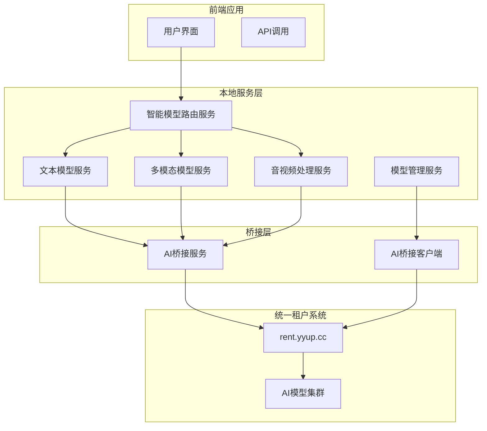
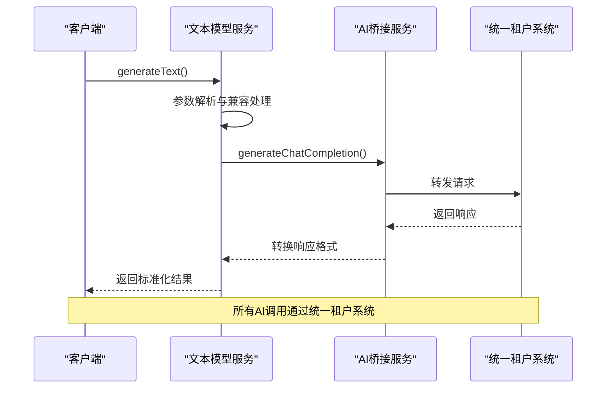
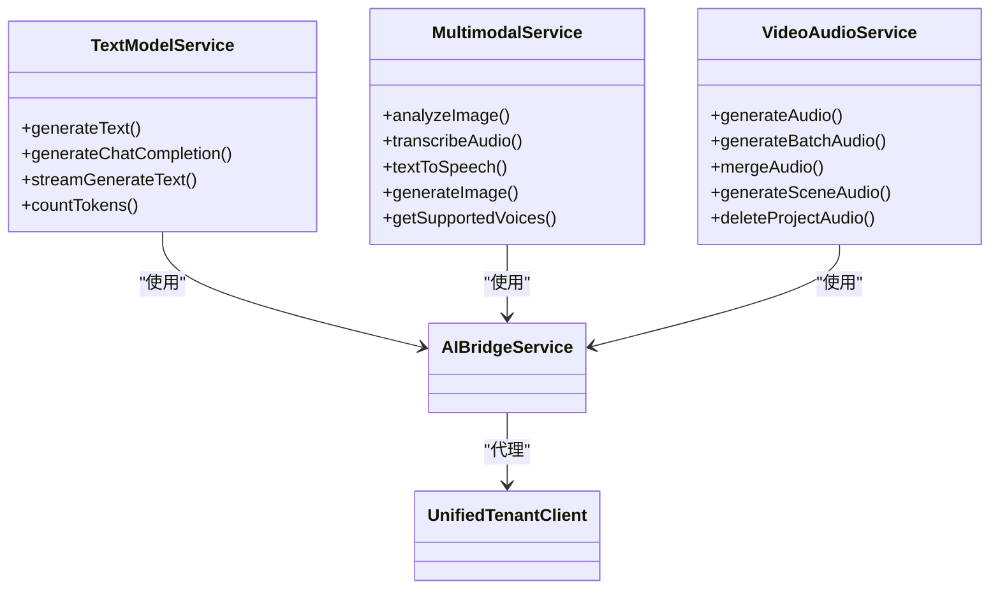
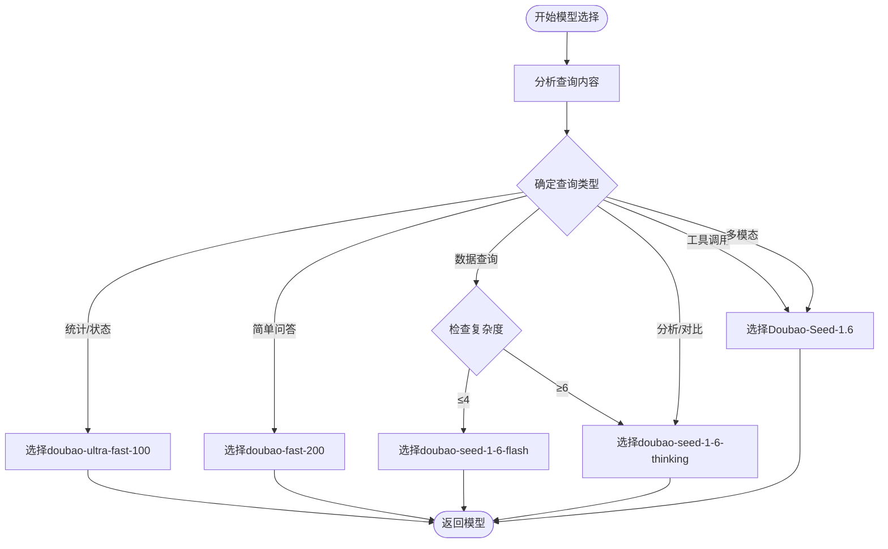

# 模型集成

<cite>
**本文档引用文件**  
- [model.service.ts](file://k.yyup.com/server/src/services/ai/model.service.ts)
- [text-model.service.ts](file://k.yyup.com/server/src/services/ai/text-model.service.ts)
- [multimodal.service.ts](file://k.yyup.com/server/src/services/ai/multimodal.service.ts)
- [video-audio.service.ts](file://k.yyup.com/server/src/services/ai/video-audio.service.ts)
- [ai-smart-model-router.service.ts](file://k.yyup.com/server/src/services/ai-smart-model-router.service.ts)
- [ai-bridge.service.ts](file://k.yyup.com/server/src/services/ai/bridge/ai-bridge.service.ts)
- [ai-bridge-client.service.ts](file://k.yyup.com/server/src/services/ai-bridge-client.service.ts)
- [ai-bridge.types.ts](file://k.yyup.com/server/src/services/ai/bridge/ai-bridge.types.ts)
- [ai-model-cache.service.ts](file://k.yyup.com/server/src/services/ai/ai-model-cache.service.ts)
</cite>

## 目录
1. [引言](#引言)
2. [AI模型集成架构](#ai模型集成架构)
3. [核心模型服务](#核心模型服务)
4. [多模态支持能力](#多模态支持能力)
5. [智能模型路由机制](#智能模型路由机制)
6. [性能监控与成本控制](#性能监控与成本控制)
7. [故障降级策略](#故障降级策略)
8. [开发者使用指南](#开发者使用指南)

## 引言
本文档详细阐述了系统的AI模型集成架构与多模态支持能力。通过分析模型服务、多模态处理、智能路由等核心组件，为开发者提供全面的技术实现细节和使用指导。

## AI模型集成架构

**图示来源**  
- [ai-smart-model-router.service.ts](file://k.yyup.com/server/src/services/ai-smart-model-router.service.ts)
- [ai-bridge.service.ts](file://k.yyup.com/server/src/services/ai/bridge/ai-bridge.service.ts)
- [ai-bridge-client.service.ts](file://k.yyup.com/server/src/services/ai-bridge-client.service.ts)

**本节来源**  
- [ai-smart-model-router.service.ts](file://k.yyup.com/server/src/services/ai-smart-model-router.service.ts)
- [ai-bridge.service.ts](file://k.yyup.com/server/src/services/ai/bridge/ai-bridge.service.ts)

## 核心模型服务

### 模型服务初始化配置
模型服务（model.service.ts）通过AI桥接客户端与统一租户系统通信，实现模型列表的获取、缓存和管理。服务采用降级策略，在无法连接统一租户系统时可回退到本地数据库查询。

### API密钥管理
系统通过认证Token进行API密钥管理，所有请求均携带Bearer Token进行身份验证。AI桥接客户端负责在请求头中自动添加认证信息。

### 请求封装逻辑
文本模型服务（text-model.service.ts）对AI请求进行了统一封装，支持多种调用方式兼容，并通过AI桥接服务转发到统一租户系统。服务支持标准的聊天完成、流式响应和token计数功能。

**图示来源**  
- [text-model.service.ts](file://k.yyup.com/server/src/services/ai/text-model.service.ts)
- [ai-bridge.service.ts](file://k.yyup.com/server/src/services/ai/bridge/ai-bridge.service.ts)

**本节来源**  
- [model.service.ts](file://k.yyup.com/server/src/services/ai/model.service.ts)
- [text-model.service.ts](file://k.yyup.com/server/src/services/ai/text-model.service.ts)
- [ai-bridge.types.ts](file://k.yyup.com/server/src/services/ai/bridge/ai-bridge.types.ts)

## 多模态支持能力

### 文本模型 vs 多模态模型
文本模型服务专注于纯文本处理，而多模态模型服务（multimodal.service.ts）扩展了图像、音频等多模态处理能力。两者均通过统一的AI桥接服务调用后端AI能力。

### 音视频处理服务
音视频处理服务（video-audio.service.ts）专门处理配音生成、音频合并等视频制作相关任务，支持批量处理和场景化音频生成。

**图示来源**  
- [text-model.service.ts](file://k.yyup.com/server/src/services/ai/text-model.service.ts)
- [multimodal.service.ts](file://k.yyup.com/server/src/services/ai/multimodal.service.ts)
- [video-audio.service.ts](file://k.yyup.com/server/src/services/ai/video-audio.service.ts)

**本节来源**  
- [text-model.service.ts](file://k.yyup.com/server/src/services/ai/text-model.service.ts)
- [multimodal.service.ts](file://k.yyup.com/server/src/services/ai/multimodal.service.ts)
- [video-audio.service.ts](file://k.yyup.com/server/src/services/ai/video-audio.service.ts)

## 智能模型路由机制

### 任务类型分析
智能模型路由服务（ai-smart-model-router.service.ts）根据任务类型自动选择最优模型。系统定义了多种查询类型，包括统计查询、状态检查、简单问答、数据分析等。

### 执行阶段优化
路由服务引入执行阶段概念，区分规划阶段和执行阶段：
- **规划阶段**：使用Thinking模型确保分析质量
- **执行阶段**：使用Flash模型提升响应速度
- **混合阶段**：根据复杂度和工具需求选择模型

### 模型选择策略
路由服务采用多维度决策策略，综合考虑查询类型、复杂度、预估token数、工具调用需求等因素，实现智能化的模型选择。

**图示来源**  
- [ai-smart-model-router.service.ts](file://k.yyup.com/server/src/services/ai-smart-model-router.service.ts)

**本节来源**  
- [ai-smart-model-router.service.ts](file://k.yyup.com/server/src/services/ai-smart-model-router.service.ts)

## 性能监控与成本控制

### 性能监控
系统通过模型性能统计接口收集各模型的平均响应时间和成功率，为模型选择提供数据支持。路由服务可根据性能数据动态调整选择策略。

### 成本控制
系统实现了模型计费规则接口，可获取各模型的输入输出价格。通过选择合适的模型和优化调用策略，有效控制AI服务使用成本。

**本节来源**  
- [model.service.ts](file://k.yyup.com/server/src/services/ai/model.service.ts)
- [ai-smart-model-router.service.ts](file://k.yyup.com/server/src/services/ai-smart-model-router.service.ts)

## 故障降级策略

### 服务降级
当统一租户系统不可用时，系统采用多层降级策略：
1. 首先尝试使用缓存的模型列表
2. 缓存失效时回退到本地数据库
3. 最终降级到默认模型配置

### 错误处理
各服务组件均实现了完善的错误处理机制，捕获异常并记录详细日志，确保系统稳定性和可维护性。

**本节来源**  
- [model.service.ts](file://k.yyup.com/server/src/services/ai/model.service.ts)
- [ai-bridge-client.service.ts](file://k.yyup.com/server/src/services/ai-bridge-client.service.ts)

## 开发者使用指南

### 模型调用最佳实践
1. 使用智能模型路由服务自动选择最优模型
2. 对于简单查询优先使用快速模型以降低成本
3. 复杂分析任务明确指定Thinking模型
4. 批量操作使用批量处理接口提高效率

### 多模态功能集成
1. 图像分析使用multimodal.service.ts的analyzeImage方法
2. 音频转文字使用transcribeAudio方法
3. 文字转语音使用textToSpeech方法
4. 视频配音使用video-audio.service.ts的专用接口

**本节来源**  
- [ai-smart-model-router.service.ts](file://k.yyup.com/server/src/services/ai-smart-model-router.service.ts)
- [multimodal.service.ts](file://k.yyup.com/server/src/services/ai/multimodal.service.ts)
- [video-audio.service.ts](file://k.yyup.com/server/src/services/ai/video-audio.service.ts)