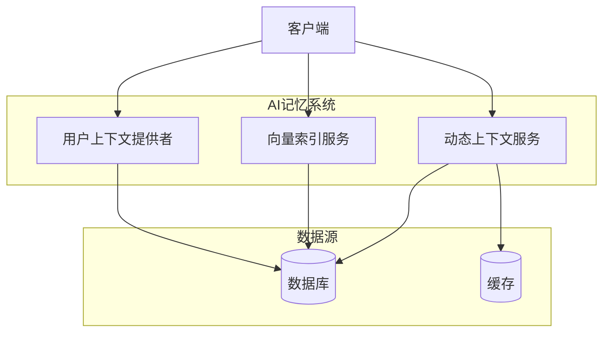
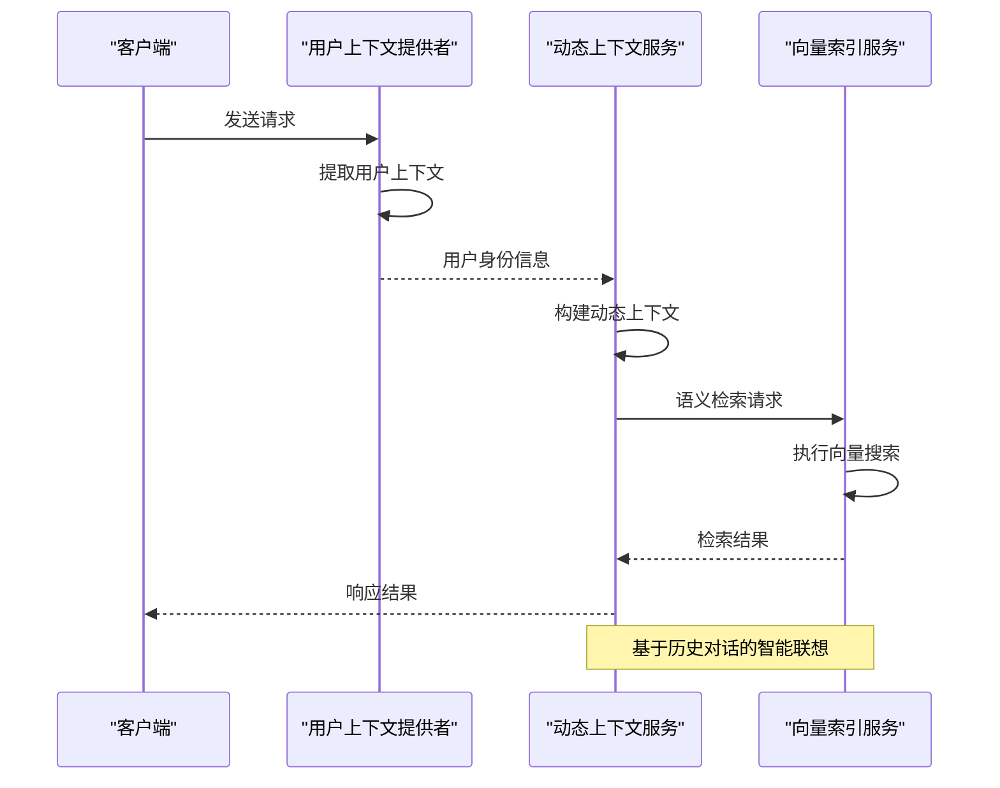
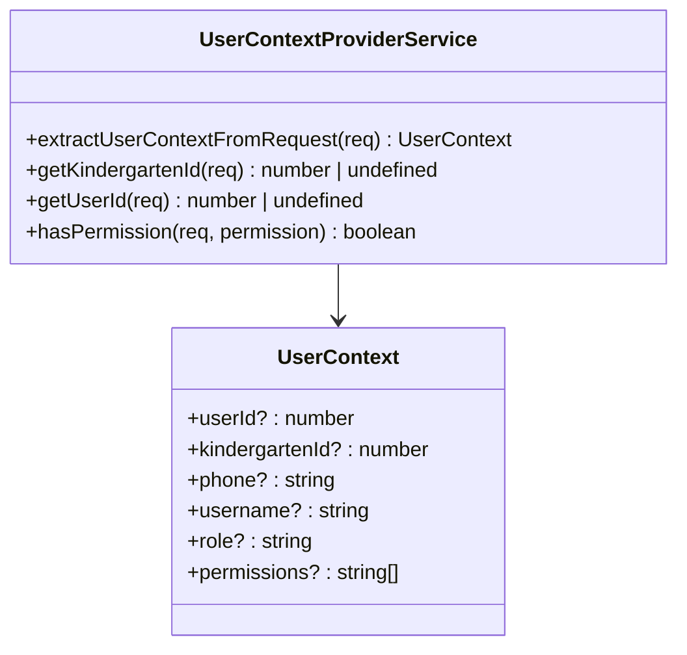
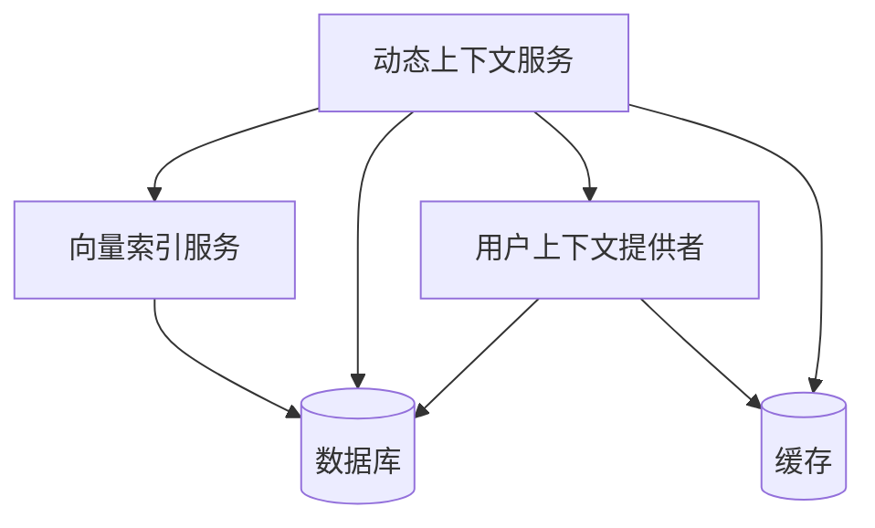

# 记忆系统

<cite>
**本文档引用的文件**  
- [dynamic-context.service.ts](file://k.yyup.com/server/src/services/ai/dynamic-context.service.ts)
- [vector-index.service.ts](file://k.yyup.com/server/src/services/ai/vector-index.service.ts)
- [user-context-provider.service.ts](file://k.yyup.com/server/src/services/ai/user-context-provider.service.ts)
</cite>

## 目录
1. [简介](#简介)
2. [项目结构](#项目结构)
3. [核心组件](#核心组件)
4. [架构概述](#架构概述)
5. [详细组件分析](#详细组件分析)
6. [依赖分析](#依赖分析)
7. [性能考虑](#性能考虑)
8. [故障排除指南](#故障排除指南)
9. [结论](#结论)

## 简介
本文档系统化描述AI记忆系统的数据架构与上下文管理机制。重点分析动态上下文服务如何实现会话内状态追踪，向量索引服务在语义检索中的应用，以及用户上下文提供者如何整合个人偏好与角色权限构建个性化记忆图谱。同时探讨数据隐私保护措施与存储优化建议。

## 项目结构
AI记忆系统主要位于服务器端的`services/ai`目录下，包含动态上下文管理、向量索引和用户上下文提供等核心服务。系统通过分层架构实现用户交互历史的持久化管理和智能联想功能。



**Diagram sources**
- [dynamic-context.service.ts](file://k.yyup.com/server/src/services/ai/dynamic-context.service.ts#L1-L98)
- [vector-index.service.ts](file://k.yyup.com/server/src/services/ai/vector-index.service.ts#L1-L38)
- [user-context-provider.service.ts](file://k.yyup.com/server/src/services/ai/user-context-provider.service.ts#L1-L67)

**Section sources**
- [dynamic-context.service.ts](file://k.yyup.com/server/src/services/ai/dynamic-context.service.ts#L1-L98)
- [vector-index.service.ts](file://k.yyup.com/server/src/services/ai/vector-index.service.ts#L1-L38)

## 核心组件
AI记忆系统由三个核心服务构成：动态上下文服务负责会话状态管理，向量索引服务支持语义检索，用户上下文提供者服务处理用户身份与权限信息。这些服务共同构建了个性化的记忆图谱，支持基于历史对话的智能联想功能。

**Section sources**
- [dynamic-context.service.ts](file://k.yyup.com/server/src/services/ai/dynamic-context.service.ts#L1-L98)
- [vector-index.service.ts](file://k.yyup.com/server/src/services/ai/vector-index.service.ts#L1-L38)
- [user-context-provider.service.ts](file://k.yyup.com/server/src/services/ai/user-context-provider.service.ts#L1-L67)

## 架构概述
AI记忆系统采用分层架构设计，通过服务间协作实现完整的上下文管理功能。系统接收用户请求后，首先通过用户上下文提供者提取身份信息，然后由动态上下文服务构建会话状态，最后利用向量索引服务进行语义检索和智能联想。



**Diagram sources**
- [dynamic-context.service.ts](file://k.yyup.com/server/src/services/ai/dynamic-context.service.ts#L1-L98)
- [vector-index.service.ts](file://k.yyup.com/server/src/services/ai/vector-index.service.ts#L1-L38)
- [user-context-provider.service.ts](file://k.yyup.com/server/src/services/ai/user-context-provider.service.ts#L1-L67)

## 详细组件分析

### 动态上下文服务分析
动态上下文服务采用单例模式实现，负责管理会话内的状态追踪。服务通过`buildDynamicContext`方法构建包含系统提示、查询内容、用户偏好和最近历史的完整上下文对象，支持新旧两种调用方式的兼容。

```mermaid
classDiagram
class DynamicContextService {
+getInstance() DynamicContextService
+getContext(userId) Promise~any~
+buildDynamicContext(config, query, userId, history, pageContext, userMemory) Promise~any~
+getContextStats() any
}
DynamicContextService : -instance : DynamicContextService
```

**Diagram sources**
- [dynamic-context.service.ts](file://k.yyup.com/server/src/services/ai/dynamic-context.service.ts#L1-L98)

**Section sources**
- [dynamic-context.service.ts](file://k.yyup.com/server/src/services/ai/dynamic-context.service.ts#L1-L98)

### 向量索引服务分析
向量索引服务提供基本的向量存储和检索功能，支持将数据转换为向量表示并执行相似性搜索。服务采用单例模式确保全局唯一实例，为语义检索提供基础支持。

```mermaid
classDiagram
class VectorIndexService {
+getInstance() VectorIndexService
+index(data) Promise~any~
+search(vector) Promise~any~
+getIndexStats() any
}
VectorIndexService : -instance : VectorIndexService
```

**Diagram sources**
- [vector-index.service.ts](file://k.yyup.com/server/src/services/ai/vector-index.service.ts#L1-L38)

**Section sources**
- [vector-index.service.ts](file://k.yyup.com/server/src/services/ai/vector-index.service.ts#L1-L38)

### 用户上下文提供者分析
用户上下文提供者服务从HTTP请求中提取用户身份、幼儿园ID、角色权限等关键信息，为个性化服务提供数据支持。服务提供便捷的方法来获取用户ID、幼儿园ID和检查特定权限。



**Diagram sources**
- [user-context-provider.service.ts](file://k.yyup.com/server/src/services/ai/user-context-provider.service.ts#L1-L67)

**Section sources**
- [user-context-provider.service.ts](file://k.yyup.com/server/src/services/ai/user-context-provider.service.ts#L1-L67)

## 依赖分析
AI记忆系统各组件之间存在明确的依赖关系。动态上下文服务依赖于用户上下文提供者获取用户身份信息，并可能依赖向量索引服务进行语义检索。所有服务最终都依赖于底层数据库和缓存系统进行数据持久化。



**Diagram sources**
- [dynamic-context.service.ts](file://k.yyup.com/server/src/services/ai/dynamic-context.service.ts#L1-L98)
- [vector-index.service.ts](file://k.yyup.com/server/src/services/ai/vector-index.service.ts#L1-L38)
- [user-context-provider.service.ts](file://k.yyup.com/server/src/services/ai/user-context-provider.service.ts#L1-L67)

**Section sources**
- [dynamic-context.service.ts](file://k.yyup.com/server/src/services/ai/dynamic-context.service.ts#L1-L98)
- [vector-index.service.ts](file://k.yyup.com/server/src/services/ai/vector-index.service.ts#L1-L38)
- [user-context-provider.service.ts](file://k.yyup.com/server/src/services/ai/user-context-provider.service.ts#L1-L67)

## 性能考虑
当前实现为简化版占位符，实际生产环境需要考虑以下性能优化：
- 实现上下文缓存机制减少重复计算
- 优化向量索引的存储和查询效率
- 采用流式处理避免大上下文导致的内存问题
- 实现上下文截断策略控制token使用量

## 故障排除指南
常见问题及解决方案：
- 用户上下文缺失：检查认证中间件是否正确设置用户信息
- 上下文构建失败：验证输入参数格式是否符合要求
- 向量搜索无结果：检查索引数据是否已正确建立
- 权限检查失败：确认用户权限数据是否已正确加载

**Section sources**
- [user-context-provider.service.ts](file://k.yyup.com/server/src/services/ai/user-context-provider.service.ts#L1-L67)
- [dynamic-context.service.ts](file://k.yyup.com/server/src/services/ai/dynamic-context.service.ts#L1-L98)

## 结论
AI记忆系统通过动态上下文服务、向量索引服务和用户上下文提供者的协同工作，构建了完整的上下文管理机制。系统设计支持个性化记忆图谱的创建和基于历史对话的智能联想功能。未来需要完善数据持久化机制和性能优化策略，以满足生产环境的需求。