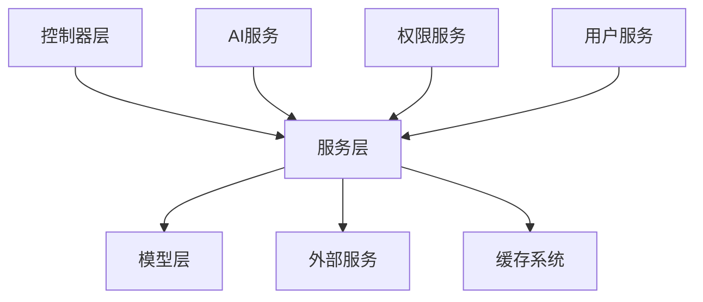
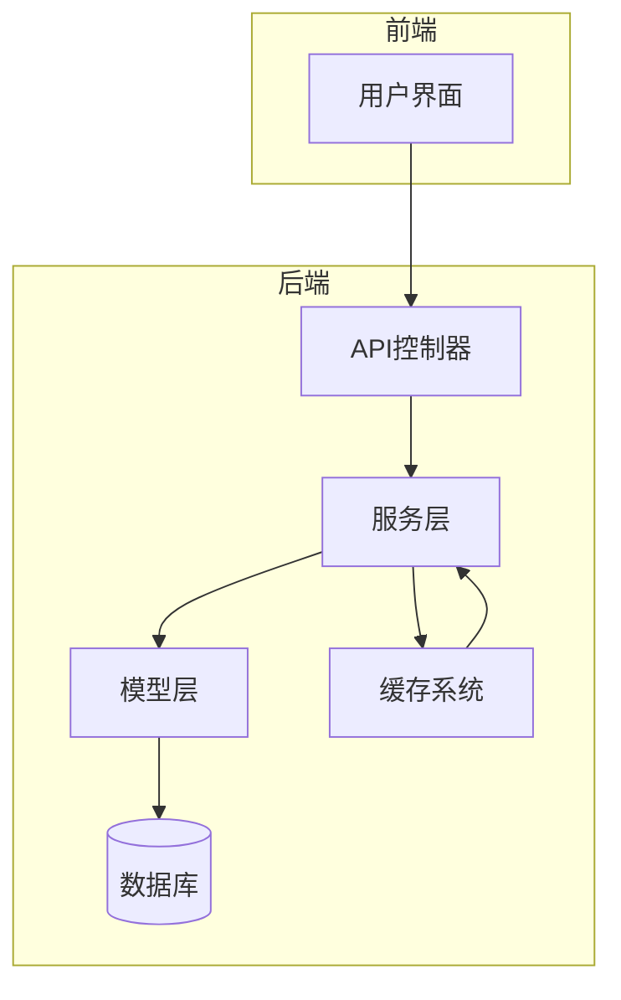
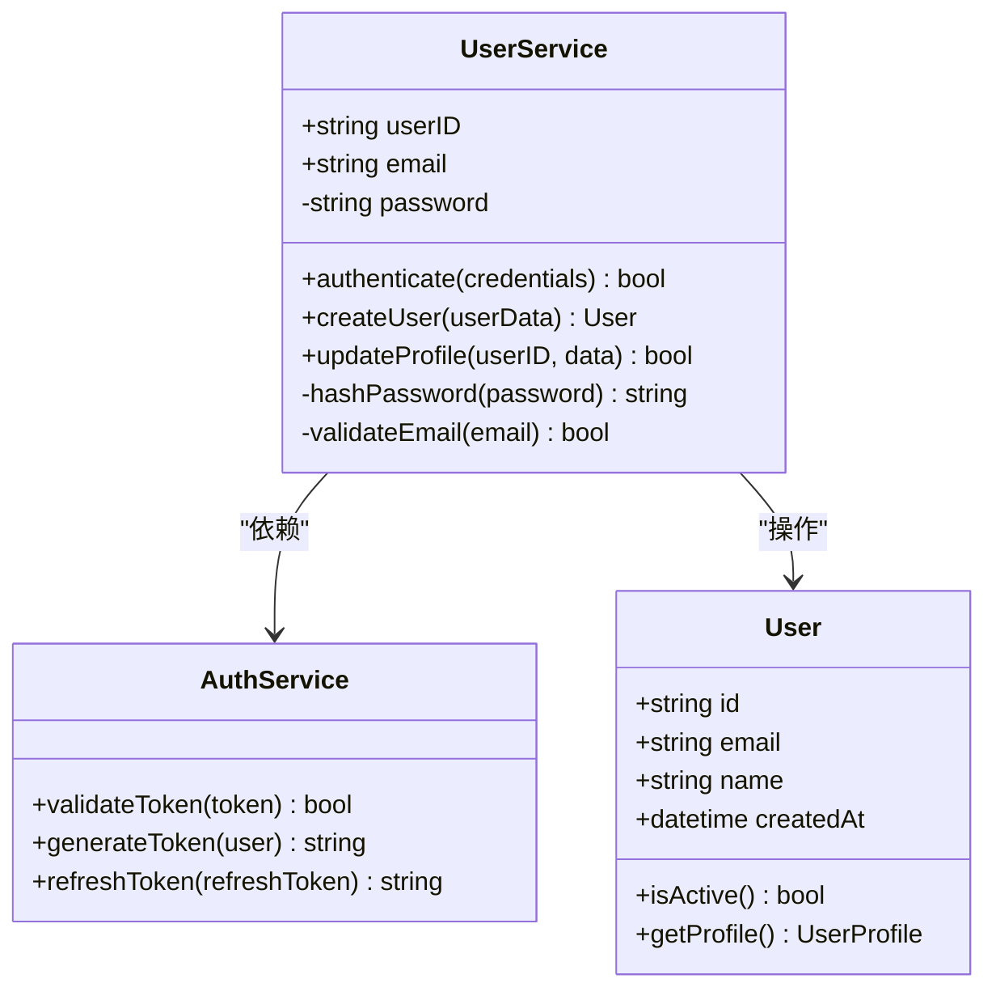
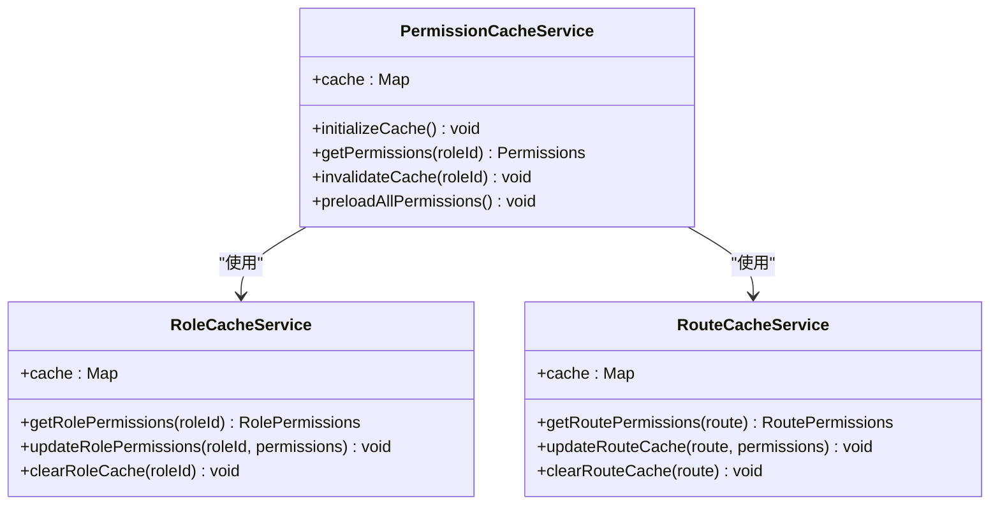
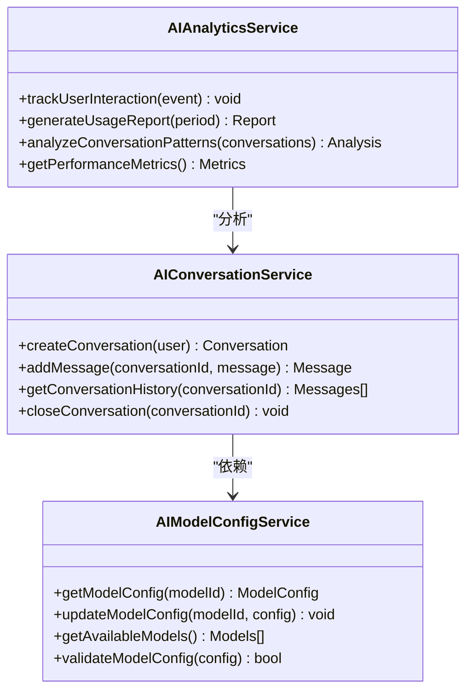
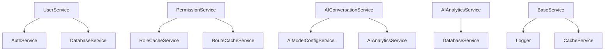

# 服务层

<cite>
**本文档引用的文件**  
- [app.ts](file://k.yyup.com/server/src/app.ts)
- [base.service.ts](file://k.yyup.com/server/src/services/base.service.ts)
- [auth.service.ts](file://k.yyup.com/server/src/services/auth/auth.service.ts)
- [ai-conversation.service.ts](file://k.yyup.com/server/src/services/ai/ai-conversation.service.ts)
- [ai-model-config.service.ts](file://k.yyup.com/server/src/services/ai/ai-model-config.service.ts)
- [ai-analytics.service.ts](file://k.yyup.com/server/src/services/ai/ai-analytics.service.ts)
- [user.service.ts](file://k.yyup.com/server/src/services/user/user.service.ts)
- [permission-cache.service.ts](file://k.yyup.com/server/src/services/permission-cache.service.ts)
- [role-cache.service.ts](file://k.yyup.com/server/src/services/role-cache.service.ts)
- [route-cache.service.ts](file://k.yyup.com/server/src/services/route-cache.service.ts)
- [ai.service.ts](file://k.yyup.com/client/src/services/ai.service.ts)
</cite>

## 目录
1. [引言](#引言)
2. [项目结构](#项目结构)
3. [核心组件](#核心组件)
4. [架构概述](#架构概述)
5. [详细组件分析](#详细组件分析)
6. [依赖分析](#依赖分析)
7. [性能考虑](#性能考虑)
8. [故障排除指南](#故障排除指南)
9. [结论](#结论)

## 引言
本文件深入阐述了后端服务层的设计与实现，重点描述服务层在MVC架构中的角色。文档详细说明了业务逻辑封装、事务管理、错误处理和跨服务调用模式，并解释了关键服务模块（如用户服务、权限服务、AI助手服务）的内部实现机制和方法签名。此外，文档还说明了服务层如何与模型层交互，以及如何处理复杂的业务规则和工作流，为开发者提供服务调用的最佳实践示例，包括异步处理、缓存策略和性能优化技巧。

## 项目结构
服务层位于`/server/src/services`目录下，采用模块化设计，按功能领域划分服务模块。每个服务模块包含独立的业务逻辑，通过清晰的接口与控制器层和模型层交互。

**图示来源**  
- [app.ts](file://k.yyup.com/server/src/app.ts#L15-L21)
- [base.service.ts](file://k.yyup.com/server/src/services/base.service.ts#L1-L10)

**本节来源**  
- [app.ts](file://k.yyup.com/server/src/app.ts#L1-L800)
- [base.service.ts](file://k.yyup.com/server/src/services/base.service.ts#L1-L50)

## 核心组件
服务层的核心组件包括用户服务、权限服务、AI助手服务等，这些服务通过继承`BaseService`类实现通用功能，并通过依赖注入机制实现松耦合。

**本节来源**  
- [base.service.ts](file://k.yyup.com/server/src/services/base.service.ts#L1-L100)
- [auth.service.ts](file://k.yyup.com/server/src/services/auth/auth.service.ts#L1-L50)

## 架构概述
服务层采用分层架构，通过清晰的职责分离实现高内聚低耦合。服务层负责处理业务逻辑，与模型层交互进行数据持久化，同时通过缓存机制提升性能。

**图示来源**  
- [app.ts](file://k.yyup.com/server/src/app.ts#L112-L128)
- [base.service.ts](file://k.yyup.com/server/src/services/base.service.ts#L1-L20)

## 详细组件分析
对服务层的关键组件进行深入分析，包括其内部实现机制和交互模式。

### 用户服务分析
用户服务负责处理用户相关的业务逻辑，包括用户认证、权限验证和用户信息管理。

#### 类图

**图示来源**  
- [user.service.ts](file://k.yyup.com/server/src/services/user/user.service.ts#L15-L45)
- [auth.service.ts](file://k.yyup.com/server/src/services/auth/auth.service.ts#L5-L20)

**本节来源**  
- [user.service.ts](file://k.yyup.com/server/src/services/user/user.service.ts#L1-L100)
- [auth.service.ts](file://k.yyup.com/server/src/services/auth/auth.service.ts#L1-L50)

### 权限服务分析
权限服务负责管理系统的权限体系，包括角色权限缓存、路由权限验证和权限预加载。

#### 类图

**图示来源**  
- [permission-cache.service.ts](file://k.yyup.com/server/src/services/permission-cache.service.ts#L15-L45)
- [role-cache.service.ts](file://k.yyup.com/server/src/services/role-cache.service.ts#L5-L20)
- [route-cache.service.ts](file://k.yyup.com/server/src/services/route-cache.service.ts#L10-L30)

**本节来源**  
- [permission-cache.service.ts](file://k.yyup.com/server/src/services/permission-cache.service.ts#L1-L100)
- [role-cache.service.ts](file://k.yyup.com/server/src/services/role-cache.service.ts#L1-L50)
- [route-cache.service.ts](file://k.yyup.com/server/src/services/route-cache.service.ts#L1-L40)

### AI助手服务分析
AI助手服务负责处理与AI相关的业务逻辑，包括会话管理、模型配置和分析功能。

#### 类图

**图示来源**  
- [ai-conversation.service.ts](file://k.yyup.com/server/src/services/ai/ai-conversation.service.ts#L15-L45)
- [ai-model-config.service.ts](file://k.yyup.com/server/src/services/ai/ai-model-config.service.ts#L5-L20)
- [ai-analytics.service.ts](file://k.yyup.com/server/src/services/ai/ai-analytics.service.ts#L10-L30)

**本节来源**  
- [ai-conversation.service.ts](file://k.yyup.com/server/src/services/ai/ai-conversation.service.ts#L1-L100)
- [ai-model-config.service.ts](file://k.yyup.com/server/src/services/ai/ai-model-config.service.ts#L1-L50)
- [ai-analytics.service.ts](file://k.yyup.com/server/src/services/ai/ai-analytics.service.ts#L1-L40)

## 依赖分析
服务层各组件之间的依赖关系通过依赖注入实现，确保了松耦合和可测试性。

**图示来源**  
- [app.ts](file://k.yyup.com/server/src/app.ts#L15-L21)
- [base.service.ts](file://k.yyup.com/server/src/services/base.service.ts#L1-L10)

**本节来源**  
- [app.ts](file://k.yyup.com/server/src/app.ts#L1-L800)
- [base.service.ts](file://k.yyup.com/server/src/services/base.service.ts#L1-L50)

## 性能考虑
服务层通过多种机制优化性能，包括缓存策略、连接池管理和异步处理。

**本节来源**  
- [app.ts](file://k.yyup.com/server/src/app.ts#L77-L88)
- [base.service.ts](file://k.yyup.com/server/src/services/base.service.ts#L1-L20)

## 故障排除指南
当服务层出现问题时，可以通过查看日志、检查缓存状态和验证数据库连接来诊断问题。

**本节来源**  
- [app.ts](file://k.yyup.com/server/src/app.ts#L247-L279)
- [base.service.ts](file://k.yyup.com/server/src/services/base.service.ts#L1-L10)

## 结论
服务层作为MVC架构的核心，承担着业务逻辑处理的重要职责。通过合理的分层设计和模块化组织，服务层实现了高内聚低耦合，为系统的可维护性和可扩展性提供了保障。开发者在实现新的业务功能时，应遵循现有的设计模式，充分利用已有的服务组件，确保代码的一致性和质量。