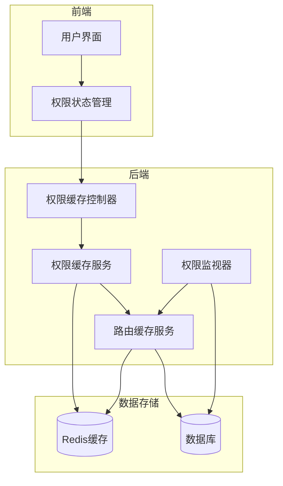
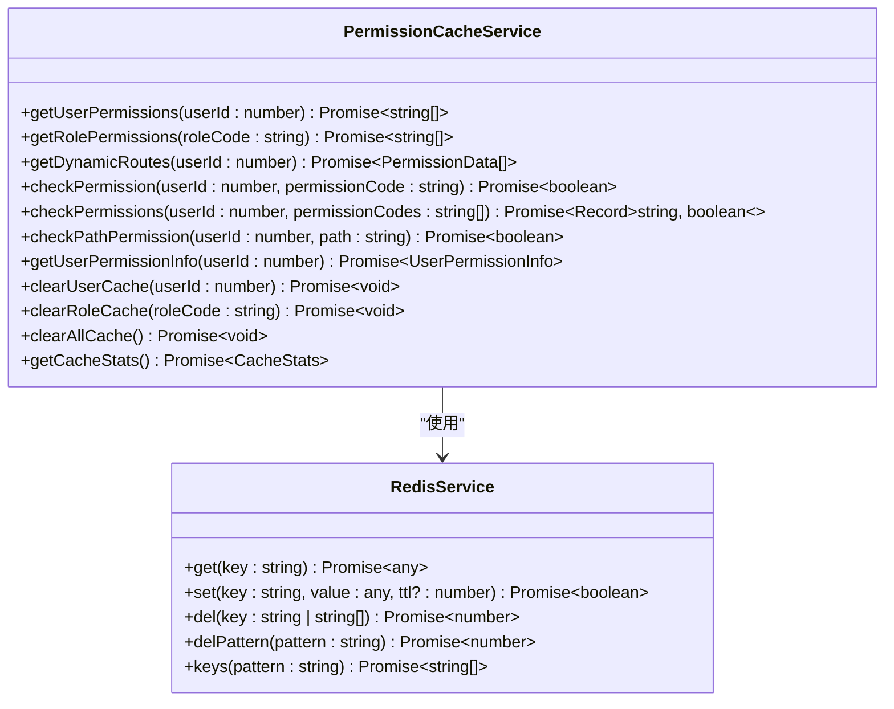
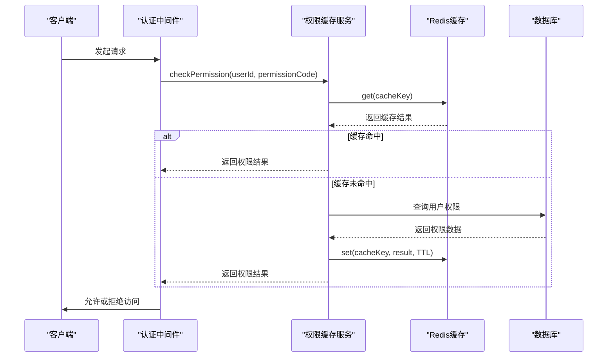
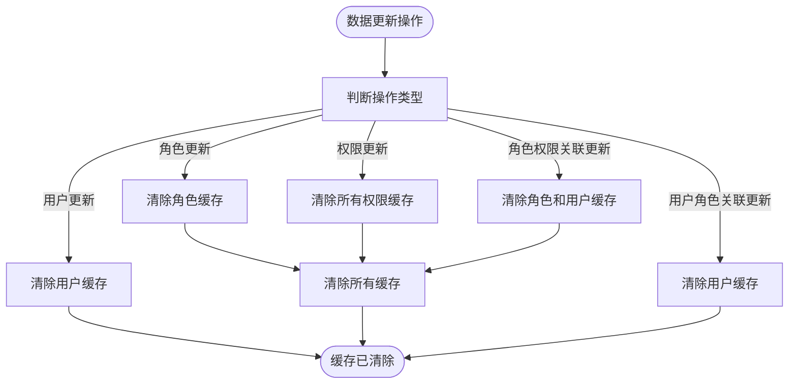
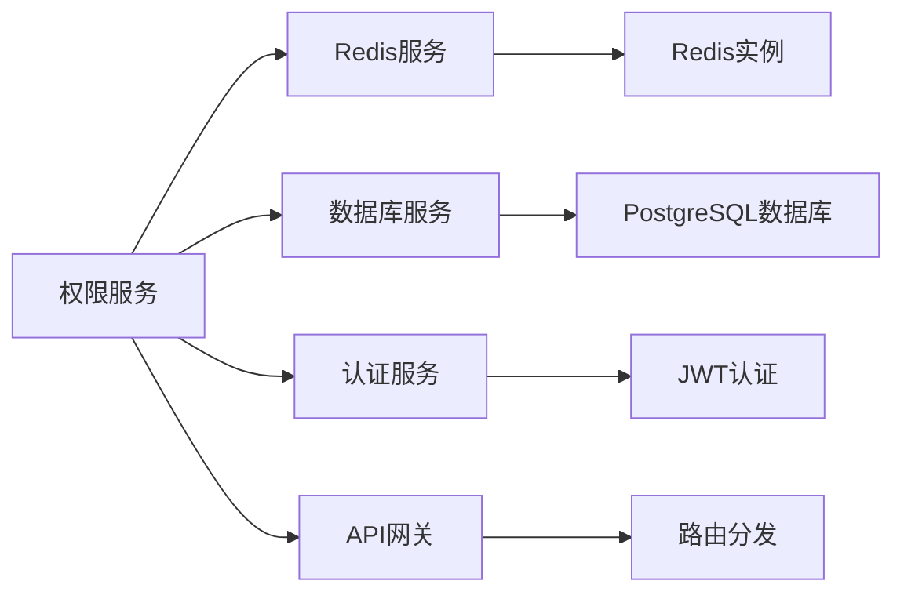

# 权限服务

<cite>
**本文档引用文件**   
- [permission-cache.service.ts](file://k.yyup.com/backup/permission-system/permission-cache.service.ts)
- [role-cache.service.ts](file://k.yyup.com/backup/permission-system/role-cache.service.ts)
- [permission-cache.controller.ts](file://k.yyup.com/backup/permission-system/permission-cache.controller.ts)
- [permissions.ts](file://k.yyup.com/backup/permission-system/permissions.ts)
- [cache-invalidation.middleware.ts](file://k.yyup.com/backup/permission-system/cache-invalidation.middleware.ts)
- [route-cache.service.ts](file://k.yyup.com/backup/permission-system/route-cache.service.ts)
- [redis.service.ts](file://k.yyup.com/server/src/services/redis.service.ts)
- [permission-watcher.service.ts](file://k.yyup.com/server/src/services/permission-watcher.service.ts)
</cite>

## 目录
1. [引言](#引言)
2. [项目结构](#项目结构)
3. [核心组件](#核心组件)
4. [架构概述](#架构概述)
5. [详细组件分析](#详细组件分析)
6. [依赖分析](#依赖分析)
7. [性能考虑](#性能考虑)
8. [故障排除指南](#故障排除指南)
9. [结论](#结论)

## 引言
本文档全面解析权限服务模块的设计与实现。详细描述权限服务的核心功能，包括基于角色的访问控制（RBAC）的实现机制、权限验证流程和缓存策略。解释权限缓存服务和角色缓存服务的工作原理，以及如何提高权限检查的性能。说明权限服务与认证中间件的集成方式和调用时序。提供权限管理的API接口文档，包括权限分配、角色创建和访问控制列表（ACL）管理。文档包含安全最佳实践，如权限最小化原则、权限继承机制和审计日志记录。

## 项目结构
权限服务模块位于`k.yyup.com/backup/permission-system`目录下，主要包含以下核心文件：
- `permission-cache.service.ts`: 权限缓存服务，提供用户权限、角色权限、动态路由和权限检查的缓存功能
- `role-cache.service.ts`: 角色缓存服务，为教师、管理员、园长等角色提供业务数据缓存
- `permission-cache.controller.ts`: 权限缓存控制器，提供管理员缓存管理接口
- `permissions.ts`: 前端权限管理，提供统一的前端权限API
- `cache-invalidation.middleware.ts`: 缓存失效中间件，在数据更新后自动清除相关缓存
- `route-cache.service.ts`: 路由缓存服务，提供内存中的路由数据缓存

**Section sources**
- [permission-cache.service.ts](file://k.yyup.com/backup/permission-system/permission-cache.service.ts)
- [role-cache.service.ts](file://k.yyup.com/backup/permission-system/role-cache.service.ts)

## 核心组件
权限服务的核心组件包括权限缓存服务、角色缓存服务、路由缓存服务和权限监视器服务。这些组件共同实现了基于角色的访问控制（RBAC）机制，通过Redis缓存大幅提升了权限检查的性能。

**Section sources**
- [permission-cache.service.ts](file://k.yyup.com/backup/permission-system/permission-cache.service.ts)
- [role-cache.service.ts](file://k.yyup.com/backup/permission-system/role-cache.service.ts)
- [route-cache.service.ts](file://k.yyup.com/backup/permission-system/route-cache.service.ts)
- [permission-watcher.service.ts](file://k.yyup.com/server/src/services/permission-watcher.service.ts)

## 架构概述
权限服务采用分层架构设计，包括数据访问层、缓存服务层和API接口层。系统通过Redis缓存用户权限、角色权限和动态路由，实现毫秒级的权限检查响应。权限变更通过监听器自动触发缓存刷新，确保数据一致性。

**Diagram sources **
- [permission-cache.service.ts](file://k.yyup.com/backup/permission-system/permission-cache.service.ts)
- [route-cache.service.ts](file://k.yyup.com/backup/permission-system/route-cache.service.ts)
- [permission-watcher.service.ts](file://k.yyup.com/server/src/services/permission-watcher.service.ts)

## 详细组件分析

### 权限缓存服务分析
权限缓存服务是权限系统的核心，提供用户权限、角色权限、动态路由和权限检查的缓存功能。服务通过Redis存储缓存数据，显著提升权限检查性能。

#### 权限缓存服务类图

**Diagram sources **
- [permission-cache.service.ts](file://k.yyup.com/backup/permission-system/permission-cache.service.ts)
- [redis.service.ts](file://k.yyup.com/server/src/services/redis.service.ts)

### 权限验证流程分析
权限验证流程从用户请求开始，通过中间件进行权限检查，最终决定是否允许访问特定资源。

#### 权限验证流程序列图

**Diagram sources **
- [permission-cache.service.ts](file://k.yyup.com/backup/permission-system/permission-cache.service.ts)
- [cache-invalidation.middleware.ts](file://k.yyup.com/backup/permission-system/cache-invalidation.middleware.ts)

### 缓存策略分析
权限服务采用多级缓存策略，包括用户权限缓存、角色权限缓存、动态路由缓存和权限检查缓存。缓存失效通过中间件在数据更新时自动触发。

#### 缓存策略流程图

**Diagram sources **
- [cache-invalidation.middleware.ts](file://k.yyup.com/backup/permission-system/cache-invalidation.middleware.ts)
- [permission-cache.service.ts](file://k.yyup.com/backup/permission-system/permission-cache.service.ts)

## 依赖分析
权限服务依赖于Redis服务进行数据缓存，依赖于数据库服务进行持久化存储，并通过中间件与其他服务集成。

**Diagram sources **
- [redis.service.ts](file://k.yyup.com/server/src/services/redis.service.ts)
- [permission-cache.service.ts](file://k.yyup.com/backup/permission-system/permission-cache.service.ts)

## 性能考虑
权限服务通过内存缓存和Redis缓存相结合的方式，实现了高性能的权限检查。路由缓存服务在服务器启动时将所有路由加载到内存中，提供毫秒级的数据访问速度。权限缓存服务使用Redis作为分布式缓存，支持高并发访问。

**Section sources**
- [route-cache.service.ts](file://k.yyup.com/backup/permission-system/route-cache.service.ts)
- [permission-cache.service.ts](file://k.yyup.com/backup/permission-system/permission-cache.service.ts)

## 故障排除指南
当权限服务出现问题时，可以按照以下步骤进行排查：
1. 检查Redis连接状态
2. 验证数据库连接和权限表数据
3. 检查缓存服务的健康状态
4. 查看权限监视器的日志和状态
5. 必要时手动刷新缓存

**Section sources**
- [redis.service.ts](file://k.yyup.com/server/src/services/redis.service.ts)
- [permission-watcher.service.ts](file://k.yyup.com/server/src/services/permission-watcher.service.ts)
- [permission-cache.controller.ts](file://k.yyup.com/backup/permission-system/permission-cache.controller.ts)

## 结论
权限服务通过基于角色的访问控制（RBAC）机制和多级缓存策略，实现了安全高效的权限管理。系统设计考虑了性能、可维护性和扩展性，能够满足大规模应用的需求。通过权限最小化原则和权限继承机制，确保了系统的安全性。审计日志记录和缓存监控功能为系统维护提供了有力支持。